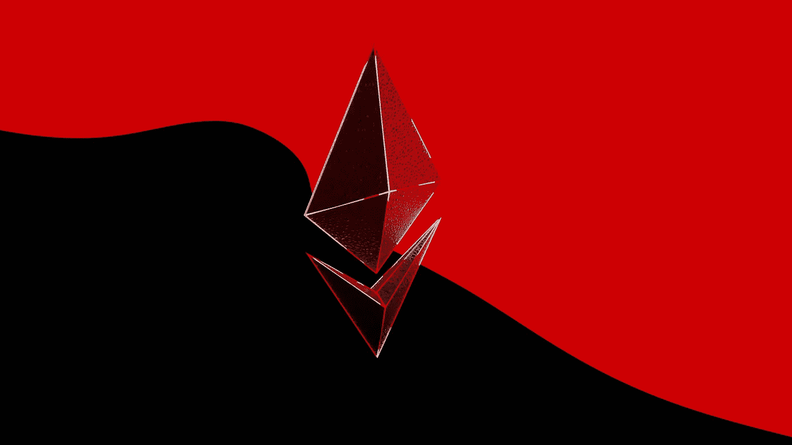
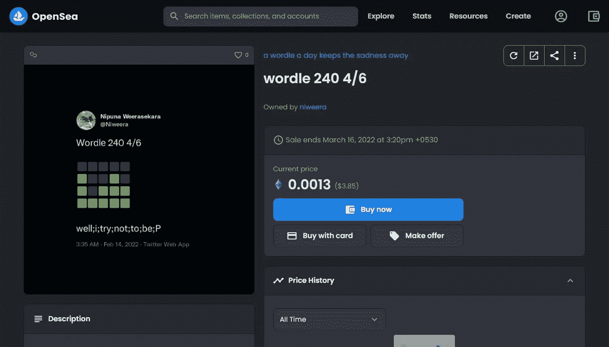
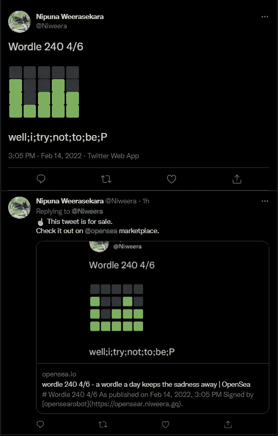

# 我如何在 OpenSea 上将我的 Tweets 自动生成为 NFTs 第 3 部分

> 原文：<https://betterprogramming.pub/how-i-automated-minting-my-tweets-as-nfts-on-opensea-part-3-9464d2652cc0>

## 承担排队的工作，mint，在 OpenSea.io 平台上发布我的推文



由[舒巴姆·达奇](https://unsplash.com/@theshubhamdhage?utm_source=unsplash&utm_medium=referral&utm_content=creditCopyText)在 [Unsplash](https://unsplash.com/?utm_source=unsplash&utm_medium=referral&utm_content=creditCopyText) 拍摄的照片

这是我如何在 OpenSea 文章系列中自动将我的 Tweets 制作成 NFT 的第三部分。在本文中，我将讨论如何使用 dAppeteer 创建 OpenSear-Worker UI 自动化系统。

要阅读本系列文章的第一部分和第二部分，

[](https://medium.com/@niweera/how-i-automated-minting-my-tweets-as-nfts-on-opensea-854c50a44467) [## 我如何在 OpenSea 上自动将我的推文制作成非功能性文件

### TL；在这篇文章中，我讨论了我是如何通过一些考验和磨难将我疯狂的想法变成现实的…

medium.com](https://medium.com/@niweera/how-i-automated-minting-my-tweets-as-nfts-on-opensea-854c50a44467) [](https://medium.com/@niweera/how-i-automated-minting-my-tweets-as-nfts-on-opensea-part-2-662fcb52c45c) [## 我如何在 OpenSea 上将我的 Tweets 自动生成为 NFTs 第 2 部分

### TL；dr——这是我如何在 OpenSea 文章系列中自动将我的推文制作成 NFT 的第二部分。

medium.com](https://medium.com/@niweera/how-i-automated-minting-my-tweets-as-nfts-on-opensea-part-2-662fcb52c45c) 

在我以前的文章中，我讨论了如何创建 OpenSear-API，以及如何根据我们的特定场景开始监听 Twitter 事件和队列作业。

在这篇文章中，我讨论了如何承担排队作业 mint，并在 [OpenSea.io](https://opensea.io) 平台上发布我的推文。由于 OpenSea 不允许我们以编程的方式创建 NFT(使用他们的 [API](https://docs.opensea.io/reference/api-overview) ，我使用 UI 自动化来处理这个创建和发布 NFT 的任务。正如我在[第一篇文章](https://medium.com/@niweera/how-i-automated-minting-my-tweets-as-nfts-on-opensea-854c50a44467)中提到的，有九个步骤需要自动化。所以让我们开门见山。

1.  **获取推文截图**

获取推文截图的方法有很多。对于这个任务，我使用 TweetPik Twitter 截图 API。

[](https://tweetpik.com/twitter-screenshot-api) [## Twitter 截图 API - TweetPik

### 现在你可以把推文截图成视频。看如何！开发商和企业采取推特截图你可以看到…

tweetpik.com](https://tweetpik.com/twitter-screenshot-api) 

下面的要点展示了如何使用 TweetPik API 来获取和存储给定 tweet 的截图。

[tweetpik-service.js](https://github.com/Niweera/opensear/blob/main/services/tweetpik-service.js)

为此，我们需要提供四个值。

一.推文的 ID

我们需要设置截图所需的 tweet 的 ID。这里我们设置`tweetId`体值。举个例子，

```
[https://twitter.com/Niweera/status/1497455677131739137](https://twitter.com/Niweera/status/1497455677131739137)tweetId = `[1497455677131739137](https://twitter.com/Niweera/status/1497455677131739137)`
```

二。主题 ID

对于截图定制，我们可以通过提供 TweetPik 主题 ID 来设置主题。这里我们将`themeId` body 值设置为 TWEETPIK_THEME_ID。

三。时区

我们可以为 tweet 截图提供一个时区。应该按照下面的 Wiki 页面提供时区值。

[](https://en.wikipedia.org/wiki/List_of_tz_database_time_zones) [## tz 数据库时区列表-维基百科

### 来自维基百科，免费的百科全书这是 tz 数据库 2021e 版的时区列表。UTC 偏移量…

en.wikipedia.org](https://en.wikipedia.org/wiki/List_of_tz_database_time_zones) 

我住在斯里兰卡，所以我的时区是`Asia/Colombo`。这里我们将`timezone`的体值设置为`Asia/Colombo`。

四。TweetPik API 密钥

为了授权 API 请求，我们需要将`authorization`头的值设置为`TWEETPIK_API_KEY`。登录用户可以从 [TweetPik 仪表板](https://tweetpik.com/dashboard)获取 TweetPik API 密钥。

现在我们可以获得给定 tweet ID 的截图。然而，我们需要一些截图润色。接下来我们来讨论一下。

2.**给推文截图添加一些润色**

当我说，润色，我的意思是提高形象等。为此，我使用了 Jimp，一个 JavaScript 图像处理程序。

[](https://github.com/oliver-moran/jimp) [## GitHub - oliver-moran/jimp:一个完全用 JavaScript 为 Node 编写的图像处理库…

### 一个完全用 JavaScript for Node 编写的图像处理库，没有任何外部或本地依赖性。…

github.com](https://github.com/oliver-moran/jimp) 

3.**登录 OpenSea.io，进入添加资产页面**

[OpenSea.io](https://opensea.io) 不是一个普通的 *web2* 应用程序，我们可以在其中使用我们的电子邮件和密码创建一个帐户。对于 OpenSea.io，我们需要将我们的[元掩码](https://metamask.io/)(或任何其他[支持的钱包提供者](https://support.opensea.io/hc/en-us/articles/1500007978402-What-crypto-wallets-can-I-use-with-OpenSea-))钱包连接到 OpenSea 平台。这是一项非常繁琐的自动化任务。然而，对我们的帮助是，`@chainsafe/dappeteer` 套装是一个穿着闪亮盔甲的骑士。

[](https://github.com/ChainSafe/dappeteer) [## GitHub-chain safe/dappeter:🏌🏼使用木偶师+ MetaMask 对 dApps 进行‍E2E 测试

### 🏌🏼使用木偶师+meta mask-github-chain safe/dappet eer 对 dApps 进行‍E2E 测试:🏌🏼使用…对 dapps 进行‍E2E 测试

github.com](https://github.com/ChainSafe/dappeteer) 

通过使用`dappeteer` 包，我们可以使用 MetaMask wallet 自动登录。引擎盖下的`*dappeteer*`包使用的是`puppeteer` 包。

[](https://github.com/puppeteer/puppeteer) [## GitHub -木偶师/木偶师:Headless Chrome Node.js API

### 无头 Chrome Node.js API。在 GitHub 上创建一个帐户，为木偶师/木偶师的发展做出贡献。

github.com](https://github.com/puppeteer/puppeteer) 

让我们首先启动一个木偶师 Chrome automation 实例，并将我们的 MetaMask 钱包连接到 OpenSea 平台。

使用 dappeteer 登录 OpenSea

我们在这里做的是，首先，我们通过给一个`metamaskVersion` *来创建一个木偶实例。*目前，`@chainsafe/dappeteer v2.4.1`支持 MetaMask v10.8.1 扩展。请确保按照以下方式安装它们。

```
$ npm i puppeteer @chainsafe/dappeteer@2.4.1
```

我已经对上述版本进行了测试，因此其他版本的组合可能无法工作，请小心。

在创建了木偶师实例之后，我们通过提供`METAMASK_MNEMONIC_PHRASE`来设置元掩码，这基本上是在设置元掩码钱包时获得的恢复密钥。如果你还没有创建一个 MetaMask 钱包或者不知道怎么做，看看下面的视频。

`METAMASK_PASSWORD`是一个字符串，您可以提供它作为临时密码。即使您省略了它，也不会有问题，因为`dappeteer`包会为您提供它。MetaMask 的怪异之处在于它只依赖于`METAMASK_MNEMONIC_PHRASE`而不依赖于密码。每次连接到 MetaMask wallet 时，都可以更改密码。

然后我在 MetaMask 中配置多边形 Mainnet，因为这是制造 NFT 的无气体方法。

[](https://szewong.medium.com/gas-free-trading-of-nfts-on-opensea-with-polygon-16ee6281e875) [## 用多边形在公海上进行无天然气交易

### 为什么你想买多边形 NFT，以及如何？

szewong.medium.com](https://szewong.medium.com/gas-free-trading-of-nfts-on-opensea-with-polygon-16ee6281e875) [](https://docs.polygon.technology/docs/develop/metamask/config-polygon-on-metamask/) [## 添加多边形网络|多边形技术|文档

### 为了查看您帐户中的资金流动，在多边形网络上，您需要配置多边形…

文档.多边形.技术](https://docs.polygon.technology/docs/develop/metamask/config-polygon-on-metamask/) 

之后，我将使用 dappeteer 登录到 OpenSea 平台。现在，我们可以转到“添加资产”页面，开始执行我们的 NFT 铸造任务。

4.**上传截图**

正如下面列表中提到的，我们将图像上传到 OpenSea。

将截图上传到 OpenSea

这里我们需要输入两个参数，`page`和`filepath`。`page`是对木偶页面的引用，而`filepath`是屏幕截图的路径。

5.**给 NFT 加上一个独特的名字**

这非常重要，因为 NFT 应该有唯一的名称。

为 NFT 添加一个名称

6.**添加外部链接**

在这里，我添加了一个外部链接到截图的原始 tweet。

向 NFT 添加外部链接

7.**添加描述**

在这里，我添加了一个作为截图的推文的小描述。

向 NFT 添加描述

8.**添加与资产相关的元数据**

在这里我做三件事。首先，我将完成猜单词游戏所用的尝试次数添加为一个等级(as [tries]/6)。然后，我从 30 个盒子中数出每个彩色盒子，并将它们作为 NFT 的数字统计数据添加进来。这两个步骤只是为了好玩。最后，我检查所有的级别元数据和统计元数据是否正确插入。如果所有的元数据都被准确地插入，我继续铸造 NFT。

向 NFT 添加元数据

在`fillLevels`函数中，我输入了`tries`参数，它是 6 次尝试的次数。在`fillStats`函数中，我输入了作为对象的`statistics`参数，如下所示。(按照下面的例子)。

⬛⬛⬛⬛⬛
⬛⬛⬛🟩🟨
🟩⬛🟩🟩🟩
🟩🟩🟩🟩🟩

```
tries = "4"statistics = {
               "blackBlocks" : "9",
               "greenBlocks" : "10",
               "yellowBlocks": "1"
             }
```

在`checkNumericTraits`函数中，我输入了`tries`和`statistics`，这样我就可以对照之前输入的值来检查它们。如果他们中的任何一个不匹配，程序会通知。

如果所有的元数据都输入正确，程序将进入最后一步，铸造 NFT。当我说薄荷 NFT，我的意思是程序将点击*创建*按钮。

9.**铸造 NFT**

最后一步是通过点击*创建*按钮来创建 NFT。就这么简单。

在公海上铸造 NFT

这里我添加两个参数，`page`是木偶页面，`browser`是木偶浏览器。点击创建按钮后，浏览器关闭，程序退出，返回我们创建的 NFT 的资产 URL。现在，我们所要做的就是创建一条回复 tweet 到原始 tweet，提到这个资产 URL。我们将添加一个回复，上面说，*上面的推文在 OpenSea 上出售，并通过这个资产 URL* 查看。

**回复带有资产 URL 的推文**

为此，我们为 NodeJS 使用了 [Twitter API v2 客户端。](https://github.com/PLhery/node-twitter-api-v2)

给原始推文添加回复

在这里，我们输入从上一步获得的`tweetID`和`assetURL`。`TwitterApi`的构造如第一条中[所述。在这之后，我们所有的步骤都完成了，OpenSear-Worker 也完成了它的工作。](https://medium.com/@niweera/how-i-automated-minting-my-tweets-as-nfts-on-opensea-854c50a44467)

**但是，**

有一个简单的警告，你不能在一个无头浏览器上运行 Chrome 扩展。所以我们不能将这个工作者部署到服务器中(比如说 Ubuntu 机器)。因此，我们需要有一个解决方法。为了解决这个问题，我使用了下面的包来创建一个虚拟显示器，并欺骗木偶浏览器相信服务器有显示器。

[](https://github.com/Rob--W/node-xvfb) [## GitHub - Rob - W/node-xvfb

### 在 GitHub 上创建一个帐户，为 Rob - W/node-xvfb 开发做贡献。

github.com](https://github.com/Rob--W/node-xvfb) 

XVFB 模仿虚拟显示器

通过使用`xvfb`，我能够克服上述问题，并且在`xvfb.startSync()`和`xvfb.stopSync()`之间运行的任何代码都会认为系统有显示器，因此问题得到了解决。

# **结束语**

所以，这就是我的故事的结尾**我是如何在 OpenSea 上自动将我的推文制作成 NFT 的。我要感谢这么多优秀的人。感谢 [Andre Rabold](https://medium.com/u/a717bb422529?source=post_page-----9464d2652cc0--------------------------------) 的[精彩文章](https://levelup.gitconnected.com/how-to-mint-100-000-nfts-for-free-62d83888ff6)和[代码](https://github.com/arabold/opensea-uploader)给我最大的启发。我还要感谢这篇文章带给我的灵感。**

最后但同样重要的是，我要感谢 StackOverflow 社区，没有他们的问题和答案(这样我就可以阅读并获得灵感)，这个 OpenSear 系统仍然是我曾经的一个疯狂的梦想。

如果你想看看最终产品，OpenSear 系统的完整源代码在 GitHub (viva la 开源)上，如下所示:

[](https://github.com/Niweera/opensear) [## GitHub-Niweera/open sear:open sear 是一个帮助我创建并列出我的 NFT 的系统…

### OpenSear 是一个帮助我在 opensea.io marketplace 上创建和列出我的 NFT 的系统。看看我的 NFT 收藏吧

github.com](https://github.com/Niweera/opensear) 

这是运行中的 OpenSear 系统。

1.  在 [OpenSea.io marketplace](https://opensea.io/assets/matic/0x2953399124f0cbb46d2cbacd8a89cf0599974963/3174924704537354725776608230933781217533108654819823768175757884922791985153)



[https://github . com/Niweera/open sear/blob/main/assets/NFT . jpg](https://github.com/Niweera/opensear/blob/main/assets/nft.jpg)

2.在[推特上](https://twitter.com/Niweera/status/1493156992588062721)



[https://github . com/Niweera/open sear/blob/main/assets/tweet . jpg](https://github.com/Niweera/opensear/blob/main/assets/tweet.jpg)