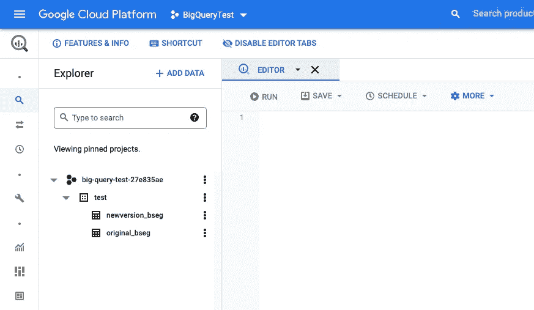
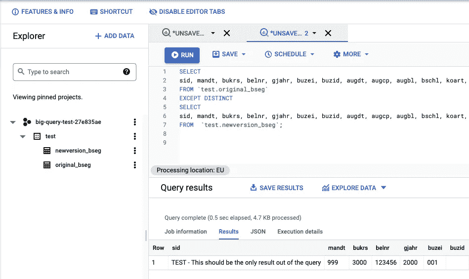

# 如何使用 Terraform 和 BigQuery 自动进行数据集比较

> 原文：<https://betterprogramming.pub/how-i-automated-my-job-using-terraform-and-bigquery-b25adec5af63>

## 自动化简化了数据集检查


安娜斯塔西娅·彼得罗娃在 [Unsplash](https://unsplash.com/s/photos/vision?utm_source=unsplash&utm_medium=referral&utm_content=creditCopyText) 上的照片

在我的日常工作中，我必须关注数据质量，我只是改变了数据生成和收集的方式。现在，我必须确保新旧程序之间的数据一致。让我们看看是否可以使用 Terraform 和 BigQuery 来自动化这项任务。

正如我所做的，你可能也在问自己， [BigQuery](https://cloud.google.com/bigquery) 是这个的合适工具吗？嗯，使用 BigQuery 可能就像用法拉利去街对面的商店买东西一样。

我实际上已经用微软的 U-SQL 解决了这个问题，所以，任何可以查询 CSV 的东西都足够好了。但是，用 BigQuery 解决这个问题对我来说很有趣。

为了更容易跟踪，检查一下我的 GitHub repo，在那里我上传了所有东西，包括一些虚假的测试数据。

另外，[查看我的博客](https://raescoto.medium.com/speed-up-your-tests-automating-project-creation-on-google-cloud-e60b36923ed7)，在那里我解释了我是如何为这个任务动态地创建测试项目的。

# 要求

*   [谷歌云账户](https://cloud.google.com/apigee/docs/hybrid/v1.5/precog-gcpaccount)
*   [谷歌 SDK](https://cloud.google.com/sdk/docs/install)
*   [地形](https://learn.hashicorp.com/tutorials/terraform/install-cli)

> *如果用 Google 的云壳 SDK，还有 Terraform 开箱！！*

# 未来的任务

因为我们正在更新我们的 [ELT](https://www.ibm.com/cloud/learn/elt#toc-what-is-el-2ZSy_nBX) 程序，我们需要确保新程序没有丢失任何数据。它可能会带来一些新数据，这没问题，但肯定不能遗漏任何数据。

为了确保它没有丢失数据，我收集了一些数据，并开始手动比较它们，正如你可以想象的那样，这不是很有效率。

我决定自动比较一些相当复杂的数据集。对于每个数据集，发现新数据集是否缺少任何数据，从而自动创建完成此任务所需的环境和服务。

在这篇博文中，我将只关注其中一个数据集。[来自 SAP 的表 BSEG](https://www.se80.co.uk/saptables/b/bseg/bseg.htm)。

# 储存；储备

数据以 CSV 文件的形式从提取过程中输出。BigQuery 允许我们查询存储在 Google 云存储上的 CSV。然后，我们需要使用 [google_storage_bucket](https://registry.terraform.io/providers/hashicorp/google/latest/docs/resources/storage_bucket) 创建一个 bucket，并将这两个文件作为[Google _ storage _ bucket _ object](https://registry.terraform.io/providers/hashicorp/google/latest/docs/resources/storage_bucket_object)上传，以便 BigQuery 可以访问它们。

存储桶片段

# BigQuery

一旦我们在云上有了数据集，我们现在就可以从 BigQuery 引用它们。但是，为了能够引用这些表，我们必须首先创建一个数据集，然后它可以将 CSV 文件作为表来引用/使用。我们使用 [google_bigquery_dataset](https://registry.terraform.io/providers/hashicorp/google/latest/docs/resources/bigquery_dataset) 资源来创建一个 bigquery 实例。

数据集片段

如您所见，我添加了存储作为 BigQuery 的依赖项，这是因为 Terraform 可以并行创建服务。BigQuery 是在数据上传完成之前创建的，这导致了实例化错误，只需添加依赖项即可修复。

有了数据和 BigQuery，我们可以继续引用 CSV 文件并查询它们。为了在 BigQuery 上创建引用，我们使用了 [google_bigquery_table](https://registry.terraform.io/providers/hashicorp/google/latest/docs/resources/bigquery_table) 。

虽然在某些情况下 BigQuery 可以识别数据的模式，但在这种情况下，我必须告诉 BigQuery 如何解释这些 CSV，因为它自己在定义模式方面做得很差。

表格片段

# 测试

我们现在可以启动我们的环境，并继续进行比较。执行我们都爱的命令。

```
$> terraform init
$> terraform plan
$> terraform apply
```

现在，在你的 Google Cloud 控制台上转到 BigQuery，你应该会找到一个包含两个表的数据集。



作者

将该查询粘贴到编辑器中，然后点击 RUN。

**告诉我，从 A 来看，b 缺少什么**

如果您使用我的测试数据按照这些说明操作，您应该只得到一行我的控件。



作者

# 试验结果

测试是成功的，没有发现数据集之间的差异(无论是真的还是我与你一起撕碎的假的)。

不要忘记

```
$> terraform destroy
```