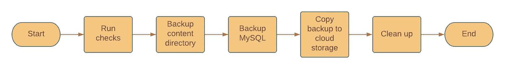

# 我如何将我的 Ghost 博客备份到云存储中

> 原文：<https://betterprogramming.pub/how-i-back-up-my-ghost-blog-to-a-cloud-storage-387524e3b524>

## 分五步做


[胡思远](https://unsplash.com/@siyuan_hu?utm_source=medium&utm_medium=referral)在 [Unsplash](https://unsplash.com?utm_source=medium&utm_medium=referral) 上拍照

我已经在我的[自主幽灵](https://github.com/TryGhost/Ghost)博客上写了一段时间了。如果你想知道，这个网站是托管在一个数字海洋上的。

在很大程度上，我觉得自己在做一些无关紧要的事情，而这些事情对我自己来说意义重大。今天，这个网站已经发展到一个规模，如果我丢失了我所有的内容，那感觉就像是一记飞向我脸上的耳光。

如果你在寻找“我如何备份我的 Ghost 博客”的答案对于你的自主幽灵博客，你来对地方了。

*TL；DR:如何像 Google Drive 一样将自托管 Ghost 博客备份到云存储，如何恢复*

# 语境

开始使用 Ghost 很容易。您通常会选择:

*   [Ghost (Pro)](https://ghost.org/pricing/) 托管服务
*   自托管在 [VPS](https://www.dreamhost.com/blog/beginners-guide-vps/#what-is-vps) 或 [Railway](https://blog.railway.app/p/ghost) 等无服务器平台上

我建议任何人(尤其是非开发人员)选择托管版本。

是的，相对贵一些；每个托管服务也是如此。然而，这很可能会为你省去一大堆自托管其他网站带来的麻烦(和时间):

*   备份
*   维护
*   停机恢复
*   安全等。

简而言之，你晚上会睡得更好。

最重要的是，100%的收入用于资助开源项目本身的开发——这是一个双赢的局面。

## “呃，那你为什么自己主持幽灵？”

1.  价格——没有什么比托管在专用服务器上的价格更实惠了
2.  知识增长——我从托管和管理自己的 VP 中学到了很多

自托管的其他好处包括可定制性、控制、隐私等。这些都很好，尽管不是我的主要原因。

最重要的是，所有上述自我托管的麻烦对我来说都是乐趣。

我想，直到它不是。

## 备份幽灵的痛苦

在数字海洋上设置 Ghost 就像点击按钮一样简单。然而，没有任何合适的内部解决方案来备份您的 Ghost 站点。

从 [Ghost 的文档](https://ghost.org/docs/faq/manual-backup/)中，您可以通过 Ghost Admin 手动备份您的 Ghost 站点。或者，你可以使用`ghost backup` [命令](https://ghost.org/docs/ghost-cli/#ghost-backup)。

尽管如此，在撰写本文时还没有提到数据库备份。我真希望他们能多谈谈这个。

# 使用 Bash 备份

## 为什么选择`bash`

简单。另外，Bash 非常适合命令行交互。

## 我们在备份什么

两件事:

*   ghost`content/`——包括 JSON 中的站点/博客内容、成员 CSV 导出、主题、图片和一些配置文件
*   MySQL 数据库

# 概观

在本文中，我们将编写一个简单的 Bash 脚本来完成以下所有步骤。

假设我们已经设置了 [Rclone](https://rclone.org/) ，下面是我们的 Bash 脚本应该涵盖的内容的概述:



概观

1.  *可选:*运行需求检查，以确保安装了我们需要的 CLI。如`mysqldump`、`rclone`等。
2.  备份存放鬼帖的`content/`文件夹
3.  备份我们的 MySQL 数据库
4.  使用 Rclone 将备份文件复制到我们的云存储中(例如 Google Drive)
5.  *可选:*清理生成的备份文件

# 效用函数

让我们创建`util.sh`，它包含一组备份脚本的帮助函数。

我喜欢在日志上打印时间戳，所以:

```
#!/bin/bashlog() {
    echo "$(date -u): $1"
}
```

有了这个，我们现在可以用`log`代替`echo`来打印文本；时间戳使用:

```
$ log 'Hola Jerry!'Sun Jul 22 03:01:52 UTC 2022: Hola Jerry!
```

接下来，我们将创建一个实用函数来帮助检查是否安装了命令:

```
# util.sh# ...check_command_installation() {
    if ! command -v $1 &>/dev/null; then
        log "$1 is not installed"
        exit 0
    fi
}
```

我们可以在步骤 1 中使用这个函数来确保我们有`ghost`、`mysqldump`等。在我们开始备份过程之前安装。如果没有安装 CLI，我们只需登录并退出。

## 备份脚本

在这一节中，我们将创建一个`backup.sh`文件作为我们的主备份 Bash 脚本。

为了保持我们的代码有条理，我们将概述中的步骤分解成单独的函数。

在我们开始之前，我们需要声明一些变量并为我们的`util.sh`提供源，这样我们就可以使用我们之前定义的效用函数:

```
#!/bin/bashset -esource util.shGHOST_DIR="/var/www/ghost/"REMOTE_BACKUP_LOCATION="ghost_backups/"TIMESTAMP=$(date +%Y_%m_%d_%H%M)
GHOST_CONTENT_BACKUP_FILENAME="ghost_content_$TIMESTAMP.tar.gz"
GHOST_MYSQL_BACKUP_FILENAME="ghost_mysql_$TIMESTAMP.sql.gz"
```

## **步骤 1:运行检查**

*   检查默认的`/var/www/ghost`目录是否存在。CLI 只能在安装了 Ghost 的文件夹中调用
*   检查是否安装了运行备份所需的 CLI

```
# backup.sh# ...pre_backup_checks() {
    if [ ! -d "$GHOST_DIR" ]; then
        log "Ghost directory does not exist"
        exit 0
    filog "Running pre-backup checks"
    cd $GHOST_DIRcli=("tar" "gzip" "mysql" "mysqldump" "ghost" "rclone")
    for c in "${cli[@]}"; do
        check_command_installation "$c"
    done
}
```

## **第二步:备份内容目录**

*   将`content/`目录压缩成一个`.gz`文件

```
# backup.sh# ...backup_ghost_content() {
    log "Dumping Ghost content..."
    cd $GHOST_DIRtar -czf "$GHOST_CONTENT_BACKUP_FILENAME" content/
}
```

## **第三步:备份 MySQL 数据库**

*   从 Ghost CLI 获取所有必要的数据库凭据(用户名、密码、数据库名称)
*   运行检查以确保我们可以使用上面的凭据连接到 MySQL 数据库
*   创建一个 MySQL 转储，并将其压缩成一个`.gz`文件

```
# backup.sh# ...check_mysql_connection() {
    log "Checking MySQL connection..."
    if ! mysql -u"$mysql_user" -p"$mysql_password" -e ";" &>/dev/null; then
        log "Could not connect to MySQL"
        exit 0
    fi
    log "MySQL connection OK"
}backup_mysql() {
    log "Backing up MySQL database"
    cd $GHOST_DIRmysql_user=$(ghost config get database.connection.user | tail -n1)
    mysql_password=$(ghost config get database.connection.password | tail -n1)
    mysql_database=$(ghost config get database.connection.database | tail -n1)check_mysql_connectionlog "Dumping MySQL database..."
    mysqldump -u"$mysql_user" -p"$mysql_password" "$mysql_database" --no-tablespaces | gzip >"$GHOST_MYSQL_BACKUP_FILENAME"
}
```

## **第四步:将压缩后的备份文件复制到云存储**

```
# backup.sh# ...rclone_to_cloud_storage() {
    log "Rclone backup..."
    cd $GHOST_DIRrclone_remote_name="remote"rclone copy "$GHOST_DIR/$GHOST_CONTENT_BACKUP_FILENAME" "$rclone_remote_name:$REMOTE_BACKUP_LOCATION"
    rclone copy "$GHOST_DIR/$GHOST_MYSQL_BACKUP_FILENAME" "$rclone_remote_name:$REMOTE_BACKUP_LOCATION"
}
```

**第五步:清理备份文件**

```
# backup.sh# ...clean_up() {
    log "Cleaning up old backups..."
    cd $GHOST_DIRrm -r "$GHOST_CONTENT_BACKUP_FILENAME"
    rm -r "$GHOST_MYSQL_BACKUP_FILENAME"
}
```

最后，我们将调用为步骤 1-5 定义的所有函数。

```
# At the end of the backup.sh# ...log "Welcome to Wraith"
pre_backup_checks
backup_ghost_content
backup_mysql
rclone_to_cloud_storage
clean_up
log "Completed backup to $REMOTE_BACKUP_LOCATION"
```

然后…我们结束了！

## 最终代码

你可以在 github.com/ngshiheng/wraith 找到代码。

要直接使用此项目:

1.  SSH 到您的 VPS，在那里您托管您的 Ghost 站点
2.  [设置 Rclone](https://github.com/ngshiheng/wraith#set-up-rclone) (重要)
3.  克隆此存储库
4.  从幽灵目录运行`./backup.sh`

# 使用 Cron 自动备份

我讨厌做手工维护和管理工作。让我们使用 Crontab 为我们的 Ghost 站点安排一次定期备份，以减轻我们的痛苦:

1.  运行`crontab -e`
2.  例如，您可以在每周一上午 5 点运行备份，使用:

在设置 Cron 计划时，一定要考虑时区。

# 还原 Ghost 备份

除非您已经测试过从备份中恢复，否则备份不是备份。

让我们使用 [Docker](https://hub.docker.com/_/ghost) 在本地测试我们的备份。

1.  在一个新的目录下，复制你的备份文件。使用`tar -xvf`解压备份文件
2.  使用`docker run -d --name some-ghost -e url=http://localhost:3001 -p 3001:2368 -v /path/to/images:/var/lib/ghost/content/images ghost`在本地运行 Ghost 来恢复博客图像
3.  访问`[localhost:3001/ghost](http://localhost:3001/ghost)`创建一个管理员帐户
4.  从 Ghost 管理界面(`[localhost:3001/ghost/#/settings/labs](http://localhost:3001/ghost/#/settings/labs)`)，从解压缩的`data/`导入您的 JSON Ghost 博客内容
5.  您也可以从成员页面导入您的成员 CSV

提示:使用`docker exec -it some-ghost bash`在你的 Ghost Docker 容器中运行`bash`

# 结束语

无论你只是运行一个简单的个人网站还是一个正常的企业，拥有一个适当的备份是至关重要的。

我犯了拖延设置备份的错误。今天，我终于把它从我的待办事项列表中去掉了。

> “这个世界上有两种人——备份文件的人和没有经历过丢失所有文件的人。”

阅读这类文章给了我一点动力，让我避免成为反面教材的一部分。

```
**Want to Connect?**This article was originally published at [jerrynsh.com](https://jerrynsh.com/backing-up-ghost-blog-in-5-steps/)
```