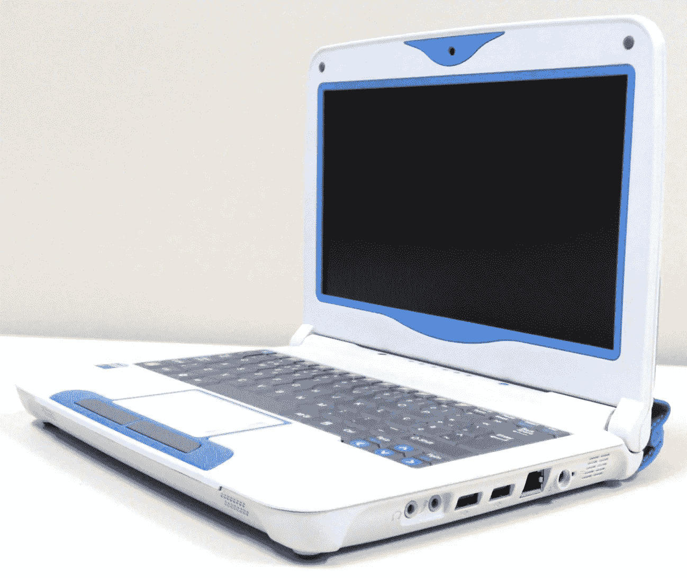
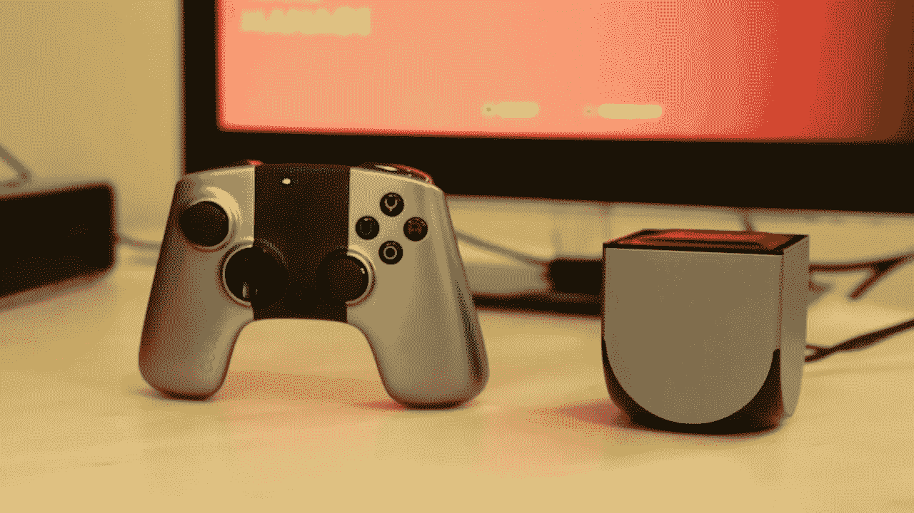
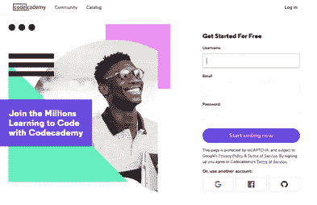

# 我如何成为一名 16 岁的全栈开发者

> 原文：<https://betterprogramming.pub/how-i-became-a-16-year-old-full-stack-developer-10af18a8f6c7>

## 我当时 14 岁，对 PHP、HTML/CSS 和 JavaScript 一无所知，我嫉妒我的朋友

[阿里·叶海亚](https://unsplash.com/@ayahya09?utm_source=unsplash&utm_medium=referral&utm_content=creditCopyText)在 [Unsplash](https://unsplash.com/search/photos/kid-laptop?utm_source=unsplash&utm_medium=referral&utm_content=creditCopyText) 上的照片

这是我在 Medium 上发表的第一篇文章，我想以一篇关于我的旅程的文章开始——这一旅程仍在继续(因为不可能了解所有关于技术的东西)。

但我是谁？我叫努诺，今年 16 岁，我来自一个名叫葡萄牙的国家(因为它是*而不是很多人认为的* 西班牙的一部分)。今天，我想告诉你我是如何成为一名全栈开发人员(或类似人员)的故事。

我一点也不觉得我这个年纪的人成为程序员很奇怪。首先，因为我看到很多人说他们喜欢创作像《侠盗猎车手 V》这样的视频游戏或者像《皇家冲突》这样的手机游戏，而且他们中的一些人确实在追求这个梦想。他们学习编码，他们喜欢它，然后他们创造自己的独立视频游戏。

其次，随着越来越多的应用程序出现在市场上，年轻人凭借他们看似简单的想法成为千万富翁(例如，马克·扎克伯格和埃文·斯皮格尔)，青少年可能会想，“为什么我不试试呢？”

但是也有一些人看到代码会感到害怕。例如，当我向我的兄弟姐妹展示我正在开发的一些代码时，他们看着它说，“我不明白你刚才写的任何东西。”

比如我妈，看到我用 C#写东西，问我是不是在做炸弹。当然，她是在开玩笑(因为她最后笑了)，但我必须告诉她我在编程。

比如我父亲，他不知道 Python 是什么。我必须为他写一个简单的 Python 脚本来实现自动化，当我向他解释他必须点击文件才能运行脚本时，他只是看着我，问我那是什么。

不管怎样，尽管一堆代码看起来很吓人，我认为年轻人会对它感兴趣的。而且变得越来越简单。看看互联网上所有可用的框架和库。它是巨大的，而且它们被制造来简化一切。代码不无聊。但是学习它…

# 我是如何开始我的旅程的

总的来说，我一直热爱互联网和技术。我出生于 2003 年，所以在我接触电脑的最初几年，我使用的是 Windows XP。哦，上帝，我喜欢它。说真的，太棒了。我花了几个小时玩弹球之类的游戏，还用 MS Paint 画了很多名作。我以前也玩过其他游戏，比如疯狂出租车，模拟人生等等。我总是对技术感兴趣，我总是想知道事物是如何工作的。

嗯，当我 7 岁的时候(我想)我有了我的第一台电脑。在葡萄牙，通常会给二年级的孩子一台笔记本电脑。它被称为“magal hes”*(指葡萄牙探险家费迪南·麦哲伦)，是那个年龄的孩子最想要的东西。它充满了教育节目，对一个 7 岁的孩子来说真的很好。Windows 7 在上面运行，对我来说是宇宙中最奇妙最珍贵的东西。*

**

*portalátil magal hes 2——2010/2011 年 7 岁儿童最想要的东西*

*因为一切都要结束，它断了。我父亲把它送去修理，但最终，它慢得不能用了(我说的“有用”是指玩视频游戏。我当时很喜欢它们)。*

*我又买了一台电脑，然后我记得我父亲买了一个残破的《T2》T3——也许他能修好我的电脑。但这已经不重要了，因为我有一台台式电脑，它比我的旧 magal hes 更快，尽管没有那么有趣。*

*然后，一个不可思议、改变了我一生的想法出现在我的脑海里:既然我父亲没能修好我的 Magalhã，我想我可以用他买的零件来创建我自己的个人视频游戏机。*

**

*OUYA，我旅途中最大的灵感*

*那时我是如此的天真无邪…*

*我读到过一款名为 [OUYA](https://en.wikipedia.org/wiki/Ouya) 的游戏机，它的提议给我留下了深刻的印象:一款基于 Android 的全新游戏机，可以自由修改和创建游戏。所以，我想只基于我的 magal hes*作品创建一个控制台。**

**不用说，我过去没有——现在也没有——足够的知识来创建这么大的项目，但我真的对此感到兴奋。在阅读了网上的一些文章后，我决定我只需要学习 C 和汇编来构建我的操作系统。**

**我以为这很容易…**

**你猜怎么着？当我看到第一条装配线时，我开始哭了。不是字面上的意思，但你明白我的意思。**

**再见控制台项目。**

**快进到几年后。我和一个朋友决定，如果我们能开一家像微软或苹果这样的公司就好了(附注，当时我们只有 13 岁)。那就太好了。我们会开发很多程序和应用程序，我们会变得很出名，在金钱中畅游。**

****

**我们的梦有点像这样……—照片由 Chiara Daneluzzi 在 Unsplash 上拍摄**

**我们开始吧，我们想。创建大公司并赚取数百万欧元的第一大步是什么？**

**没错——创建一个脸书/推特页面。**

**在那之后，我们不得不开始创建我们的应用程序和程序，但我们都不会编程。一点也不。甚至没有一行 Python，Java，PHP，甚至没有我的老朋友 C！**

**你可能会问，我们做了什么？完全正确…**

**我们没有做的是学习如何编码。相反，我们认为跟随一系列不可信的 YouTube 视频会很棒，这些视频讲述了如何用 [Visual Basic](https://en.wikipedia.org/wiki/Visual_Basic) 创建 web 浏览器。**

**对我们的大公司来说很有创意，对吧？**

**你猜怎么着？我们创造了自己的浏览器！我甚至在 Weebly 上开了一个网站(网址是. com 真的，我不知道我是如何说服我父亲给我买了一个)来与世界分享这个杰作。**

**没有一个人在乎。**

**但是这件小事，我的朋友们，是我旅程的开始。这就是我成为今天的开发者的原因。这是我第一次接触 Visual Basic(尽管我年轻时曾试图学习 Java，但后来放弃了)和真正的编程(尽管我复制粘贴了视频中那个人所说的一切)。**

# **我是如何真正开始我的旅程的**

**现在我们可以讨论如何正确编程了！**

**在这些愉快的经历之后，我意识到我必须学习如何正确地编码，而不是基于一些随机的 YouTube 视频来教我如何构建一个可疑的网络浏览器。不，我的朋友们，我想要的不止这些！**

****

**这个网站真的帮了我大忙！**

**这个网站帮了我大忙:[代码学院](https://www.codecademy.com/)！**

**Codecademy 是目前为止整个互联网上最棒的学习编程网站之一。这让我想起了 [freeCodeCamp](https://www.freecodecamp.org/) (我去年才知道它，它也真的很棒)，但我相信在某些方面它甚至更好。**

**我的第一次冒险是 Python。Python 学习和编码简单、快速、有趣！这几乎就像英语一样(如果我从所有英语老师那里听到的都是真的，我相对擅长英语)。**

**过了一段时间，我想要更多，所以我开始学习 PHP 只是为了好玩(因为我甚至不想做网站，它们太…无聊了——看看现在的我)。我有一个朋友是 PHP 方面的天才，所以我也开始学习，因为他推荐我学。**

**在很短的时间内，我了解了 PHP 和 Python 的基础知识。但后来我发现了一个永远改变了我开发者生活的 YouTube 频道。它的名字叫 [Curso em Vídeo](https://www.cursoemvideo.com/) ，是一个巴西频道，有很多免费的编程课程，由一位非常优秀的大学老师 Gustavo Guanabara 教授。**

**这个频道是我经历过的最好的事情(当然，从专业角度来说)。**

**我注册了他们的第一门课程:算法和编程逻辑(对不起，这是我能想到的最好的翻译。我不确定这是不是课程的名字)。**

**学习编程逻辑是我做过的最重要的事情之一；它对我理解许多编程基础知识帮助很大。**

**然后旅程开始了。**

**从那以后，我专注于学习 PHP (OOP)、Java (我最大的梦想，因为我一直想开发 Android 应用)、、HTML/CSS、JavaScript (现在如此重要)以及……差不多就是这些了。**

**我也试着学了一点 C 语言(只是基础的)，但是这让我很困惑。例如，我很难理解指针的概念。但现在我觉得我知道最基本的东西，我可以写一个基本的 C 程序。**

# ****当我开始学习大量的编程语言并得到一份“工作”的时候****

**做完这些工作后，我并不开心。当我开始学习如何编码时，我最大的梦想是能够开发桌面和移动应用程序。出于某种原因，我不喜欢网站，我不知道为什么。直到今天仍然如此。**

**我的一个朋友(也是帮助我建立大公司的那个人——他也学过 PHP)告诉我，他认识一个人，他有一个大项目，这个项目有可能增长很多，并成为一个重要的公司。**

**这个项目是一个网站。后端和前端。**

**但是当你 13-14 岁的时候，你不会关心这些事情。如果我的朋友参与了这么大的项目，我也想参与。因为即使我知道一些事情，我还是个孩子。孩子们又蠢又嫉妒。**

**我做了什么？我和我朋友的朋友谈过，我以一些股份的价格(我相信大约 10%)被他的项目接受了。他们的项目，他们的提议，对我来说是鼓舞人心的。**

**这就是我如何得到第一份“工作”的故事:我 14 岁，对 PHP、HTML/CSS 和 JavaScript 一无所知，我嫉妒我的朋友。**

**非常专业。**

# **现在呢？**

**嗯，我现在 16 岁了，我的旅程并没有结束(当然)。在意识到 web 开发和移动开发是我的专长之后，我开始学习更多关于 PHP、数据库( [MySQL](https://www.mysql.com/) 和 [MongoDB](https://www.mongodb.com/) )、API、JSON、HTML/CSS 及其框架( [Bootstrap](https://getbootstrap.com/) 、[Sass/Less](https://css-tricks.com/sass-vs-less/)……)以及最终一些 Javascript ( [ES6](http://es6-features.org/#Constants) 、[node . js](https://nodejs.org/en/)……)。**

**在选择 [AngularJS](https://angularjs.org/) 还是 [Vue.js](https://vuejs.org/) 之间犹豫再三之后，我决定先学 [React](https://reactjs.org/) 。这是有史以来最好的事情，因为我能够学习一些原生的反应，实现了我成为一名移动应用开发者的梦想。**

**现在，我想我可以说我了解以下技术:**

*   **HTML/CSS(和框架)**
*   **JavaScript ( [MERN 栈](https://mern.io/)，NodeJS 等。)**
*   **PHP(但不是 [Laravel](https://laravel.com/) ，很遗憾。我只和 [CodeIgniter](https://www.codeigniter.com/) 合作过**
*   **数据库(MySQL、MongoDB)**
*   **Java 语言(一种计算机语言，尤用于创建网站)**
*   **计算机编程语言**
*   **C#(就一点点。它与 Java 相似，这很有帮助)**
*   **c(几件事。我不是每天都用这个，只是当我觉得需要玩 Arduino 的时候)**
*   **API(如何开发和使用 REST API)**

**现在，我不像以前那样专注于编程。我热爱它，我仍然每天编程，但现在我更专注于加密货币、商业和人工智能，这些都是我想学习的。**

**我现在最大的项目是用 Python 编写的加密货币投资机器人，我相信它有很大的潜力。**

**我也对学习 UI/UX 设计和为我的网站开发伟大的主题和设计感到非常兴奋。**

# **结论**

**我真的希望你喜欢这篇文章。对于你们这些和我年龄相仿，正在考虑成为一名程序员的人来说，不要想:做！就知识和职业生涯而言，这是迄今为止我做过的最令人惊叹的事情，越早开始越好。**