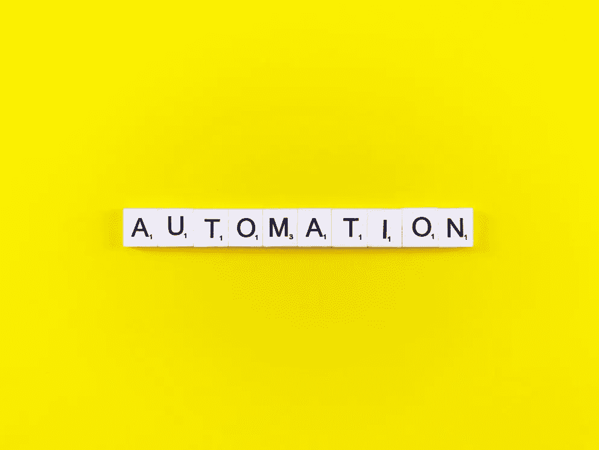
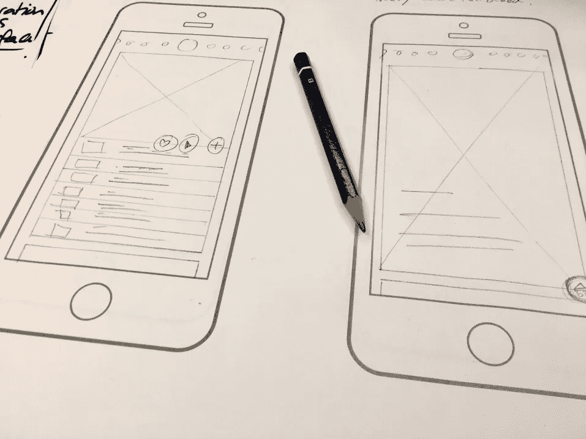
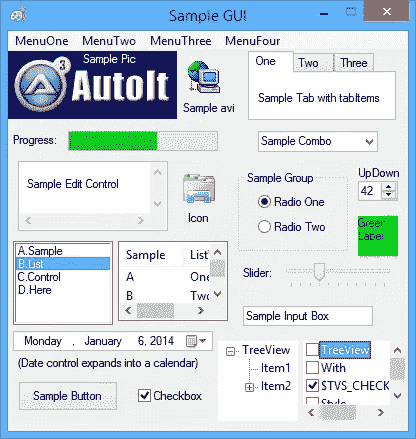
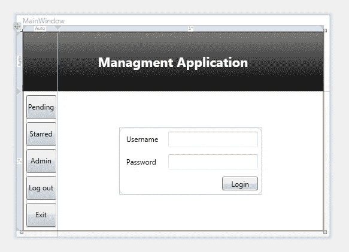

# 我如何自学软件工程

> 原文：<https://betterprogramming.pub/how-i-became-a-professional-software-developer-with-zero-qualifications-539019525740>

## 假装直到你成功

克里斯蒂娜@ wocintechchat.com 在 [Unsplash](https://unsplash.com?utm_source=medium&utm_medium=referral) 上的照片

有充分的理由，生活中有些职业是你不能随便涉足的。例如，我不能去医院参加脑外科手术(幸运的是)。不，我们需要知道如何做那件事的人，*去做那件事*。与此同时，在光谱的另一端，是更容易实现的任务，如园艺或在快餐店工作。这些仍然是必要的任务，但比起在别人的大脑上工作时修复错误，修复你在做汉堡时犯的错误更容易。

软件开发介于两者之间。我知道，这是一个奇怪的规模，一端是脑外科医生，另一端是汉堡店员工/园丁，但我的角色传统上有很多大学毕业的员工。我不是其中之一。我从未接受过高等教育来成为一名软件开发人员，但这已经是我五年来的职业了。

所以，谁在乎？嗯，今天，有相当多的人有着*企业家的心态*，他们想开发一个新的应用程序或新的服务供大众消费，但不知道如何从他们目前在技术领域的角色转变为软件开发人员，这样他们就可以开发自己的应用程序和解决方案。在我的例子中，我就是这样做的。我的希望是，通过清楚地阐明我是如何从一个技术人员角色逐渐转变为一个成熟的软件开发人员的，你可以找到一个可以应用的模式，或许你自己也可以做出同样的改变。对我来说，我的转变是如何开始的？

## 从一开始就实现自动化

我的第一个角色是见习技术官。从本质上说，我去那里是为了跟踪那些修理电脑的人，看他们如何修理东西，这样我就可以知道将来如何修理同样的东西。然而，作为一名实习生，把最无聊、最重复的任务分配给我几乎不花一分钱。为什么要付给一个训练有素的技术人员全额工资，让他去做一个新手花更少的钱就能做的事情？

当时，有一堆电脑需要软件更新。这些更新是几个安装包和几个可执行文件，所以我的任务工作是给计算机插上电源，运行更新，重启，安装另一个更新，再次重启，等等，直到完成。当我完成了大约 50 台电脑中的两台时，我充满了这种恐惧感。我不能坐在那里手动在电脑上安装所有这些更新，我必须找到一种自动化的方法。

自动化是关键([图片由 wanaktek via Twenty20](https://www.twenty20.com/photos/a5bc7d72-ff57-4654-a498-c9dbd34589e0/?utm_t20_channel=bl) )

因此，在我插入的下一台计算机上，我插入了存有我的更新的 USB 驱动器，并开始在命令行中试验，看看能做些什么。不久，我意识到 MSI 会在命令行接受一个`/passive`开关。这只是用 MSI 的默认值运行，并给出一个进度条。接下来的事情是创建一个批处理脚本，在所有需要的更新包中反复调用`msiexec`。其他的更新是可执行的，所以我只是在命令行中在它们后面加上了一个`/?`，甚至是一个`/help`。这也为如何自动化这些包提供了合适的指导。

> 当我完成了大约 50 台电脑中的两台时，我充满了这种恐惧感。我不能坐在那里手动在电脑上安装所有这些更新，我必须找到一种自动化的方法。

也许你在读这篇文章时会想“有人答应给我一篇关于这家伙如何成为软件开发人员的文章，他正在谈论自动化*软件安装*”也许你会觉得我浪费了你几分钟的时间。但最终，**开发者创造应用来解决问题**。自动化软件安装正在解决一个问题，所以它与我将来要做的事情非常吻合。

## 为用户开发

创建简单的批处理脚本就足以自动化这些安装，但有时我会希望自动化某个过程。我们在工作中遇到的困难之一是当我们升级人们的计算机时，我们必须确保他们的数据在计算机之间得到维护。

我们反复告诉客户不要将文档保存在他们的桌面上，因为这不会永久存储在任何地方，一旦我们更换了他们的计算机，我们将安全地擦除他们的驱动器。然而，一次又一次，我们安全地删除硬盘，却在几周后被告知桌面上有一些极其重要的文件。有一次，我们甚至付钱给一家专业的数据恢复公司，试图从一个我们已经按照 DoD 规范擦除的驱动器中恢复一些数据(一遍用零，另一遍用随机数据，第三遍用零)。尽管他们做了努力，数据还是无法恢复。

显然，客户对“抱歉，您的数据不见了”的体验很差，所以我开始研究是否有一种方法可以使这一过程自动化。不久，我的一个朋友向我展示了汽车。现在回想起来，AutoIT3 可能是我第一次接触类似 OOP(面向对象编程)的语言。更好的是，它向我介绍了集成开发环境(IDE)的概念以及它如何帮助开发。它还附带了一个相当初级但功能强大的 GUI 编辑器。

从那以后，我只需要知道如何使用这种脚本语言将一个目录递归地复制到另一个目录。我第一次运行这个脚本时，它非常失败。我没有考虑过如果文件*不能*被复制该怎么办——所以这很自然地向我介绍了处理异常的概念，或者给我的代码指示在出错的情况下该怎么做。

我可以用 AutoIT3 完成的复杂逻辑流程一直让我惊叹不已。有一次，在我的日常工作中，我的任务是在我们的服务台软件中手动打开 100 多个任务，并打印出每个任务的文书工作。手动做了几个，就记住了按键组合(就是类似于回车打开记录，然后左 ALT 打开菜单，向下三次，右箭头键，然后回车打印那个特定的任务)。这个特定的帮助台工具有一个特性，你可以选择一个记录，按下键盘上的 CTRL+C，它会将所有相关信息复制到剪贴板。因此，我可以偶尔向程序发送复制命令，然后在发送更多按键之前检查剪贴板，以确保我的应用程序处于正确的“状态”。

当我的老板离开时，他告诉我从服务台软件打印这些表格。当他 30 分钟后回来时，我正在和另一个员工在一张完全独立的桌子上聊一些完全不相关的事情。他有一点争议，因为他特别要求我打印这些表格，我只是指着我的电脑说:“它正在打印！”。当他看过去的时候，他惊讶地看到这个过程自动运行，纸从打印机里出来了。花十分钟来自动完成这项任务是非常值得的，因为它为我节省了大约两个小时的单调工作。

## 成为更好的设计师

作为一名客户服务人员，我很自然地开始想办法自动化我们为用户完成的任务，因此我开始自动化解决我们用户面临的常见问题或任务。不久，很明显，即使一个应用程序功能齐全，运行良好，如果应用程序的视觉设计很差，用户会很快(有时甚至没有意识到)认为应用程序本身质量很差。这意味着一个应该自动化手动流程的应用程序的采用率非常低，我们将不得不帮助用户运行该应用程序(从而抵消了从自动化流程中节省的时间)。

就像我有一天会创建的手机应用程序一样，为我的电脑应用程序获得正确的设计是至关重要的

最终，这意味着我必须学习一门真正的、真正的语言和框架。AutoIT3 对于自动化日常任务来说很棒，但是如果非技术人员打算*使用*该应用，那么它必须看起来很棒，并且功能良好。为了满足这个需求，我开始学习 C#和 WPF (Windows 演示框架)。

在那之前，我为自己的应用程序创建的用户界面非常简单，只是屏幕上的一些控件。使用 AutoIT3，您能实现的最好结果是一个如下所示的 GUI:

这是基本的，但它完成了工作(最初来自[https://www.autoitscript.com/autoit3/docs/guiref/GUIRef.htm](https://www.autoitscript.com/autoit3/docs/guiref/GUIRef.htm)

有功能吗？是的。用户可以从使用视觉上很漂亮的体验(比如脸书，或者他们手机上的任何一个应用程序)到在他们的电脑上使用这样的应用程序，并认为它的质量是一样的吗？不，他们不能。不管你喜欢它还是讨厌它，即使你的应用程序非常有用而且设计精良，它看起来有多好也是保证用户接受和持续使用的一个重要因素。开箱后，WPF 看起来有点像这样(除了蓝色的标尺，因为这个截图是在设计视图中拍摄的):

源自[https://stack overflow . com/questions/7114687/wpf-mvvm-simple-log in-to-a-application](https://stackoverflow.com/questions/7114687/wpf-mvvm-simple-login-to-an-application)

所以现在我们有了一个更加柔和的调色板和一些渐变的按钮。文本很好地消除了锯齿，总体外观与 Windows 调色板更好地保持一致。看起来好一点，质量高一点。它还允许我创建故事板来将动画引入我的应用程序。因此，当我逐步引导用户完成一个过程时，我的应用程序中的页面通常会消失并出现在 AutoIT3 中，而当用户单击“下一步”时，每一步都会滑入用户的视窗(就像旋转木马一样)。

通过这个过程，我也学会了在后台线程上运行密集型操作的重要性。通常，如果我的应用程序正在复制大量文件，UI 将停止响应(因为应用程序将在主线程上忙于复制文件)。这给人一种应用程序已经锁定的印象，因此用户通常会认为有什么地方出错了，而强制退出应用程序。

一旦我将这些密集的文件复制操作转移到后台线程，我的主 UI 线程就可以自由地显示实际文件复制的进度更新。结果是，这款应用给人的感觉是高质量的，并且被我们所有的客户大量使用。由于它也自动化了一个常见的任务，我们也能够花时间改进我们工具的其他部分，而我们通常会陷入为每个需要它的客户一遍又一遍地运行同样的任务。

在所有这些任务中，从事软件工作仍然只是一个副业或爱好。我开发软件来帮助*我的主要角色*作为一名电脑技术人员。在我的职位上，这不是我的主要职责。但是，随着时间的推移，我发现仅仅作为一名计算机技术员工作并不具有挑战性，我发现很难保持我对这个角色的热情。

> 结果是，这款应用给人的感觉是高质量的，并且被我们所有的客户大量使用。

## 陷入困境

我从这个职位转到了另一个明显不愉快的角色，所以我很快又转到了另一个当时可以胜任的角色。因为我的角色转换太快，这实际上还是我离开时的那个角色，是一名帮助台电脑技术人员。幸运的是，这是在一个不同的领域，不久，我的老板注意到我的简历上有一些软件开发经验。然后他继续问*我是否愿意为他们的业务*维护一些软件。

因此，我没有大学学历或大专学历，不知道如何实际做到这一点，我被要求维护一套成千上万人每天都在使用的应用程序。我觉得自己太不合格了。但是我知道我的日常角色，因为它是在那个时间点，是非常不满足的。我刚刚离开了这样一个角色，去做更有挑战性的事情。所以我接受了这个角色，为的是有机会做一些不同的事情。

在最初的几个月里，我非常担心对我管理的应用程序做任何改变。如果我把它们弄坏了呢？我想知道。我很快意识到，虽然我想象破坏这些应用程序的风险是一个巨大的、世界末日的考验，但现实完全不同。这些应用程序每晚都进行备份，包括数据库和 web 应用程序。除此之外，客户还拥有一个用于任何更新的测试环境，并负责测试他们的应用程序。虽然我认为更新的风险是*巨大的*，但发布 bunk 更新的*实际*风险实际上相当低——在发现问题之前通过测试的可能性很小，即使这种情况发生了，我们也总是可以从备份中恢复应用程序。

> 虽然我认为更新风险是巨大的，但是发布 bunk 更新的实际风险是非常低的。

我逐渐变得更有信心做出改变和改进应用程序本身。现在，请记住，这个应用程序本身非常古老，并显示出这个时代的迹象；它是用 Visual Basic 编写的。NET 和 WebForms。如果你现在还不是一名开发人员，你应该知道这是一个非常糟糕的技术组合。尽管如此，我还是坚持并实现了客户要求的大量改进和错误修复。该应用程序随后被部署到测试环境中，并通过了客户的验证阶段。最后，是时候将它发布到生产或现实世界中了。作为一名开发人员，我第一次承担了风险。

就像这只鸟一样，我不知道会发生什么

这一改变被安排在凌晨 2 点左右，在工作时间之外。由于这是我的代码第一次被部署到生产环境中，我被吓坏了。如果我错过了什么呢？如果我要引起一个问题，而如果我不去管这个应用程序，这个问题就不会出现了，那该怎么办？我不可能照顾到每一种情况，不是吗？那天晚上我没睡好。

第二天早上，我尽可能早地开始工作，因为大多数现场客户的工作时间是早上 8 点。我以为会有一大堆电话打来，是关于一个不工作的应用程序的。然后……什么都没有。大约半小时后，我们接到了一个客户的电话，他打电话来询问升级事宜。“就是这样，”我想，“他们发现了一个问题，我们必须退回去。”相反，用户注意到应用程序的版本没有改变，应用程序版本的文本仍然显示旧的号码。这就像告诉用户清空他们的缓存一样简单，下次他们使用该应用程序时，正确的版本号就会显示出来。

当我们的下一个版本发布时，我引入了一些措施来解决人们提出的这个*单一问题*(被称为“破坏缓存”)。那次呢？*没人*打电话求助热线。它只是按照预期的方式工作——这是一种很棒的感觉😊。

## 我会给其他寻求职业改变的人什么建议？

简而言之，有一些关键的时刻保证了我向软件开发的长期转变。

1.  **自动化一切—** 许多适用于自动化的概念，如控制逻辑流程或解决如何以编程方式控制手动过程，也适用于全面的软件开发。这是一个相对安全和容易的方式开始走这条路。此外，您将解决一个问题，这是每个软件开发人员每天都在做的事情。
2.  **评估你会堕落到什么程度—** 当我开始为客户维护现有的应用程序时，对破坏现有功能的恐惧让我陷入瘫痪。当我真正想到这一点，以及在某个更新失败的情况下备份如何随时可用，以及我实际上没有走那么远，这让我对改进基础应用程序不那么害羞。最终，这导致了应用程序的改进，否则就不会进入。
3.  **这是一个前所未有的好时机—** 当我开始从事软件开发时，那只是五六年前的事情，所有的东西都要花很多钱。你不能购买 Visual Studio 来玩，它有一个简化的“速成”版本，而且专业工具很贵。现在，您可以在 Visual Studio 社区中免费获得这些内容。这是一个惊人的变化，应该激励你至少[安装工具并四处看看](https://visualstudio.microsoft.com/vs/community/)。

当然，像任何工作一样，作为一名软件开发人员有它的成功和磨难。我最终被分配去维护和改进一个非常旧的应用程序，即使在我接手的时候。那么，我如何有意义地改进应用程序，而不增加现有的堆积如山的技术债务呢？这是我将在下一篇文章中深入探讨的内容。

最后——如果你对事物的工作方式感兴趣，并准备好迎接挑战，尝试一下软件开发没有坏处。如果你有一个想尝试开发的应用的想法，你可能会惊讶于这个梦想的可实现程度(请注意，可实现的和简单的不是一回事🙄).最终，作为一名软件开发人员，我得以走出去，构建自己的解决方案和应用程序。

如果你喜欢逻辑谜题，并且拥有解决潜在复杂问题的思维能力，尤其是如果你有一个想要开发应用或网站的想法，那么现在是时候尝试软件开发了。你会失去什么？