# 我如何使用 Lightning App Builder 构建基本的 Salesforce 移动应用程序

> 原文：<https://betterprogramming.pub/how-i-built-a-basic-salesforce-mobile-app-with-lightning-app-builder-a75e8b5ca962>

## 几分钟，而不是几天


2018 年秋天，我决定更换我婆婆正在为她的房地产业务使用的一个应用程序。我决定用运行在 AWS 内部的 Angular 客户端和 Spring Boot 服务替换这个应用程序。我学到的最大教训是，我觉得我花了更多的时间试图理解 AWS，而花了更少的时间来增强她的应用程序。

当 2020 年春天到来时，一切都变了…

当整个世界都在试图找出如何在全球疫情导航时，我却一头扎进了 Heroku PaaS…并爱上了它。在很短的时间内，我就能够将同样的应用程序转移到 Heroku。

虽然我知道 Heroku 在幕后使用 AWS，但这对我的时间没有任何影响。我可以专注于我真正喜欢的事情:为定制应用程序增加价值，以及使用基于 git 的基本操作部署新版本。

虽然我知道 Heroku 并不是每种情况下的理想选择，但今天运行的大多数应用程序都可以利用 Heroku 提供的优势，并让支持这些应用程序的功能团队专注于添加新功能。

随着我开始在移动应用领域做更多的工作，我想知道是否有类似 Heroku 的移动应用开发选项来构建 Salesforce 应用。我决定先看看 Salesforce 工程团队能提供什么。

# 关于 Lightning 应用构建器

Salesforce Lightning App Builder 是一个点击式工具，用于创建可在移动设备上使用的单页应用程序。就像 Heroku 从应用托管的角度提供的一样，Lightning App Builder 产品处理大部分的应用基础。这允许开发人员将他们的时间集中在满足业务需求和目标上。

Lightning App Builder 支持以下三类单页应用程序:

1.  应用程序—用于自定义应用程序
2.  主页—登录时的登录页面
3.  记录—数据聚焦视角的页面布局

在本文中，我将重点介绍应用程序选项，并创建一个全新的应用程序。

# 一个“站立”用例

在我创建应用程序的三十年中，我已经成为了功能团队的一员。在那段时间里，我很高兴听到有创造力的开发人员机智地回答团队经理的问题，“完成了吗？”

虽然敏捷团队通常不会像传统项目经理那样问这个问题，但是对于大多数特性开发人员来说，交流您当前状态的需求仍然是日常生活的一部分。为了帮助开发者保持新鲜感，我们将使用 Lightning App Builder 创建“站立”应用。

考虑这些高级需求:

```
1\. Create a custom object (called Stand Up) to house the following information:
  A. Name (existing property) will be the response
  B. Type includes the following values to assign a type to the response:
    i. Positive
    ii. Neutral
    iii. Negative2\. Create a Stand Up component and display four buttons:
  A. Positive
  B. Neutral
  C. Negative
  D. All3\. The basic flow of the app:
  A.  Starting the app will present the four buttons (noted above)
  B.  When the user selects a button, select a random response that matches the type property of the custom object. The All button will select a random response across all three types.
  C. Display the response on the screen for the developer to relay during the daily stand-up session.4\. The App will run inside the Salesforce mobile client.
```

# 运行中的 Lightning 应用构建器

随着 [Visual Studio (VS)代码](https://code.visualstudio.com/)的运行和 [Salesforce 扩展包](https://marketplace.visualstudio.com/items?itemName=salesforce.salesforcedx-vscode)的安装，开始使用 Stand Up 应用程序就像使用 Cmd+Shift+P(在我的 MacBook Pro 上)或 Ctrl+Shift+P(在 Windows 机器上)并键入以下命令一样简单:

```
SFDX: Create Project
```

为了让事情变得简单快捷，我选择了标准选项:

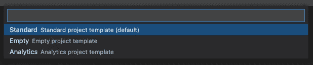

我将我的项目命名为“StandUpLightningWebComponent”:

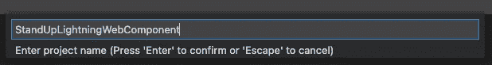

我将项目放在一个名为“stand-up-web-component”的文件夹中，并在 VS 代码中打开一个新的工作区:

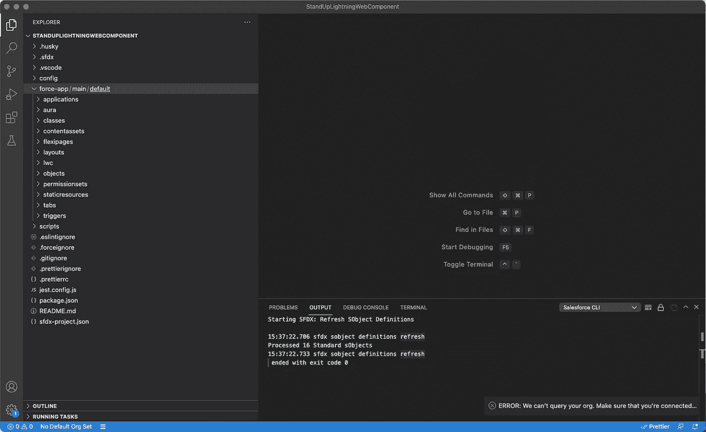

接下来，我们需要连接到一个 Salesforce 组织，我将在我现有的一个沙箱中使用它。如果您需要创建一个新的，请查看以下 URL:

[https://developer.salesforce.com/signup](https://developer.salesforce.com/signup)

一旦有了要使用的开发人员组织，就可以使用下面的 Cmd+Shift+P/Ctrl+Shift+P 命令将 VS 代码连接到该组织:

```
SFDX: Authorize an Org
```

VS 代码将提示一个登录 URL 选项。我选择了项目默认选项:

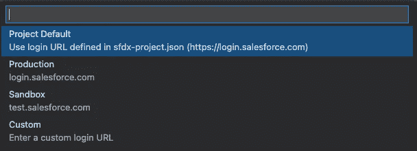

当被要求输入登录别名时，我只需按下回车键:

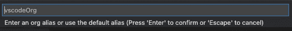

一个浏览器窗口出现了，我登录到我的沙盒组织。出现以下对话框:

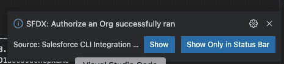

VS 代码现在已经连接到我的沙箱，我们已经准备好开始使用 Stand Up 组件了。

# 创建站立自定义对象

使用上一节中打开的浏览器页面，我使用 Salesforce 设置透视图创建了一个新的自定义对象。如果您碰巧关闭了该浏览器窗口，请使用以下 VS 代码 Cmd+Shift+P/Ctrl+Shift+P 命令在浏览器窗口中打开默认组织:

```
SFDX: Open Default Org
```

在设置中，我只是导航到对象和字段|对象管理器。接下来，我使用了创建|自定义对象选项，如下所示:

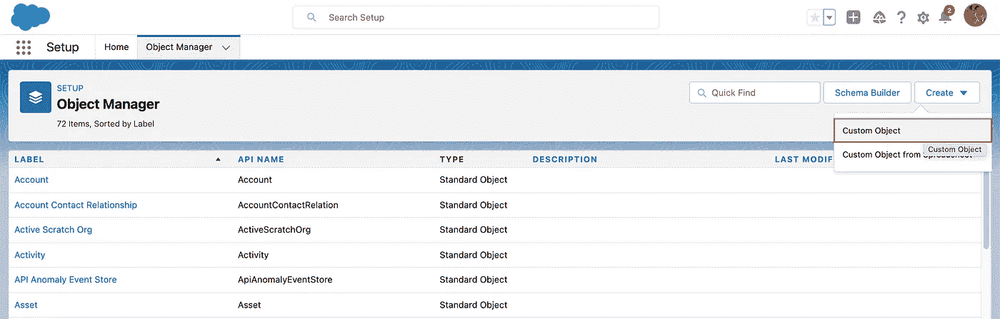

我创建了一个新的定制对象，标签为 Stand Up，并保留了默认的对象名 Stand_Up。但是，我用机智的回答替换了默认的记录名值:

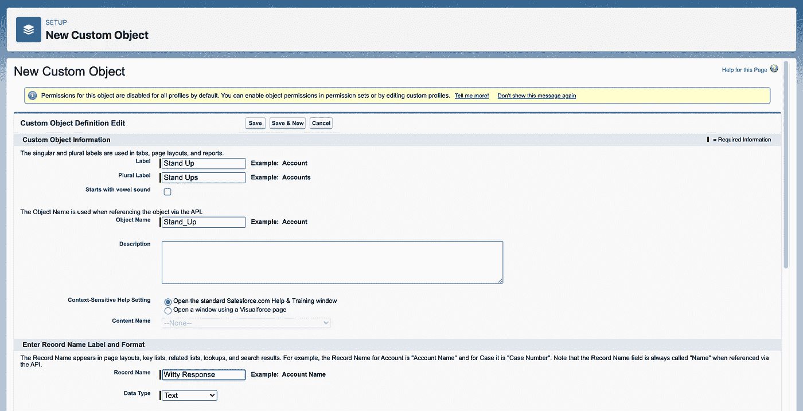

我保留了其他所有内容的默认值，并单击 Save 按钮来建立新对象。

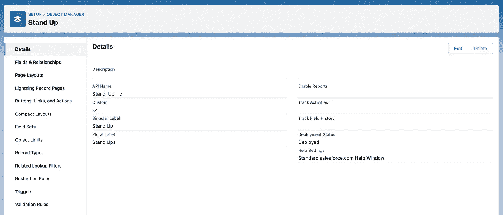

为了创建 Type 属性，我导航到 Fields & Relationships 选项并单击 New 按钮。对于此字段，我选择了选项列表选项，并单击了下一步按钮，这将导致以下屏幕:

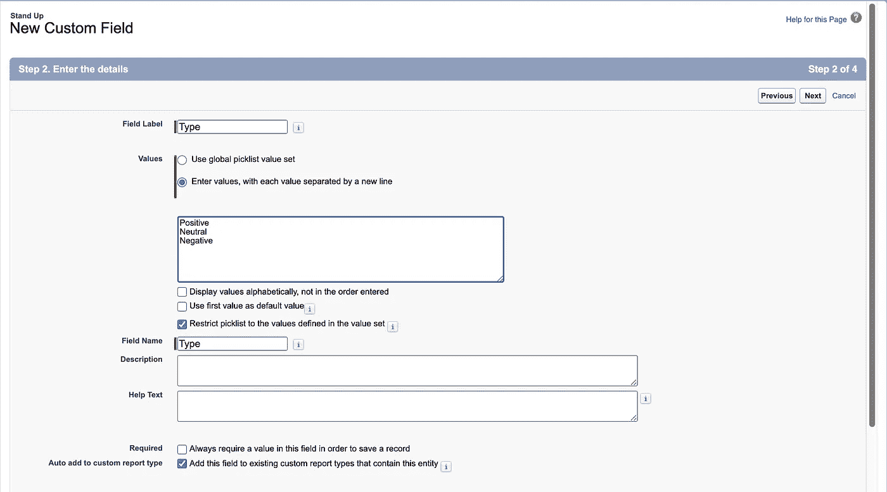

选项列表将限于上述三个选项。我单击了两次 Next 按钮(接受这些值和默认的字段安全性)，然后单击 Save 按钮添加新字段。直立物件已准备就绪:

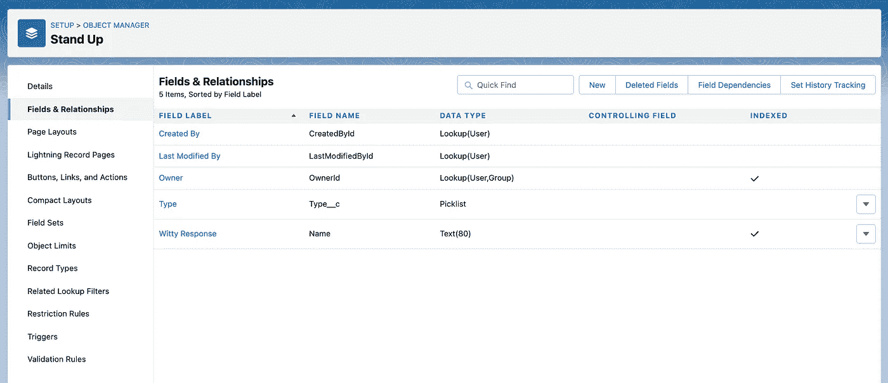

接下来，我使用 Salesforce 中的集成|数据导入向导流程将以下记录从`sample-data.csv`文件导入到 Stand Up 自定义对象中。

```
All is good in the hood!,Positive
I am free and need something to work on.,Positive
Should be finished today.,Positive
Been battling a migraine - no update.,Neutral
It works but it hasn't been tested,Neutral
QA is testing things right now - fingers crossed.,Neutral
Still making progress - but not finished.,Neutral
Waiting for my merge-request to be approved.,Neutral
I am honestly thinking about a career change.,Negative
It is as done as it is gonna be - is that good enough?,Negative
My dog ate my code and I am starting over.,Negative
```

如果您不熟悉该过程，您可以在此阅读如何使用导入向导:

[数据导入向导](https://help.salesforce.com/s/articleView?id=sf.data_import_wizard.htm&type=5)

导入完成后，我在 VS 代码的 Scripts | soql 部分创建了一个名为`Stand_Up__c.soql`的文件，它包含以下内容:

```
// Use .soql files to store SOQL queries.
// You can execute queries in VS Code by selecting the
//     query text and running the command:
//     SFDX: Execute SOQL Query with Currently Selected Text

SELECT Id, Name, Type__c FROM Stand_Up__c ORDER BY Name ASC
```

接下来，我突出显示了 SELECT 语句，并使用 Cmd+Shift+P/Ctrl+Shift+P 命令来选择以下选项:

```
SFDX: Execute SOQL Query with Currently Selected Text
```

此操作在我的终端选项卡中产生了以下结果:

```
Starting SFDX: Execute SOQL Query...

12:29:51.99 sfdx force:data:soql:query --query SELECT Id, Name, Type__c FROM Stand_Up__c ORDER BY Name ASCQuerying Data... doneID                  NAME                                                    TYPE__C
──────────────────  ──────────────────────────────────────────────────────  ────────
a092L00000E6eX4QAJ  Been battling a migraine - no update.                   Neutral
a092L00000E6eX2QAJ  I am free and need something to work on.                Positive
a092L00000E6eX9QAJ  I am honestly thinking about a career change.           Negative
a092L00000E6eXAQAZ  It is as done as it is gonna be - is that good enough?  Negative
a092L00000E6eX5QAJ  It works but it hasn't been tested                      Neutral
a092L00000E6eXBQAZ  My dog ate my code and I am starting over.              Negative
a092L00000E6eX6QAJ  QA is testing things right now - fingers crossed.       Neutral
a092L00000E6eX3QAJ  Should be finished today.                               Positive
a092L00000E6eX7QAJ  Still making progress - but not finished.               Neutral
a092L00000E6eX8QAJ  Waiting for my merge-request to be approved.            NeutralTotal number of records retrieved: 10.12:29:52.681 sfdx force:data:soql:query --query SELECT Id, Name, Type__c FROM Stand_Up__c ORDER BY Name ASC
 ended with exit code 0
```

最后，我想把定制对象的所有元数据都放到 VS 代码中。这样，定制对象就可以包含在基于 git 的存储库中，而不需要组件用户手动创建对象。

要将 Stand Up 自定义对象导入 VS 代码，请在终端窗口中使用以下命令:

```
sfdx force:source:retrieve -m CustomObject:Stand_Up__c
```

以下输出出现在 VS 代码中:

```
╭─jv@me ~/projects/jvc/stand-up-web-component/StandUpLightningWebComponent 
╰─$ sfdx force:source:retrieve -m CustomObject:Stand_Up__c                                                               
Preparing retrieve request... done
=== Retrieved Source
FULL NAME            TYPE          PROJECT PATH
────────────────── ──────────── ────────────────────────────────────────────────────────────────────────
Stand_Up__c.Type__c  CustomField   force-app/main/default/objects/Stand_Up__c/fields/Type__c.field-meta.xml
Stand_Up__c          CustomObject  force-app/main/default/objects/Stand_Up__c/Stand_Up__c.object-meta.xml
```

在 VS 代码中也可以达到同样的效果，方法是单击工具栏中的云图标，找到您想要检索的项目，然后点击下载图标。

在 VS 代码的左侧，站立自定义对象现在是可用的:

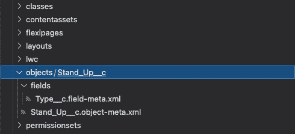

准备好对象和数据后，我们可以构建将与应用程序一起使用的 Lightning Web 组件。

# 创建立式控制器

我们将首先创建站立控制器，它将作为一个 API 来定位适当的响应。

我们可以使用下面的 Cmd+Shift+P/Ctrl+Shift+P 命令来创建`StandUpController`类:

```
SFDX: Create Apex Class
```

我填充了简单的控制器，如下所示:

客户端将调用`StandUpController.getRandomResponse()`方法，传入适当的`responseType`选项，这将返回一个`Stand_Up__c` 记录。如果没有与请求匹配的记录，那么将返回一个新的`Stand_Up__c`对象，其中间状态简单地为“Ummmm……”

# 创建站立式 Lightning Web 组件

我们现在准备为站立应用程序创建 Lightning Web 组件。

我们可以使用下面的 Cmd+Shift+P/Ctrl+Shift+P 命令来创建直立的 Lightning Web 组件:

```
SFDX: Create Lightning Web Component
```

我们需要做的第一件事是更新`standUp.js-meta.xml`以使该组件可用:

接下来，需要更新`standUp.js`来处理应用程序的请求，与我们在上一节中创建的控制器进行交互:

最后，我们需要更新`standUp.html`文件以包含视图层逻辑:

现在，我们已经准备好将站立应用程序部署到 Salesforce。

# 部署到 Salesforce

将我的所有代码从本地机器推送到 Salesforce 很简单。我只需在导航器中右键单击 force-app/main/default，然后选择 SFDX: Deploy Source to Org 选项:

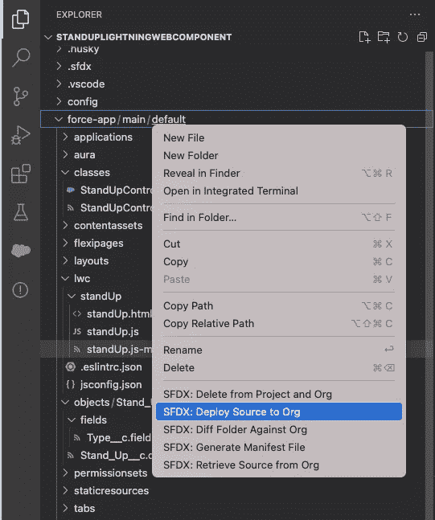

一旦完成，下面的对话框将出现在 VS 代码中:

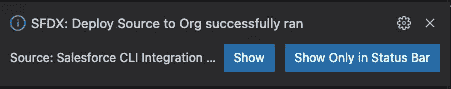

现在，我们准备将 Lightning Web 组件添加到 Salesforce 的新应用程序中。

# 在 Salesforce 中创建新的 Lightning 应用程序

我切换到浏览器选项卡，登录到我的 Salesforce 组织并打开设置透视图。接下来，我导航到应用程序|应用程序管理器页面，并单击新的 Lightning 应用程序按钮。

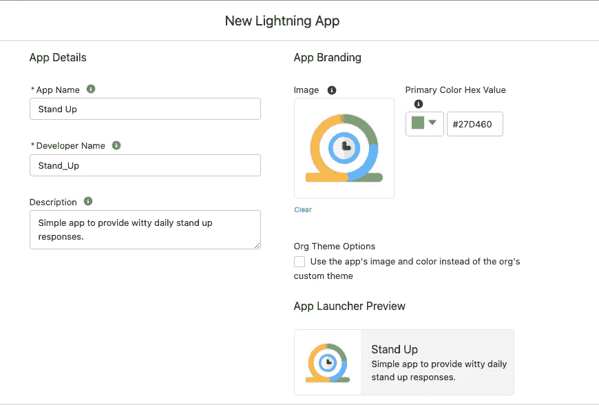

我决定调用新的应用程序，站起来，甚至找到了一个很好的小图标来使用。除了最后一个屏幕，我使用了向导中的其他默认设置，在最后一个屏幕中，我授予了所有用户对该应用程序的访问权限。

然后，我导航到用户界面| Lightning App Builder 屏幕。在这里，我创建了一个名为 Stand Up 的新 Lightning 应用程序页面，它被设计为具有单个区域的应用程序页面。

在屏幕的左侧，我可以在自定义部分看到我的 LWC 单口相声。我所要做的就是将该组件拖放到基于 Lightning 的页面的单个区域中。

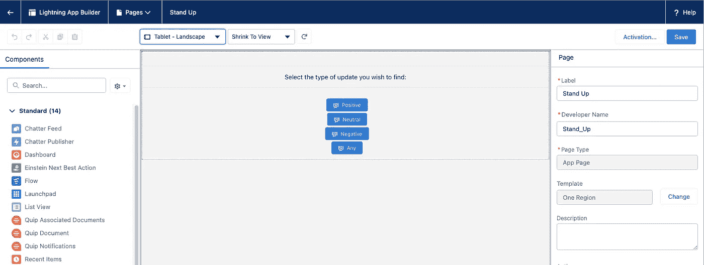

保存组件后，我使用激活过程向客户展示 Lightning 页面。

在激活阶段，我将应用程序名称设置为 Stand Up，并在列表中找到了最佳图标:

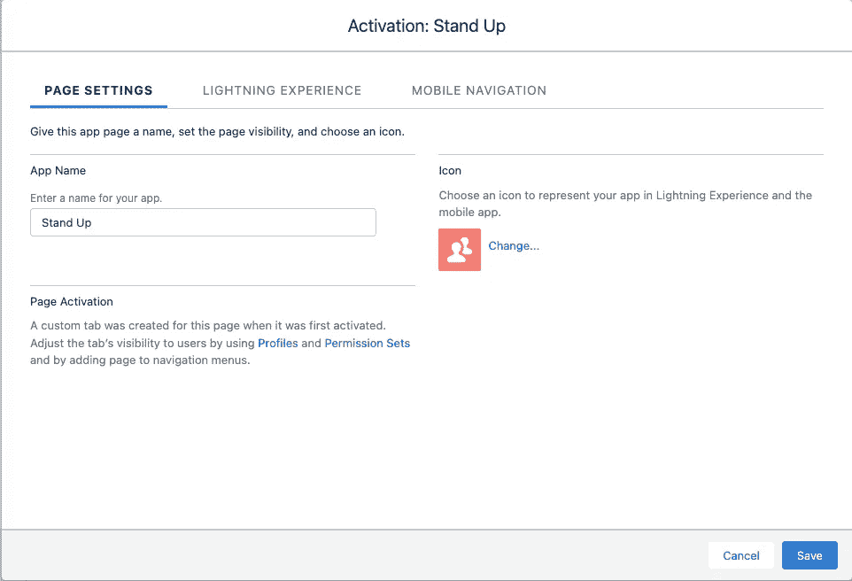

为了设置闪电体验，我将 Stand Up 应用程序放到了屏幕的右侧:

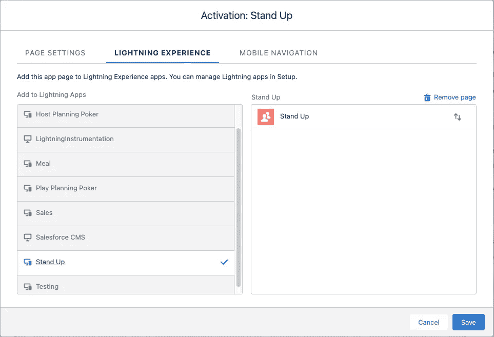

对于移动导航，我添加了站立照明应用程序，并确保它位于列表顶部附近:

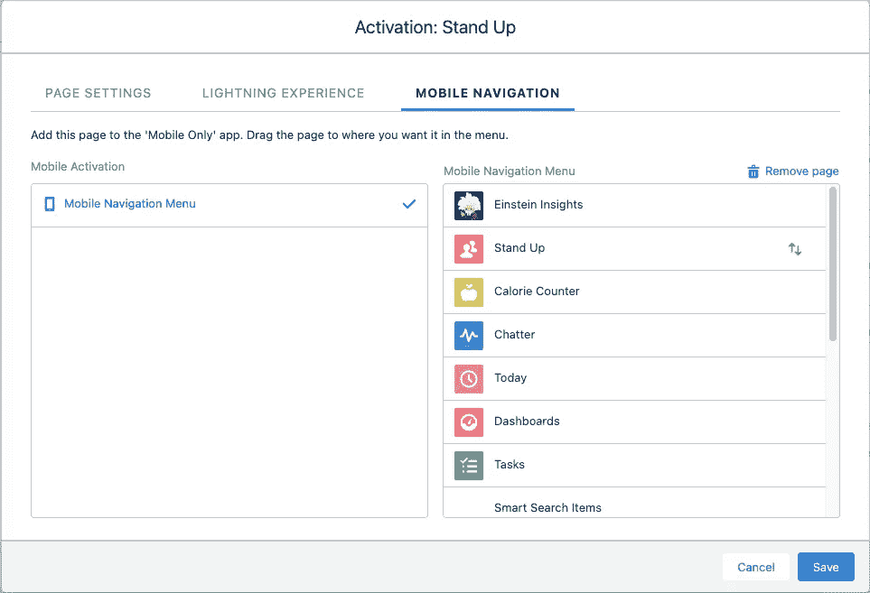

点击保存按钮后，站立应用程序就可以使用了。

# 使用站立应用程序

启动 Salesforce 移动应用程序后，我能够看到我刚刚创建的站立应用程序:

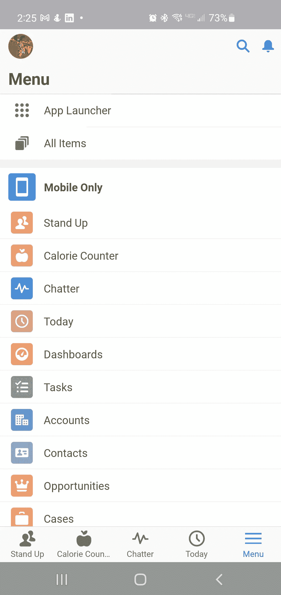

接下来，我点击了站立应用程序，它显示了以下带有我的自定义 LWC 的屏幕:


点击任意按钮将从`Stand_Up__c`记录集中返回一个随机响应:

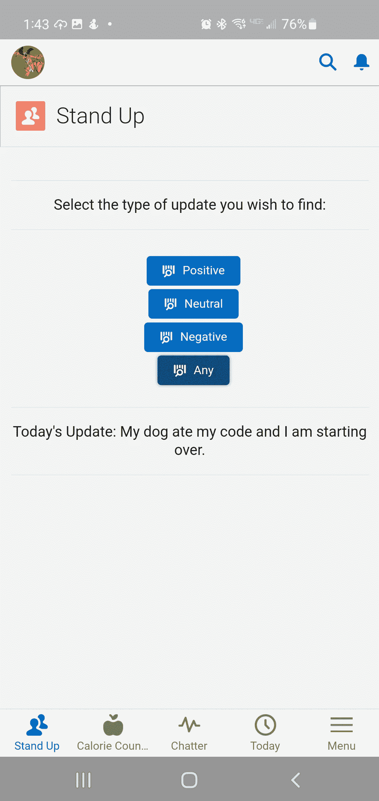

该应用程序也可在 Salesforce 中使用，无需对代码进行任何更新:

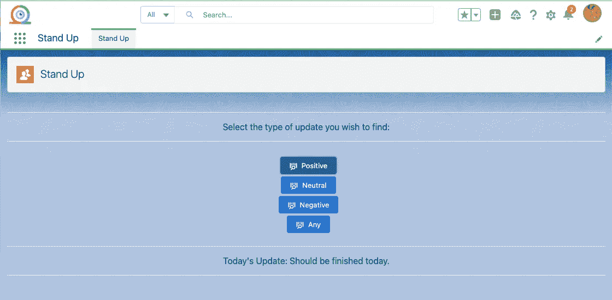

# 结论

从 2021 年开始，我一直努力按照以下使命宣言生活，我觉得这可以适用于任何 IT 专业人士:

> “将您的时间集中在提供扩展您知识产权价值的特性/功能上。将框架、产品和服务用于其他一切。”
> 
> —j·维斯特

正如我对 Heroku 平台的评估一样，我能够通过利用 Salesforce 平台快速引入 Salesforce 移动应用程序。在这样做的时候，我仍然专注于满足应用程序的需求，而不是担心基础和设计决策。

的确，这种模式符合我的使命宣言…而且完成这个例子所需的时间是以分钟计算的，而不是以小时甚至天计算的。

如果您对本文的源代码感兴趣，只需导航到 GitLab 上的以下资源库:

[](https://gitlab.com/johnjvester/stand-up-web-component) [## John Vester /站立式网络组件

### 15.0 主要版本即将发布！该版本为 GitLab 带来了许多令人兴奋的改进，但也删除了一些…

gitlab.com](https://gitlab.com/johnjvester/stand-up-web-component) 

祝你今天过得愉快！