# 我如何在两周内构建一个 Go Web 应用程序

> 原文：<https://betterprogramming.pub/how-i-built-a-go-web-app-in-2-weeks-8d82323c359c>

## 从设计开始，按时完成

在 [Unsplash](https://unsplash.com?utm_source=medium&utm_medium=referral) 上[卡尔·恩格尔](https://unsplash.com/@calengel?utm_source=medium&utm_medium=referral)拍摄的照片

> “设计后编码，你得到一匹马；编码后再设计，你就得到一头骆驼。”**—没人**

# **至理名言**

当被问及构建一个应用程序最关键的部分时，一个入门开发者可能会告诉你，“肯定是后端编码。”一个更资深的开发人员可能会认为系统设计、安全性和一个健壮的服务器让他们在周五晚上保持清醒。然而，任何经历过整个 web 应用程序创建周期的人都会让你明白设计的重要性，以及它如何包含和渗透到开发的每个阶段——所以这就是旅程的开始。

# **14** 天**剩余*天*天**

## ***构思***

一个以故事开始。每一个好的 web 应用程序都有一个有趣的背景故事，但是一个成功的应用程序体现了这个故事，并对其进行了改进。我们从亚历克斯的故事开始。亚历克斯住在库比蒂诺。如果你不知道，库比蒂诺和加州的许多城镇一样，有一条在建筑圈广为人知的规则——如果你翻新房子，一定要保留一面旧墙。如果你打破了这个规则，你就有可能在政府眼中失去改造项目的灵魂。换句话说，库比蒂诺会把你的改造项目当成新的建设项目来代替。因此，你会以提高财产税税率的形式招致巨额罚款。对于任何在硅谷有房子的人来说，这都不是一个愉快的前景，如今，硅谷的平均房价肯定接近 150 万美元。

也就是说，设计发展到包括在伯克利公寓生活的元素，通过采访建筑和设计专业的学生形成的想法，以及一个大学生独特的预算。一天结束时，我意识到我的设计受到了三个不变量的启发:

1.  第一个用户角色——**居住在硅谷的软件工程师希望在专业设计师的帮助下改造他们的家。这个用户群受限于三个因素:预算、时间、社交。**
2.  ****第二个用户角色**——大学设计专业的学生，希望通过解决现实世界的问题来实践他们的设计知识。我还为这个群体考虑了三个因素，即:收入、时间和互动方式。**
3.  ****动机** —在采访了两个角色组的成员后，我有了一个认识。尽管有针对房主和潜在买家的应用程序(Zillow、Redfin、ReMax)和为建筑师设计的工作空间应用程序(AutoCAD、iRhino、Sketchbook)，但没有现有的应用程序允许建筑师/设计师和客户直接交互，更不用说促进与蓝图的交互了。**

**在这一点上，在我得出最后的想法之前，我的脑海中出现了一连串不同的想法。这个想法是从一个叫做 BetterThanZillow 的东西开始的。**

## ****betterthanzilow****

**这个想法是以 Zillow 为例，而不是创建一个不同地区的房屋价格汇编，创建一个网站，建筑师可以拍卖他们的设计，以及房屋的最终成本给客户，他们会对设计进行投标。获胜者可以，毫不夸张地说，带回家一个家。**

**这被证明是一个可怕的想法。以下是我收到的一个有用的反馈:**

**“我不确定建筑师会愿意花那么多时间建造一个完整的 3D 模型，结果却让富人毫无兴趣。”**

**还有这个:**

**“谁来建造现实生活中的房屋？不管怎样，这比 Zillow 好多少……确切地说？”**

**哎哟。**

**因此，为了确保每个设计都是想要的，并远离 Zillow 和潜在的版权诉讼，我想创建一个应用程序，让房主参与建筑师设计过程的每一步。给予反馈、评论和批评。因此，archi build——一个允许房主在整个设计过程中与建筑师和设计师互动的应用程序，以改善他们的房子。**

**虽然一开始每一步都缠着一个建筑师似乎不是一个好主意，但采访显示并非如此。然而，在我深入研究具体细节之前，我们先来看看设计过程。**

## ****分两步走的设计流程****

1.  **创造**
2.  **反馈**

**就是这样。喝杯咖啡休息一下。**

**好吧。这不是一个全面的描述，看起来像这样:**

**构思——任务分析——观察研究——综合——成堆的草图——反馈——线框/故事板——评估——低逼真度纸质原型——代码骨架——实体模型——细化代码——高保真实现原型——更细化代码——用户评估——更细化代码——等等。**

**然而本质上，我只是一遍又一遍地描述了这两个步骤。这里的重点是说明，50%的设计实际上来自于向世界展示你的设计，并向它征求反馈。如果一个设计是不相关的，它就不可能是好的。**

# ****剩余 13 天****

## **任务分析**

**从分析手头任务的简单图表开始。在这里，我试图创建一个 web 应用程序，允许用户与建筑师进行交互。请注意，虽然这个任务分析图总共有六个面板，但是它充分地描述了用户和架构师将如何相互交互，并且无论我是从用户还是架构师开始，我都可以找到一条清晰简洁的指示路径，指示如何进行下一步。这有助于为项目开发的流程打下基础。**

**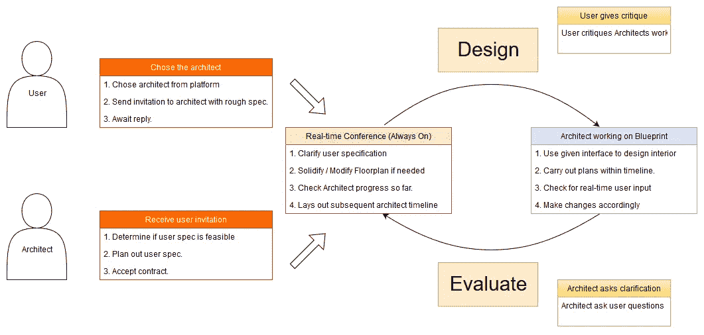**

**使用 draw.io 创建的任务分析图**

# **还剩 12 天**

## ****面试****

**受访者来自不同的背景，但他们主要平均分为两类，因此我将受访者分为两组。一组负责评估房主方面，而另一组作为建筑师给出反馈。**

**我问房主小组的关键问题包括:**

*   **翻新房子的过程**
*   **他们过去设计/重新设计房屋内部/外部的经验**
*   **房主在设计房子时看重的因素:预算、时间、外部帮助(建筑师)、最重要的方面、现代与古典美学、家具、颜色、空间的使用、家的位置、对孩子、宠物和其他重要事物的考虑**

**我向架构师团队提出的关键问题包括:**

*   **教育经历——什么学院，什么专业，以前的设计经历**
*   **工作经历——什么公司，多久一次，重要的工作**
*   **作为建筑师设计房子的过程——你使用什么工具，纸质还是电子，你多久联系一次客户，修改/重新设计以满足客户需求的难度有多大**

## **调查的结果**

**房主:**

*   **大多数房主购买的房子状况良好。许多房子一开始就有家具。尽管有现成的家具，大多数房主还是决定使用他们自己的家具。**
*   **然而，许多房主梦想中的房子与他们现在拥有的房子有很大不同，他们的许多愿望都非常具体，例如特定类型的地板，特定的家具材料，特定的室内/室外颜色。许多人还希望根据健康需求来设计，比如如果有过敏问题就放弃地毯。这表明对室内设计师的高度需求。**
*   **当被问及预算时，房主不愿意在他们已经支付的家具和其他物品的金额之外，再分配一个大得多的预算。如果他们雇佣了建筑师，他们愿意给建筑师的平均利润是家具总成本的 5%。**
*   **许多人认为定制家具不值得，而是选择从宜家等零售渠道购买价格合理的家具。**

**建筑师:**

*   **与最初的假设相反，大多数受访的架构师会欢迎客户交互，主要有两个原因。**
*   **首先，许多客户对他们的家应该是什么样子有非常具体的想法。因此，架构师经常必须在与用户的初次会议之后修改他们的蓝图的重要部分，浪费时间和精力。**
*   **第二，相当多的客户不善于及时回答建筑师关于他们的要求的问题，因为有时客户可能会要求一些建筑上不合理的东西(对物理和重力的理解差，会导致房屋倒塌)或法律上不负责任的东西(拆除所有的墙壁，或翻新结构的最高点，导致财产税的大幅增加)。**
*   **建筑师也表达了想要亲自了解客户，了解客户性格的怪癖和细节，例如客户有孩子吗，客户是素食主义者吗，客户是环保主义者吗？客户的首要任务是什么？有时客户不了解他们自己，这对建筑师来说是一个难题，他们被迫修改花了几周时间制作的蓝图的 90%。**

# **还剩 11 天**

## **草图**

**通过想象用户和建筑师将如何通过应用程序，跟随用户和建筑师的流程，下面的草图几乎是一个脱节的，断开的低保真度线框。虽然很粗糙，但它们起到了最终产品可视化的作用。**

**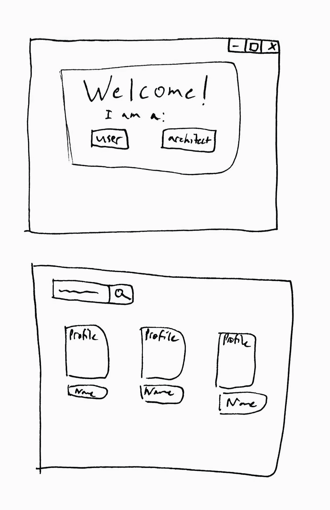**

**草图#1**

**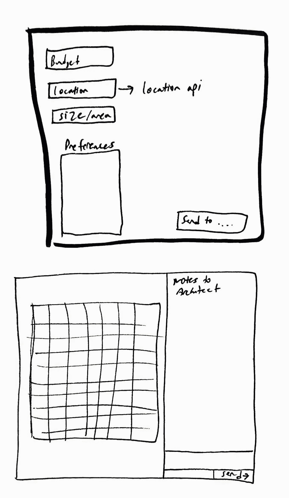**

**草图#2**

**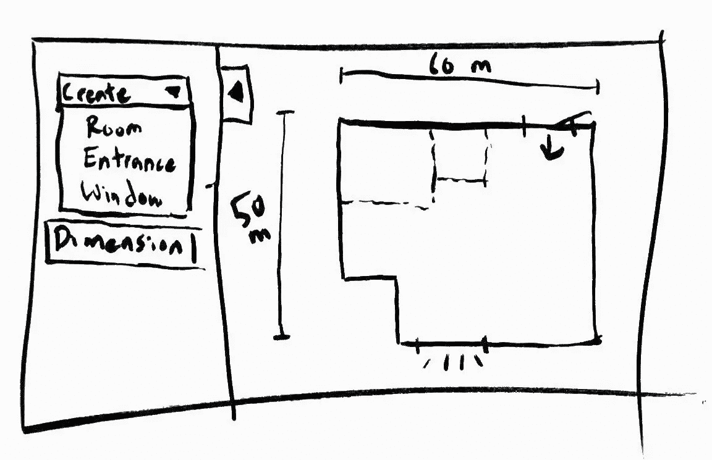**

**草图#3**

## **访谈结果**

*   **既然客户和架构师都有概要文件，那么如何创建和显示它们呢？**
*   **客户和建筑师还有其他沟通渠道吗？**
*   **如果客户想改进设计怎么办？**
*   **客户能把平面图发给建筑师吗？**
*   **如果客户想要更新他们的偏好怎么办？**

# **还剩 10 天**

## **三维线框模型**

**画线框需要特别小心。这是一个在用户交互期间传达关于应用程序流动方式的信息的机会。哪个按钮做什么？如何进入下一个屏幕？这种互动的意义是什么，它是如何工作的？线框回答了这些问题，使后续设计更容易。**

****

**线框的初始草图**

## **访谈结果**

*   **在用户将联系信息和偏好调查发送给架构师之后，这个应用程序的状态是如何可见的？**
*   **架构师的视点与他们已经习惯的蓝图软件不一致:Edraw Max、CAD 和 TurboFloorPlan 等。**
*   **右下角的信息和调查界面非常笨拙，因为它突然变成了完全不同的风格。**
*   **架构师的蓝图视图不提供关于其所提供的功能的可视化指导或文本文档。应该使用标志性的标志。**
*   **客户和建筑师之间到底共享什么？作为客户，当我想查看蓝图草案时，重要信息根本没有突出显示。**

# **还剩 9 天**

## **线框已修改**

**修改线框以反映反馈建议的更改，如表格视图以反映建筑师可能使用的平板电脑。图标的数量越来越多，建筑师的参与成为一个重要的特征。架构师通过与用户实时交互的形式获得一种“身临其境”的感觉，作为交换，用户会返回实时警报。现在的设计是房间的鸟瞰图，以方便交互。**

**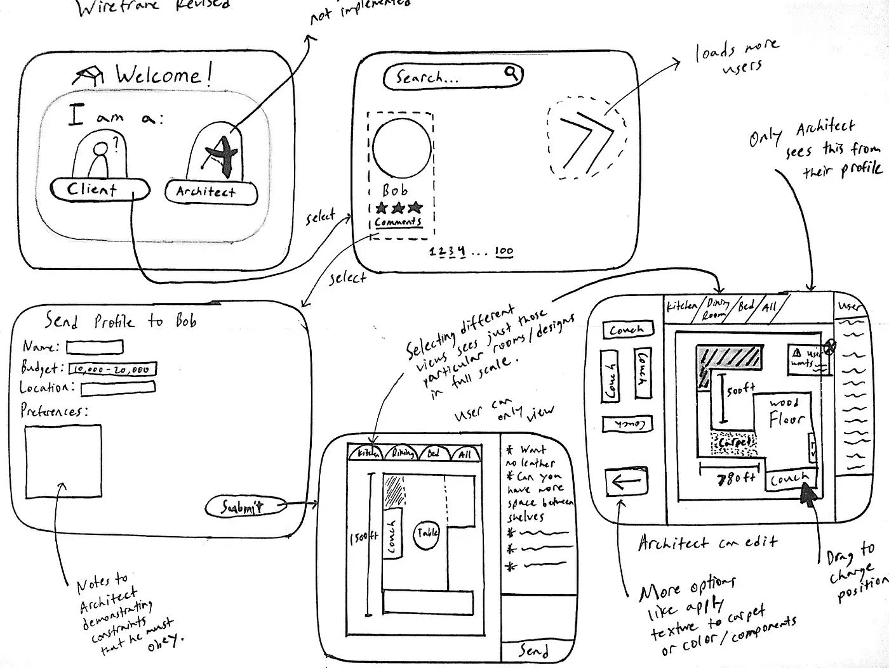**

**修订的线框**

# **还剩 8 天**

## **故事板**

**如下所示，故事板比线框更粗糙，因为它传达的信息不是具体的工作流，而是用户角色使用应用程序的上下文的抽象概念，以及应用程序如何在这样的上下文中满足用户的需求。**

**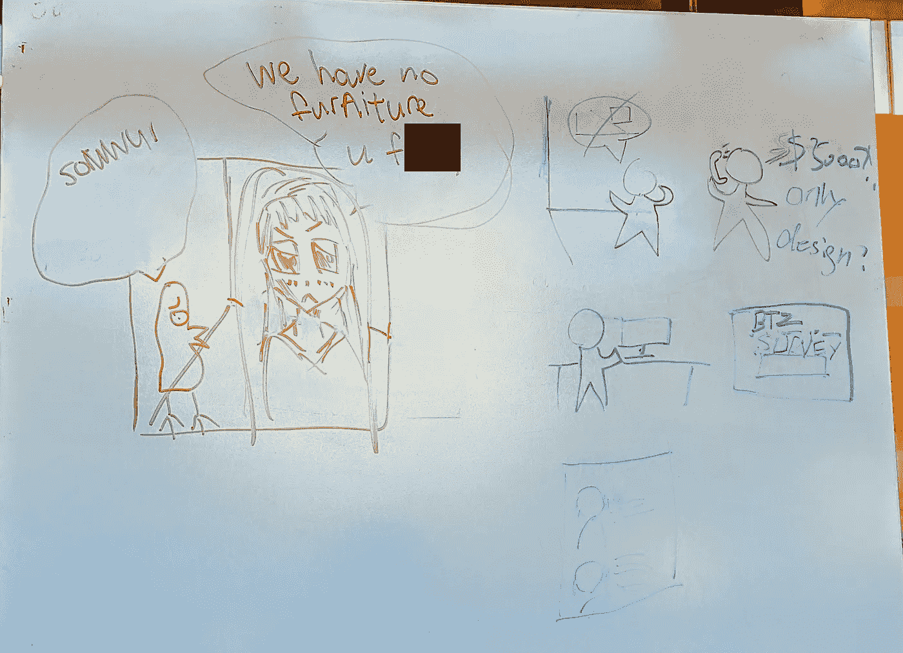**

**故事板头脑风暴**

**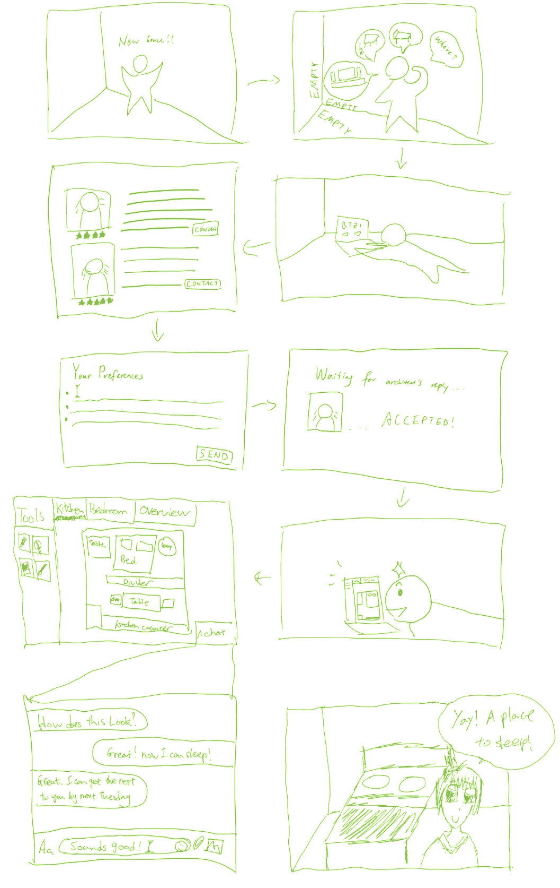**

**故事板草图**

# **还剩 7 天**

## **低保真度纸张原型**

**对于低保真度的纸质原型，我强调了应用程序的主要交互，而忽略了细节。这给出了前端在最终应用程序中的大致外观；最重要的是，这突出了所有将包含在交互中的特性。**

**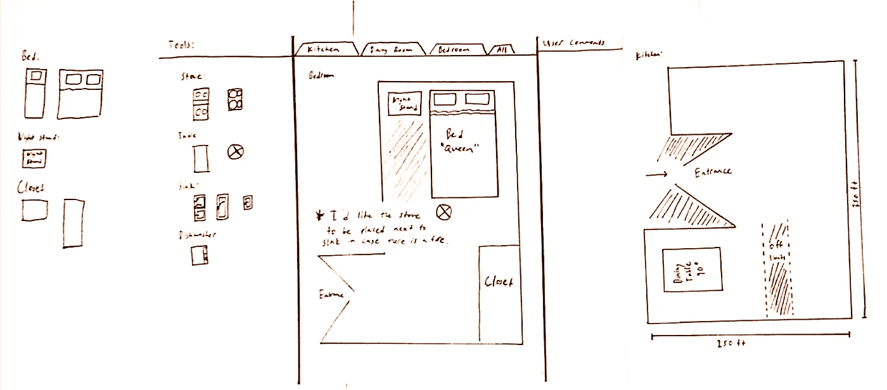**

# **还剩 6 天**

## **实体模型**

**在 Figma 中创建了前端实际外观的草图。我不仅可以看到每个交互步骤的视图和每个特定的视图，而且 Figma 还提供了一个非常基本的前端框架代码，我可以利用它作为起点，也可以作为我通过后端生成的内容的参考。非常俏皮。**

**选择设计师的第一个屏幕版本**

**选择设计师的第二版屏幕**

**设计师对蓝图绘图板的看法**

# **剩余 5 天**

## **高保真实现原型**

**后端使用 Golang 和 gorilla websockets 从头开始构建。前端用 HTML，CSS，Javascript 实现。**

**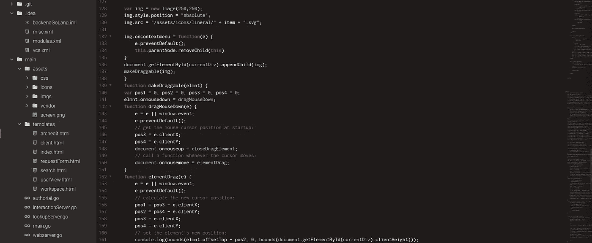**

**第一页是建筑师的搜索页面。我使用 trie 数据结构实现了这一点，每次击键都会向后端发送一个查询，从以前的客户那里提取建筑师的个人资料，包括他们的姓名、个人资料图片、评级和评论。然后将这些配置文件显示给客户端。**

**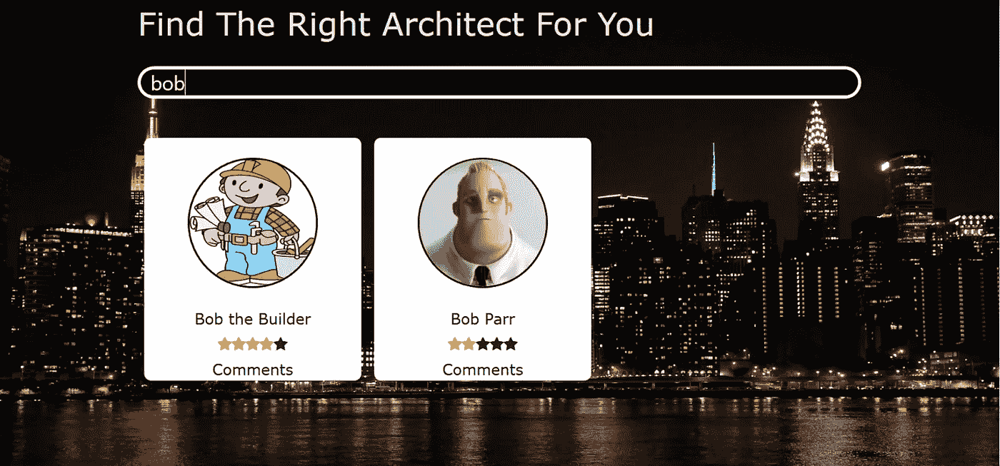**

**房主可以用来搜索建筑师的页面**

**在用一个表单提示客户将必要的信息发送给架构师之后，显示主交互。这包括名称、预算、区域、位置和其他偏好。建筑师从他们的角度接受了这一点。**

**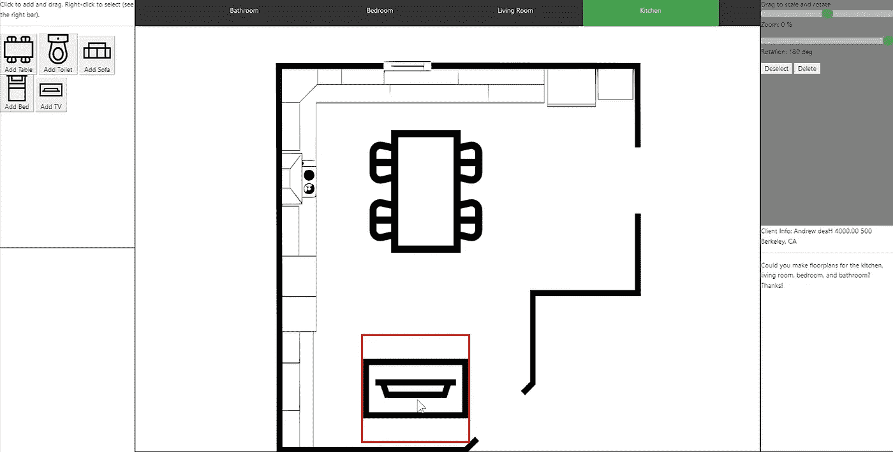**

**webapp 实现原型的屏幕截图。拆分平面图、缩放和旋转功能将在以后的版本中添加**

## **访谈结果**

> **“设计师从来不会一成不变。我只画轮廓，因为一切都在不断变化。例如，商品会比我们最初想象的要贵，或者客户改变了对设计、材料甚至预算的看法。”—匿名建筑师**

*   **创建蓝图与想象力关系不大，而与灵活性关系更大。**
*   **架构师喜欢拖放功能。它很灵活，如果出现错误，他们可以简单地移动它。**
*   **蓝图应该更加灵活。另一方面，有些东西应该受到约束，例如，什么家具可以放在哪里，客户的总预算是多少，或者每件家具的成本。**
*   **平面图应该分成不同的房间。这解决了平面图太小的问题(眼睛疲劳是非常危险的，因为它决定了我能工作多长时间)，并允许我在脑海中划分不同的计划。**
*   **能够与客户沟通并准确了解客户的需求是一个很大的帮助。这也有助于告诉客户我能做什么，不能做什么。**

# **还剩 3 天**

## **最终原型**

**为了更好地满足架构师的需求，我采纳了用户访谈中建议的所有变更。我添加了缩放和旋转功能，以及将平面图分成不同房间的功能。这些变化减少了眼睛疲劳，并允许建筑师工作更长的时间。架构师现在可以与用户实时协商，最终确定我最初打算实现的功能。还增加了灵活性和约束功能，包括地板纹理和预算限制。建筑师不能添加超出用户预算的家具，家具成本会实时从预算中扣除。这导致了一个更加完美的交互页面，如下图所示。**

**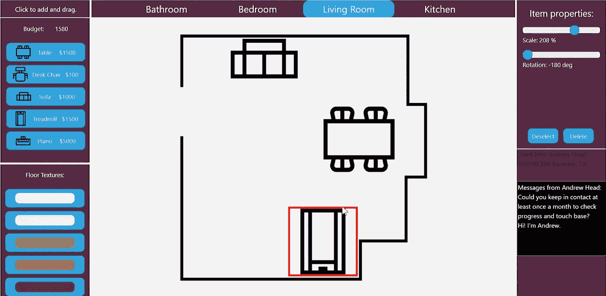**

**最终的原型界面有了很大的改进**

# **还剩 1 天**

**一晚上喝五杯咖啡量的 Adobe Premier 来保持清醒。我们开始吧！**

# **最终产品**

## **标志；徽标**

**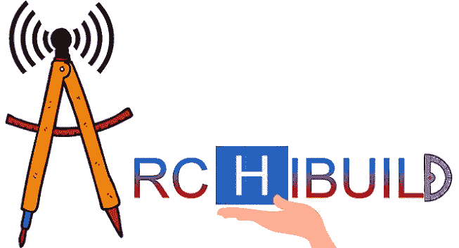**

**亚历克斯·帕克的标志**

## **产品**

**archi build[http://cs160 . Hu . fo](http://cs160.hu.fo)**

## **演示**

**肖恩·刘的视频**

# **剩余 0 天**

## **结论**

**如果我一开始就匆忙从头开始编写整个程序，这本指南的标题应该是“在笔记本电脑前苦干一年后，在几乎放弃编写 go webapp 后，我是如何最终爬着完成的。”与常识相反，从设计开始一个项目对按时完成它至关重要。另一方面，如果我不听取反馈就继续推进，我会被 BetterThanZillow(一个名不副实的应用程序)困住，花两年时间完成，并拥有吸引架构师的特性。不仅是一个好的建议来源，质量保证，并消除不必要的功能，以节省时间和精力，获得大量良好的采访也可以作为一个客户和用户的开始来源。**

**尽管这个原型令人印象深刻，因为它只用了 14 天就建成了，但它受到时间和预算的限制。没有足够的工作人员来进行大规模采访，以获得完整应用程序的足够多样性，尽管最终产品充满了功能，但仍然让房主和建筑师感到失望。我打算继续改进这个应用程序，加入更强大的功能，如 3D 编辑器、包含家具、地板纹理的数据库，以及各种壁纸、物品和人们可能希望放在家里的小工具。messenger 还可以改进为包括语音、视频和语音邮件。**

**不同的受访者还表示，该应用程序可以作为一个产品推出，因此支付集成和各种生产级功能也在考虑中。**

## **谢谢大家！**

**最后但同样重要的是，我想衷心感谢我们所有的受访者，我们的导师 Andrew 和 Sarah，以及我们设计团队的每个成员，没有他们，这款应用就不可能实现。**

# **附录**

*   **GitHub [链接](https://github.com/yliu-code/Archibuild)**
*   **滑动[链接](https://docs.google.com/presentation/d/1cbke_z6S15VzNdNcSx0eg3BeAJwROhAsk2ByFGbP8lg/edit#slide=id.p)**
*   **视频[链接](https://www.youtube.com/watch?v=IL48dyXwMu8)**