# 我如何使用 Unity3D 和 AWS 构建酒店平台

> 原文：<https://betterprogramming.pub/how-i-built-a-hotel-platform-with-unity3d-and-aws-22bd3c315d81>

## 使用 Amazon Web Services 构建一个完整的可扩展云架构

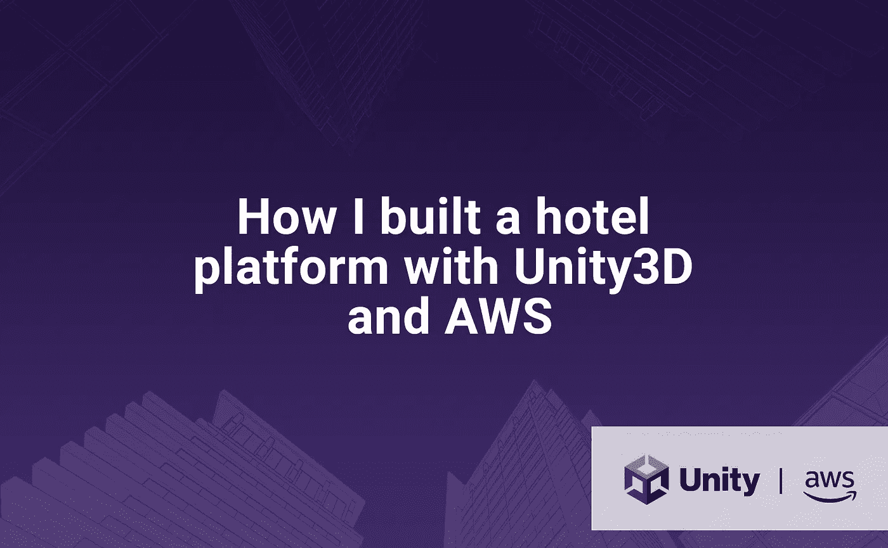

插图由 [Gianca Chavest](https://www.instagram.com/niimde/) 绘制

几年前(疫情时报成立之前)，我的一个客户非常兴奋地打电话给我，他有一个大项目，需要我的服务。他告诉我:“亚历克斯，我想为拉美市场做一个合适的 ipad”。等等，什么？

如果您曾在豪华酒店或度假村旅行和休息，您应该在酒店房间使用多功能 pad 或平板电脑。该设备主要允许可视化关于酒店、电话号码、菜单、价格和事件的信息，并且有时允许与客房服务或接待处通信。这类产品的一个很好的例子就是 [SuitePad](https://www.suitepad.de/en/) 。

我终于做到了！以下是最终应用的概述:

在本文中，我将解释如何使用 **Unity3D** 的可视界面和 **Amazon Web Services** (AWS)的服务器端架构来构建这种平台。本文将关注如何配置服务并在它们之间建立通信。出于保密考虑，我将只展示平台主要功能的代码片段。

在 Android 平板电脑上运行的最终应用的垂直版本

# 要求

我的客户声称他已经买了一些 Android 平板电脑，他需要我来搭建平台。第一次交付非常简单:它只会从服务器加载酒店信息，并在 pad 上显示出来。没有与客房服务的沟通，也没有其他功能。

我的客户对第一次交货有很多要求:

*   该应用程序应该是一个“白标”应用程序:它可以适应任何酒店。因此，标志，应用程序的颜色，文本，媒体等。应该从云中加载。
*   该应用程序应该有一个登录机制，用户名和密码。每个酒店房间的用户名应该是唯一的。
*   该应用程序应该是多语言和多种货币。
*   该应用程序应该可以在 Android 和 iOS 设备上运行，并考虑横向和纵向格式。
*   该应用程序应该下载所有可用的媒体(图像，文本等。)用户登录后。
*   服务器应该处理大量的客户端连接。

# 软件体系结构

我们开始吧。

对于客户端，我们需要建立一个可以在 Android 和 iOS 上运行的应用程序。我选择使用 Unity3D，因为它提供的灵活性(Unity 应用程序可以在桌面、iOS、Android、WebGL、tvOS、PS4 和 PS5 上运行)以及我对该平台的一般了解。

对于服务器端，我们需要一个建立在云平台上的可扩展架构。我选择与亚马逊网络服务(AWS)合作，主要是因为它的可伸缩服务的可靠性和我的经验。

以下是我们平台的总体架构:

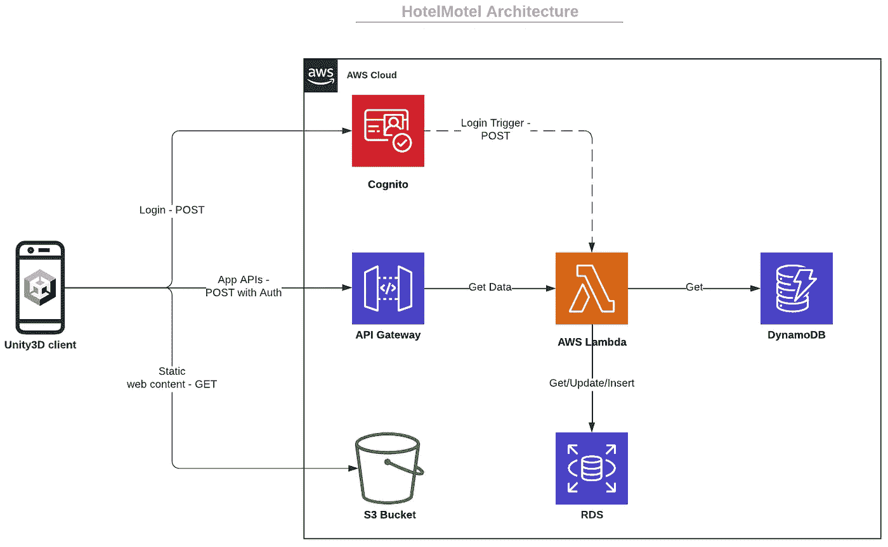

**注意**:我不会实现[AWS SDK](https://docs.aws.amazon.com/sdk-for-net/v3/developer-guide/welcome.html)；我更喜欢保持客户端和服务器端的独立性。

# 服务器端实现

## 认知

我们使用的第一个亚马逊服务是 Cognito。Cognito 就像一个存储用户、用户属性和密码的保险箱。它通过用户名和密码提供安全的用户认证。

➡️ **用户池**:首先我们创建一个用户池，禁用用户名 auth 和自注册。请注意，用户池 ID 将自动生成。

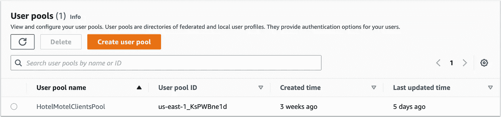

➡️ **App** :在用户池创建过程中，会创建一个用户池 App。我们选择用户密码认证作为唯一允许的认证流，并且我们创建了两个定制属性:`hotel_name`和`room_number`。请注意，应用程序客户端 ID 将自动生成。

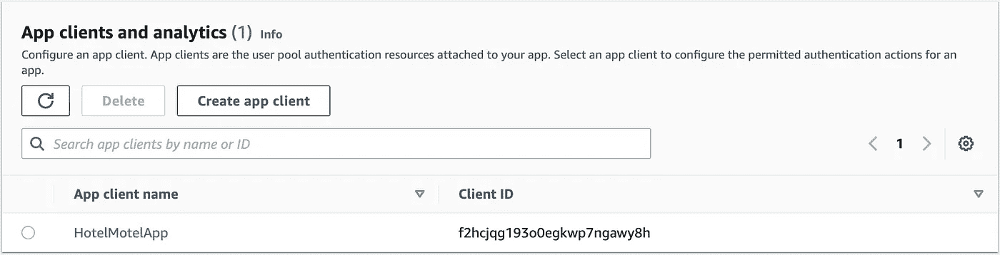

➡️ **用户**:我们在用户池中手动创建用户。用户名字段是惟一的，所以我将其设置为酒店名称和房间号的组合。

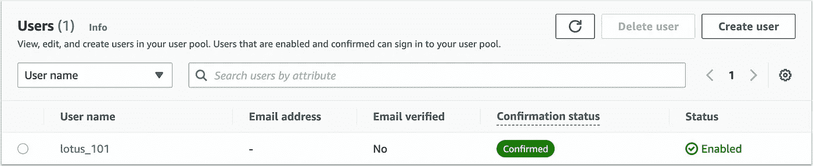

## 无线电数据系统

RDS 代表关系数据库服务。在关系数据库中，我们将存储我们需要的所有事务信息。

➡️ **数据库创建**:首先，我们创建一个公共访问的 MySQL 数据库，并设置凭证(数据库名称、用户名和密码):

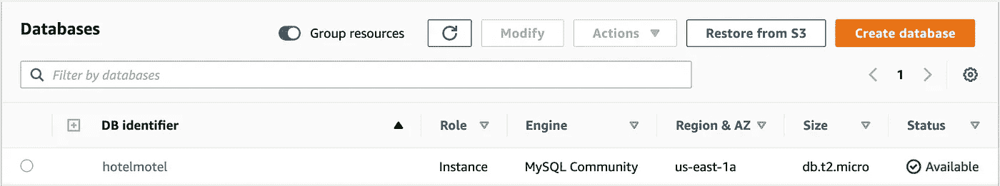

➡️ **安全规则**:现在我们需要访问数据库来构建表格，并用数据填充它们。我选择用桌面 MySQL 客户端来做: [Sequel Pro](http://sequelpro.com/) 。因此，我们需要允许数据库的外部连接:我们进入数据库的安全组，并更改入站规则以允许所有连接。

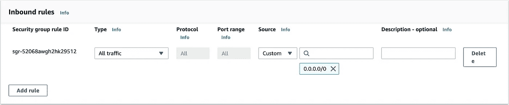

现在，我们可以使用在数据库创建过程中设置的凭据从 MySQL 客户端连接到我们的数据库:

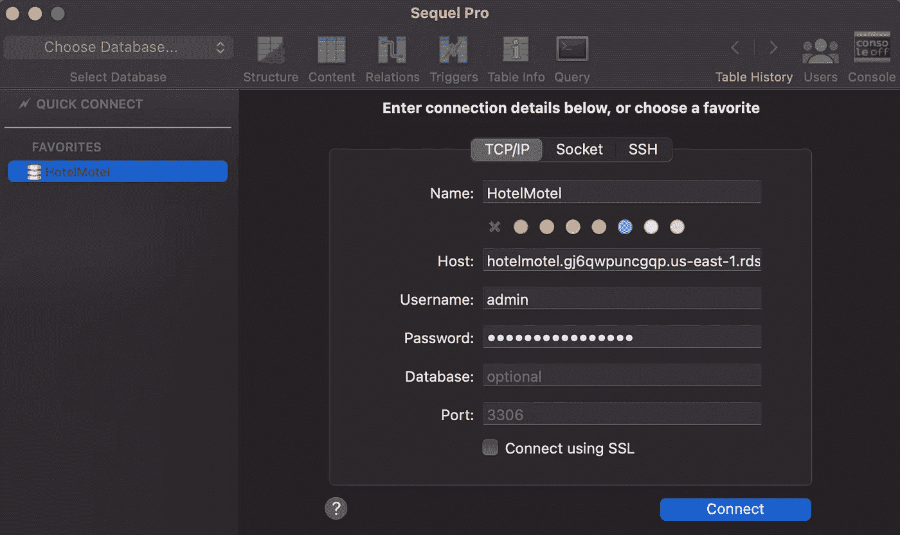

## DynamoDB

DynamoDB 是 AWS 的非关系数据库服务。我们将在其中存储所有的非交易信息，如标题，描述，图片网址等。

➡️ **表创建**:我们创建一个 DynamoDB 表。我们的数据将被酒店分段，所以我们选择这个参数作为表的**分区键**。

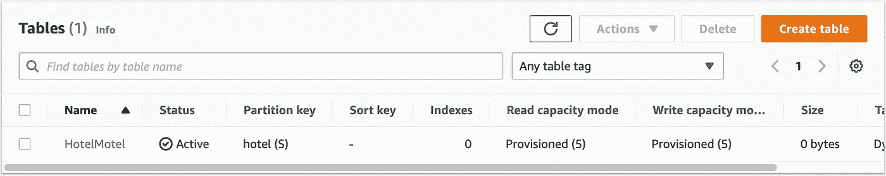

➡️ **条目创建**:我们创建了一个包含 JSON 数据的新条目。

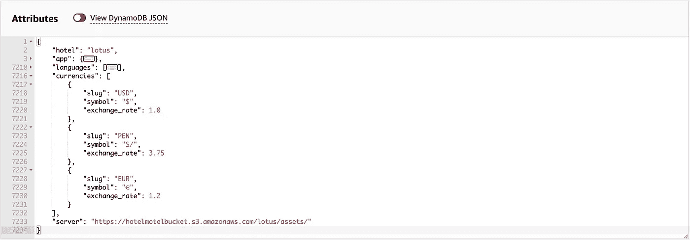

## S3

S3 是静态内容的可扩展存储服务，我们用它来存储将在平板电脑上显示的图片。

➡️ **存储桶**:我们创建了一个新的存储桶，又名存储库。因为我们不存储敏感媒体(酒店、菜单、房间等的图片)。可以在网上找到)，我们将 bucket 及其内容设置为“public”。

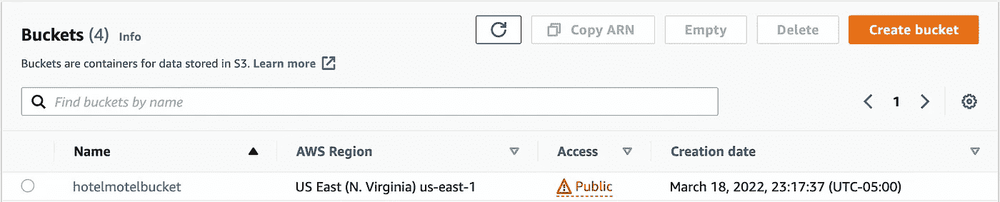

➡️ **存储桶策略**:我们编辑存储桶策略，只允许存储桶内容被读取。

**注意**:在上面的例子中，我们库的最终 URL 是:[https://hotelmotelbucket.s3.amazonaws.com/](https://hotelmotelbucket.s3.amazonaws.com/)

## 希腊字母的第 11 个

Lambda 是一个很棒的无服务器服务，允许运行代码让 Amazon 为你管理服务器资源。

➡️ **GetData 函数**:这个 Lambda 函数将允许获取存储在 DynamoDB 中的酒店数据。首先，我们从头开始创建一个新函数，运行在 Lambda 提供的最新版本的 Python 上(目前是 3.9)

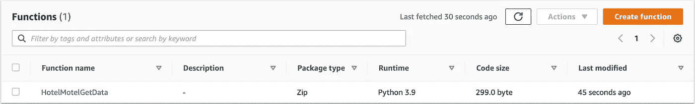

下面是函数:

**注意事项**:

*   多亏了我们使用的授权器，所有的用户信息都可以在事件变量中得到。我们可以获得我们在用户池应用程序中定义的自定义属性`hotel_name`的值。在我们的例子中，这个值应该是“lotus”。
*   我们使用 Python 的 AWS SDK[boto 3](https://boto3.readthedocs.io)来调用其他 AWS 服务，在本例中是 DynamoDB。我们使用`[get_item](https://boto3.amazonaws.com/v1/documentation/api/latest/reference/services/dynamodb.html#DynamoDB.Table.get_item)`函数从带有关键字“lotus”的表“HotelMotel”中检索数据。
*   Python 原生 JSON 库[不支持小数类型](https://docs.python.org/3/library/json.html#implementation-limitations)，所以我们创建了一个`DecimalEncoder`类来将小数转换为浮点数。
*   我们使用 try/except 子句来处理潜在的错误。

默认情况下，Lambda 函数没有读写 DynamoDB 表的权限，所以不要忘记给我们刚刚创建的 Lambda 函数附加`AmazonDynamoDBReadOnlyAccess`权限。

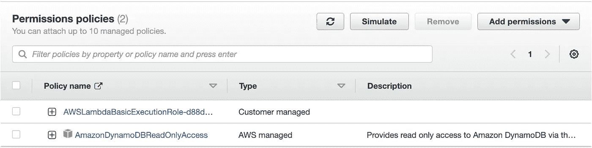

➡️ **OnLogged 函数**:这个 Lambda 函数将允许在我们的关系数据库中保存一个新的用户登录。当用户成功登录时，Cognito 将直接调用该函数作为触发器。

用于在关系数据库中保存登录历史的表格如下:

用 [DBDiagram](https://dbdiagram.io/) 工具设计的 login_history 表

为了编写关系数据库，我们需要首先连接到 [PyMySQL](https://pymysql.readthedocs.io/) 库。问题:PyMySQL 不是原生的 Lambda 库，所以我们必须创建一个新的层，并将 PyMySQL 导入其中。该层可重复用于其他功能。

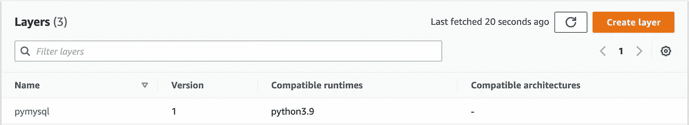

**注**:PyMySQL 的干净版本可以在 [PyPI](https://pypi.org/project/PyMySQL/#files) 上找到。

我们现在可以添加刚刚为我们的功能创建的层:

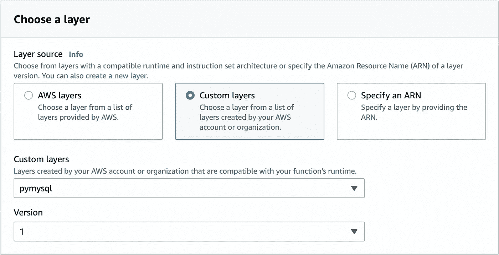

这是它的功能:

注意事项:

*   正如 AWS [文档](https://docs.aws.amazon.com/cognito/latest/developerguide/user-pool-lambda-post-authentication.html)中所描述的，事件对象包含用户的信息，比如用户名。
*   我们返回文档中描述的整个事件对象。

现在回到科宁托。我们在用户池中创建了一个新的身份验证后触发器，并为我们刚刚创建的 lambda 函数赋值:

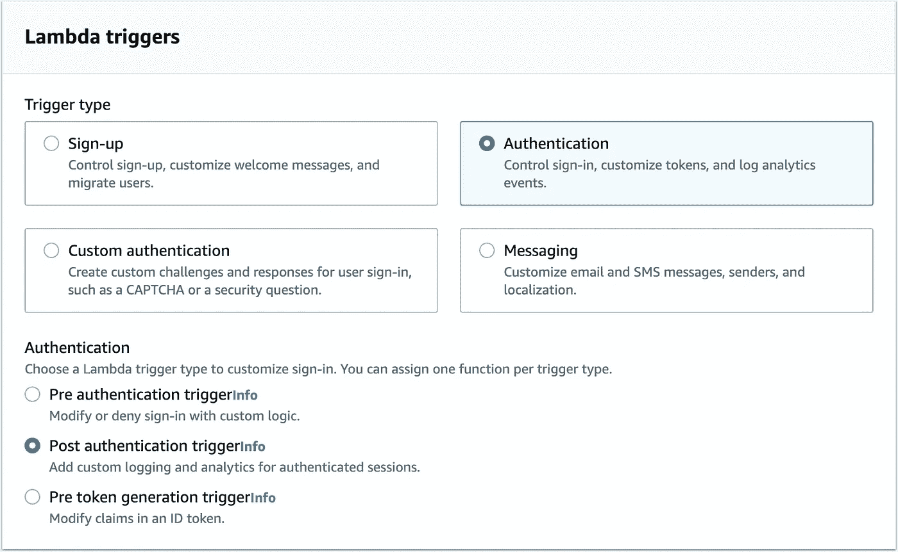

## API 网关

API 网关服务允许为我们的应用程序创建一个安全的入口点，并将其连接到我们正在使用的其他 AWS 服务，在本例中是 Lambda。

➡️ **API** :我们创建了一个新的 REST API

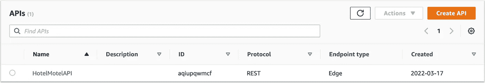

➡️ **授权者**:我们创建一个新的授权者，只允许属于用户池的用户调用我们将要创建的 API 资源。

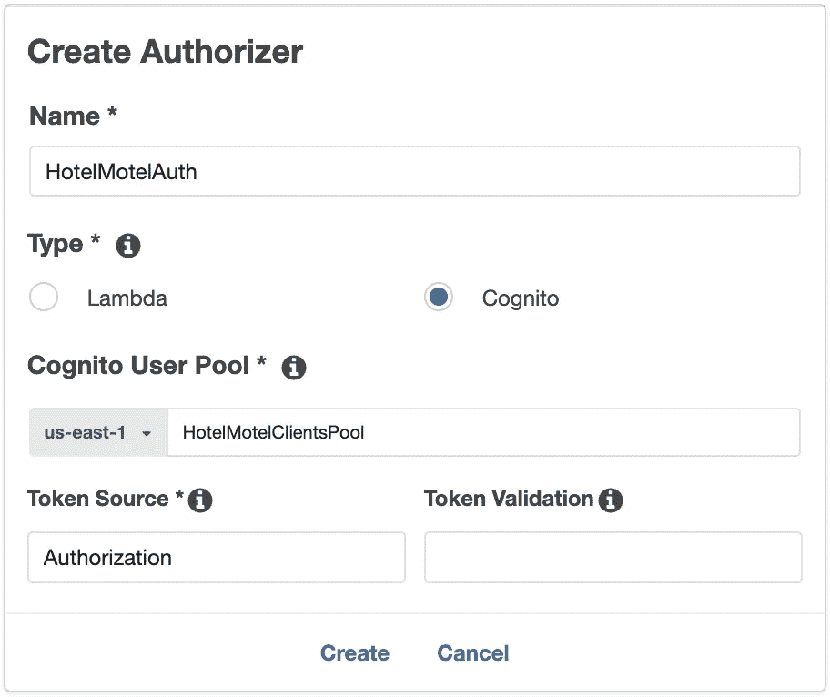

➡️ **资源**:我们创建一个新的资源。资源名称将是入口点的最终 URL 的后缀。

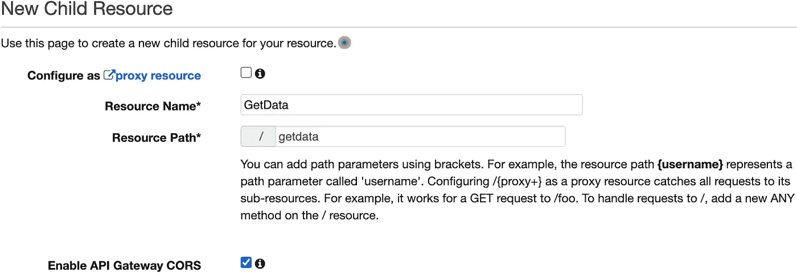

➡️ **方法**:我们需要指定如何调用资源，创建一个新方法。我们创建一个集成了 Lambda 的 POST 方法，并选择我们之前编写的 Python 函数。请注意，应该激活 Lambda 代理集成，以允许从 Unity 客户端发送参数。

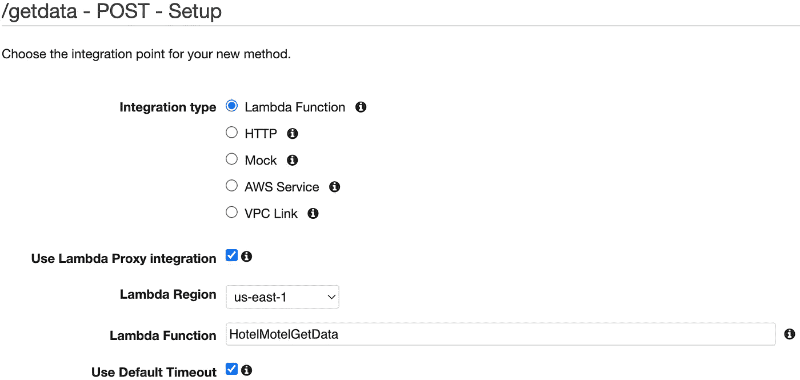

在我们刚刚创建的方法中，我们选择了授权人:

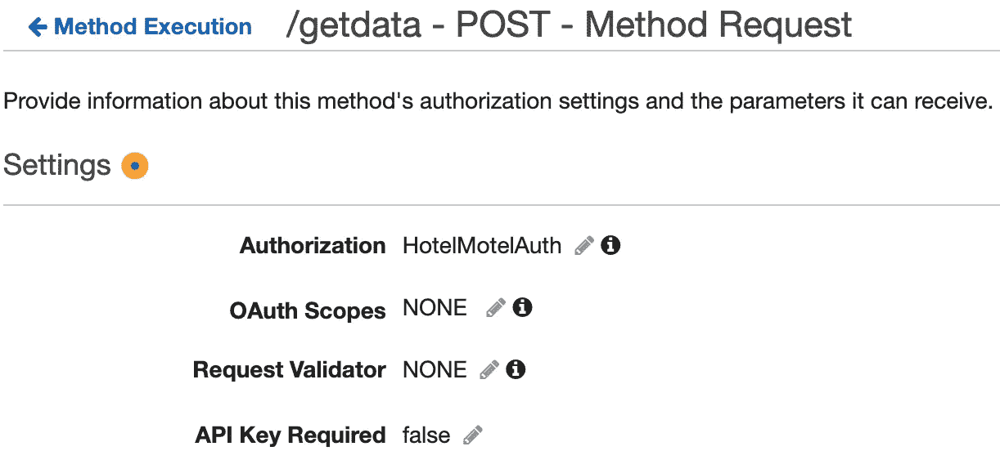

➡️ **部署**:我们的 API 已经准备好了，我们只需要部署它。我们创建一个新的阶段，例如，“prod”。

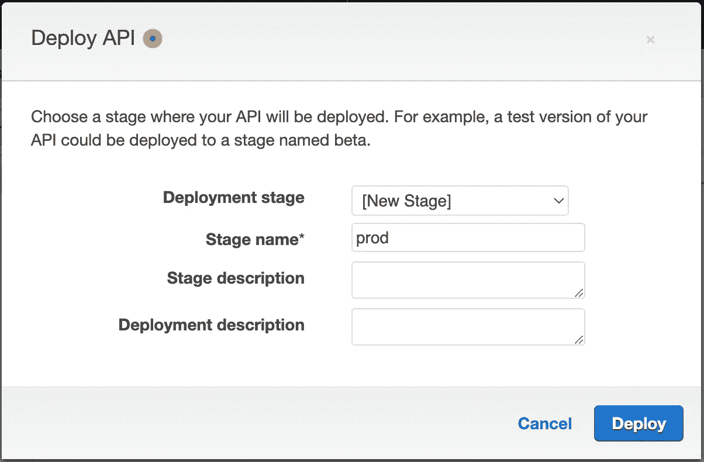

我们的 API 已经部署好了，可以使用了！请注意，出现的 URL 将由我们的 Unity 客户端调用。

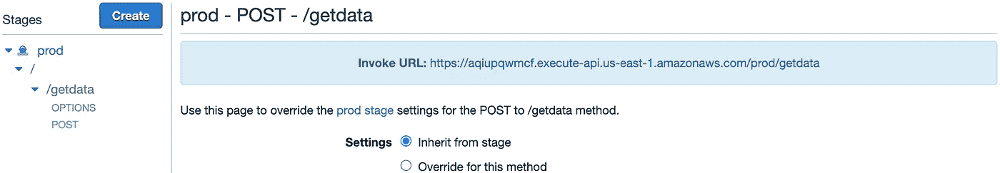

让我们用 [Postman](https://www.postman.com) 试试我们 API 的 get data 函数:

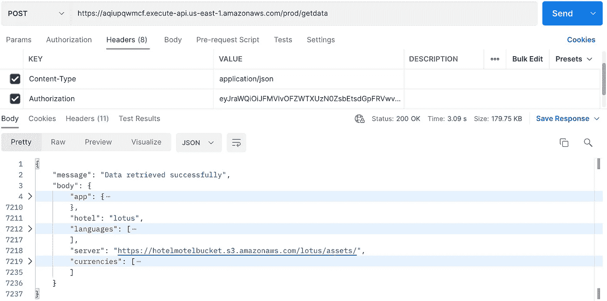

它非常有效🙌

# UX/用户界面设计

由于我不是设计师，我想知道如何才能交付一个设计良好的产品，考虑用户体验、颜色组合、正确的字体大小等等。对于第一次交付，我选择使用响应式 HTML 模板:Lotus Hotel 模板。

嗯，我没有使用 HTML 代码，我只是将移动模板设计复制到 Unity UI 组件(画布、按钮、图像等)中。)

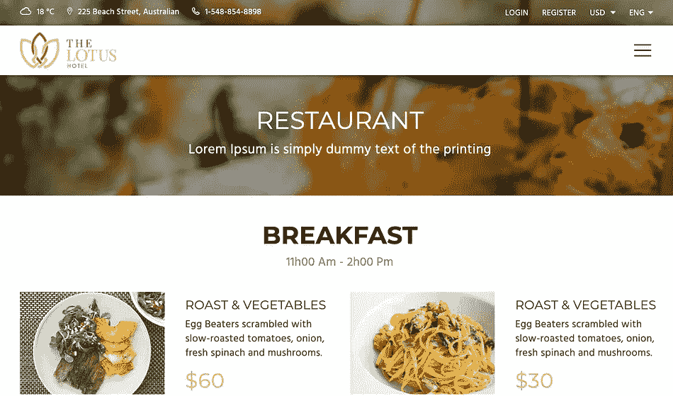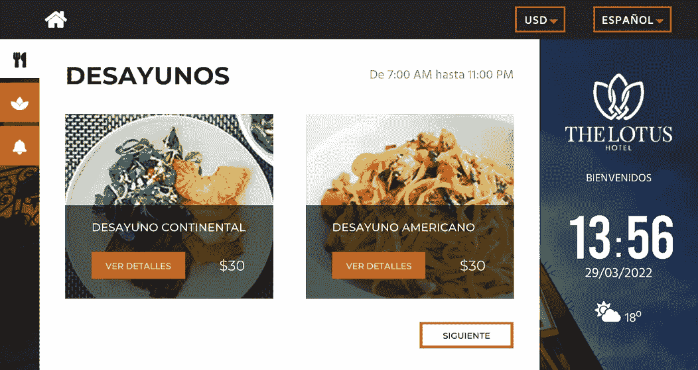

Lotus 模板// HotelMotel 应用程序概述

该模板提供了大量的图像和图标。通过添加像 [Pixabay](https://pixabay.com/) 这样的免费图片库网站的图片，我可以有一个很棒的演示应用程序。

# Unity3D 客户端

## 登录 Cognito

为了登录到 Cognito，我们将通过 [UnityWebRequest](https://docs.unity3d.com/ScriptReference/Networking.UnityWebRequest.html) 类执行一个 post 请求。因为我们正在处理 JSON 数据，所以我们使用 [JsonUtility](https://docs.unity3d.com/ScriptReference/JsonUtility.html) 类的 [ToJson](https://docs.unity3d.com/ScriptReference/JsonUtility.ToJson.html) 函数来字符串化我们的登录参数。同样，我们使用 [FromJson](https://docs.unity3d.com/ScriptReference/JsonUtility.FromJson.html) 函数来解析响应数据。

首先，我们按照 [Cognito 文档](https://docs.aws.amazon.com/cognito-user-identity-pools/latest/APIReference/API_InitiateAuth.html)中描述的结构创建数据类，并使用 [Serializable](https://docs.unity3d.com/ScriptReference/Serializable.html) 属性来处理 JsonUtility 需求:

然后，我们使用用户参数(用户名和密码)调用 Cognito 服务进行登录:

**注意事项**:

*   `UnityWebRequest`类在[协程](https://docs.unity3d.com/ScriptReference/Coroutine.html)内工作。
*   `**ClientId**`参数是由 Cognito 生成的 App 客户端 ID。
*   如果您选择了另一个地区来创建您的用户池，登录 URL 可能会有所不同( **us-east-1** )。
*   UnityWebRequest 的 [Post](https://docs.unity3d.com/ScriptReference/Networking.UnityWebRequest.Post.html) 函数**不**支持 JSON 字符串，而是使用一种奇怪的 HTML 字符串加密。一个解决方法是用一个字节数组和一个 [Put](https://docs.unity3d.com/ScriptReference/Networking.UnityWebRequest.Put.html) 请求做一个奇怪的把戏。如果你有更好的解决方案，请在评论区告诉我。
*   请求需要**内容类型**和 **X-Amz-Target** 头才能正常工作。
*   我们将使用 Cognito 返回的`IdToken`值作为 GetData 函数中的授权参数。

## 获取酒店数据

由于我们已经成功登录到 Cognito，我们现在可以获得需要在屏幕上显示的酒店数据。

**注意事项**:

*   我们使用在 API Gateway 中部署的入口点的 URL。
*   我们发送从 Cognito 收到的 IdToken 作为请求头。

## 从 S3 加载图像

我们已经登录，并获得了需要在 pad 上显示的数据。我们现在可以从我们在 S3 ( `hotelmotelbucket`)上创建的存储库中下载媒体。

**注意事项**:

*   我们正在使用 UI 组件，所以我们使用 [UI Image](https://docs.unity3d.com/2018.3/Documentation/ScriptReference/UI.Image.html) 类来显示图片。
*   我们使用来自 [UnityWebRequestTexture](https://docs.unity3d.com/ScriptReference/Networking.UnityWebRequestTexture.html) 类的 [GetTexture](https://docs.unity3d.com/ScriptReference/Networking.UnityWebRequestTexture.GetTexture.html) 函数从存储库中下载图片。
*   UnityWebRequestTexture 类在协程中工作。
*   我们用 [DownloadHandlerTexture](https://docs.unity3d.com/ScriptReference/Networking.DownloadHandlerTexture.html) 类对传入的数据进行转换，以获得一个 [Texture2D](https://docs.unity3d.com/ScriptReference/Texture2D.html) 对象。
*   我们用纹理的维度动态地创建 UI 图像精灵。

## 任务排队和出队

Unity3D 应用程序在用户登录并下载可用媒体(房间、食物等的图片)后获得酒店的全部数据。)从存储库中。问题如下:有很多媒体，运行应用程序的设备无法处理数百个同时下载的图像。

解决方法是创建一个队列机制，使用 C# [入队](https://docs.microsoft.com/en-us/dotnet/api/system.collections.generic.queue-1.enqueue)和[出列](https://docs.microsoft.com/en-us/dotnet/api/system.collections.generic.queue-1.dequeue)方法。

**注意事项**:

*   我们创建的队列是一个协程队列:我们将之前创建的`GetPicture`函数入队和出队。
*   当协程出队时，执行相关的`GetPicture`函数。

## 水平和垂直格式支持

我们正在使用响应式 UI 元素，但是水平和垂直格式差别太大，不能被认为是同一设计的一部分，所以我们创建了两个不同的画布，每种格式一个。

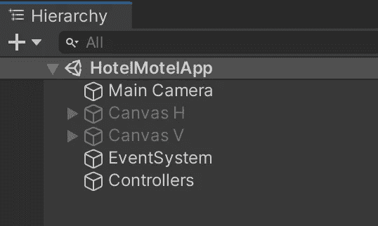

我们使用[屏幕](https://docs.unity3d.com/ScriptReference/Screen.html)类来显示适当的画布:

## 奖励:时钟系统

该应用程序包含一个用文本对象制作的时钟，代码如下:

**注意事项**:

*   我们使用[调用](https://docs.unity3d.com/ScriptReference/MonoBehaviour.InvokeRepeating.html)函数每分钟更新一次时钟，并且每半秒钟响一次指针。
*   我们使用 [DateTime](https://docs.microsoft.com/en-us/dotnet/api/system.datetime) 类的 Now 函数来检索设备的实际时间。
*   每个数字都被单独管理，以便对其进行更好的控制。

# 结束语

本文向您展示了如何使用 Amazon Web Services 构建一个完整的可扩展云架构，如何让这些服务进行交互，以及 Unity3D 应用程序如何与这些云服务进行通信。

本文的每一段代码都是用 Unity 2020.3.17 和 Visual Studio Community 2019 测试过的。我用来运行 Unity 应用程序的移动设备是一台装有 Android 11 的 Galaxy Tab A7 Lite。

本文中显示的所有 id 和令牌都是假的或过期的，如果您试图使用它们，您将无法建立任何连接。

特别感谢 [Gianca Chavest](https://www.instagram.com/niimde/) 设计了这些精彩的插图。