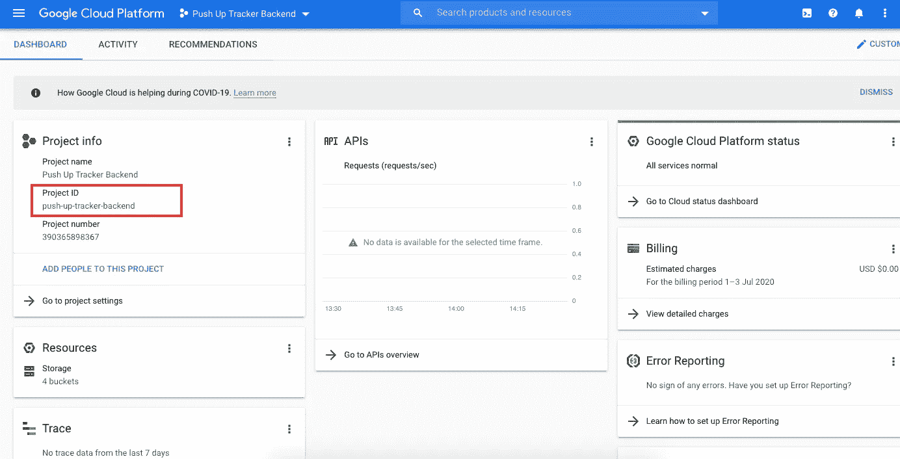
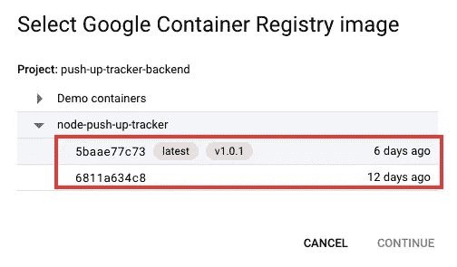
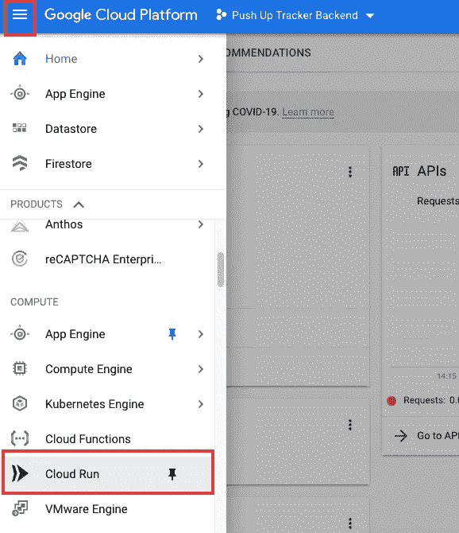
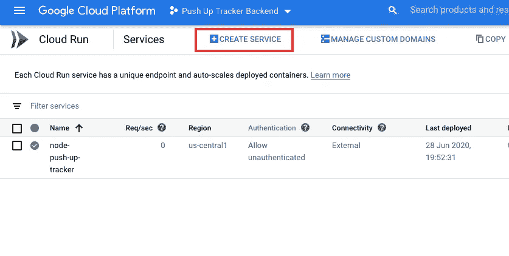
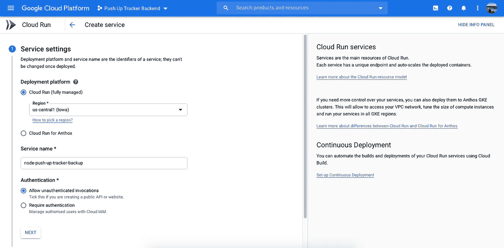
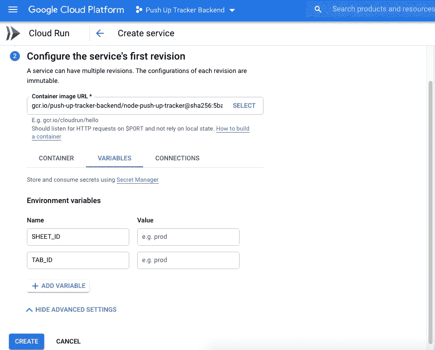
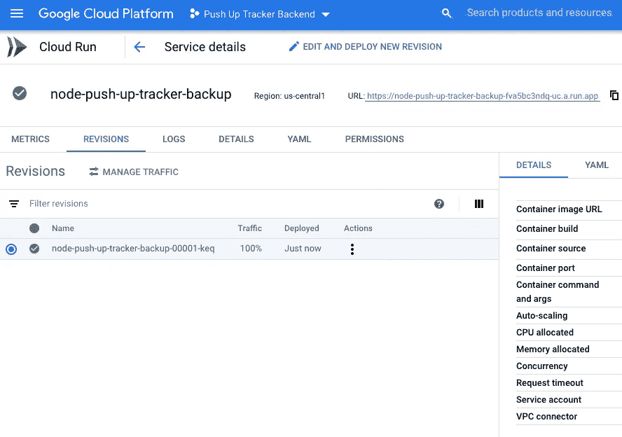
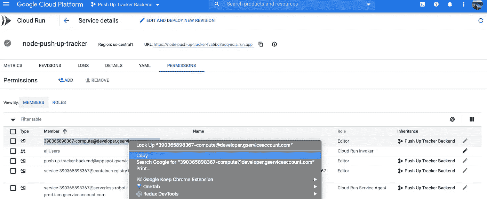
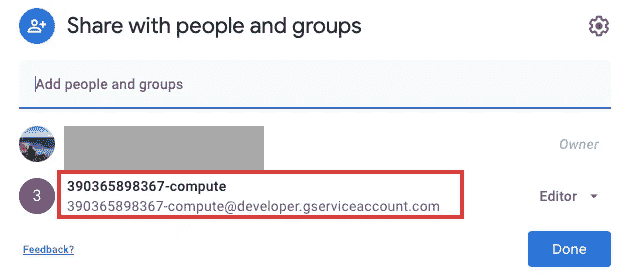
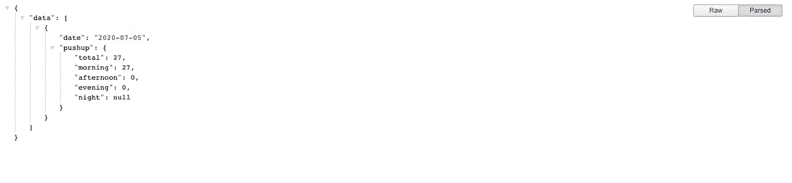

# 我如何使用 Google Sheets 构建 REST API

> 原文：<https://betterprogramming.pub/how-i-built-a-rest-api-using-google-sheets-5bbf356b01f0>

## 不是所有的应用程序都需要数据库。有时电子表格也可以


卡希克·西莫尼安在 [Unsplash](https://unsplash.com?utm_source=medium&utm_medium=referral) 上的照片

# 问题陈述

谷歌床单是我记录俯卧撑的地方。我希望能够可视化我的俯卧撑，我决定用我自己的数据建立一个数据可视化图表。我二话没说，迅速探索了这个想法，发现了可能性，并最终确定了我的目标。

# 目标

这是我想要达到的结果列表。我已经将它们分为关键结果(必须拥有)和加分(最好拥有)。

## 主要结果

*   构建一个 REST API，我可以在其中检索给定开始日期和结束日期的俯卧撑计数。例如，我将能够检索从 2020 年 6 月 1 日到 2020 年 6 月 30 日的俯卧撑次数。

## 奖励积分

*   我不需要移动我的俯卧撑数据，这些数据已经在谷歌工作表中了。
*   高可用性——在开发我的 REST API 的过程中，我仍然可以继续记录我的俯卧撑记录，而不需要在开发完成后手动插入我的俯卧撑数据。

因为我不想在记录我的俯卧撑上花费更多的精力，如果我能在当前的基础上建立一些东西，那对我来说将是最好的情况。

# 解决方案设计

在我研究解决方案的时候，我偶然发现了谷歌的[无服务器工具箱系列](https://www.youtube.com/playlist?list=PLIivdWyY5sqKiWvnaA5A8F3UQ0Xu5i49U)。它有几个很好的例子，其中一个正好可以解决我的问题。

用非技术术语来说，我可以将我的 [Express](https://expressjs.com/) 应用程序部署到 [Cloud Run](https://cloud.google.com/run) 中，它可以利用 Google Sheet API，无缝地检索我的俯卧撑数据。

这里总结了使用云运行的优势:

*   我可以使用 Express 框架构建 REST APIs 来检索我的俯卧撑数据。
*   我不需要迁移现有的俯卧撑数据。
*   我可以继续用 Google Sheets 记录我的俯卧撑数据，即使以后也没问题。
*   额外的好处:我不用管理服务器。

关于 [Docker](https://www.docker.com/) 的一些知识在这个解决方案中无疑是有帮助的。不过，就算你不像我一样了解 Docker，你还是可以钉钉，把事情做好。

# 解决方案实施

既然我们已经决定了我们的解决方案，那就让我们想想如何一步一步来。下面我总结了整个解决方案实施的启发式版本:

1.  在 Google 云平台中创建一个项目并启用计费。(请记住，云运行是按使用付费的，但有一个免费层。只要你的使用没有超过限制，谷歌就不会向你收费。此时此刻，当我写这篇文章时，我的账单仍然是零美元。)
2.  创建一个节点项目并安装 Express framework。
3.  编写业务逻辑并创建 API 端点。
4.  安装[Google API](https://github.com/googleapis/google-api-nodejs-client/releases)依赖项。
5.  使用 googleapis 执行身份验证并检索 Google Sheets 数据。
6.  创建一个关于如何启动应用程序的基本`Dockerfile`。
7.  构建您的容器映像，并提交给云运行。
8.  部署您的容器。
9.  授予计算引擎访问您的 Google 工作表的权限。

虽然我已经提到了解决方案实现的启发式/简短版本，但我还是想记录一下我上面提到的一些亮点，以供参考。

因此，如果你在某个特定的步骤上停滞不前，请随意阅读下一节中的细节。

# 选定步骤的详细信息

## 第二步。创建节点项目并安装 Express framework

```
mkdir node-push-up-tracker// Change directory to the created project folder
cd node-push-up-tracker// Create Node Project
npm init -y// Install Express Framework
npm install express
```

## 第三步。编写业务逻辑并创建 API 端点

在这一步中，我们将创建两个端点。第一个端点是检索今天的俯卧撑，而第二个端点是检索日期范围内的俯卧撑。

## 第五步。使用 googleapis 执行身份验证并检索 Google Sheets 数据

我们将创建负责检索 Google Sheets 数据的`pushupService.js`。但在此之前，我们必须使用 googleapis 库执行身份验证。

```
// Install Googleapis dependency
npm install googleapis
```

## 步骤 **6。创建关于如何启动应用程序的基本 docker 文件**

在这一步，我复制了关于如何启动节点应用程序的基本`Dockerfile`。

## St **ep 7。构建您的容器映像并提交给云运行**

在这个特定的步骤中，我们将构建容器映像并使用 gcloud 命令提交它。如果您尚未安装 gcloud，请参考[安装指南](https://cloud.google.com/sdk/docs/downloads-interactive)。

在我们开始之前，你必须知道你的谷歌项目 ID。去谷歌云控制台，选择你的项目。您将在项目信息部分看到项目 ID。参考下面的截图。



在项目信息部分获取您的项目 ID

现在让我们构建容器映像，并将其提交给 Cloud Run。我为构建过程编写了一个 bash 脚本，以避免重复输入构建命令(我总是忘记这一点，所以总是要再次参考文档)。

通过`sh build.sh`运行构建脚本。

这个构建脚本的作用是:

*   它会将您的 Google 项目 ID 分配给`GOOGLE_PROJECT_ID`变量，并使用该变量来标识该容器图像属于哪个项目。
*   您还将在`CONTAINER_IMAGE_NAME`变量下命名容器图像。因此，如果您使用相同的容器映像名称，每个构建过程都会为您生成一个修订。参考下面的截图，自从我提交了两次构建图像后，我做了两次修改。



我有两张修改过的图片

## 第八步。**部署你的容器**

让我们部署您已经构建并提交的容器映像。供您参考，您实际上也可以使用 gcloud 命令部署容器映像。然而，我想展示如何使用谷歌云平台网站部署这项服务——这很简单。

1.  转到您的 Google Cloud 控制台，选择您已经创建的项目。
2.  单击导航菜单，然后单击导航菜单中的云运行。(也可以参考下面截图中的红框。)



导航菜单上的云运行

3.您将看到 Cloud Run Services 屏幕，在这里您可以使用已经构建的容器映像创建服务。每个云运行服务都有一个唯一的端点。

4.让我们通过单击“创建服务”来创建一个新服务。



创建服务

5.填写输入字段(部署平台、服务名和身份验证)，然后单击 Next。可以参考下面的例子。



如何填充的例子

6.通过单击“选择”选择您构建的容器映像。您应该会看到一个已构建容器映像的列表。

7.在单击创建之前，单击变量选项卡添加环境变量(如果有)。在我的用例中，我需要添加`SHEET_ID`和`TAB_ID`，这样它就知道应该从哪个电子表格和哪个选项卡中检索数据。



在变量选项卡中添加环境变量

8.单击 Create，您的服务将被创建和部署。如果您的服务成功创建并部署，您将看到下面的屏幕。您可以通过调用用 URL 创建的 API 端点来进行验证。



服务现在准备好了！！

## 第九步。授予计算引擎访问您的 Google Sh **eets** 的权限

如果您按照这里的步骤并试图调用 API，当您试图访问 Google Sheets 时，可能会得到“权限被拒绝”。默认情况下，出于安全和隐私考虑，你是唯一可以访问你的谷歌电子表格的人。

拷贝您在“权限”标签中找到的计算帐号，并将其添加到电子表格共享。现在，您将能够成功地检索电子表格数据。参考下面的截图。



复制计算机帐户成员



将您的电子表格共享到计算帐户

现在你应该有一个工作的快速应用程序，你应该能够从电子表格中检索总俯卧撑。

下面是我成功找回俯卧撑数据的截图。



我的俯卧撑数据

# 结论

以下是这篇文章的要点:

*   出于数据可视化的目的，我们使用 Google Sheets 作为数据源构建了 REST API。
*   我们讨论了使用 Sheets 构建 REST API 的好处，它允许高可用性，并且不会影响开发期间的日常上推日志记录过程。
*   我们经历了从创建项目到通过 Google Cloud Console 部署项目的各个步骤，包括具体的步骤细节。

感谢您的阅读。完整的源代码可以在 [Github](https://github.com/tlcheah2/node-push-up-tracker) 获得。