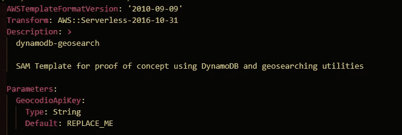
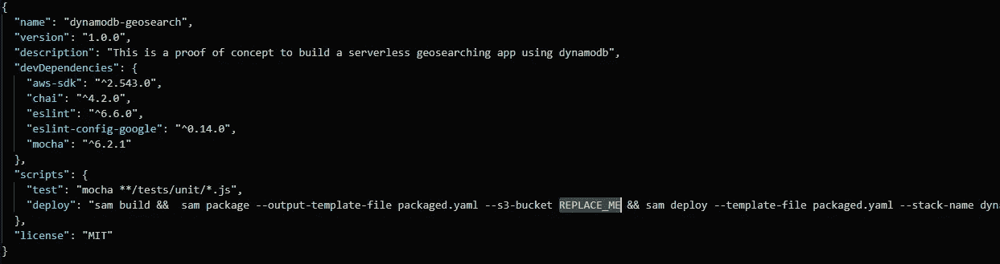

# 我如何用 DynamoDB 构建一个无服务器的地理搜索应用

> 原文：<https://betterprogramming.pub/how-i-built-a-serverless-geo-search-app-with-dynamodb-491879233754>

## 你也可以


本·怀特在 [Unsplash](https://unsplash.com?utm_source=medium&utm_medium=referral) 上的照片

我在业余时间写一个无服务器的 app。我想加入的功能之一是一个用户可滚动的地图。地图上会有图钉，显示与我的项目相关的特定兴趣点。

我使用严格的无服务器设置来构建应用程序。 [API 网关](https://docs.aws.amazon.com/apigateway/latest/developerguide/welcome.html)、 [lambda](https://www.w3schools.com/python/python_lambda.asp) 和 [DynamoDB](https://aws.amazon.com/dynamodb/) 。真的就这些了。(旁注:事实并非如此。详情请看我的[无服务器成本模型文章](https://medium.com/better-programming/5-steps-to-making-a-predictable-cost-model-for-aws-serverless-projects-78d78909bb82)。)我不使用预配服务，因为我想降低成本。另外，我想让应用程序 100%无服务器。

构建这个地图功能的难点在于搜索。我必须在 DynamoDB 中搜索我地图上可视空间中的所有兴趣点。

如果有一件事迪纳摩做得很好，那就是查找。如果有一件事迪纳摩做得不好，那就是搜索。

查找和搜索的区别很简单:

*   **查找**——“把这个给我。这是标识符。”
*   **搜索**——“我想要所有符合这套标准的东西。”

我必须在一个坐标的特定半径内建立一个项目搜索。不是迪纳摩的最佳用例。

所以我去了网上。

# 开源 FTW


照片由[马修·施瓦茨](https://unsplash.com/@cadop?utm_source=medium&utm_medium=referral)在 [Unsplash](https://unsplash.com?utm_source=medium&utm_medium=referral) 上拍摄

我花了两分钟的搜索时间偶然发现了 [dynamodb-geo](https://www.npmjs.com/package/dynamodb-geo) ，这是一个免费的、开源的、类似 AWS 支持的 npm 包，它可以进行地理哈希处理，使我能够在 Dynamo 中执行我的搜索查询。我不会详细说明它是如何工作的，因为 npm 页面在这方面做得很好。

带着我的开源、充满活力的 npm 包，我开始着手实现我的地图。

没过多久，我就遇到了下一个障碍:地理编码。

地理编码是将一个人类可读的地址转换成纬度和经度。

令人惊讶的是，该功能在 dynamodb-geo 中并不可用，也没有内置到一些随机的 JavaScript 库中。回到互联网。

显而易见的选择是[谷歌地图地理编码 API](https://developers.google.com/maps/documentation/geocoding/start) 。每个人都知道并信任谷歌地图。但我并不热衷于定价模型或获取 API 密钥所需的繁重的 GCP 配置。我想要一种感觉上门槛较低的东西。

就在那时，我偶然发现了[地理编码](https://www.geocod.io/)。这看起来像是一个小公司，有正确的想法和功能集，让我去我需要去的地方。所以我生成了一个免费的 API 密匙，开始把地址转换成坐标。

# 借助无服务器保持强大

dynamodb-geo 的文档很好，但是当您开始使用无服务器环境时，它遗漏了一些重要的细节。例如，这个包需要在 AWS 中设置一个带有特定主键组合的 Dynamo 表，另外还需要一个 LSI。我被迫手动运行一些脚本，并在控制台周围窥探，以弄清楚发生了什么。

我所有的无服务器端项目都被扔进了 CloudFormation 模板。我这样做是为了让我可以把我的代码带到任何账户和任何地区，这很有效。在浏览了 Dynamo 控制台的后设置脚本之后，我可以回来添加 CloudFormation 中的表和索引的布局细节。

我通过 lambda 构建了一个快速的方法来为系统添加兴趣点。我在 API Gateway 中设置了一个端点，该端点接受一个名称和街道地址，并将其路由到 lambda。lambda 使用 Geocodio 从地址中获取坐标，并使用 dynamodb-geo 将坐标添加到 Dynamo 中。

当然，我也在 CloudFormation 中添加了 API 和 lambda 函数。

# 克服局限性


照片由[杰瑞米·毕肖普](https://unsplash.com/@jeremybishop?utm_source=medium&utm_medium=referral)在 [Unsplash](https://unsplash.com?utm_source=medium&utm_medium=referral) 上拍摄

“如果我需要改变我的一个兴趣点的地址会发生什么”用例在我的项目中很快显露出来。嗯，dynamodb-geo 不太允许你更新地址和坐标。因为它使用坐标的 geohash 作为分区键，所以不能只更新一个地址。

不能更新 DynamoDB 项目的键值。所以我开始工作，让我的更新做一个删除和重新添加的点。只是，这并不太容易做到，因为我没有地理哈希算法。表上的分区键是地址的 geohash。如果没有算法，我就无法查找条目来删除它。

对于一个健壮的地理搜索解决方案，我需要做的是为自己提供一个简单的查找机制来更新和删除特定的点。

我想到的第一个想法非常简单:只需为该点分配一个 UUID，并向 Dynamo 添加一个元数据项。嘣。小菜一碟。

除了表中的 pk 是一个**号**而不是一个**串**。这个让我有点迷惑。该表有一个由数字分区键和字符串排序键组成的复合主键。要查找一个项目，我需要两者。作为一个简单的解决方案，我为排序键生成了一个 UUID，并去掉了分区键的所有字母。对我有用。

# 把它们绑在一起

现在我已经有了添加新点和管理现有点的策略，我需要完成我的 CRUD 操作。

我为创建、更新和删除点构建了一个端点，但是我将读取操作留给了地理搜索。使用 Geocodio 将我的街道地址转换成坐标，使用 dynamodb-geo 保存和搜索坐标，我能够拥有一个完全可搜索的地图——完全不需要服务器！

我对搜索的结果感到非常高兴，所以我赶去灵媒公司解释并与大家分享。如果你想得到我的概念证明，你可以在我的 Github 页面查看。

# 让它成为你自己的

如果您的计算机上已经安装了 AWS CLI，那么您只需要执行两个步骤就可以启动并运行这个解决方案。在[geo codeo](https://www.geocod.io/)获取一个 API 密钥，并替换`template.yaml`中的默认参数值。



您必须更改的另一部分在根目录的`package.json`中。我有一个脚本，它将构建代码并将其部署到您机器上的默认 AWS 帐户。您所需要做的就是为它提供一个 S3 存储桶的名称，以便它上传您的工件。



替换这两个值后，您应该可以运行

```
npm run deploy
```

并将其部署到 AWS 中。

玩得开心，祝你好运建设！