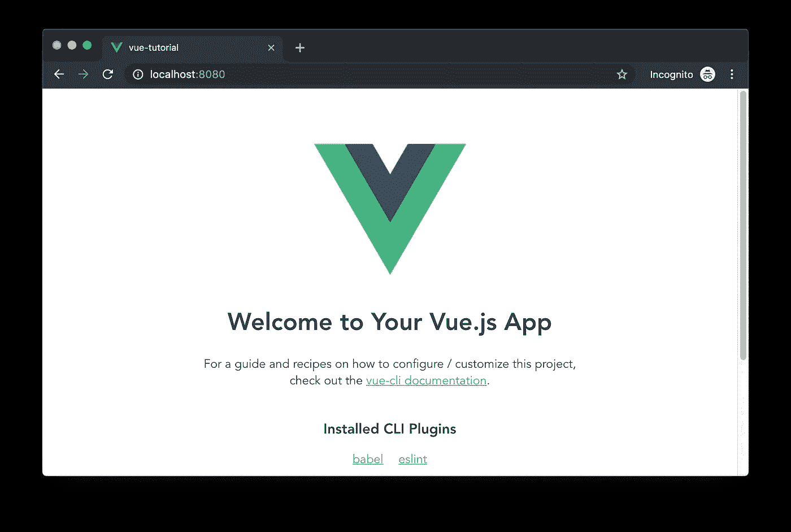
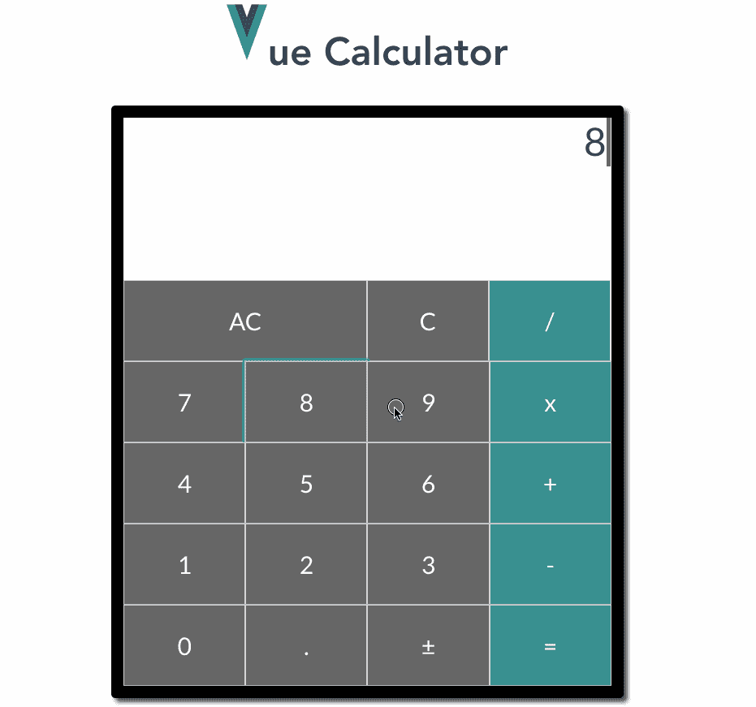
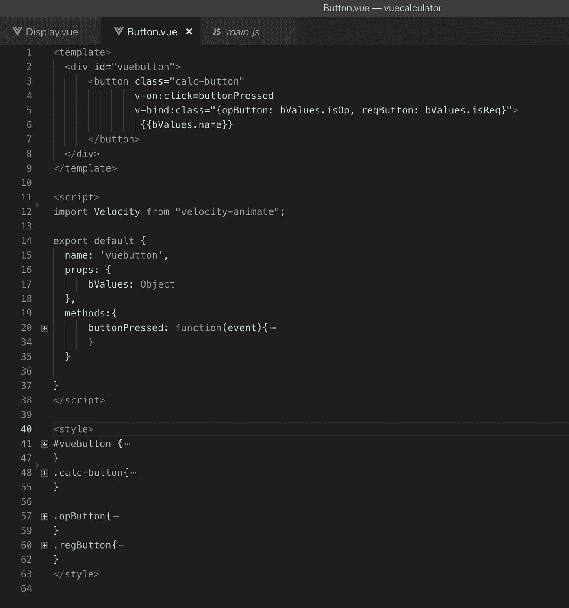
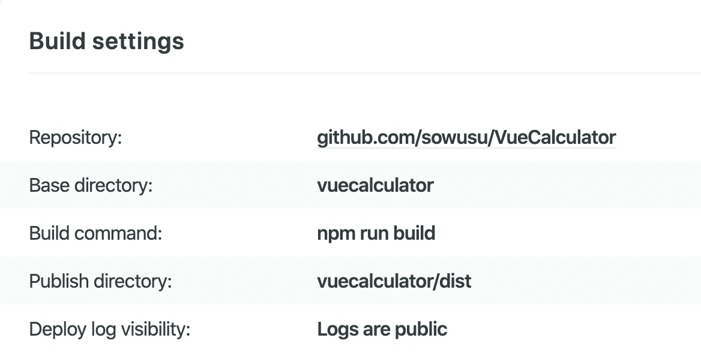

# 用 Vue.js 立即构建一个简单的计算器

> 原文：<https://betterprogramming.pub/how-i-built-a-simple-calculator-with-vue-in-no-time-210b215a16eb>

## 通过这个有用的入门项目学习 Vue 的基础知识



图 1 — Vue cli 现成的登录页面

我过去曾尝试过一些前端框架，Angular 和 React 是其中最令人难忘的。

最近，我对作为框架的 [Vue.js](https://vuejs.org/) 很感兴趣(有些人可能会说它是一个库——选择你的阵营),并决定通过构建一个简单的计算器应用程序来加深对它的理解。

我也想知道我能多快学会它。对于这个项目，我介绍了框架的以下基础知识:

*   Vue CLI。
*   单个文件组件。
*   Vue 指令(`v-bind`、`v-on`、`v-for`)。
*   来自子组件的自定义 Vue 事件和`$emit-ing`。
*   [Velocity.js](http://velocityjs.org/) 动画整合。

我将深入研究 Vue 的所有这些部分，以及我如何使用它们来构建您在下面看到的计算器应用程序:



图 2 — Vue 计算器

# Vue CLI

Vue CLI 是一个功能强大的命令行工具(以及其他工具),它可以加速 Vue 项目的设置，其配置和构建工具通常可以很好地协同工作。

它让我在几秒钟内就可以启动并运行。我所要做的就是用 npm 安装它(也可以用这个网站上的说明用 [Yarn](https://yarnpkg.com/lang/en/) package manager 完成):

```
npm install -g @vue/cli
```

安装完成后，我使用 CLI 命令`vue create vuecalculator`初始化 calculator 项目，选择默认设置，最后得到默认的 Vue 项目，然后我可以开始对其进行修改。

使用新建目录中的`npm run serve`命令*启动 CLI 服务器，即可查看新建的项目。*启动服务器后，可以在`localhost:8080`从浏览器中查看，如上面图 1 所示。

加分:用 Git 设置新的 Vue 项目来处理版本控制。拉什蒂和吉特在一起？查看一下我写的关于处理不太基本的 Git 情况的文章或者这本[手册。](https://git-scm.com/book/en/v2)

# 单个文件组件

Vue.js 作为前端框架，基于可复用的组件模型，类似 React。组件本质上是一个定制的 HTML 标记，允许开发人员预定义其模板、属性、行为和样式。

模板是组成组件的 HTML，属性是它可以拥有的不同属性，行为是它可以执行的动作，样式是决定其外观的 CSS。

下面是`Button`组件的定义:



图 3— Button.vue 组件

上述组件被定义为单个文件组件。从上面可以看出，单个文件组件有三个部分:模板部分、脚本部分(定义组件的属性和行为的地方)和样式部分(可以定义组件的 CSS 的地方)。

每个 Vue 项目都是由嵌套组件和本地 HTML 元素组成的。

使用组件是将复杂的前端分解成更容易管理的部分的一种强有力的方法，这种方法允许最大的可重用性、可读性、可维护性、内聚性以及其他好处。在 Vue 网站上阅读更多关于 Vue 组件[的信息。](https://vuejs.org/v2/guide/components.html)

对于计算器，我使用了以下组件分类:

*   计算器容器组件
*   显示组件
*   按钮组件
*   闪光灯组件

在 Vue 中，您可以选择使用 Vue 实例组件构造函数来创建全局组件。

在这个项目中，我选择将每个组件定义在它自己的文件中，作为一个单独的文件组件，并根据需要在任意多个位置多次导入它。

下面看看`Button`组件是如何通过导入被用在父`Calculator`组件中的([完整代码在这里](https://github.com/sowusu/VueCalculator/blob/master/vuecalculator/src/components/Calculator.vue#L15))。

图 4—导入和注册按钮组件

图 5—在计算器组件模板中使用导入的按钮组件

使用单个文件组件有多种好处，例如使项目更加模块化，允许在使用 Vue CLI 和 [webpack](https://webpack.js.org/) 时进行必要的构建步骤，以及在单个模块/文件中包含组件的样式。

在 Vue 网站上阅读关于单个文件组件[的更多信息。](https://vuejs.org/v2/guide/single-file-components.html)

# Vue 指令

Vue 中的指令本质上是框架提供的 HTML 标签，用于扩展在 Vue 组件的模板部分中编写的 HTML 的功能。对于这个项目，我以下列方式利用指令:

## v 型装订

如上所述，组件拥有的四样东西之一是属性。这类似于实例变量的面向对象概念。

每当组件被使用或“实例化”时，都需要设置其属性。这是使用`v-bind`指令完成的。图 5**上方的显示了我使用`v-bind`指令的几个例子。**

**在其中一个例子中，我将对象`b`绑定到`Button`组件的`bValues` 属性。这种绑定意味着无论何时`b`改变，`bValues`属性也会改变。**

**因为`v-bind`是最常用的指令之一，所以它有一个简写版本，就是“`:`”。所以，我可以写`:bValues="b"`而不是`v-bind:bValues="b"`，这样也可以！**

## **v-on**

**这个指令允许组件监听与组件相关的 DOM 事件，例如，当一个按钮被点击时。如果你不熟悉 DOM 事件，请在 W3 Schools 阅读更多关于它们的内容[。](https://www.w3schools.com/js/js_htmldom_events.asp)**

**当然，`v-on`也允许组件监听开发者创建的自定义事件。我们将在下面的*自定义事件*部分看到一个我如何在项目中使用`v-on`的例子。**

**`V-on`和`v-bind`一样经常使用，因此使用了简写的`@`，即`v-on:click="doSomething"`和`@click="doSomething"`是等价的。**

## **v-for**

**`v-for`指令对于迭代一个项目数组很有用。在这个项目中，我在`Button`组件上使用它来创建计算器的所有按钮，如图 5 所示。**

**`buttons`数组包含对象，每个对象包含应用于每个`Button`组件的名称、ID 和样式([的完整代码在这里是](https://github.com/sowusu/VueCalculator/blob/master/vuecalculator/src/components/Calculator.vue#L31))。**

**当然，Vue 还有很多其他的指令，比如`v-text`、`v-model`、`v-html`等等。我在这个项目中没有使用过这些，所以不会花时间在它们上面，但是，在文章末尾链接的 Vue 手册很好地介绍了它们。**

# **自定义 Vue 事件和$从子组件发出**

**我们现在知道 Vue 允许我们使用组件构建应用程序。当我们构建这些组件时，我们需要以不同的方式在它们之间发送信息。**

**将信息从父组件传递到子组件就是这样一种情况。这可以通过创建带有我们想要发送的信息的属性的子组件，然后当我们在父组件中“实例化”子组件时设置该属性来实现。**

**这正是我在图 5 中创建时传递每个`Button`组件的 ID、样式和名称的方式。**

**另一个场景是当我们想要将信息从子组件传递到父组件时。这个场景实际上描述了我如何将哪个子`Button`组件被按下传递给父`Calculator`组件。**

**这是通过在每个按钮组件*上设置一个自定义事件`handle-press`*来实现的。*Vue 实现这一点的方式是通过`$emit-ing`从`Button`组件中按下本地按钮时的事件。***

***然后，父组件使用`v-on`来捕获定制事件和被按下的按钮的任何传递的细节。下面的要点让它更清晰:***

***设计评论:我可以很容易地使用原生的 HTML 按钮标签，而不是创建一个定制的 Vue `Button`组件。***

***我选择了后者，因为它允许我使用自定义事件进行子到父组件的通信。我也认为它有一些可扩展性的好处。***

***图 6 —点击按钮组件按钮时发出“handle-press”自定义事件[ [参见完整代码](https://github.com/sowusu/VueCalculator/blob/master/vuecalculator/src/components/Button.vue#L21)***

***图 7 —处理父组件中的自定义“handle-press”事件[ [参见完整代码](https://github.com/sowusu/VueCalculator/blob/master/vuecalculator/src/components/Calculator.vue#L7)***

# ***针对动画的 Velocity.js 集成***

***Velocity 是一个流行的 JavaScript 动画库。我在项目中使用它来制作按钮按压和显示闪光灯的动画。***

***为了整合速度，我使用 npm 安装了速度动画 包，然后将全局`Velocity` 对象从包中导入到`Button`和`Display`组件中。***

***下面是 npm 命令以及动画按钮按下的代码片段。[了解有关 Velocit](http://velocityjs.org/#dependencies) y 的更多信息。***

***`npm install **velocity-animate**`***

***图 8 —将 Velocity.js 集成到按钮组件中***

# ***就是这样！***

***剩下的只是实现细节，你可以在下面链接的我的 GitHub repo 中仔细查看。你也可以在这个网站上查看部署的 app [。(注意:在桌面上打开，不支持移动响应。)](https://vue-calkulator.netlify.com)***

***额外收获:使用`npm run build`命令在几秒钟内在 [Netlify](https://www.netlify.com/) 上部署你新构建的 Vue 应用，并在`dist`文件夹中部署文件。***

***Netlify 允许您通过提供以下构建设置直接从 GitHub repo 进行部署:***

******

***图 Github 中 Vue 应用程序的 Netlify 构建设置***

# ***最后的想法***

***有很多改进可以通过重构来实现，但是完美不是目标。***

***目标是看看我可以多快地使用从未使用过的 Vue 与我尝试过的其他前端框架相比，它快得惊人(看看你，Angular)。***

***编码快乐！***

***该项目的 GitHub repo:***

***[](https://github.com/sowusu/VueCalculator) [## so wusu/vue 计算器

### 简单的计算器项目，以锤家一些 Vue 概念:单个文件组件简单的 Vue 关键字用法:v-for…

github.com](https://github.com/sowusu/VueCalculator)***