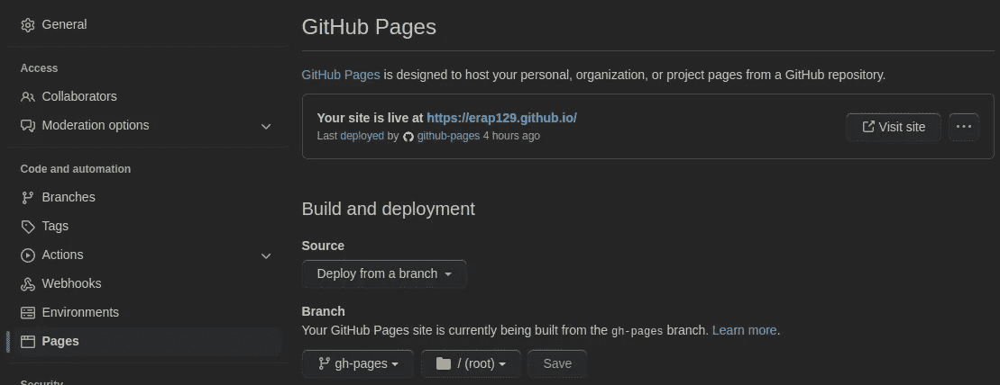

# 我如何使用 Jekyll 和 GitHub 页面建立一个整合媒体文章的网站

> 原文：<https://betterprogramming.pub/how-i-built-a-website-integrated-with-medium-using-jekyll-and-github-pages-c8f505e3b9e3>

## 帮助您节省时间和精力的分步指南


照片由 Ketut Subiyanto 拍摄:[https://www . pexels . com/photo/face less-person-using-touchpad-on-laptop-4126724/](https://www.pexels.com/photo/faceless-person-using-touchpad-on-laptop-4126724/)

在这篇文章中，我将分享使用 [Jekyll](https://jekyllrb.com/) 创建我的个人网站和作品集的过程。Jekyll 是一款 [Ruby Gem](https://guides.rubygems.org/what-is-a-gem/) ，用于轻松创建静态网站，其内容在构建时就已预先确定，不依赖于任何实时用户输入或数据库连接。

由于我不是网页设计师，也不想花时间在 CSS 和 HTML 的设计上，我搜索了一个不错的令人印象深刻的模板，无意中发现了迪安·阿塔利的美丽的哲基尔([https://beautifuljekyll.com/](https://beautifuljekyll.com/)),我将在这篇文章中定制它。这是我的站点——[https://erap 129 . github . io](https://erap129.github.io/index)，这是我们将要学习创建的，这是站点的仓库——[https://github.com/erap129/erap129.github.io](https://github.com/erap129/erap129.github.io)。

本文将按如下方式组织:

1.  需求—我需要/想要从我的网站得到什么
2.  设置和安装
3.  建设网站
4.  部署网站

# 第 1 部分—要求

在我开始工作之前，我确定了这个网站的主要目标。它应该:

*   向潜在和现有客户/合作者/雇主提供关于我的一般信息，如我的兴趣、项目和爱好。
*   包含一个页面，其中包含我在 Medium 上的所有文章的预览，以及在 Medium 平台上指向它们的链接。这个页面不应该手动创建，因为我打算继续在介质上写，我不想每次都把我的帖子复制粘贴到我的个人网站上。此外，它应该自动更新，这样我就不必在任何时候在媒体上发布文章时更新我的网站。
*   包含额外的静态页面——比如我的科学出版物、公共代码贡献等等。

# 第 2 部分—设置和安装

重要的是要说——美丽哲基尔是一个很棒的模板。如果这个模板定义的站点结构适合你，并且你不需要与 Medium 集成——跳过我的文章，按照[官方说明](https://github.com/daattali/beautiful-jekyll)就可以了。

我真的很喜欢这个模板的设计，但是要创建一个与 Medium 的集成，我需要做一些定制。为此，我需要能够在本地部署站点，这就是以下安装的目的:

本文档—[https://docs . github . com/en/Pages/setting-up-a-Github-Pages-site-with-jekyll/creating-a-Github-Pages-site-with-Jekyll](https://docs.github.com/en/pages/setting-up-a-github-pages-site-with-jekyll/creating-a-github-pages-site-with-jekyll)很好地解释了如何设置您的环境以使用 Jekyll 和 Github 页面，但我也将在这里介绍主要步骤。我将假设您使用的是 Ubuntu Linux(如果不是这样，请根据您的操作系统遵循上面链接中的说明)。

*   首先，安装 Ruby — `sudo apt-get install ruby-full`
*   现在安装捆扎机— `sudo gem install bundler`
*   叉美——哲基尔——步骤写在这里——[https://github.com/daattali/beautiful-jekyll#readme](https://github.com/daattali/beautiful-jekyll#readme)。分别是:
    1。叉项目为`<yourusername>.github.io`
    2。将项目克隆到您的 PC 上
*   要在本地运行网站，导航到终端中的本地存储库文件夹并运行`bundle install`。这将安装运行和服务 Jekyll 所需的 Ruby 软件。现在，每次你想在本地运行`bundle exec jekyll serve`网站。恭喜你。该网站将于`[http://localhost:4000](http://localhost:4000)`上线

# 第 3 部分—建立网站

我将做以下事情来定制 Jekyll 模板以满足我的需要:

1.  创建“博客文章”页面，这将被整合到媒体
2.  创建附加的基于降价的页面:主页和出版物

开始吧！

## 创建“博客文章”页面

第一个问题是——我们如何从媒介中获取信息？答案是——RSS！Medium 为每个作者提供了一个 RSS feed，这让我可以使用一个简单的 URL(对我来说，它是——[https://medium.com/feed/@erap129](https://medium.com/feed/@erap129))获得我所有文章的信息。

我真的很喜欢帖子在 [Beautiful Jekyll](https://beautifuljekyll.com/) 中的显示方式，但就我而言，我不希望每个预览都链接到内部帖子，而是链接到媒体上的原始帖子。


美丽的哲基尔的原后正式

为了在 Jekyll 中动态生成内容，我们需要创建一个[生成器插件](https://jekyllrb.com/docs/plugins/generators/)。Jekyll 中的插件是一些 Ruby 代码，当你建立你的网站和执行各种功能时运行。我们的生成器将收集我的所有中型职位的信息，并将其存储在一个集合中，我们将在我们的网站的 HTML 代码中使用。

让我们在 repo 的主目录中创建一个名为`_plugins`的文件夹，并创建一个名为`jekyll-display-medium-posts-json.rb`的文件，其内容如下:

这个插件是由 [rss2json](https://medium.com/u/c040a0cea7ab#rss_url=https%3A%2F%2Fgithub.com%2Frails%2Frails%2Freleases.atom) 的 API。JSON 格式使我们能够更好地控制从 Medium 接收的内容，因此我们使用这个 API 将 Medium 的 XML 格式转换成 JSON。

*   在第 18–33 行，我们收集了将在我们的“博客文章”页面中使用的信息——文章的标题、图片、链接和日期(我们也收集了类别，但没有使用它们)*   注意，我们在第 31 行使用了`nokogiri` Ruby gem 来遍历 HTML 内容。为什么？因为 RSS 提要中每篇文章的描述都是原始的 HTML，所以我们在这里想要创建一个简短的文章摘录。为了跳过标题和图片，我们只提取段落(在 HTML 的`p`标签中)。

将下面的代码片段添加到`_config.yaml`很重要。否则，生成器创建的集合将无法在站点中使用:

```
collections:- medium_posts_json
```

现在，我们需要创建一个布局来使用这些信息，并将其转换成浏览器呈现的 HTML 代码。我们将在`_layouts`目录下创建一个名为`blog.html`的新文件，内容如下:

这个布局基本上是 Beautiful-Jekyll—[https://github . com/daattali/Beautiful-Jekyll/blob/master/_ layouts/home . html](https://github.com/daattali/beautiful-jekyll/blob/master/_layouts/home.html)中原始布局的精简版。我所做的唯一更改是删除不相关的内容，并使布局使用我之前创建的集合— `site.medium_posts_json`。

*   注意，在第 5 行中，我们迭代了使用插件创建的集合，并为每个元素添加了所需的 HTML 代码。Jekyll 使用一种称为 Liquid 的语法来生成这些内容。你可以在这里阅读更多关于液体的内容——[https://shopify.github.io/liquid/](https://shopify.github.io/liquid/)。

现在，我们需要做的就是在主目录中创建一个名为`blogposts.md`的新文件，并让它使用我们创建的新布局— `blog`。

```
---layout: blogtitle: Blog Postssubtitle: This is what keeps my mind busy---
```

此外，编辑`_config.yaml`中的`navbar-links`部分，以包含新的博客文章页面。

太好了！如果我现在使用`bundle exec jekyll serve`在本地服务我的网站，我应该能够在`[http://localhost:4000](http://localhost:4000)`中访问我的网站，并看到我所做的更改。

## 2.创建附加的基于降价的页面

现在，因为我们添加了博客文章页面，我们不再需要主页来列出本地博客内容。此外，我们希望主页可以使用 Markdown 而不是 HTML 轻松编辑。

因此，我们将删除`index.html`并用`index.md`替换它。我在这个页面上添加了我的个人信息，但是你可以做任何你想做的事情。我还添加了一个`publications.md`页面，在那里我列出了我的科学出版物。我的`_config.yaml`中的`navbar-links`部分是这样的:

```
navbar-links:Home: "index"Blog Posts: "blogposts"Publications: "publications"
```

# 第 4 部分—部署网站

一旦我们到达运行`bundle exec jekyll serve`的阶段，就像我们看到的那样，我们就准备好部署了。

我们希望我们的站点在两种情况下部署:

1.  当我们将新的/更新的内容推入存储库的主分支时
2.  每次在 Medium 上添加一个新的帖子，我们都希望整合到站点中。

1 将是容易的，对于 2，我们将使这成为一个日常过程。这意味着每天在一个固定的时间，网站的构建过程将被建立，如果我添加新的内容到我的媒体档案，它将被拉到网站。

我们不能依赖默认的 GitHub 页面部署动作，因为我们正在使用自定义插件，GitHub 页面并不正式支持。另外，我们希望构建过程是及时的，而不仅仅是基于对主分支的推动。为此，我们将使用这个来自市场的自定义 GitHub 动作，名为 Jekyll Actions—【https://github.com/marketplace/actions/jekyll-actions。

上面的链接有一个非常有用的教程，但我仍然会带你通过激活这个动作所需的步骤。从站点的根目录，我创建了下面的文件:`.github/workflows/github-pages.yml`，内容如下:

让我们回顾一下我们在这里看到的(有趣的部分)

*   在第 4–8 行，我们定义了站点部署的发生时间——主分支的推送事件和每天午夜。如果我愿意，我这样做是为了手动编辑我的网站，但如果我在 Medium 上发布新内容，我就不一定要编辑它。
*   请注意，在第 23 行和第 26 行，我引用了一个名为`JEKYLL_PAT`的秘密。为此，我创建了一个 GitHub 个人访问令牌——[https://github.com/settings/tokens](https://github.com/settings/tokens)，具有完全回购访问权限，并将其作为秘密添加到我的项目设置中(回购页面- >设置- >秘密- >操作)。
*   其余的代码摘自最初的 GitHub 动作，在这里会有详细的解释——https://github.com/marketplace/actions/jekyll-actions[。](https://github.com/marketplace/actions/jekyll-actions)

另一个重要的步骤是将部署分支设置为`gh-pages`(静态内容被推送到的分支)，这样 GitHub 将知道托管来自这个分支的文件。我要特别感谢来自 StackOverflow 的 Christian，他帮助我解决了一个与此相关的问题—[https://stack overflow . com/questions/74244454/he laili-Jekyll-action-does-update-the-browser-with-GH-pages-branch-content](https://stackoverflow.com/questions/74244454/helaili-jekyll-action-does-not-update-the-browser-with-gh-pages-branch-content)。这是通过存储库设置完成的，如下所示:



将 gh-pages 分支设置为构建源

就是这样！

当然，你可以不断地定制你的网站，我没有重复我相信你能够解决的琐碎事情，比如改变网站标题，添加你自己的照片，等等。`_config.yaml`文件非常简单明了，允许轻松操作和定制。

谢谢各位。干杯。

额外提示:

*   这期 GitHub 帮我为网站设置了一个图标——[https://github.com/daattali/beautiful-jekyll/issues/312](https://github.com/daattali/beautiful-jekyll/issues/312)

# 相关链接:

*   哲基尔主页—【https://jekyllrb.com/ 
*   美丽的化身库—【https://beautifuljekyll.com/ 
*   杰基尔-action GitHub action—[https://github.com/marketplace/actions/jekyll-actions](https://github.com/marketplace/actions/jekyll-actions)
*   詹姆斯·海曼[关于杰基尔与媒体整合的帖子—](https://medium.com/u/c040a0cea7ab?source=post_page-----c8f505e3b9e3--------------------------------)[https://Medium . com/@詹姆斯·哈曼/displaying-Medium-posts-on-your-Jekyll-website-7eef 230309 E4](https://medium.com/@jameshamann/displaying-medium-posts-on-your-jekyll-website-7eef230309e4)。
*   关于液体语法的解释—[https://shopify.github.io/liquid/](https://shopify.github.io/liquid/)