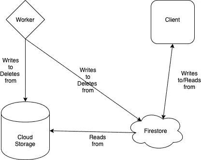

# 我如何构建 AlgoTab

> 原文：<https://betterprogramming.pub/how-i-built-algotab-1f1de00979f5>

## 每当你在 Chrome 中打开一个新的标签页，就会得到一个新的算法问题


照片由 [ThisisEngineering RAEng](https://unsplash.com/@thisisengineering?utm_source=medium&utm_medium=referral) 在 [Unsplash](https://unsplash.com?utm_source=medium&utm_medium=referral) 上拍摄。

我最近看到了詹姆斯·克利尔的《T4 原子习惯》一书，并虔诚地将这本书的教导应用到我的日常生活中。我还在读这本书，但我认为建立一个工具来强迫我每天至少尝试一个新的编码挑战会是一个有趣的项目。

所以我决定构建 AlgoTab，这是一个 Chrome 扩展，每当你打开一个新标签时，它都会给你一个新的算法问题！

# 技术架构



整个应用程序是以无服务器的方式构建的。我们有一个 worker (cron job ),它在特定的时间框架后执行，用新的图像不断刷新我们的数据库。它访问 LeetCode，抓取一个新问题，将这个问题保存为截图，并同时写入云 Firestore 和云存储。

它将主图像存储在云存储中，并将指向该图像的指针存储在 Firestore 中。为了防止我的数据库变得太大，worker 不断地监控当前存储的图像数量，每当这个数量增长到 100 以上时，它就批量清除一些图像。这样，在任何给定时间，数据库中都会存储大约 90 到 110 个问题。

我们将问题存储为具有以下参数的对象:

```
{
  "link": "{pointer to cloud storage}",
  "questionUrl": "{url of the question}"
}
```

# 后端

后端是该项目的最有趣的部分。它包含我们的 worker 以及客户使用的主要 API。

问题工作者的工作如下。它负责在数据库中添加和删除问题:

向客户端发送问题的 API 是:

完整的代码库可以在 GitHub 上找到[。](https://github.com/yasimba/algotab)

# 面临的挑战

我最初对这个建筑的想法与我最终选定的大相径庭。最初，我想象它是这样工作的:

1.  每次打开一个新标签，调用我们的 API。
2.  API 启动一个无头浏览器来捕捉屏幕截图。
3.  屏幕截图连同问题信息一起被发送回客户端。

然而，我很快遇到了一些问题，其中一些问题并不完全由我决定。主要问题是每个 API 调用需要大约 30 到 34 秒来执行。因为每次打开一个新标签页，我们都要发送一个新问题，这实在是太浪费时间了。如果我们再加上并发请求的可能性，那么我们就走进了一个噩梦。

# 未来的工作

虽然这是一个简单的项目，但我发现它非常有用，每天都要使用多次。我想到的一些改进是:

1.  添加另一个工作人员来检测重复问题并删除它们。
2.  增加对更多算法题平台的支持。
3.  获取问题难度。

# 结论

AlgoTab 是一个快速而有趣的项目。无服务器架构的使用让我可以快速构建原型，并且不花一分钱就可以投入使用。因此，选择 Docker 还是无服务器是显而易见的。

尽管 Docker 允许更多的控制，但我发现去无服务器化——至少在早期阶段——应该是默认的方法。Firebase 对 cron jobs 的支持也意味着我不必手动设置，我认为这是一个胜利。

您可以在此处查看代码:

[](https://github.com/yasimba/algotab) [## yasimba/algotab

### 每当你在 Chrome - yasimba/algotab 上打开一个新标签时，都会得到一个新的算法问题

github.com](https://github.com/yasimba/algotab) 

这里的扩展是:

[](https://chrome.google.com/webstore/detail/algotab/bdbdkaldlokgnidglfhfdiecbmnimdne) [## Algotab

### 一天一个问题，远离失业

chrome.google.com](https://chrome.google.com/webstore/detail/algotab/bdbdkaldlokgnidglfhfdiecbmnimdne)