# 我如何在 5 周内用 Django 构建并部署我的第一个 Web 应用程序

> 原文：<https://betterprogramming.pub/how-i-built-and-deployed-my-first-web-application-with-django-in-5-weeks-e9728480a8dd>

## 给首次开发 Python 网站的人的提示

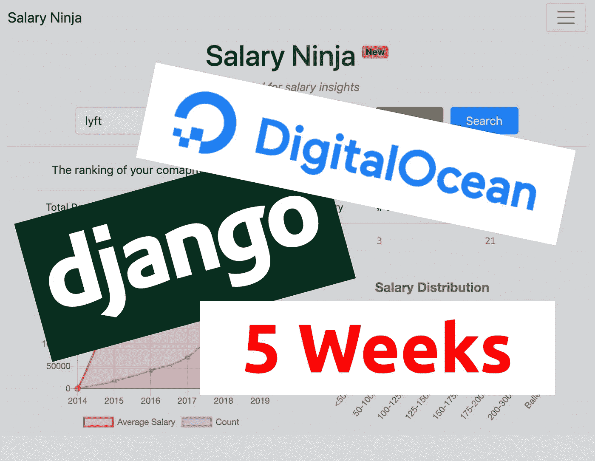

# 你好，我是杰森

我是一名程序员，机器学习实践者，自动化爱好者，原籍韩国。尽管我没有计算机科学学位，但我在大学毕业后就爱上了编程，并一直在自学新东西。

# 介绍

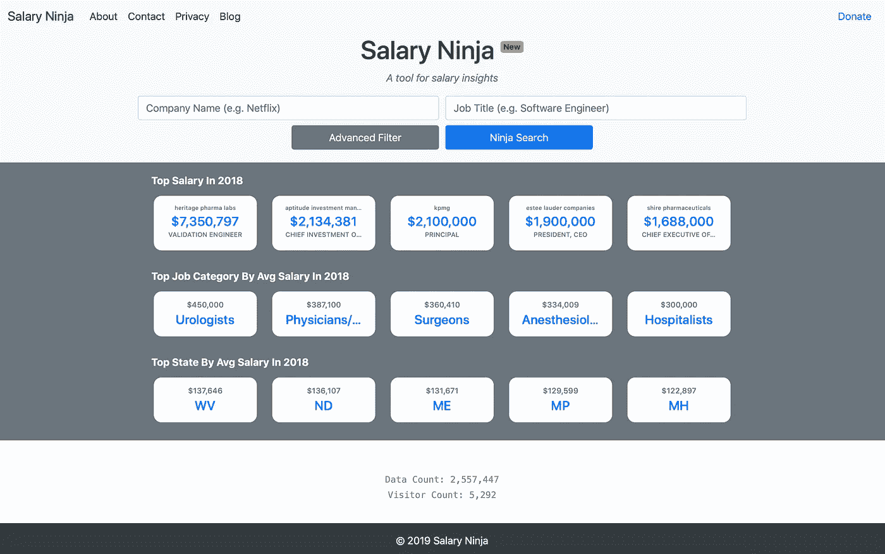

2019 年 7 月，我推出了我的第一个 web 应用，[薪资忍者](https://salary.ninja)，一个薪资洞察的工具。我花了整整五周的时间学习 Django，编写代码，并在服务器上部署这个应用程序。

作为成为全栈工程师/问题解决者的一部分，我想通过进入前端世界来提升我的游戏。我的想法是建立一个网站，在那里你可以搜索数据库并返回带有洞察力的结果。因为我对构建 web 应用程序一无所知，所以我研究了不同的选项、工具和框架。我想分享我经历的过程，因为它可能会给那些想自己建造一个的人一些启示。

粗略时间表:

*   第一周:形成想法，研究不同的框架，寻找合适的教程和资源，购买域名等。
*   第 2 周:完成 Django 官方教程
*   第 3 周:用 Django 实现薪水忍者后端
*   第 4 周:实现工资忍者前端，图表和表格
*   第 5 周:在 DigitalOcean 上部署，添加 Google Analytics，并结束

# 1.想法

一切从一个想法开始。你可以用勇气、毅力和信念把你的想法变成现实，只要你下定决心，你就能实现任何事情。我喜欢软件世界的一点是，一旦你有了一个想法，很有可能，你就能实现它。你所要做的就是坐下来，找到合适的资源去执行，不要放弃。

我有一个想法，想在脑海中建立一个网站应用程序已经有一段时间了。当我读到[安德烈·阿齐莫夫](https://medium.com/u/d85008b0fd22?source=post_page-----e9728480a8dd--------------------------------)的[这篇文章](https://medium.com/@AndreyAzimov/i-learned-to-code-and-build-a-web-app-in-2-months-da8f2932c139)时，我受到启发，开始着手我的项目，首先购买一个域名，这样我会更加投入。在世界上最大的域名注册机构工作，我没有理由不买一个。我就是这样结束了 [https://salary.ninja.](https://salary.ninja.)

因为我已经花了我宝贵的钱买了域名，我肯定会更致力于尽快解决这个问题。

# 2.后端— Django vs Node.js

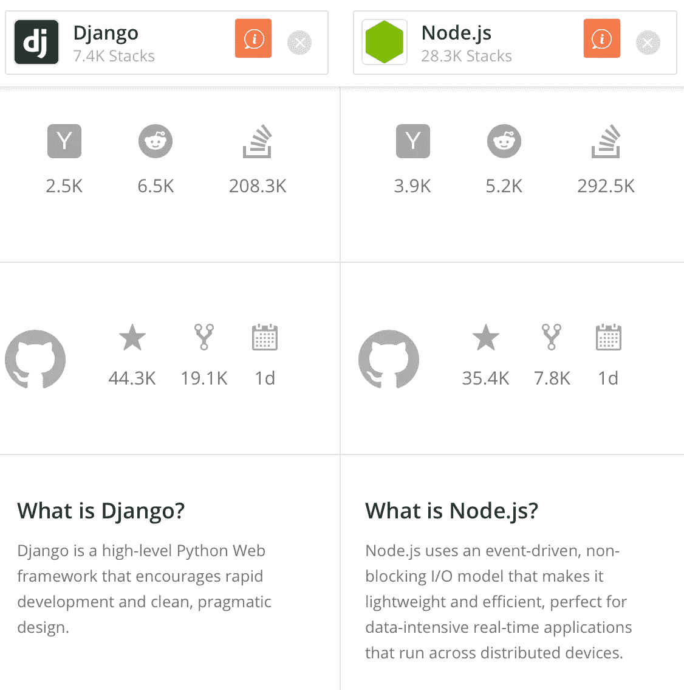

截图自 StackShare.io

我以前用过一些 HTML 和 CSS，但是我不知道从哪里开始拥有一个数据库。我开始这个项目只是简单地在谷歌上搜索“如何用搜索和数据库建立一个网站。”这不是最好的搜索方式。不管怎样，我最终选择了两个最流行的选项:Django 和 Node.js。简单地说，Django 是基于 Python 的 web 框架，Node.js 是基于 Javascript 的。老实说，Node.js 似乎更受欢迎，也更直观，因为 Javascript 已经广泛用于前端世界。下图证实了 Node.js 比 Django 更受欢迎。

Django 和 Node.js 之间的谷歌趋势

然而，这并不意味着 Django 是一个坏的选择。我很惊讶地得知，许多知名公司，如 Pinterest、Dropbox 和 Instagram，都在使用 Django。我推断这些公司一定做了足够的研究来证明使用 Django 而不是 Node.js 是正确的。此外，Django 对我来说是一个很大的优势，因为我已经习惯了 Python，并希望尽快建立我的网站。所以我决定和姜戈一起去。

我用来学习 Django 的资源主要有两个:官方文档和 YouTube。

*   [Django 官方教程](https://docs.djangoproject.com/en/2.2/intro/)全面回顾
*   CS Dojo 的[用 Django](https://www.youtube.com/watch?v=ovql0Ui3n_I) 制作了一个待办事项应用程序，这是一个简单的 Django 示例

我花了前两个星期浏览官方教程。我鼓励你也这样做。我看了两遍教程。第一次我只是浏览了所有的例子和代码，第二次，我开始修改代码来创建我的网站。方法很简单——在你学会了基础知识之后，你不断尝试和失败，直到你得到你想要的方式。在这个阶段，我只是确保我有一个正常工作的搜索功能和如下所示的数据库:

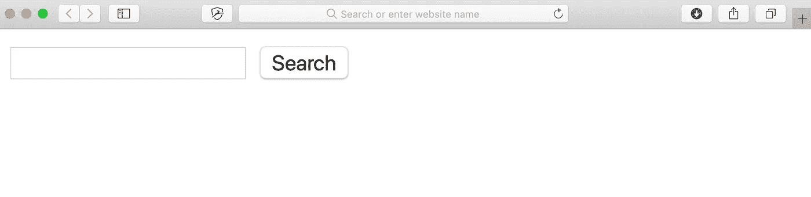

没有样式的网站看起来有多简单的例子。

如果你想了解更多关于 Django 和 Node.js 的区别，这里有一些链接(排名不分先后):

*   [用姜戈建造的遗址](https://djangostars.com/blog/10-popular-sites-made-on-django/)
*   节点 vs Django:[文章链接 1](https://learn.onemonth.com/node-vs-django/) 、[文章链接 2](https://dzone.com/articles/nodejs-vs-djangois-javascript-better-than-python) 、[文章链接 3](https://www.dailyrazor.com/blog/django-vs-node.js/)

# 3.前端—引导、反应、角度、Javascript、HTML、CSS

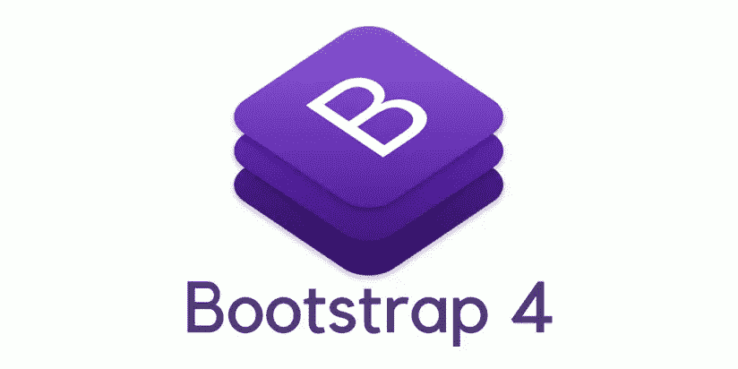

现在我有了一个基本结构的网站，是时候让它看起来漂亮了。我绝对不想要一个蹩脚的网站。刚开始的时候，我不知道什么更好，所以我开始用 HTML 和 CSS 手动样式。我很难找到一致的风格和手机友好的界面。就在那时，我遇到了 Bootstrap，，它救了我的命。

根据其官方网站，Bootstrap 是*“*世界上最受欢迎的前端组件库，用于构建响应迅速、移动优先的网站。”其移动优先的理念意味着组件首先是为移动体验而构建的，桌面版本只是移动网站的更大版本。

过去，我创建了一个桌面版本和一个单独的移动版本，发现这是非常低效的。然而，Bootstrap 为我处理了这个问题。对移动设备友好很重要，因为现在许多人使用智能手机浏览网页。即使是对于[的薪水忍者](https://salary.ninja)，移动访客几乎是桌面访客的两倍，所以我知道我最好专注于移动用户体验。

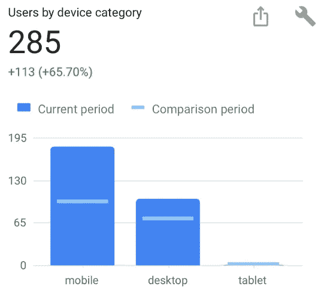

Bootstrap 提供了许多预定义的类/样式，您可以轻松使用。例如，我将它的模板用于导航栏、输入表单、表格、页脚等等。请查看其官方文档:

*   [文档主页](https://getbootstrap.com/docs/4.3/getting-started/introduction/)
*   [导航栏文档](https://getbootstrap.com/docs/4.3/components/navbar/)
*   [输入表单的文档](https://getbootstrap.com/docs/4.3/components/forms/)

不过，要使用 Bootstrap，你需要了解基本的 HTML、CSS 和 Javascript，所以我建议你在线学习基础知识。或许去看看代码学院:

*   [https://www.codecademy.com/catalog/subject/web-development](https://www.codecademy.com/catalog/subject/web-development)

在继续之前，我必须提到其他流行的前端库/框架:Angular、React 和 Vue。我不能对他们做太多的评论，因为我对他们没有多少经验。我觉得没有必要在我的简单网站上使用它们。但如果你想认真成为一名前端开发人员，你一定要深入了解他们。下面是一个简单的趋势对比。

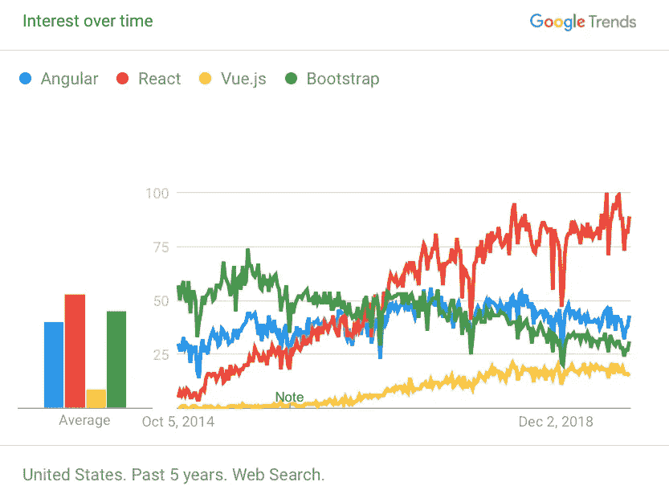

谷歌趋势介于 Angular、React、Vue 和 Bootstrap 之间

参考资料如果你想进一步阅读:

*   [反应与角度](https://programmingwithmosh.com/react/react-vs-angular/)
*   Quora: [React vs. Bootstrap](https://www.quora.com/What-is-the-difference-between-React-js-and-Bootstrap)
*   堆栈共享:[反应 vs .引导](https://stackshare.io/stackups/bootstrap-vs-react)

# 4.表格和绘图 Chart.js，数据表

## 图表

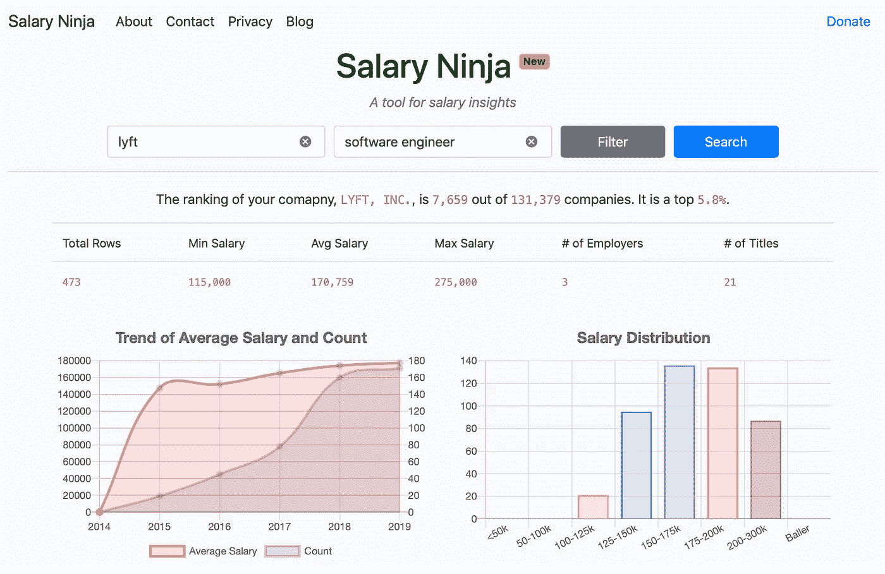

如上图所示，我希望我的搜索结果显示一个交互式的情节。我的第一个想法是使用 D3.js，但是它对我所需要的来说太复杂了。对于更简单的绘图，Chart.js 对我来说是更好的选择。如果你想设计一些更加定制和复杂的东西，我推荐 D3.js。我能够使用 Chart.js 的简单模板创建上面的图表。请通过下面的链接了解更多信息:

*   D3 . js:【https://d3js.org 
*   chart . js:[https://www.chartjs.org](https://www.chartjs.org/docs/latest/getting-started/)

## 桌子

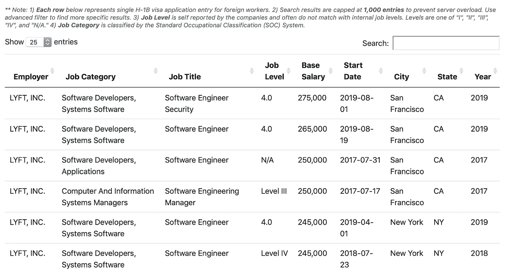

接下来，我希望我的表具有一些特性，比如分页、显示选项、搜索栏和排序。引导表提供了一些功能/样式，但对我来说还不够。然后我遇到了数据表，它“给你的 HTML 表格添加了高级交互控件
”我最终将 Bootstrap 和 DataTables 结合起来，以获得最好的功能和样式。请查看以下参考资料:

*   [数据表](https://datatables.net)
*   [添加分页的示例](https://datatables.net/examples/basic_init/alt_pagination.html)

# 5.部署—自动气象站、GCP、数字海洋

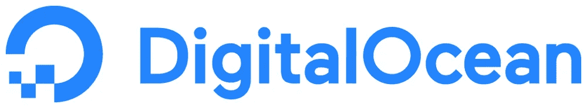

现在我有了一个功能正常的，漂亮的(？)网站，我需要使它可以从互联网上访问，以便任何人都可以访问该网站。我的标准是:

1.  便宜:我不会从这个项目中赚很多钱，如果有的话。因此，我想保持每月的低运营成本。我可以在性能上妥协，只要它是体面的。(回过头来看，我现在正在努力让表演变得更好，所以我怀疑这是不是一个糟糕的选择。)
2.  相关:我想使用与今天相关的技术，而不是过时的东西。也就是说，我想使用一个值得信赖的和最新的公司。
3.  简单:我不想花数周时间学习一个新的环境/平台。

我研究了三个选项:[亚马逊网络服务(AWS)](https://aws.amazon.com) 、[谷歌云平台(GCP)](https://cloud.google.com) 和[数字海洋](https://www.digitalocean.com)。

选择:

*   数字海洋如果你想要最简单最便宜的选择。尽管简单，但它们似乎很受欢迎，服务也很强大。
*   AWS，如果你想拥有最可定制和最强大的解决方案。然而，它的学习曲线最陡，大多数人不喜欢它的用户界面。这可能是压倒性的，因为他们有这么多的选项和定制。
*   GCP，如果你想要介于两者之间的。它比 AWS 更加用户友好，但可定制性较差。

数字海洋对我来说是一个容易的选择，因为它似乎有很好的文档/教程，而且只花了我 5 美元/月。GCP 和 AWS 最便宜的选项每月花费你 20 美元左右。下面是[数字海洋和 AWS](https://serverguy.com/comparison/digitalocean-vs-aws-ec2/) 的对比。

在 DigitalOcean 上设置您的服务器、连接您的自定义域名以及设置 SSL 时，您还需要学习一些教程。DigitalOcean 提供了关于如何做到这些的很好的教程。检查以下内容:

*   DigitalOcean: [如何在 Ubuntu 18.04 上用 Postgres、Nginx、Gunicorn 设置 Django](https://www.digitalocean.com/community/tutorials/how-to-set-up-django-with-postgres-nginx-and-gunicorn-on-ubuntu-18-04)
*   数字海洋:[使用 Ubuntu 的初始服务器设置](https://www.digitalocean.com/community/tutorials/initial-server-setup-with-ubuntu-18-04)
*   数字海洋:[如何添加域名](https://www.digitalocean.com/docs/networking/dns/how-to/add-domains/)
*   [如何使用 DigitalOcean 添加 GoDaddy 域](https://top5hosting.co.uk/blog/uk-hosting/361-connecting-a-godaddy-domain-with-digitalocean-droplet-step-by-step-guide-with-images)
*   数字海洋:[如何加密你的网站(HTTPS)](https://www.digitalocean.com/community/tutorials/how-to-secure-nginx-with-let-s-encrypt-on-ubuntu-18-04)

# 6.商业

现在你完成了你的网站，你的项目有了商业的一面。你可以使用 [Google Analytics](https://analytics.google.com/analytics/web/) 来了解更多关于你的受众的信息，使用 [Google Adsense](https://www.google.com/intl/en/adsense/start/) 来将你的网站货币化，并添加一个 [Paypal 捐赠按钮](https://www.paypal.com/donate/buttons)来获得粉丝的捐赠。我鼓励你去看看。

同样，我鼓励你查看链接来了解更多。它们中的每一个都相对容易设置和实现。

# 结论

嘿，感谢你阅读这篇文章！每次我完成一个项目，我都会试着写一篇关于它的文章，这样我就可以记录和分享我的过程。我不知道我的网站的命运会如何，但我想继续把它做得更好。我认为最需要努力的地方是查询速度。如果你有什么建议，请在评论区告诉我！

我最近增加了一个新的公司排名功能。你可以看到你的公司在平均工资方面的情况。

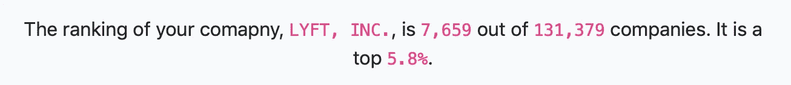

公司排名功能

我还想学习和探索更多的前端技术，比如 React 和 Node.js。我希望有一天我能接触到它们。我希望你发现这篇文章信息丰富，并学到了一些新的东西。再次感谢您的阅读！

请随意查看我以前的项目/文章:

*   **中等:** [**如何数据科学无学位**](https://towardsdatascience.com/how-to-data-science-without-a-degree-79d8388a49ba) **。**
*   **中:** [**作为数据/研究科学家如何保持最新**](https://towardsdatascience.com/how-to-stay-up-to-date-as-a-data-research-scientist-3846ef6b1739) 。
*   **YouTube:** [**用深度学习打败脸书的文字闪电战游戏。**](https://youtu.be/uP0-T8kYCjI)

*(*[*LinkedIn*](https://www.linkedin.com/in/jasjung/)*，*[*Twitter*](https://twitter.com/jasjung_)*)*