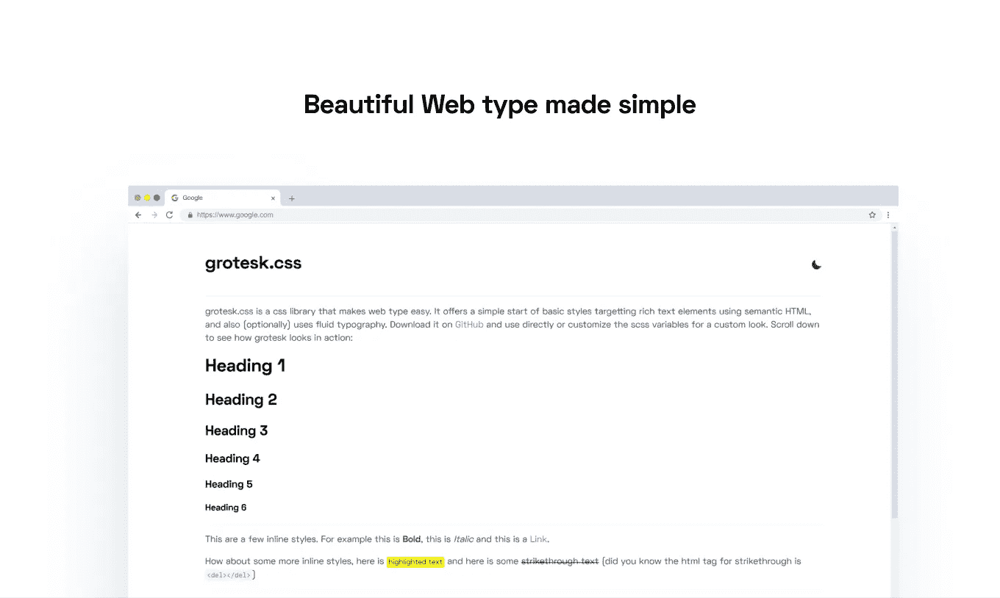

# 我是如何构建 Grotesk 的，它是一个 React 组件(和 CSS 库),使 Web 类型变得简单

> 原文：<https://betterprogramming.pub/how-i-built-grotesk-a-react-component-and-css-library-that-makes-web-type-simple-a84b832aeb00>

## 简化的版式样式



# 格罗特斯克是什么？

Grotesk 是一个 CSS 库和 React 组件，旨在简化网页排版。

我建立它的原因是因为我注意到几乎每个静态网站都是以相同的主题或排版规则开始的，所以我决定建立一个小型的库，我可以很容易地插入到我的下一个项目中。

由于我主要从事 React 应用程序和普通静态网站，我制作了一个 React 组件和一个 CSS 库。

# 目标

Grotesk 的目标不是结束所有的造型——它应该是一个非常小的 stater，可以支持您的常规造型。对于一个单一的主题，缩小的 CSS 文件只有 1.8Kb，我认为这是非常惊人的。

它还努力使定制尽可能简单，提供超过 15 个不同的变量供您使用。

# 它是如何工作的

我使用 SCSS 为变量和定制构建了`grotesk.css`(因为 CSS 定制属性相对较低的浏览器支持)。这是我使用 SCSS 的第一个项目——我不得不说，在 VS 代码中使用实时 Sass 编译器的工作流程非常流畅，开发体验非常愉快。

由于这是我的第一个 npm 包，我决定为 React 组件选择简单的东西，所以我决定使用 [create-react-library](https://www.npmjs.com/package/create-react-library) ，这使得构建和发布组件变得非常容易。对于样式和定制，我决定去与情感，因为我想要一些简单而强大的，可以动态的主题。

# 用户化

定制在 CSS 库中实现非常简单，因为用户所要做的就是改变文件顶部的 SCSS 变量，剩下的就由 SCSS 来管理了。然而，对于 React 组件，它要复杂一些。

我决定的方法是允许用户添加一个可选的`theme`道具到他们的`<Grotesk>`组件中。它接受一个允许它们改变变量的对象，如果有任何属性被排除，它们将恢复为默认值。

这里有一个主题示例:

```
const theme = {
  bg: '#ffffff',
  fgBody: '#2d3748',
  fgHeadings: '#000000', hrColor: 'rgba(0, 0, 0, 0.07)', linkColor: '#8a4baf', preBg: 'rgba(0, 0, 0, 0.04)',
  preColor: '#2d3748', inlineCodeBg: 'rgba(0, 0, 0, 0.04)',
  inlineCodeColor: 'hsl(0, 79 %, 63 %)', quoteBg: '#ffffff',
  quoteBorder: '#8a4baf',
  quoteColor: '#6a727c', fontFamMain: 'space-grotesk, sans-serif',
  fontFamMono: 'Menlo, Monaco, Consolas, "Liberation Mono", "Courier New" monospace',
  lineHtMain: '1.5',
  lineHtMono: '1'
}
```

# Grotesk vs. grotesk.css

哪个是给你的？我个人向几乎所有人推荐 CSS 库。即使您使用的是 React 项目，在大多数情况下，CSS 库已经足够好了。

我推荐 React 组件的唯一情况是当你的项目已经使用了情感或者如果你计划做很多动态主题化(比如两个以上的主题)。

# 我的过程

对于 CSS 库，我的过程非常简单——我所做的就是，首先，创建一个 HTML 文件，其中包含我想要样式化的所有内容，然后我开始处理`grotesk.light.scss`。

由于我使用 VS 代码，编译非常简单，有了惊人的 [Live Sass 编译器](https://marketplace.visualstudio.com/items?itemName=ritwickdey.live-sass)插件(强烈推荐)。

然而，对于 React 组件，过程有点复杂，但正如我之前提到的，Emotion 和 [create-react-library](https://www.npmjs.com/package/create-react-library) 确实有所帮助，尤其是如果你是一个新手。

# 最终注释

我敢肯定，其中可能有一些我还没有遇到的错误，我可能在其他许多事情上做错了——但这就是我开源这个项目的原因。如果你遇到任何错误，就去 [GitHub](https://github.com/kartiknair/grotesk) 吧，提出问题，我会尽快调查。另外，如果你认为你可以改善 Grotesk，就用你的贡献开一个 PR，我会把它加进去。伙计们，让我们充分利用开源的力量。