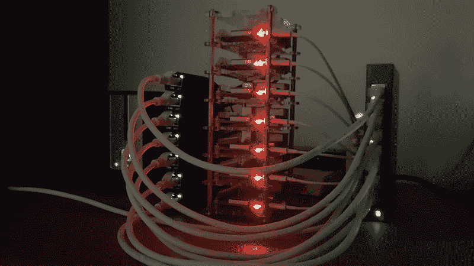
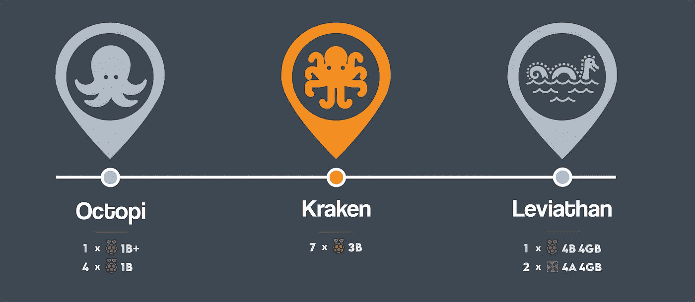
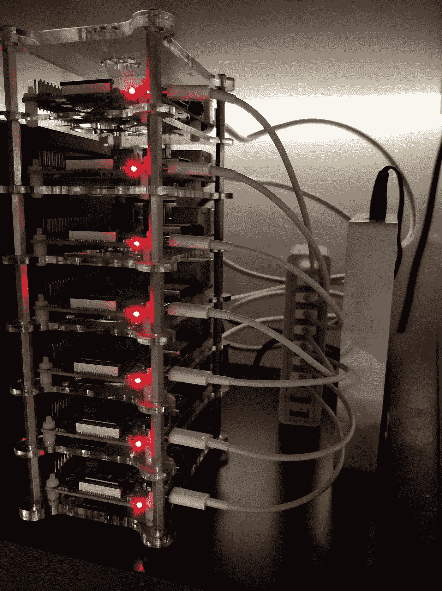
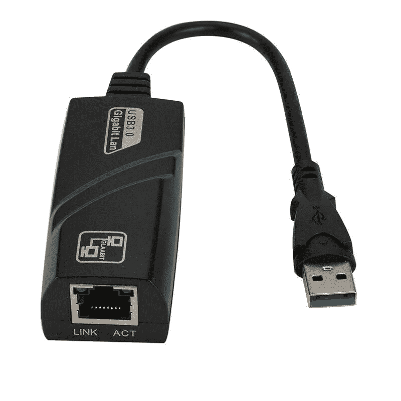

# 让我们构建一个 28 核的 Raspberry Pi 集群

> 原文：<https://betterprogramming.pub/how-i-built-kraken-8f2cfb7874de>

## 我构建了一个 28 核千兆集群北海巨妖，由 7 个 Raspberry Pi 3 模型 b 组成



北海巨妖星团(图片来源:作者)(*原载于*[*ikarus . SG*](https://ikarus.sg/how-i-built-kraken/)*2020 年 7 月 6 日)*

*这是我的“我如何构建”三部曲的第二部分，详细介绍了我的三个集群的构建过程。先看* [*这里看*](https://medium.com/swlh/how-i-built-a-raspberry-pi-cluster-for-cheap-38ab661bd641) *。*



您在群集时间线中的位置

# 十月*疼痛*

2018 年 10 月，在[构建我的第一个集群 Octopi](https://ikarus.sg/how-i-built-octopi/) 一年多之后，我已经正式超越了集群。当我试着在上面运行 WordPress 时，我开始注意到性能瓶颈，一个新安装的 WordPress 博客的单个页面加载需要大约 10 秒钟！然而，考虑到每个节点上微不足道的单核 700MHz 处理器，这一切都不足为奇。

那时我大学毕业，在一家初创公司找到了一份数据科学家+全栈工程师的工作，我心想:*还有什么更好的时间来为自己构建一个新的集群呢？*

# 北海巨妖

我的第二个集群被命名为北海巨妖。

> "克拉肯(/ˈkrɑːkən/)[1)是斯堪的纳维亚民间传说中一种传说中的头足类海怪，体型巨大."— [维基百科](https://en.wikipedia.org/wiki/Kraken)

北海巨妖基本上是一只更大更可怕的章鱼；因此得名，象征着第一个集群的进化。它由七个 Raspberry Pi 3Bs 组成，由一个 USB 充电器供电。

用我的第一份薪水，我最初打算最终建立一个八节点的集群，但是我又一次无法实现这个被诅咒的想法。消费级网络交换机上的最大端口数是八个，足够七个节点和一根到路由器的电缆使用。

一种替代方案是使用具有 16 个端口的商业级网络交换机，但这显然是不可能的(也没有预算)。

## 集群规格



北海巨妖星团诞生了！(不，那不是我的天花板。)

我的钱包在北海巨妖遭受的损失总共是 626.63 新元，合 449.73 美元，这是我这个月扣除费用和教育贷款还款后所剩无几的钱。

# 零件目录表

值得注意的是，我选择了一个 32 GB 的 MicroSD 卡作为第一个节点的存储，因为我打算将它作为一个 [Docker](https://www.docker.com/) 群设置的主节点，并预计我需要额外的存储来构建和部署 Docker 映像。


北海巨妖(上)和章鱼(下)共存，用土豆拍摄

# 北海巨妖千兆升级

一年后，在 2019 年 9 月，我发现自己经常在 Raspberry Pi 3Bs 的内置以太网端口上达到 100 Mbps 的带宽限制，特别是在机器内外进行大型文件传输时，传输速度大约在 8MB/s 左右。

我环顾四周，找到了 Jeff Geerling 的[博客文章](https://www.jeffgeerling.com/blogs/jeff-geerling/getting-gigabit-networking)，在那里我了解到我可以使用 USB 千兆以太网适配器将带宽增加到略高于 200 Mbps。所以我买了一堆便宜的中国 USB 千兆以太网适配器和一个千兆交换机，开始升级。



廉价、粗略、无品牌的 USB 千兆以太网适配器

## 附加零件清单

升级后，这是北海巨妖的样子:


千兆北海巨妖、章鱼和我的电缆管理噩梦

这次升级使集群的总成本达到 708.99 新元或 508.84 新元。

# 基准

升级前运行`iperf`，我们看到最大带宽为 93.1 Mbps。

```
~ ❯ iperf -c 192.168.3.11
------------------------------------------------------------
Client connecting to 192.168.3.11, TCP port 5001
TCP window size:  129 KByte (default)
------------------------------------------------------------
[  4] local 192.168.3.71 port 57041 connected with 192.168.3.11 port 5001
[ ID] Interval       Transfer     Bandwidth
[  4]  0.0-10.0 sec   111 MBytes  93.1 Mbits/sec
```

安装千兆适配器后运行`iperf`，我们看到最大带宽为 224 Mbps。

```
~ ❯ iperf -c 192.168.3.11
------------------------------------------------------------
Client connecting to 192.168.3.11, TCP port 5001
TCP window size:  145 KByte (default)
------------------------------------------------------------
[  4] local 192.168.3.71 port 57298 connected with 192.168.3.11 port 5001
[ ID] Interval       Transfer     Bandwidth
[  4]  0.0-10.0 sec   268 MBytes   224 Mbits/sec
```

通过这个简单的模块，我已经获得了 131 Mbps 的速度。然而，这些仍然只是理论速度，因为典型的使用场景涉及将从网络接收的数据写入磁盘，但`iperf`只从网络接收数据，不将数据写入磁盘。

## 一些警告

在典型使用中，即使在 web 服务中，持续充分利用这种新的可用带宽也是极不可能的。它主要有助于在第一次加载时更快地传输图像等大型资产，之后图像将被用户的浏览器缓存。

此外，实际带宽仍然受到 Raspberry Pi 模型 1 到 3 中臭名昭著的共享 USB 2.0 总线的限制。

对于外行来说，单条 USB 2.0 总线中 480 Mbps 的理论单向带宽是在以太网端口、SD 卡插槽和所有 USB 端口之间共享的。

带宽分布可能如下所示:

尽管列表中的数字给人的印象是这次升级并没有带来性能提升，但它们代表了最糟糕的情况，通常人们会认为 web 服务器中主要是读取，很少是写入。

在现实世界中，带宽分配通常应该是这样的:

# 您应该构建这个集群吗？

如果您符合以下条件，此版本适合您:

*   您希望学习 Docker 及其相关框架
*   你不会想花一大笔钱购买多个 Raspberry Pi 4Bs 来建立一个集群
*   想要探索 [Kubernetes](https://kubernetes.io/)

如果您有以下情况，此版本不适合您:

*   已经熟悉 Docker 生态系统
*   正在寻找高性能的家庭设置

# 我的两分钱

我强烈推荐任何热衷于进入 Docker 和 Kubernetes 的人构建这个集群，主要有两个原因。

首先，这个集群与官方支持的 Docker 映像的最新版本兼容。Raspberry Pi 3Bs 运行在 armv7 CPU 架构上，这恰好是当今 Arm 处理器中的最低公分母。

最新的 Arm 处理器(arm64)向后兼容在 armv7 上编写和编译的所有代码。相比之下，arm64 处理器与 armv6 处理器(Raspberry Pi 1 和 2)不向后兼容，因此它们本质上处于被社区淘汰的过程中。

其次，除了对带宽要求最高的应用程序之外，该集群非常适合所有应用程序，包括托管您自己的博客、文件同步服务、媒体库管理器、链接缩短程序、笔记应用程序等等。如果 Raspberry Pi 3 中存在 USB 2.0 总线瓶颈(这个问题仅在 Raspberry Pi 4 中得到解决)，那么它唯一不能按预期执行的情况是当您的应用程序需要大量持续写入时，例如对视频进行编码时。

总而言之，在我看来，构建一个 Raspberry Pi 3 集群是学习 Docker 和集群的最具成本效益的方式，并且在可预见的未来仍将如此。所以如果你刚刚进入 Docker，我强烈推荐这个版本。

# 下一步是什么？

在本系列的下一篇文章中，我将介绍我专门为高 I/O 应用程序构建的 Leviathan 集群，它能够对 HEVC -> h264 视频进行实时视频转码和流式传输。

*原载于 2020 年 7 月 6 日*[*ikarus . SG*](https://ikarus.sg/how-i-built-kraken/)*。*