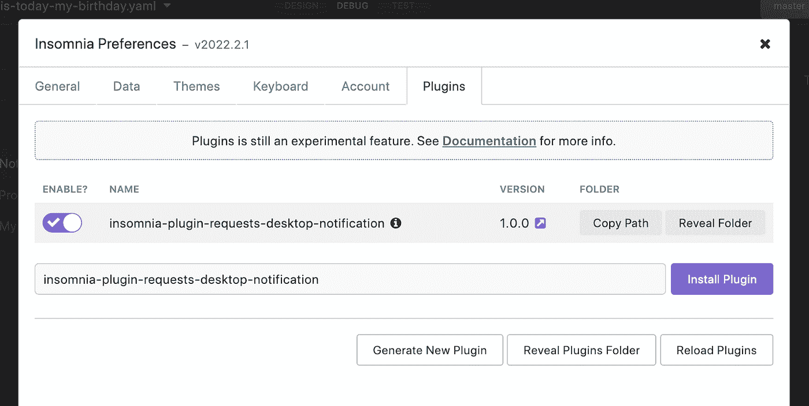
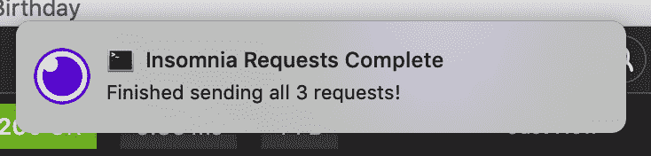
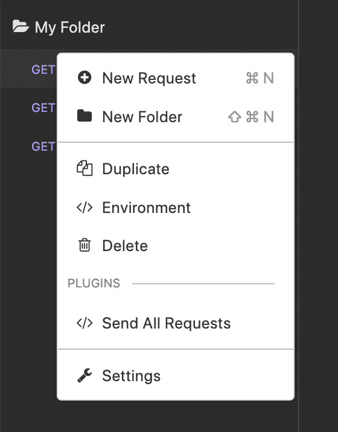
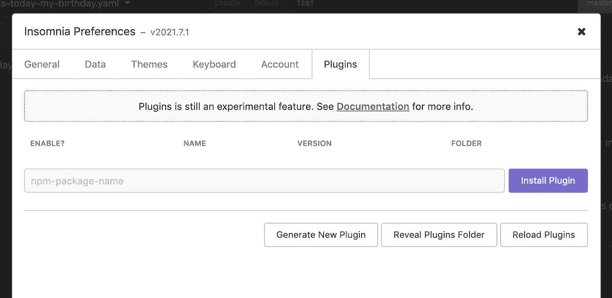

# 我如何构建自己的失眠插件

> 原文：<https://betterprogramming.pub/how-i-built-my-own-insomnia-plugin-56ebb9dba5f>

## 只需几行代码！

我的失眠插件(请求-桌面-通知)

[失眠症](https://insomnia.rest/)是一个开源的 API 客户端，帮助你测试和调试 GraphQL、gRPC 和 REST API 端点。尽管失眠很强大，但有时你想进一步扩展它的功能，你可以用[插件](https://docs.insomnia.rest/insomnia/introduction-to-plugins)来实现。

在[失眠插件中心](https://insomnia.rest/plugins)上有许多很棒的插件，都是由开源社区贡献的。更令人兴奋的是，如果你想投稿，你可以建立自己的插件！

在这篇文章中，我们将探索我构建的一个插件，然后向你展示如何构建你自己的失眠插件。

# 插件演示

我的插件是一个简单的添加，允许你启动一个文件夹中的所有请求，然后在所有请求完成后显示一个桌面通知。

上下文菜单项允许你在失眠应用程序中“发送所有请求”

如果你像我一样是一个习惯性的多任务处理者，你可能会在工作的时候同时快速切换几个应用程序。你的 IDE，你的终端，你的浏览器，失眠可能是少数。

如果您的文件夹中有大量请求，并且不想等待它们全部完成，您可以在等待的同时转移到其他地方，然后在作业完成时得到通知。

发送完所有请求后，会出现桌面通知

你可以[在 npm 上找到我的插件包](https://www.npmjs.com/package/insomnia-plugin-requests-desktop-notification)或者[在这里查看 GitHub repo](https://github.com/thawkin3/insomnia-plugin-requests-desktop-notification)。

# 插件安装

可以通过你的失眠桌面 app 中的设置页面安装失眠插件。只需点击应用右上角的齿轮图标，然后选择“插件”标签。在文本输入中搜索任何插件名称，然后单击“安装插件”按钮将插件添加到您的应用程序中。

以我的插件为例，名字是`insomnia-plugin-requests-desktop-notification`。

安装请求-桌面-通知插件

# 插件使用

一旦你安装了插件，你就可以开始使用它了——不需要重启你的失眠应用。插件有几种变体。有些为各种钩子添加了行为，比如[请求钩子或者响应钩子](https://docs.insomnia.rest/insomnia/hooks-and-actions)。其他[向应用程序中的下拉菜单](https://docs.insomnia.rest/insomnia/hooks-and-actions#folder-actions)添加新项目。你甚至可以通过插件安装一个[自定义主题](https://docs.insomnia.rest/insomnia/custom-themes)。

我的插件在请求文件夹的下拉菜单中增加了一个新项目。要查看它的运行，你可以导航到你的失眠应用程序的“调试”区域。然后，创建一个新文件夹，并向其中添加一些请求(或者使用一个现有的文件夹，如果您已经有一个的话)。

接下来，单击文件夹名称右侧的下拉触发器按钮，打开下拉菜单。在默认菜单项中，你还会看到我的插件添加的自定义菜单项:“发送所有请求。”

上下文菜单项允许你在失眠应用程序中“发送所有请求”

选择该菜单项以发送您文件夹中的所有请求。一旦所有的请求都完成了，一个桌面通知将会出现在你的机器上。哒哒！

发送完所有请求后，会出现桌面通知

# 如何建立一个失眠插件

那么，我是如何建造这个的呢？嗯，其实挺简单的！该插件是一个小的 JavaScript 应用程序，由一个`main.js`文件和一个`package.json`文件组成。对于桌面通知功能，我使用了`[node-notifier](https://www.npmjs.com/package/node-notifier)` npm 包。

当[创建一个新的失眠症插件](https://docs.insomnia.rest/insomnia/introduction-to-plugins#create-a-plugin)时，你可以通过导航到失眠症应用程序的设置屏幕，点击“插件”标签，然后点击“生成新插件”按钮来引导你的插件。

使用“生成新插件”按钮来引导你的插件

这将为你的插件创建一个新的目录，并把它放在一个文件夹中，在这个文件夹中，失眠保存了它所有的插件。它还会自动为您创建`main.js`和`package.json`文件。

从那里，我在我的`main.js`文件中编写了下面的代码。看它有多短！

让我们一起来看一下这段代码。首先，它需要我们所依赖的两个依赖关系:`path`和`node-notifier`。`path`是一个内置模块，但是我需要在我的终端上运行`yarn add node-notifier`来安装`node-notifier`。

*   代码的主要部分向`requestGroupActions`数组添加了一个新条目。这就是在我们的请求文件夹的下拉菜单中创建新菜单项的原因。
*   `label`是菜单项的文本。
*   `action`是当有人选择菜单项时我们想要运行的代码。

在`action`功能中，我们执行以下操作:

1.  收集文件夹中的所有请求。
2.  送他们。
3.  完成所有请求后，调用`notifier.notify`。`title`、`message`、`icon`和`sound`属性都配置了我们的桌面通知。

就是这样！这个插件真的就这么简单。

一旦我写了这段代码，我就可以导航到我的失眠应用程序的设置页面，然后是“插件”标签，然后点击“重新加载插件”按钮来重新加载最新的更改。之后，菜单项出现在我的请求文件夹的下拉菜单中。

# 发布到国家预防机制

写完我的插件后，我在本地一切都很好。但是我也想与更广泛的社区分享这个插件。为了做到这一点，我需要将它发布到 npm。为此，我将最新的代码推送到我的 GitHub repo，用`npm login`登录我的 npm 帐户，然后用`npm publish`发布我的包。

发布包的初始版本后，我可以对代码进行一些更新，用`npm version <major|minor|patch>`生成新的包版本，用`git push --tags`将标签推送到 GitHub，用`git push`将代码推送到 GitHub，然后用`npm publish`将新的包版本发布到 npm。

一旦我的包在 npm 注册中心发布，它会在接下来的 24 小时内自动添加到失眠插件中心。

# 结论

现在你知道了——我是如何构建自己的失眠插件的，你也可以。

总而言之，失眠对于构建、测试和调试 API 非常有用。插件让你扩展失眠的功能。

构建自己的定制插件很容易。您只需几行代码就可以添加新功能！