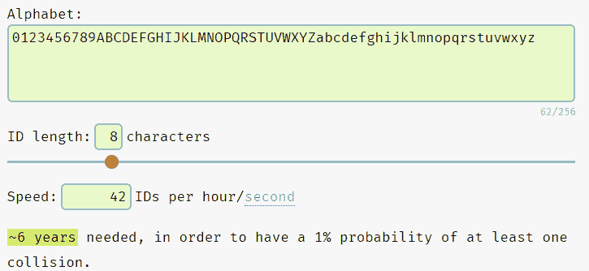

# 我如何使用无服务器计算构建自己的类似 TinyURL 的服务

> 原文：<https://betterprogramming.pub/how-i-built-my-own-tinyurl-like-service-using-serverless-computing-f41899f3fdcb>

## 使用 Cloudflare Worker 和 KV 设计和构建低延迟无服务器 URL shortener 服务


Pawel Czerwinski 在 [Unsplash](https://unsplash.com?utm_source=medium&utm_medium=referral) 上的照片

设计一个网址缩写器如 [TinyURL](https://tinyurl.com/) 和 [Bitly](https://bitly.com/) 是软件工程中最常见的系统设计面试问题之一。

在使用 cloud flare Worker[将每日 LeetCode Challenge 同步到我的 Todoist](/how-i-sync-daily-leetcoding-challenge-to-todoist-e50784bbcc8) 时，它给了我一个想法，即构建一个任何人都可以使用的实际 URL 缩短器。

以下是我的思考过程，通过代码示例说明我们如何使用 [Cloudflare Worker](https://workers.cloudflare.com/) 创建 URL shortener。如果您想跟进，您需要一个 [Cloudflare 帐户](https://www.cloudflare.com/)并使用 [Wrangler CLI](https://developers.cloudflare.com/workers/get-started/guide) 。

## 内容

*   使用 Cloudflare Worker 和 KV 免费构建 URL 缩短器
*   项目要求和限制计划
*   短 URL UUID 生成逻辑
*   s.jerrynsh.com[的现场演示](https://s.jerrynsh.com/)
*   [GitHub 库](https://github.com/ngshiheng/atomic-url)

在我们开始之前，不要抱太大希望。这不是关于以下方面的指南:

*   如何应对实际的系统设计面试
*   构建一个商业级的 URL 缩写器，如 TinyURL 或 Bitly

而是如何使用无服务器计算构建实际的 URL 缩写服务的概念证明(POC)。所以，抛出“可扩展性”、“分区”、“副本”等。从窗户出去，系好安全带。

我希望你会发现这篇文章很有见地，读起来很有趣！

# 要求

像任何系统设计面试一样，让我们从定义一些功能性和非功能性需求开始。

## 功能的

*   给定一个 URL，我们的服务应该返回一个唯一的短 URL。例如`[https://betterprogramming.pub/how-to-write-clean-code-in-python-5d67746133f2](/how-to-write-clean-code-in-python-5d67746133f2)` → `[s.jerrynsh.com/FpS0a2LU](https://s.jerrynsh.com/FpS0a2LU)`
*   每当用户试图访问`[s.jerrynsh.com/FpS0a2LU](https://s.jerrynsh.com/FpS0a2LU)`时，用户就会被引导回原来的网址。
*   UUID(我有时称它为 URL 键，因为它是我们存储对象的键)应该遵循 [Base62 编码方案](https://en.wikipedia.org/wiki/Base62) (26 + 26 + 10):

```
1\. A lower case alphabet **'a' to 'z'**, a total of 26 characters
2\. An upper case alphabet **'A' to 'Z'**, a total of 26 characters
3\. A digit **'0' to '9'**, a total of 10 characters
4\. In this POC, we will not be supporting custom short links
```

*   我们的 UUID 的长度应该≤ 8 个字符，因为 62⁸将给我们大约 218 万亿种可能性。
*   生成的短 URL 应该永不过期。

## 非功能性

*   低延迟
*   高可用性

## 预算、容量和限制规划

目标很简单——我希望能够免费提供这项服务。因此，我们的约束很大程度上取决于 [Cloudflare Worker 的定价](https://developers.cloudflare.com/workers/platform/pricing)和[平台限制](https://developers.cloudflare.com/workers/platform/limits)。

在撰写本文时，每个帐户免费托管我们服务的限制是:

*   每天 10 万个请求，每分钟 1 千个请求
*   CPU 运行时间不超过 10ms

像大多数 URL 缩短程序一样，我们的应用程序预计会遇到高读取率，但相对较低的写入率。为了存储我们的数据，我们将使用 [Cloudflare KV，这是一个键值数据存储库](https://developers.cloudflare.com/workers/learning/how-kv-works)，支持高读取和低延迟，非常适合我们的用例。

从我们之前的限制继续，KV 和[限制](https://developers.cloudflare.com/workers/platform/limits#kv-limits)的[自由层允许我们:](https://developers.cloudflare.com/workers/platform/pricing#workers-kv)

*   10 万次阅读/天
*   1k 写入/天
*   1 GB 的存储数据(密钥大小为 512 字节；25 MiB 的值大小)

## 我们可以存储多少个短网址

记住 1 GB 的免费最大存储数据限制，让我们尝试估计我们可以存储多少 URL。在这里，我使用[这个工具](https://mothereff.in/byte-counter)来估计 URL 的字节大小:

*   1 个字符为 1 个字节
*   因为我们的 UUID 应该最多只有 8 个字符，所以我们肯定没有密钥大小限制的问题。
*   另一方面，值大小限制——我推测最大 URL 大小应该平均在 200 个字符左右。因此，我相信可以安全地假设每个存储的对象应该平均不超过 400 字节，这远远低于 25 MiB。
*   最后，使用 1 GB，我们的 URL shortener 最多可以支持总共 2，500，000 个(1 GB 除以 400 字节)短 URL。
*   我知道，我知道。250 万个网址并不算多。

回头看，我们可以使 UUID 的长度≥ 4 而不是 8，因为 62⁴的可能性远远超过 250 万。话虽如此，我们还是坚持使用长度为 8 的 UUID。

总的来说，我认为 Cloudflare Worker 和 KV 的免费层非常慷慨，对于我们的概念验证来说绝对足够体面。请注意，限额是基于每个账户的。

# 存储/数据库

正如我前面提到的，我们将使用 Cloudflare KV 作为数据库来存储我们缩短的 URL，因为我们预计读取次数将多于写入次数。

## 最终一致

一个重要的注意事项—尽管 KV 能够支持异常高的全局读取，但它是一个最终一致的存储解决方案。换句话说，任何写入(即创建一个短 URL)可能需要长达 60 秒的时间来进行全局传播，这是我们可以接受的缺点。

通过我的实验，我还没有遇到过超过几秒钟的情况。

## 原子操作

阅读[KV 如何工作](https://developers.cloudflare.com/workers/learning/how-kv-works)，KV 并不适合需要原子操作的情况(例如两个账户余额之间的银行交易)。幸运的是，这与我们无关。

对于我们的 POC，我们的 KV 的密钥将是跟在我们的域名后面的 UUID(例如`s.jerrynsh.com/**FpS0a2LU**`),而值将由用户给出的长 URL 组成。

## 创建 KV

要创建 KV，只需使用 Wrangler CLI 运行以下命令。

```
# Production namespace:
wrangler kv:namespace create "URL_DB"# This namespace is used for `wrangler dev` local testing:
wrangler kv:namespace create "URL_DB" --preview
```

为了创建这些 KV 名称空间，我们还需要更新我们的`wrangler.toml`文件，以包含相应的名称空间绑定。您可以通过访问`https://dash.cloudflare.com/*<your_cloudflare_account_id>*/workers/kv/namespaces`查看您的 KV 仪表板。

# 短 URL UUID 生成逻辑

这可能是我们整个应用程序最重要的方面。

根据我们的要求，目标是为每个网址生成一个字母数字 UUID，其中我们的密钥长度不应超过 8 个字符。

在一个完美的世界中，生成的短链的 UUID 应该没有碰撞。另一个需要考虑的重要方面是——如果多个用户缩短同一个 URL 会怎么样？理想情况下，我们还应该检查重复。

让我们考虑以下解决方案:

## 1.使用 UUID 发电机

```
https://betterprogramming.pub/stop-using-exceptions-like-this-in-python-2bd8ba7d8841 → UUID Generator → **Yyf6AJ39**→ s.jerrynsh.com/**Yyf6AJ39**
```

这个解决方案实现起来相对简单。对于我们遇到的每一个新的 URL，我们简单地调用我们的 UUID 生成器来给我们一个新的 UUID。然后，我们将使用生成的 UUID 作为我们的键来分配新的 URL。

在 UUID 已经在我们的 KV 中存在(冲突)的情况下，我们可以继续重试。然而，我们确实希望注意重试，因为它可能相对昂贵。

此外，当涉及到处理 KV 中的重复时，使用 UUID 发生器不会帮助我们。在我们的 KV 中查找长 URL 值会相对较慢。

## 2.散列 URL

```
https://betterprogramming.pub/how-to-write-clean-code-in-python-5d67746133f2 → MD5 Hash → **99d641e9**923e135bd5f3a19dca1afbfa → **99d641e9** → s.jerrynsh.com/**99d641e9**
```

另一方面，散列 URL 允许我们检查重复的 URL，因为通过散列函数传递字符串(URL)将总是产生相同的结果。然后，我们可以使用结果(键)在 KV 中查找，以检查重复。

假设我们使用 [MD5](https://en.wikipedia.org/wiki/MD5) ，我们的密匙将会有≥ 8 个字符。那么，如果我们只取生成的 MD5 散列的前 8 个字节会怎么样呢？问题解决了对吗？

不完全是。散列函数总是会产生冲突。为了降低冲突的[概率](https://stackoverflow.com/questions/201705/how-many-random-elements-before-md5-produces-collisions)，我们可以生成一个更长的散列。但是，它对用户不太友好。此外，我们希望保持我们的 UUID ≤ 8 个字符。

## 3.使用增量计数器

```
https://betterprogramming.pub/3-useful-python-f-string-tricks-you-probably-dont-know-f908f7ed6cf5 → Counter → s.jerrynsh.com/**12345678**
```

在我看来，这可能是最简单也是最具扩展性的解决方案。使用这个解决方案，我们将不会遇到冲突问题。每当我们使用整个集合(从 00000000 到 9999999)时，我们可以简单地增加 UUID 中的字符数。

尽管如此，我不希望用户能够通过简单地访问`s.jerrynsh.com/12345678`来随机猜测一个短 URL。所以，这个解决方案是不可能的。

## 最后

有许多其他解决方案(例如，预先生成一个键列表，并在新请求到来时分配一个未使用的键)各有利弊。

对于我们的概念验证，我们将采用**解决方案 1** ，因为它易于实施，而且我也不介意重复。为了处理重复，我们可以缓存用户缩短 URL 的请求。

## 纳米 ID

为了生成 UUID，我们使用了`[nanoid](https://github.com/ai/nanoid)`包。为了估计我们的碰撞率，我们可以使用 [Nano ID 碰撞计算器](https://zelark.github.io/nano-id-cc/):



KV 空闲层每天只能处理 1k 次写入，因此速度大约为 42id/小时(1k / 24 小时)

好了，说够了，让我们写一些代码吧！

为了处理冲突的可能性，我们只需不断重试:

# 应用程序接口

在本节中，我们将定义我们想要支持的 API 端点。这个项目是使用`[itty-router](https://github.com/kwhitley/itty-router)` [工人模板](https://github.com/cloudflare/worker-template-router)初始化的——它帮助我们处理所有的路由逻辑:

```
wrangler generate <project-name> https://github.com/cloudflare/worker-template-router
```

我们项目的切入点在于`index.js`:

为了更好的用户体验，我创建了一个简单的 HTML 登录页面，任何人都可以使用；你可以在这里获得登陆页面的 HTML [。](https://github.com/ngshiheng/atomic-url/blob/main/src/utils/constants.js#L4)

## 创建短 URL

首先，我们需要一个 POST 端点(`/api/url`)，它调用`createShortUrl`，解析来自主体的`originalUrl`，并从中生成一个短 URL。

下面是代码示例:

要在本地进行尝试(您可以使用`wrangler dev`在本地启动服务器)，使用下面的 Curl 命令:

```
curl --request POST \\
  --url http://127.0.0.1:8787/api/url \\
  --header 'Content-Type: application/json' \\
  --data '{
	"originalUrl": "https://www.google.com/"
}'
```

## 重定向短 URL

作为一项 URL 缩短服务，我们希望用户在访问一个短 URL 时能够重定向到他们的原始 URL:

删了怎么样？因为用户不需要任何授权来缩短任何 URL，所以决定在没有删除 API 的情况下继续前进，因为任何用户可以简单地删除另一个用户的短 URL 是没有意义的。

要在本地试用我们的 URL shortener，只需运行`wrangler dev`。

## 好处:用缓存处理重复

> 注意:目前，这仅适用于自定义域。

如果用户决定重复缩短同一个 URL 会发生什么？我们不希望我们的 KV 以分配了唯一 UUID 的重复 URL 结束，对吗？

为了减轻这种情况，我们可以使用一个缓存中间件来缓存用户使用[缓存 API](https://developers.cloudflare.com/workers/runtime-apis/cache) 提交的`originalUrl`:

要使用这个缓存中间件，只需相应地更新我们的`index.js`:

```
// index.js...router.post('/api/url', **shortUrlCacheMiddleware**, createShortUrl)...
```

最后，我们需要确保在缩短缓存实例时用原始 URL 更新它:

在我对`wrangler dev`的测试中，[工作缓存似乎不能在本地或任何](https://community.cloudflare.com/t/cloudflare-worker-cache-does-not-work/298125) `[worker.dev](https://community.cloudflare.com/t/cloudflare-worker-cache-does-not-work/298125)`域上工作。

测试这个问题的解决方法是运行`wrangler publish`在**定制域**上发布应用程序。您可以通过向`/api/url`端点发送请求来验证更改，同时通过`wrangler tail`观察日志。

# 部署

没有一个副业是在没有主持的情况下完成的，对吗？

在发布您的代码之前，您需要编辑`wrangler.toml`文件并在其中添加您的 Cloudflare `account_id`。你可以在[官方文档](https://developers.cloudflare.com/workers/get-started/guide#7-configure-your-project-for-deployment)中找到更多关于配置和发布你的代码的信息。

要向您的 Cloudflare Worker 部署和发布任何新的更改，只需运行`wrangler publish`。要将您的应用程序部署到自定义域，请查看这个短片。

万一你中途迷路了，你可以在这里查看 [GitHub 库。就是这样！](https://github.com/ngshiheng/atomic-url)

# 最后的想法

老实说，这是我最近最开心的一次——同时研究、编写和构建这个概念验证。在我看来，我们可以为我们的网址缩短器做更多的事情；仅举几个例子:

*   存储[元数据](https://developers.cloudflare.com/workers/runtime-apis/kv#metadata)，如创建日期、访问次数
*   添加身份验证
*   处理短网址删除和[过期](https://developers.cloudflare.com/workers/runtime-apis/kv#creating-expiring-keys)
*   用户分析
*   自定义链接

大多数 URL 缩短服务面临的一个问题是，短 URL 经常被滥用来将用户引向恶意站点。我认为这是一个值得深入研究的有趣话题。

今天就到这里吧！干杯！

```
**Want to Connect With the Author?**This article was originally published at [jerrynsh.com](https://jerrynsh.com/i-built-my-own-tiny-url/)
```