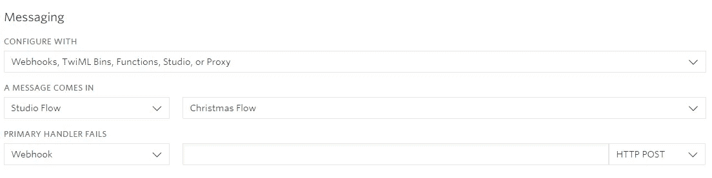
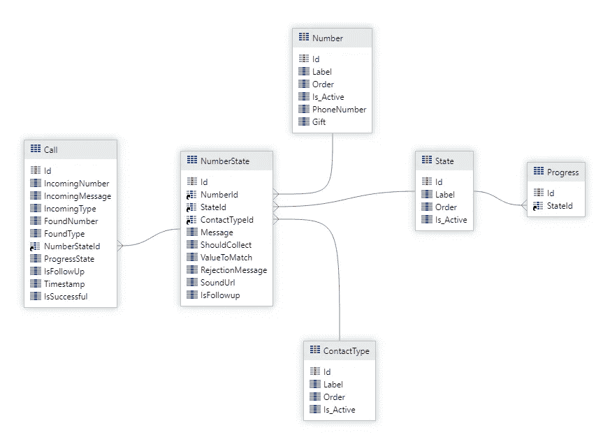
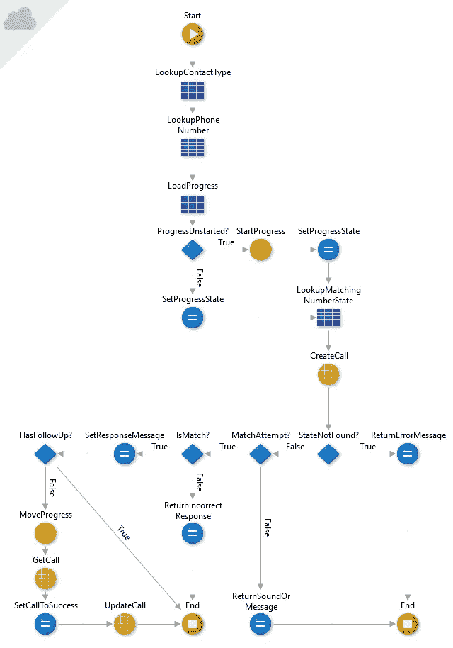
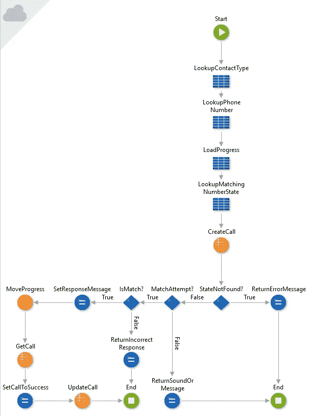
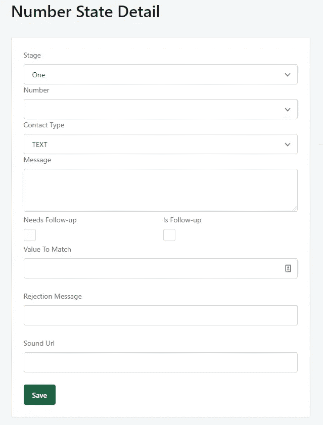
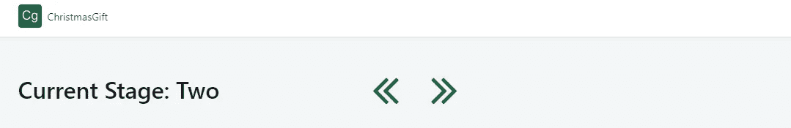
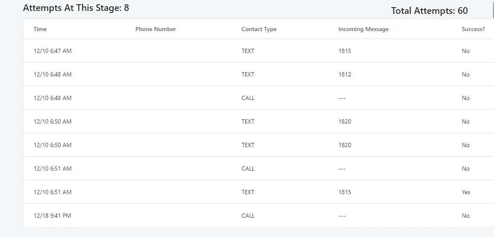

# 我如何与 Twilio、AWS 和 OutSystems 一起打造有史以来最好的圣诞礼物

> 原文：<https://betterprogramming.pub/how-i-built-the-best-christmas-gift-ever-with-twilio-aws-and-outsystems-6c6bc79c1c9d>

## 最棒的是，它不到 10 美元

我有一个小弟弟。在我快 30 岁的时候，我有很多时间来完善我的骚扰游戏。我最喜欢和我哥哥玩的一个游戏是“我能让你花多长时间打开你的圣诞礼物”游戏。

对于整个家庭来说，这是一个有趣的游戏，当然除了我的弟弟。游戏很简单:

*   给我弟弟买一堆礼物。
*   找出它们应该按什么顺序打开。
*   给每件礼物贴上神秘的标签。
*   让哥哥根据模糊的暗示和模棱两可的图像推断出顺序。

在我家，我们都轮流打开礼物。如果我弟弟猜错了礼物，他就会被跳过，不得不等待下一轮。这导致了一个特别漫长和欢乐的圣诞节早晨。他总是以活力开始，逐渐失去他的魔力，退化成随机猜测。

这个游戏不容易。为了让你了解我过去几年所做的事情，有一年我在他的每一件礼物上画了一个不同的美国土著部落，并告诉他顺序是从最西端到最东端。他不被允许使用他的电话来解决这个问题。

另一年，我研究了一些不知名的狗品种。我在每件礼物上都贴上了狗的品种标签，并告诉我哥哥，顺序是平均肩高除以 AKC 认可的公狗平均体重的除数，从最小到最大。

我决定今年更上一层楼。

我的职业是软件工程师，为什么不利用我的技能呢？有很多免费的工具和服务供我使用，所以让我们把其中的一些结合起来，创造一个有趣的、技术性的圣诞节早晨。

经过短暂的头脑风暴，我想到了一个计划。我会给每件礼物分配一个电话号码，他需要打电话或发短信来决定是不是该打开了。礼物会回应他的电话/短信，告诉他是，不是，或者一些断章取义的废话。为了更上一层楼，我打算让他一路上回答一些小问题。

每个电话号码都会期待一个小问题的答案。当他答对一题时，他会收到下一个小问题，以此类推，直到他打开所有的礼物。

# 从哪里开始？

从高层思考我的总体规划，无非就是一个状态机。一个简单的国家机器会在圣诞节的早晨把沮丧之火浇到我弟弟身上。

从头到尾，共有三个组件:

1.发送/接收电话和短信

2.状态机

3.文件存储(用于我想回放的一些片段)

从架构的角度来看，这是一个非常基本的流程:

1.有电话或短信进来。

2.来自呼叫/文本的细节被路由到管理状态的 web 服务。

3.该服务处理响应状态的消息，并返回消息、声音或标志，以便后续获取更多信息。

4.该消息或跟进被返回给用户。

## 信息发送

我决定发信息很容易。当你是一名开发人员，需要发短信或打电话时，答案只有一个: [Twilio](https://www.twilio.com/) 。

Twilio 有一个名为 Twilio Studio 的设计功能，允许您通过拖放用户界面来构建工作流程。它为呼叫和文本提供了特定的路由，并为您提供了调用 web API 来实现特殊逻辑的能力。这正是我所需要的。

我组装了一个通用流，将联系人类型(呼叫或文本)、电话号码和消息传入我要编写的 API。根据响应，它将执行以下三项操作之一:

1.从 API 的响应中说出/发送一条消息

2.播放声音

3.问一个问题，收集我哥哥的意见

[这里是来自 Twilio Studio 的 JSON](https://gist.github.com/allenheltondev/e3f35fbdba2ed41a71f79e1c8a26f64f) 流，而不是进入工作流的细节。

## 电话号码

接下来，我必须获得一些电话号码。我去了 Twilio，买了八个电话号码，每个礼物一个。有了 Twilio，每个电话号码每月只需 1 美元，所以我觉得自己是在捡便宜。

购买号码后，我必须将它们绑定到我的流程中。所以，我去仪表盘上找每个电话号码，告诉它用我的圣诞流量，然后嘣。完成了。

电话号码的消息仪表板

## 在线存储

当一些电话号码被拨打时，我想回放一些片段。我决定使用 AWS，并使用 [S3](https://aws.amazon.com/s3/) (简单存储服务)来托管文件。对于我想托管的文件数量，它不会花费一分钱。

我把声音文件上传到 S3，让公众可以访问，并记下了网址。

## 国家机器

这无疑是项目中最复杂的部分。我想要一些优雅但尽可能小的东西。而且去部署的时候也没大惊小怪。

进入[输出系统](https://www.outsystems.com/)。

OutSystems 是一家专注于低代码/无代码开发的公司，为您管理一切。他们通过他们的 service studio 和 designer 为您提供丰富的体验，消除了部署、编写无关代码和操作 HTML 的麻烦。另外，如果您正在进行非生产开发，它是免费的。双赢！

这绝对是您可以偏离我所走的道路，采用完整的 AWS 解决方案的地方。我最初确实考虑过这一点，但是我想把我的开发时间减到最少，所以我选择了 OutSystems。

下面是状态机的实体关系图。

call——用来跟踪/羞辱我哥。这向我展示了他试图找出打开哪个礼物的每一次尝试。它最初是用于调试的目的，但最终有了一个有趣的用途，所以我可以告诉他，他联系了他的礼物多少次。这完全是可选的。

NumberState —任何给定状态下每个电话号码的响应。当礼物被打开时，状态会发展，电话号码会改变他们的回应和电话/短信偏好。这才是国家机器真正的肉。

号码——指定给礼物的电话号码。

联系人类型—硬编码列表、电话或文本。

州——代表我的兄弟在哪个礼物上。这个圣诞节他很幸运地得到了八份礼物，所以有八个州。

progress——这是一个单例，表示状态机的当前进度。它负责根据传递给服务的参数查找适当的 NumberState。

# 状态机逻辑

为了让状态机正常运行，我需要创建两个端点:尝试和跟进。

尝试是进入系统的主要入口。这是端点的逻辑流程。

该流程从一些初始查找开始，以获得其方向。它加载状态机的当前进度，然后根据进度、来电号码和联系人类型获取适当的 NumberState。

NumberState 将提供类似“我是在期待一个特定的值吗？我期望看到的价值是什么？我需要问一个后续问题吗？”

如果传入的消息与我们正在寻找的值匹配，我们将状态向前推进并更新状态机。

这些问题将在我们反馈给 Twilio 流的响应中返回。该流程知道如何播放声音、口述消息或进行跟进。

说到跟进，我们来看看那个逻辑。

如你所见，逻辑非常相似，除了这里我们可以做一些假设。我们假设进展已经开始，这意味着这不是有史以来的第一次接触，我们知道不会有另一个后续行动。这只是我强加给这个游戏的规则。此外，LookupMatchingNumberState 现在查找要在 NumberState 上设置的后续标志。除此之外，完全相同的逻辑。

有了这个，我们现在有了有史以来最好的圣诞礼物的所有逻辑。是时候集合数字状态了。

# 国家创造又名研磨

我制作了一个简单的网页，可以让我快速方便地添加我的状态。

舞台——我哥哥正在打开什么礼物？

号码——他联系的是什么号码？

联系人类型—是回复电话还是短信？

信息——电话号码会怎么回答？

需要跟进——我需要更多信息，并致电跟进端点

是跟进—表示此状态是对跟进的响应。

要匹配的值—传入消息应该说什么(例如，我的琐事问题的答案) :)

拒绝消息—如果传入消息的值不匹配，电话号码会回复什么

声音 URL —要播放的声音片段的 URL。如果这是设定好的，它将胜过一切

要完成我的游戏，我所要做的就是建造大量的这种东西。我开始工作，开始拼凑我美妙的圣诞兄弟恐怖游戏。奇怪的是，这实际上是整个过程中最耗时的部分。

# 监视

我不是没有缺点。我知道，尽管我所有的测试运行都很顺利，但在圣诞节的早晨还是会出现一个错误。任何一个开发者都会告诉你。臭名昭著的“在我的机器上工作”这句话比我们愿意承认的更经常地伤害我们。

考虑到这一点，我还添加了一个监控网页，以便在出现问题时可以控制游戏的状态。我可以来回移动状态，以防应用程序没有自动这样做。另外，我们可以在他完成后开怀大笑，并获得一些重播价值。

由于整件事都是关于调侃和幽默，我在我的监控页面底部添加了一个联系人跟踪器，这样我就可以向他显示他联系每个号码的次数，如果是电话或短信，以及他说了什么。

出于显而易见的原因对数字进行了编辑:)

# 包起来(呵呵，懂了？)

在我写这篇文章的时候，圣诞节还没有到来，但是我确实打算回来告诉你们圣诞节是怎么过的。

对我来说，这是一次很好的学习经历，让我尝试做一些便宜、快速、健壮和通用的东西。我使用的工具使我能够达到所有这些标准，并为圣诞节想出一些独特而有趣的东西。让我们来看看托管/构建/测试/运行这个东西的总成本。

*   外部系统中的主机状态机—免费
*   在 S3 免费托管声音文件
*   开发和故障排除的所有文本—0.89 美元
*   所有开发和故障排除呼叫—0.68 美元
*   十二月份的电话号码——8.00 美元

总计:9.57 美元

从各方面考虑，计划、构建、测试和部署一切花费了大约八个小时。找到适合这项工作的合适工具会有很大的不同。在今天的环境中，几乎所有可用的服务都有免费层，您只需要做一点探索，就可以快速、高效、廉价地将您自己的项目连接起来！

圣诞快乐！

**一月更新**

我哥哥在圣诞节那天情绪波动很大。他从“你的系统是荒谬的。全是运气！”以“你真的需要把这个放到 reddit 上，这样人们就能看到我受了多少苦”结尾

当他还在揣摩我的谜语和游戏流程时，他的日子就不好过了。老实说，找到第一份礼物全靠运气。他很生气，因为他总是得不到礼物。

如果我不得不改变体验，我可能会写更好的说明如何玩。虽然对我来说很有意义，但对我的兄弟来说却毫无意义，我只是把整件事都推给了他。

不管怎样，他最终还是喜欢这种体验。现在我只需要想出明年要做什么…