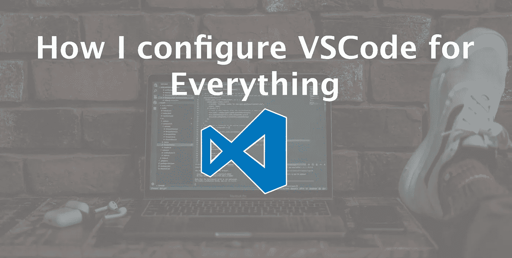
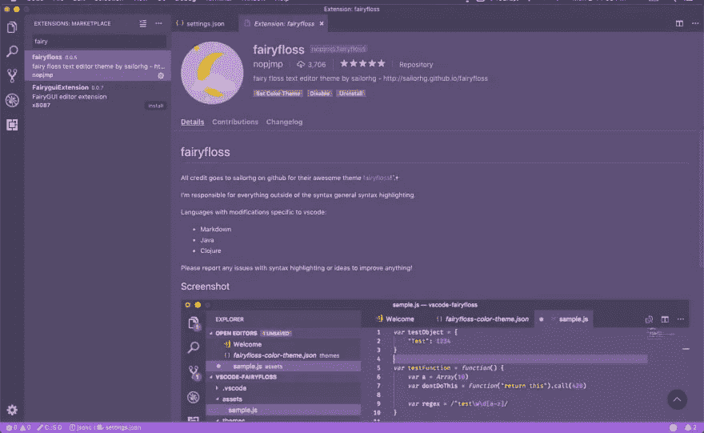

# 我如何为一切配置 VS 代码

> 原文：<https://betterprogramming.pub/how-i-configure-vscode-for-everything-7df65a316a52>



鸣谢:Unsplash/Joshua Aragon

> **我更新了这篇文章**[](https://amanhimself.dev/blog/setup-macbook-m1/)****，添加了基于 M1 芯片的新 Macbook Pro！****

**最近，我在乌克兰的 Boryspil 机场写博客文章，突然我的 VS 代码停止工作了。居然死机了！不是一次，而是在不到 30 分钟内两次。有些内容是自动保存的，但有些内容永远消失了。**

**我起初很沮丧，为什么它必须在那一刻崩溃。重新打开编辑器后，我对自己很生气，因为我不得不写一些没有再次保存的东西。**

**在这次经历之前，它确实有时觉得我有太多没有使用的扩展，因为我在最近几个月停止了一些框架的工作(例如 Angular)。**

**我做了什么？情绪没有帮助；我必须找到更好的方法。于是，我重装了 [VS 代码](https://code.visualstudio.com/)。**

**VS 代码使用 [Electron](https://electronjs.org/) 作为其基础，这使得它能够跨平台并在 macOS、Windows 和 Linux 上工作。它是使用 [Node.js](https://nodejs.org/) 构建的，完全支持任何 JavaScript 开发者。**

**这就是我所说的双赢。与我以前用过的编辑器( [Atom](https://atom.io/) 和 IDE 的( [Webstorm](https://www.jetbrains.com/webstorm/) )相比，它的速度很快。**

# **主题**

**我做的第一件事是安装我整天看到的主题。我希望我的编辑有魅力，有吸引力。因此，我出于不同的目的使用了以下主题。**

*   **fairyFloss(大部分时间，因为我喜欢紫色背景)。**
*   **德古拉官方(我在我的 [iTerm](https://www.iterm2.com/) 设置中使用了这个，并在它和仙女线之间切换)。**
*   **夜猫子(只是为了尝试新事物)。**
*   **材质-图标-主题(用于文件图标)。**

****

# **配置 VS 代码**

**接下来，我改变了一些我从以前的设置中记住的东西。**

*   **将`Tab`尺寸设置为两个空格。**
*   **启用 HTML 和 JavaScript 的 Emmet。**
*   **延迟 5 秒使能`autoSave`。**
*   **用过 OS 的终端设置和 shell ( [Zsh](https://ohmyz.sh/) )。**
*   **允许在保存和粘贴其他地方的代码片段时格式化文件。**
*   **禁用小地图，因为我喜欢节省空间，我们写模块化功能模块这些天。**
*   **同样，使能`wordwrap`。**

# **扩展ˌ扩张**

**对我来说，下一步是在一些维护良好的免费扩展的帮助下，让这个编辑器像一个魔咒一样工作。**

*   **:[表情符号](https://marketplace.visualstudio.com/items?itemName=bierner.emojisense):**
*   **[括号对上色器](https://marketplace.visualstudio.com/items?itemName=CoenraadS.bracket-pair-colorizer)**
*   **[代码拼写检查器](https://marketplace.visualstudio.com/items?itemName=streetsidesoftware.code-spell-checker)(我用 VS 代码写了很多博文。)**
*   **[Code::Stats](https://codestats.net/) (一个小的统计工具，好玩的。)**
*   **[ESLint](https://eslint.org/)**
*   **[缩进 4 到 2](https://marketplace.visualstudio.com/items?itemName=Compulim.indent4to2) (将制表符缩进从四个空格转换为两个空格。)**
*   **[Express.js](https://expressjs.com/) (我写的一个 snippets 包。)**
*   **[markdownlint](https://github.com/markdownlint/markdownlint) (我有时候一天写的 Markdown 比 JavaScript 代码还多。)**
*   **[GitHub 拉取请求](https://help.github.com/en/articles/about-pull-requests)。**
*   **[graph QL](https://graphql.org/)(Prisma 出版。)**
*   **[进口成本](https://marketplace.visualstudio.com/items?itemName=wix.vscode-import-cost)**
*   **[npm 智能感知](https://marketplace.visualstudio.com/items?itemName=christian-kohler.npm-intellisense)**
*   **[路径智能感知](https://marketplace.visualstudio.com/items?itemName=christian-kohler.path-intellisense)**
*   **[Pug](https://marketplace.visualstudio.com/items?itemName=amandeepmittal.pug) (我为 Jade 和 Pug 模板语言做的另一个片段，针对一些老项目。)**
*   **[CSS 类名的智能感知](https://marketplace.visualstudio.com/items?itemName=Zignd.html-css-class-completion)**
*   **[React 原生工具](https://marketplace.visualstudio.com/items?itemName=msjsdiag.vscode-react-native)**
*   **[待办事项树](https://marketplace.visualstudio.com/items?itemName=Gruntfuggly.todo-tree)**
*   **[版镜头](https://marketplace.visualstudio.com/items?itemName=pflannery.vscode-versionlens)**
*   **[设置同步](https://marketplace.visualstudio.com/items?itemName=Shan.code-settings-sync)(我在这里提到的最重要的扩展之一)**
*   **[字数](https://marketplace.visualstudio.com/items?itemName=ms-vscode.wordcount)**
*   **[更漂亮](https://prettier.io/)(代码格式化程序我不能没有。)**

**对于更漂亮的，我喜欢使用我自己的一套配置，如下所述。**

```
"prettier.jsxSingleQuote": true,
"prettier.printWidth": 100,
"prettier.semi": false,
"prettier.useTabs": true,
"prettier.tabWidth": 2,
```

# **结论**

**这就是我现在用于 JavaScript、Node.js、 [React](https://reactjs.org/) 和 React 本机工作的设置。你使用什么类型的 VS 代码配置？它看起来像什么？我希望你喜欢阅读这篇文章。**

**编码快乐！**

> ****我在这里** **更新了这篇文章** [**，添加了基于 M1 芯片的新 Macbook Pro！**](https://amanhimself.dev/blog/setup-macbook-m1/)**