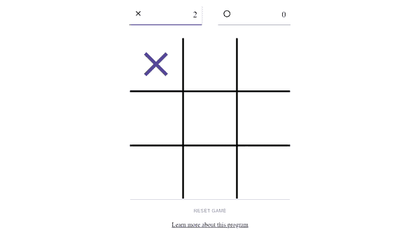
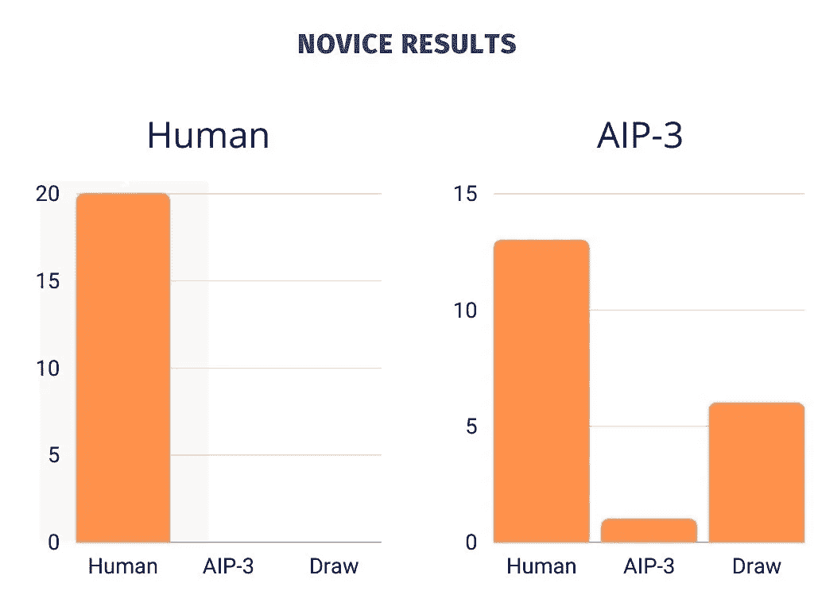
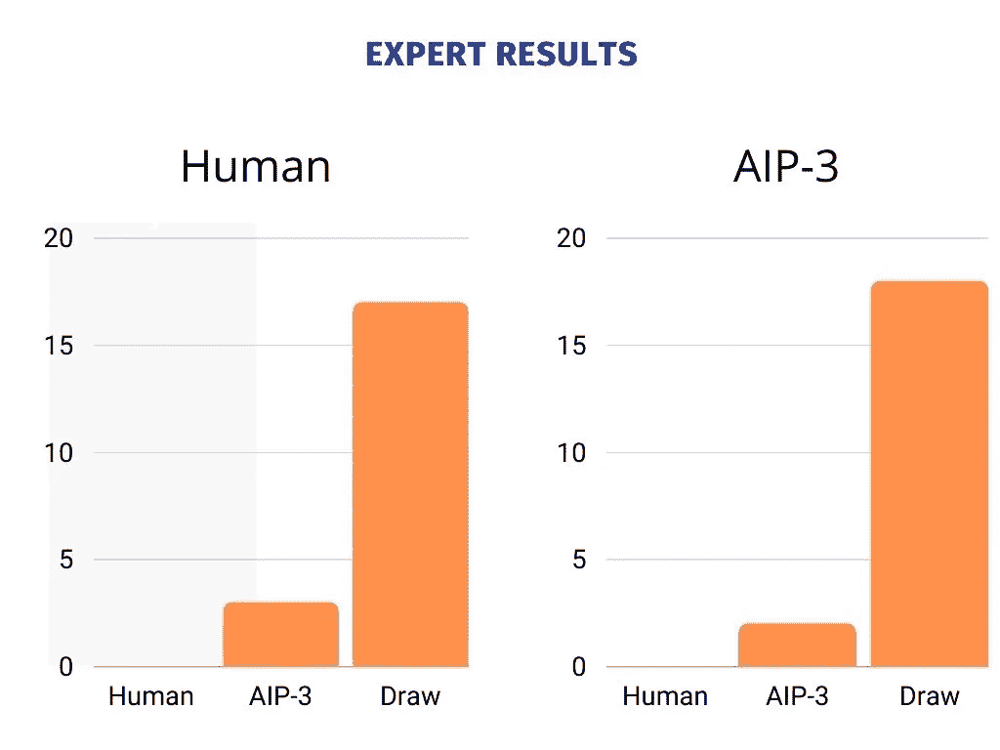
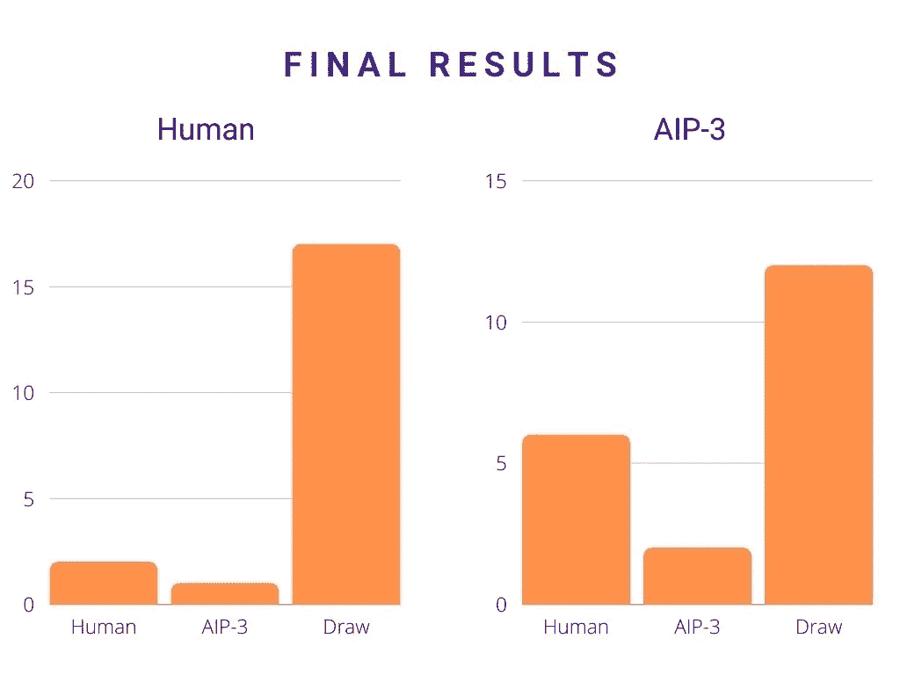

# 使用 React.js 创建一个井字游戏 AI 游戏

> 原文：<https://betterprogramming.pub/how-i-created-my-first-ai-program-using-react-js-95fe54d994d6>

## 机器人几乎每次都能打败人类吗？让我们找出答案

[马修·戴维斯](https://unsplash.com/@treatzone?utm_source=medium&utm_medium=referral)在 [Unsplash](https://unsplash.com?utm_source=medium&utm_medium=referral) 上拍照

人工智能已经走上了统治世界的道路，这不是什么秘密。OpenAI、DeepMind 和 IBM 等公司已经创造了一些迄今为止最顶级的人工智能项目，如 GPT-3、AlphaGO 和深蓝。

意识到这是编程的未来，我决定跟上潮流，用 Node.js 和 React 构建我的第一个人工智能程序。

这个项目被证明是对我编码技能的终极测试。那么为什么要大费周章呢？

就为了说是我做的？也许吧…但是当我在几年后被某个人工智能开发者取代后和我的孩子坐在一起时，我至少可以让他们看看这一切是如何开始的。

# 游戏

我认为开始我的旅程的最好方式是制造一个可以和人类对手玩游戏的人工智能。对我来说幸运的是，已经有一些游戏被认为是“解决了”的，例如，连接四，跳棋和井字游戏。

我说的“解决”是什么意思？这意味着每个玩家都可以采取一些已知的行动来决定胜负。这些类型的游戏被证明是最好的开始，因为它们的规则不是很复杂。

Checkers 是我列出的三个中最复杂的一个，所以这个马上就被淘汰了。我最感兴趣的是 Connect Four，但对于可以模拟的 **4，531，985，219，092** (4.5 万亿)种可能的游戏，这有点超出了我的能力范围……目前来说。

如果我想做点什么的话，我需要把它降低一个等级。

输入井字游戏…

只有 255，168 个唯一可能的游戏，这似乎是最简单的路线，而不会让我的大脑变得一团糟。

假设大部分人对 [**井字游戏**](https://en.wikipedia.org/wiki/Tic-tac-toe) 比较熟悉，至于游戏怎么玩我就不做太深入了。对于那些不喜欢的人来说，这个游戏只是一个 3x3 的开放空间网格，每个玩家轮流用“X”或“O”填充每个空间。一旦玩家连续获得三个分数，他们就赢了。就这么简单。

最初的游戏设置起来并不太难，因为我能够在几分钟内建立并运行一个工作模型。我的轨迹是首先让游戏的基本模型工作(检查！)，允许计算机在网格上选择随机空间，最后构建 AI。

看起来很简单，对吗？

我一点也不知道这样一个简单的游戏会比我想象的更难。

在专家难度下玩 AIP-3

# **第一阶段**

像所有被创造出来的人工智能程序一样，它们也有自己独特的挑战。我知道已经有人工智能程序实现了这个游戏，所以我想在现有的基础上加入我自己的一点小改动。

自适应智能程序(AIP-3)不仅能玩井字游戏，还能适应对手的技能水平。对大多数玩家来说，与这样的人工智能比赛会变得非常无聊，因为所有的比赛通常都以失败或平局告终(如果你足够优秀的话)。

我想通过增加三个不同级别的复杂性来使我的 AI 更有趣:新手、中级和专家，希望让游戏不那么陈旧。

在这一点上，我仍然需要让我的程序在构建运行我的人工智能大脑的算法之前至少随机选择空白空间。

为此，我首先需要弄清楚几件事:

*   找到棋盘上所有可供人工智能选择的空间
*   检查游戏的终端状态，并确定赢家

为了获得棋盘上的可用空间，我需要遍历棋盘上的每个方块，并返回那些未被占用的方块。默认情况下，初始板位置设置为-9，稍后您将看到原因。

既然我已经能够获得棋盘上的空白区域列表，我就可以运行一个方法来随机选择这些方块中的任何一个让 AI 获得。

上面的方法搜索棋盘上的空位，然后随机选择其中一个。这个索引返回给程序，这样它就可以进行下一步了。但在我这样做之前，程序需要知道游戏是否处于终止状态。

你说的终端状态是什么意思？

就井字游戏而言，终结状态是指你或你的对手连续得到 3 个标记，或者棋盘上没有剩余的空间。用哀叹的话来说…这是最后的游戏。

为了做到这一点，我需要一种方法来将棋盘上的值相加并确定赢家。

当第一个玩家选择棋盘上的一个空格时，该空格将被数字 1 替换。同样，当第二个玩家选择棋盘上的一个空格时，这个空格会被数字 2 代替。这使我能够迭代棋盘，检查三个相邻空格的和是否等于 3(玩家 1 赢)或 6(玩家 2 赢)。如果这些检查中的任何一个返回真值，那么获胜玩家的号码被返回，否则，它返回假值并继续游戏。

既然我的程序能够随机选择任何空间，是时候进行测试了。

在和我先去的 AIP-3 打了 20 场后，我赢了全部 20 场。AIP-3 先走的时候，我只赢了 13 场，6 平，输了一场。虽然输给一个随机选择的程序令人尴尬，但有趣的是，根据我们谁先走，结果会有所不同。

> 旁白:我保证在我第一次亏损之前，我没有很好地分析牌局…

假设两个玩家的技巧相似， [**统计数据**](https://www.jesperjuul.net/ludologist/2003/12/28/255168-ways-of-playing-tic-tac-toe/#:~:text=It%20gives%20the%20following%20numbers,advantage%20to%20begin%20the%20game.) 显示，在 255，168 个独特的井字游戏中，大约 51%的游戏由第一个玩家获胜，31%由第二个玩家获胜，18%以平局结束。

与我的结果相比，你可以看到情况并非如此。当然，我的样本量也小得多，而且我的对手与我的技术水平不匹配，因此这扭曲了结果。

现在我的新手人工智能开始工作了，是时候把它的技能提升到一个新的水平了。

# 人还是机器？

随着一大块重担的完成，是时候完成世界统治的下一阶段了…呃，我是说 AIP-3。

在下一阶段，我需要为我的程序找到一种有意义的方法，而不仅仅是随机的。

但是我该怎么做呢？

经过一番挖掘和深入研究，我找到了问题的解决方案……T4 极小极大算法。

最小最大算法一开始很难理解，我花了几天时间才理解它的实际工作原理。我不会深入研究 minimax 算法是如何工作的，所以我会给你这个 [**源**](https://www.javatpoint.com/mini-max-algorithm-in-ai) 作为参考，看看它是如何完成的。

长话短说，minimax 算法扫描了我们当前棋盘上所有可能的结果，并在递归的帮助下返回我们的 AI 应该走的最佳棋。这意味着我们的程序最终最多运行 255，168 个场景，并选择它认为最好的一步。

动作真多啊！

通过查看下面的代码，您可以看到我是如何做到这一点的。

虽然看起来很简单，但这个方法花了我最长的时间来完成。这个方法所做的是寻找 AI 可以选择的每一个空位。它选择第一个空位，然后再次调用自己，但这一次为对手做出模拟移动。这个过程一直重复，直到模拟人或 AIP-3 达到一个终端状态，将每个可能的结果存储在一个数组中。

完成后，程序扫描所有模拟结果，并确定哪一步棋的结果可能最高(要么+10，要么-10)。理想情况下，人工智能正在寻找+10，因为这意味着下一步可能导致 AIP-3 获胜。返回 0 或-10 并不理想，因为这意味着在这两种情况下都不会成功。

我花了大部分时间写，调试，重构，再调试，直到完美为止。AIP-3 在这一点上完全有能力做出自己的决定，这是非常了不起的。在这个程序上工作了一个星期后，程序的大脑终于完成了，现在是测试它的时候了。

这一次的结果和以前有点不同。大多数比赛都以平局告终。准确的说是 82%左右。不幸的是，我无法打败我自己编写的程序，一次也没有。虽然听起来令人失望，但这证明了我的水平在专家难度上与 AIP-3 相当。这是整个项目中最令人满意的时刻之一。

当然，过了一段时间后，游戏变得陈旧和可预测，因为 AIP-3 每次都会根据对手的打法选择相同的招式。所以现在我需要 AIP-3 来适应它的对手。

# 最终游戏

随着奥运会变得更加稳定和可预测，是时候完成 AIP-3 的最后阶段了…适应。

为了做到这一点，我认为最好的方法是计算人类玩家的当前胜率，并根据人类的表现进行调整。当然，这可能有点天真，但它让人类玩家在程序调整时更加努力地思考。

当 AIP-3 改变它的游戏风格时，我没有给人类玩家任何微妙的暗示，它会在没有任何外界知识的情况下自动改变风格。现在，如果你玩它的次数足够多，你可以感觉到 AIP-3 何时调整，并可以根据它当前的技能水平识别某些动作。

程序的这个阶段完成后，我决定再测试一次，看看结果有什么变化。

在玩了另外一组 20 场游戏后，结果稍微平衡了一些。当我第一次去的时候，我取得的一些胜利是由于 AIP-3 试图适应我的技能水平。在那之后，AIP-3 赢得了一场比赛，其余的比赛都以平局告终，因为 AIP-3 适应了我。下一局是我第二局。在这一盘，我最终赢得了比 AIP-3 更多的比赛，但平局的数量仍然更高，因为它适应了我的技能水平。

我预计 AIP-3 会找到我的技能水平，这应该会导致更多的平局，这正是它所做的。

这样，我的人工智能程序就完成了。

# 结论

我必须投入到这个项目中的工作远远超过了我的预期，但最终，看到这一切走到一起令人惊讶。开发一个人工智能程序不是在公园散步，需要技巧和决心，但结果是值得的。

有了一个人工智能程序，我下一步会想出什么…

如果你想在你的本地机器上运行这个项目，你可以在这里克隆源代码[。](https://github.com/dev-michael-m/aip-3.github.io)

下一集见。

这个项目中使用的一些高级数组方法可以在我以前写的一篇文章中找到:

 [## 像专家一样理解 JavaScript 数组方法

### 如果你真的想成为 JavaScript 专家，那么你必须能够完全理解数组方法是如何工作的…

javascript.plainenglish.io](https://javascript.plainenglish.io/understanding-javascript-array-methods-like-a-pro-72be6153320f)