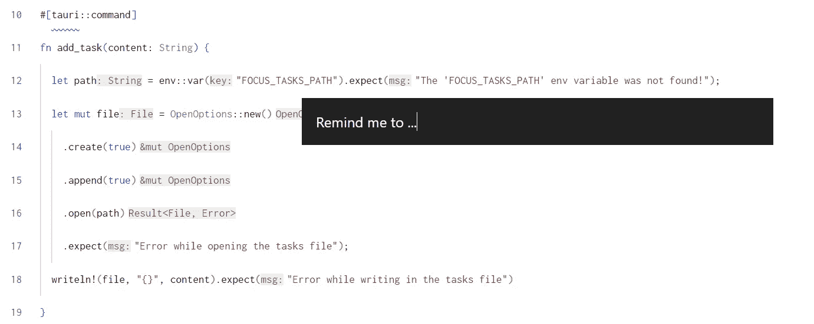
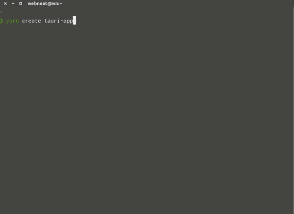
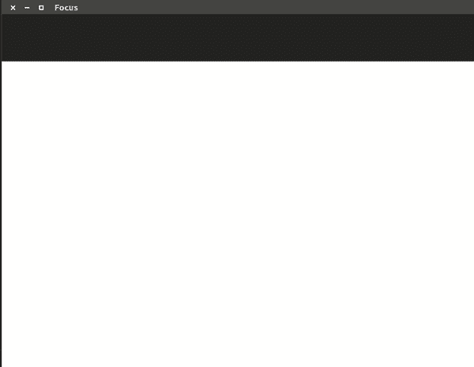
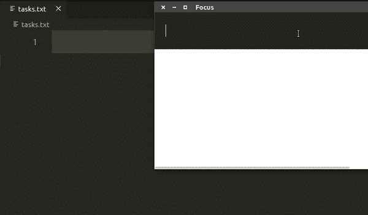
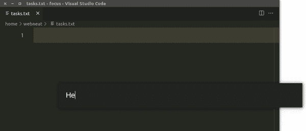

# 我如何使用 React 和 Rust 创建 Focus 应用程序

> 原文：<https://betterprogramming.pub/how-i-created-the-focus-app-using-react-and-rust-fd8fd072d1a7>

## 在本文中，我将描述我创建一个小型桌面应用程序的步骤，以帮助我专注于日常任务。



焦点弹出窗口的预览

# 焦点问题

我的目标之一是创建一个终极的时间管理工具来解决我所有的效率问题，但是现在让我们从一个小问题开始。当我在做一个任务时，我经常会被其他应该完成的任务打断(一个新任务被分配给我，我记得我应该做的一些事情，…)，大多数时候，新任务不是那么紧急，可以等到我完成当前的任务。但这让我分心，有时我发现自己优先考虑它而不是当前的任务，只是为了不忘记它。然后恢复原来的任务变得很困难，因为我失去了注意力。为了解决这个问题，我需要一种方法来快速记录弹出的中断任务，并在完成当前任务之前忘记它们。

# 应用程序的想法

*   我正在做一些事情…一个打断我的想法/任务出现了。
*   我点击了键盘上的自定义快捷键，然后一个文本输入出现在屏幕中央。
*   我键入打断想法/任务的快速描述，按 enter 键，文本输入消失。
*   我正常继续工作。…
*   当我完成时，我打开一个预定义的文件，发现我输入的所有想法/任务都写在里面。

# 设置项目

我在这里试图构建的是一个桌面应用程序，但是我想使用 web 技术(至少对于 UI 来说)。最流行的工具是[电子](https://www.electronjs.org)，但我最近开始学习 Rust 和 [Tauri](https://tauri.studio/) 似乎是一个很好的尝试工具。因此，我将使用它与反应的前端和造型的顺风。

我按照 Tauri 的先决条件页面上的说明在我的系统上安装 Rust 和 Node，然后我运行 T0 来创建这个项目。我将项目命名为`focus`，并为 UI 选择了`create-vite` receipe，并同意安装`@tauri-apps/api`。然后选择了`create-vite`的`react-ts`模板:



创建项目

Tauri 创建了项目并安装了依赖项。让我们来看看文件的结构:

```
src/
  main.tsx  <- entry point of JS/TS
  ... other UI files here
src-tauri/
  icons/           <- icons of different sizes
  src/
    main.rs        <- entry point for the application
  target/          <- the compiled and bundles files
  Cargo.toml       <- like package.json for Rust
  Cargo.lock       <- like yarn.lock
  tauri.conf.json  <- config file for Tauri
index.html         <- entry point of the UI
package.json
yarn.lock
tsconfig.json
vite.config.ts     <- config file for Vite
```

现在运行`yarn tauri dev`应该会启动应用程序。这将需要一些时间，因为 Rust 第一次编译代码，接下来的执行会很快。

设置的最后一步是给项目添加顺风，我是按照官方文件[做的](https://tailwindcss.com/docs/guides/vite)

# 创建用户界面

对于 UI，我需要的只是一个文本输入，我将在其中键入任务，然后按 Enter 保存它。所以我将`App`组件代码改为如下:

```
function App() {
  return <input
    type="text"
    className="w-[800px] h-[80px] bg-[#222] text-2xl text-white px-6"
  />
}
```

请注意，我使用 Tailwind 的[任意值](https://tailwindcss.com/docs/adding-custom-styles#using-arbitrary-values)语法来获得深灰色`800px/80px`输入。

当我在这个输入中键入一些文本，然后点击`Enter`，我希望这些文本被附加到某个文件中。让我们从保存一个状态中的文本并在按下`Enter`时记录它开始:

```
function App() {
  const [content, setContent] = React.useState('')
  return (
    <input
      type="text"
      value={content}
      onChange={e => setContent(e.target.value)}
      onKeyDown={e => e.key === 'Enter' && console.log(content)}
      className="w-[800px] h-[80px] bg-[#222] text-2xl text-white px-6"
    />
  )
}
```



在控制台上显示输入值

# 从前端调用 Rust 函数

下一步是编写一个 Rust 函数，它将接收输入内容并将其附加到一个文件中。在阅读了从前端文档页面调用 Rust 的[后，我将`src-tauri/src/main.rs`改为如下:](https://tauri.studio/v1/guides/features/command/)

警告:我是 Rust 新手，所以我可能在这段代码中做错了很多事情

```
#![cfg_attr(
  all(not(debug_assertions), target_os = "windows"),
  windows_subsystem = "windows"
)]use std::fs::OpenOptions;
use std::io::prelude::*;#[tauri::command]
fn add_task(content: String) {
  let mut file = OpenOptions::new()
    .create(true)
    .append(true)
    .open("../tasks.txt")
    .expect("Error while opening the tasks file");
  writeln!(file, "{}", content).expect("Error while writing in the tasks file");
}fn main() {
  tauri::Builder::default()
    .invoke_handler(tauri::generate_handler![add_task])
    .run(tauri::generate_context!())
    .expect("error while running tauri application");
}
```

然后我修改了`App`组件，以便在按下`Enter`时调用该函数:

```
function App() {
  const [content, setContent] = React.useState('')
  const handleKeyDown = async (e: React.KeyboardEvent) => {
    if (e.key === 'Enter') {
      await invoke('add_task', { content })
    }
  }
  return (
    <input
      type="text"
      value={content}
      onChange={e => setContent(e.target.value)}
      onKeyDown={handleKeyDown}
      className="w-[800px] h-[80px] bg-[#222] text-2xl text-white px-6"
    />
  )
}
```

现在，当输入一些文本并点击`Enter`时，输入的文本被添加到`tasks.txt`文件中。



将键入的文本添加到文件中

# 自定义任务文件路径

注意，这个文件是在项目的根目录下创建的，而 Rust 代码中的路径是`../tasks.txt`，这是因为 app 是在`src-tauri`目录下执行的，所以任何相对路径都是相对于那个目录的。最好使用绝对路径，让用户自己定义。我能想到的定义它的最简单的方法是通过一个环境变量，让我们称它为`FOCUS_TASKS_PATH`。

所以我将这个变量添加到我的`.zshrc`中，然后更新 Rust 代码:

```
// ...
use std::env;#[tauri::command]
fn add_task(content: String) {
  let path = env::var("FOCUS_TASKS_PATH") // read the env var
    .expect("The 'FOCUS_TASKS_PATH' env variable was not found!"); 
  let mut file = OpenOptions::new()
    .create(true)
    .append(true)
    .open(path)                           // <- use it here
    .expect("Error while opening the tasks file");
  writeln!(file, "{}", content).expect("Error while writing in the tasks file")
}
```

# 自定义窗口

最初的想法是有一个弹出窗口，类似于 macOS 上的 Spotlight，但我们现在有一个浏览器窗口！幸运的是，Tauri 允许我们使用`src-tauri/tauri.conf.json`文件来调整窗口。初始窗口配置为:

```
{
  "fullscreen": false,
  "height": 600,
  "resizable": true,
  "title": "Focus",
  "width": 800
}
```

我把它换成了

```
{
  "fullscreen": false,
  "width": 800,         // the width of the input
  "height": 80,         // the height of the input
  "title": "Focus",
  "resizable": false,
  "center": true,         // position it in the center of the screen
  "decorations": false    // remove the title bar
}
```

结果看起来不错:)



弹出窗口的预览

# 添加任务后关闭应用程序

现在我希望当我点击`Enter`时弹出窗口消失，所以让我们在我们的`App`组件中添加一个`process.exit()`(这也可以添加到`add_task` Rust 函数中)。

```
import { process } from '[@tauri](http://twitter.com/tauri)-apps/api'function App() {
  const [content, setContent] = React.useState('')
  const handleKeyDown = async (e: React.KeyboardEvent) => {
    if (e.key === 'Enter') {
      await invoke('add_task', { content })
      process.exit()
    }
  }
  //...
}
```

现在当按下`Enter`时弹出窗口关闭:)

# 编译、安装和使用应用程序

我想我们现在已经准备好了应用程序的 alpha 版本，让我们来构建它

```
yarn tauri build
```

首先，命令失败，并显示以下消息

```
Error You must change the bundle identifier in `tauri.conf.json > tauri > bundle > identifier`. The default value `com.tauri.dev` is not allowed as it must be unique across applications.
```

将标识符设置为`dev.webneat.focus`解决了这个问题。

编译花了一段时间，然后我生成了以下文件(我用的是 Ubuntu):

```
src-tauri/target/release/bundle/
  deb/focus_0.1.0_amd64.deb
  appimage/focus_0.1.0_amd64.AppImage
```

由于 AppImage 更容易使用(不需要安装)，我只是将它移到我的`bin`目录中，并将其命名为`focus`:

```
sudo mv src-tauri/target/release/bundle/appimage/focus_0.1.0_amd64.AppImage /usr/bin/focus
```

现在，在终端上运行命令 focus 将打开弹出:D

在 Ubuntu 上，我可以在键盘设置上设置一个新的自定义快捷键。现在，当我点击任何地方的快捷方式时，弹出窗口就会出现，我输入我想输入的内容，然后点击`Enter`，然后继续我正在做的事情。

看看我在这个项目上工作的下一部分，在那里我通过把它添加到系统托盘来使应用程序打开得更快。

点击此处查看仓库:

[](https://github.com/webNeat/focus) [## GitHub - webNeat/focus

### 此时您不能执行该操作。您已使用另一个标签页或窗口登录。您已在另一个选项卡中注销，或者…

github.com](https://github.com/webNeat/focus)