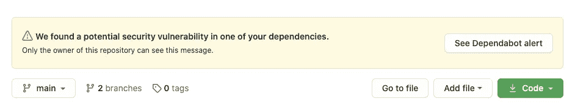
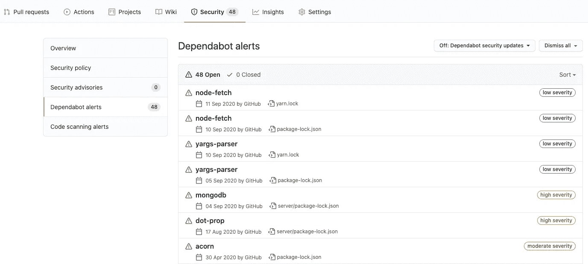
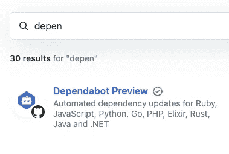
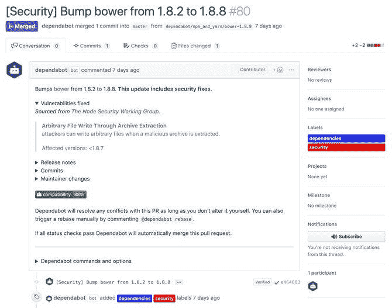
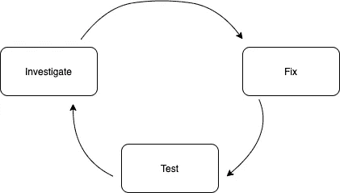
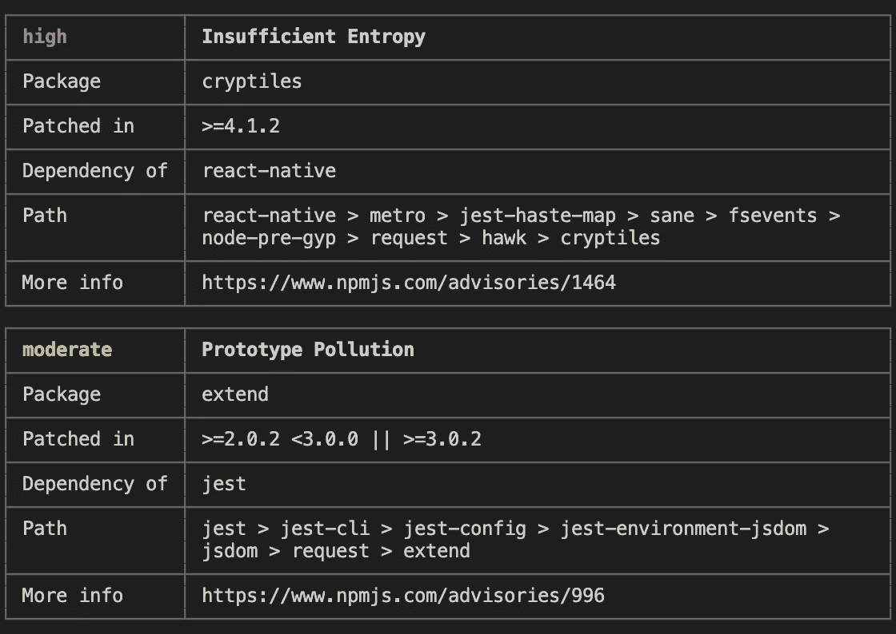
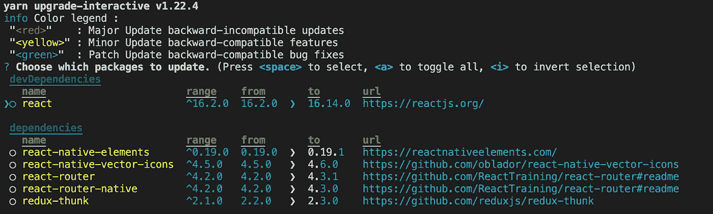
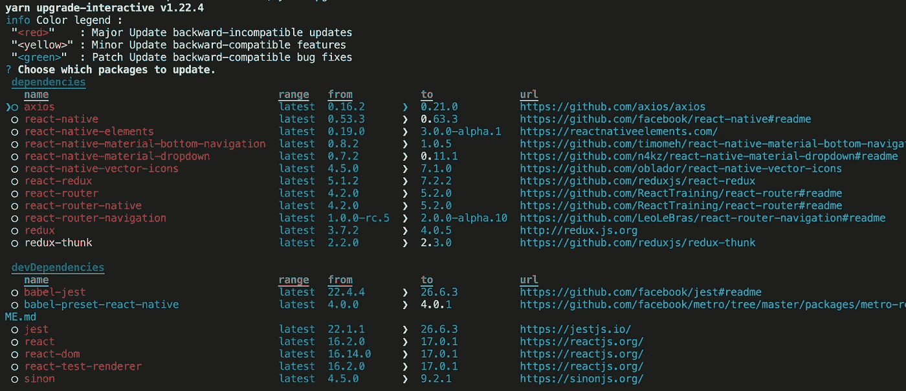
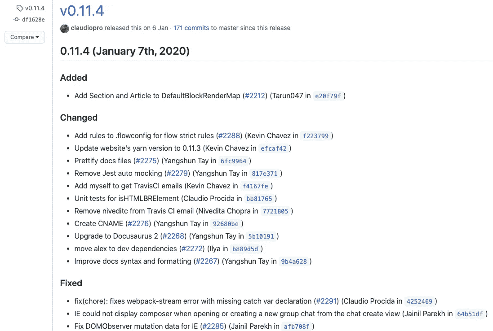

# 我如何处理安全漏洞

> 原文：<https://betterprogramming.pub/how-i-deal-with-security-vulnerabilities-40322ac5c038>

## 依赖救援


安妮·斯普拉特在 [Unsplash](https://unsplash.com?utm_source=medium&utm_medium=referral) 上的照片。

这将是一篇短文，向你展示我是如何处理安全漏洞的。

如果您过去一直在与导致安全漏洞的更新依赖作斗争，或者您只是想看看我的方法，那么这篇文章就是为您准备的。



安全漏洞通知

据我所知，没有人喜欢处理像上面这样的警报。相反，我们想写一些新的特性或用测试覆盖更多的代码，但这项工作仍然要做。

好了，不说了。让我们开始吧。

# **目标**

我们的目标应该是解决所有的安全漏洞，或者至少是那些最严重的安全漏洞。我们可以识别四种严重程度:

*   批评的
*   高的
*   温和的
*   低的



从属机器人警报页面

您可以根据严重程度对它们进行分类。基本上，一个好的方法是偶尔查看一下 Dependabot 警报，以避免出现上图所示的情况(48 个潜在漏洞)。

# 从属机器人

首先，如果你有可能从 GitHub marketplace 添加`Dependabot Preview`，那么就去做吧。完全免费。



从属机器人

“自动处理安全建议”选项对您的情况特别有帮助。为了实现这一点，Dependabot 创建了带有依赖性更新的 pull 请求。



从属机器人创建的拉请求

如果您配置了 dependent bot，您可以转到 pull requests 页面，尝试合并由 dependent bot 创建的 PRs，这通常可以解决安全漏洞问题。

# 工作流程



工作流程方案

# 研究

如果您不能用 dependent bot 解决所有问题，或者您根本没有配置 dependent bot，您可以切换到终端，尝试用`audit`命令列出所有安全漏洞:

```
yarn audit npm audit
```



审计命令输出

`audit`命令的输出包含:

*   严重程度
*   可疑依赖项的名称
*   您应该使用的版本
*   包含该依赖项的包的名称(我称之为*根依赖项*
*   `*.lock`文件中依赖项的路径
*   更多信息

# 固定

## **package.json**

第一种方法是看看我们是否在应用程序中使用了*根依赖*。这听起来很荒谬，但事实是应用程序经常包含一些未使用的剩余包。如果是这种情况，我们可以从`package.json`文件中删除依赖关系，这样就完成了。要删除未使用的依赖项，可以使用以下命令:

```
yarn remove dependency-name npm uninstall dependency-name
```

否则，您可以尝试找出是否有新版本的*根依赖*可用。如果是这样的话，你应该看一下新的包版本，以便根据[语义版本](https://docs.npmjs.com/about-semantic-versioning)知道更新有多严重。

## 升级命令

另一种方法是使用`upgrade`命令:

```
yarn upgrade-interactive
```

npm 本身不支持`upgrade`工具，所以当你使用 npm 时，你需要安装全局依赖 [npm-check](https://www.npmjs.com/package/npm-check) :

```
npm install -g npm-check npm-check -u
```



纱线升级-交互式输出

接口遵循语义版本化(看看上图中的`color legend`)。

使用键盘箭头浏览升级界面，通过按空格键选择要更新的包，然后按 enter 键接受所有更改。

您可以将`--latest`与`yarn upgrade-interactive`选项一起使用，以便显示所有可能的升级，即使它们与`package.json`中的版本不匹配。那些是红色的。



纱线升级-互动-最新输出

# 试验

对于每种更新类型，我测试一切是否都正常的方法是不同的。

*   补丁:试运行。
*   辅修:测试运行，运行一个应用程序，点击左右。
*   Major:测试运行，运行一个应用程序，点击左右，进入 changelog，阅读新版本中增加了什么以及改变了什么。然后，您可以导航到某个特定的变更并阅读更多相关信息。



变更日志示例

# 结束语

您应该重复这个调查-修复-测试的循环，直到您修复了所有的安全漏洞——或者至少是主要的安全漏洞。

这是我更新安全漏洞的工作流程。请分享您的想法，看看它是否也适合您，或者您是否发现了一些改进的空间。

> 推特: [k_wdowik](https://twitter.com/home?lang=pl)