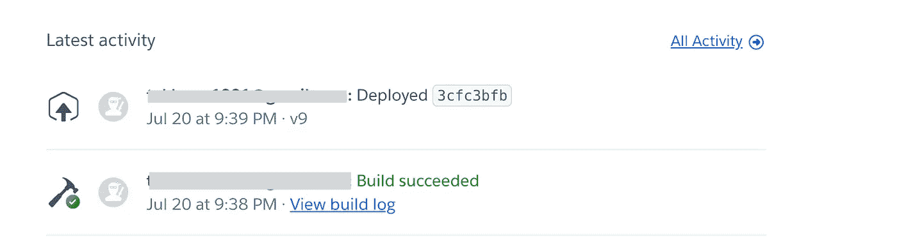
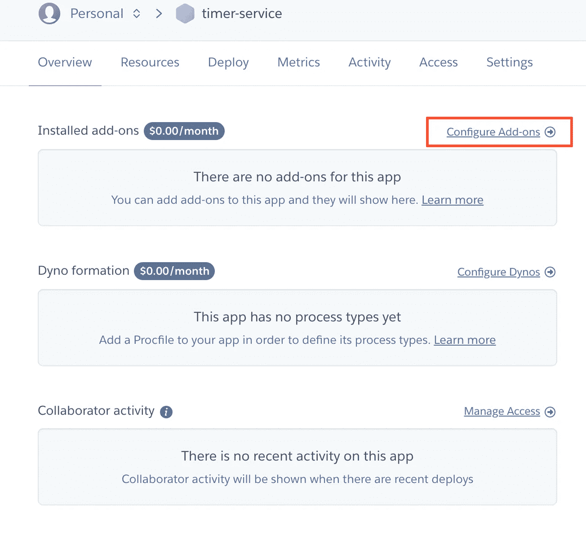
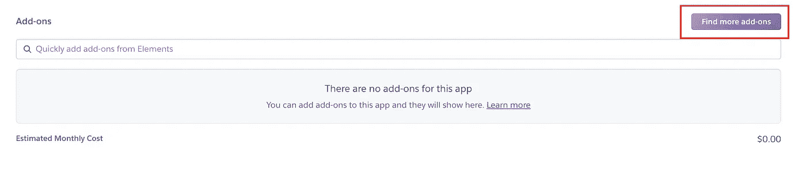
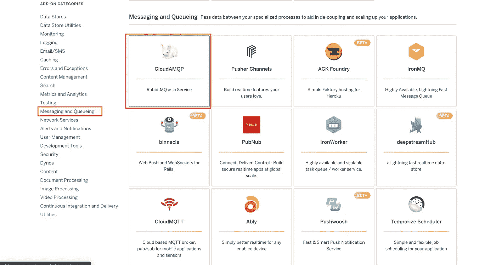
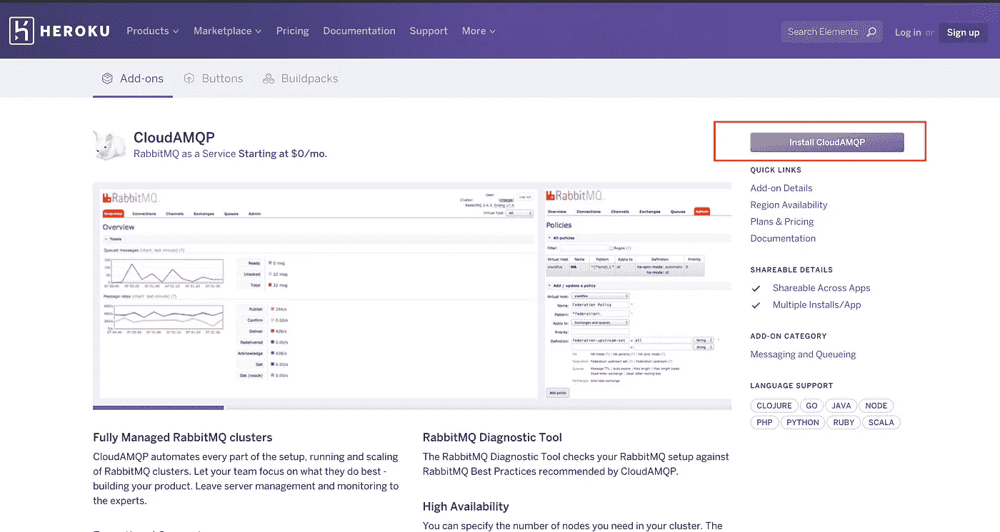
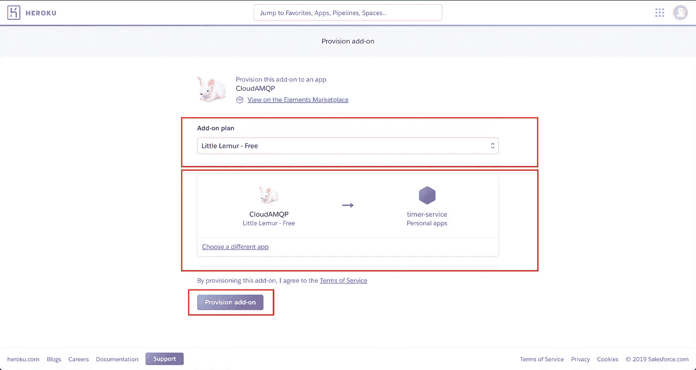
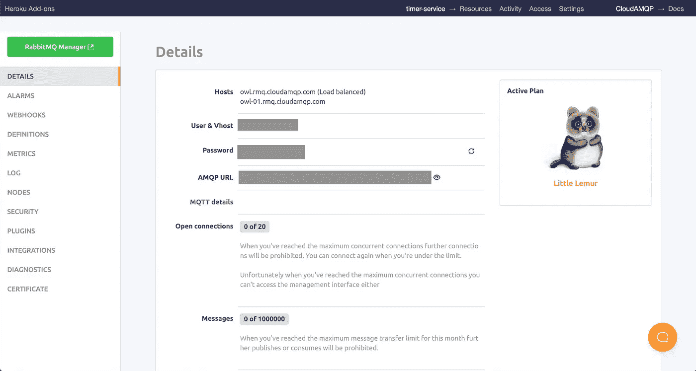
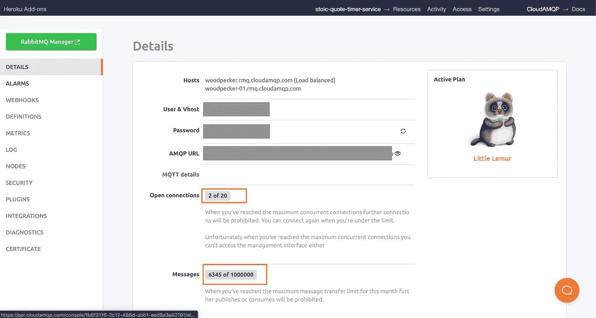

# 我如何使用 RabbitMQ 将微服务部署到 Heroku

> 原文：<https://betterprogramming.pub/how-i-deploy-microservice-to-heroku-with-rabbitmq-876499c797cc>

## 微服务部署的详细步骤


照片由 [Unsplash](https://unsplash.com?utm_source=medium&utm_medium=referral) 上的[émile Perron](https://unsplash.com/@emilep?utm_source=medium&utm_medium=referral)拍摄

我写了一篇关于我如何使用 RabbitMQ 构建微服务的[文章](https://medium.com/better-programming/a-step-by-step-guide-to-building-event-driven-microservices-with-rabbitmq-deeb85b3031c)。这是那篇文章的第二部分。

# 背景

在上一篇文章中，我构建了一个微服务项目，从互联网上搜集激励性的引语。现在，我正在探索如何免费部署这个项目。

经过一些研究，我发现有很多免费资源。我决定从 Heroku 开始，因为它似乎很适合我的项目。

*   自由层
*   免费 CloudAmqp 服务(RabbitMQ 即服务)

# 亲自动手

本实践部分包括几个部分:

*   在 Heroku 建立项目
*   RabbitMQ 在 Heroku 成立
*   将 RabbitMQ 集成到您的项目中
*   我遇到的问题

## 在 Heroku 建立项目

1.  在 Mac 上设置 Heroku。

```
brew tap heroku/brew && brew install heroku
```

2.在 Heroku 仪表板中创建一个应用程序。


创建应用仪表板页面

3.登录 Heroku。插入您的凭证，您应该可以登录。

```
heroku login
heroku: Press any key to open up the browser to login or q to exit:
```

4.我已经准备好了我的节点项目。因此，我只需要将我现有的项目添加到 Heroku Remote。以下是所需的步骤。

如果您还没有将代码提交到 git 中，您可能需要执行以下命令。

```
// Add all your existing file 
git add .// Commit all your changed file
git commit -am "Added feature ???"// Push to Heroku Master
git push heroku master
```

如果你已经提交了你所有的代码，你只需要把它推到 Heroku 源，主分支。

```
// Push to Heroku Master
git push heroku master
```

只要你推送到 Heroku master 分支，Heroku 会帮你搭建和运行节点项目。您将在仪表板上看到您的构建日志，它将显示构建是成功了*还是失败了*，随后显示它是否成功地*部署了*。**

**

*最新活动的屏幕截图*

## *RabbitMQ 在 Heroku 成立*

*现在，让我们在 Heroku 上启动 RabbitMQ 服务。*

1.  *去你的 Heroku 仪表板。*
2.  *选择一个您部署的微服务。对我来说，我选择了我构建的 TimerService。*
3.  *您将看到一个类似下面截图中的仪表板。我将提供几个截图来指导您如何设置 RabbitMQ 附加组件。我相信截图比我的文字更能说明如何做到这一点。*

**

*TimerService Heroku 仪表板的屏幕截图*

**

*选择查找更多加载项*

**

*您将看到一个加载项列表。寻找*消息和队列。你也会看到 CloudAMQP。**

**

*点击安装 AMQP*

*点击安装后，您将看到 RabbitMQ 可用的不同类型的计划。选择要托管 CloudAMQP 的应用程序。最后，单击*供应插件，*显示为，如下图所示。*

**

*现在你有一个工作的 RabbitMQ 服务。*

**

## *将 Heroku RabbitMQ 与项目集成*

*现在我们有一个部署到 Heroku 的工作项目和一个工作 RabbitMQ 服务。我们缺少的是整合。我们必须将我们的项目配置为*发布*消息，而*监听来自已定义的 RabbitMQ 服务的*消息。*

*整合很容易。我们只需要更新`process.env.CLOUDAMQP_URL`，如上面的要点所示。*

*为了获得 RabbitMQ 的 URL，您只需在 Heroku 应用仪表板上点击 CloudAMQP 附加组件。下面是您点击 CloudAMQP 附加组件后将看到的屏幕截图。*

**

*你会看到 AMQP 的网址*

*只需复制 AMQP 网址并粘贴到`.env` 文件中。然后，将它重新部署到 Heroku 上的应用程序中，它就可以工作了。*

*下面是我的 RabbitMQ 管理器在我的微服务连接到它时的截图。*

**

*微服务之间有两个连接和 6345 条消息*

## *我遇到的问题*

*在整个部署学习过程中，我遇到了两个问题。*

*   *您必须在`package.json`中声明您的启动脚本。为了开始你的项目，你需要做`node server.js`。然后你必须在你的`package.json`脚本中声明它。这是因为 Heroku 将通过执行`npm start`命令来启动您的项目。*
*   *第二个问题是如果我有 10 个微服务，是不是每个节点 app 都要声明 10 个 RabbitMQ 插件？这不知何故违背了目的，对不对？事实证明不是的。我只是尝试在所有节点项目中使用相同的 RabbitMQ 服务——事实证明它是可以共享的。RabbitMQ 服务只需要附加一个应用程序。然后，只要 URL 正确，就可以在所有微服务之间共享。*

*如果你遇到了和我一样的问题，我希望这能帮助你。如果你遇到其他问题，你可以谷歌一下或者寻求帮助。*

# *结论*

*简而言之，在你知道如何使用它之后，我觉得它很容易部署到 Heroku。当您不必管理服务器设置和工具安装时，这种感觉棒极了。*

## *参考*

*   *[云 AMQP 附加指南](https://devcenter.heroku.com/articles/cloudamqp#use-with-node-js)*

*感谢阅读并享受发展。*