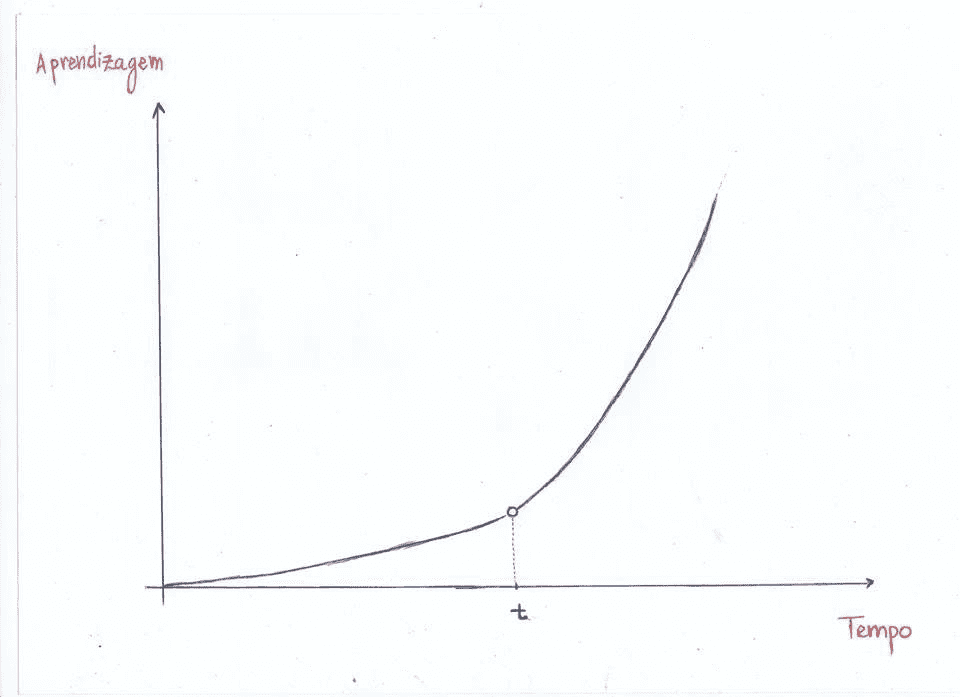
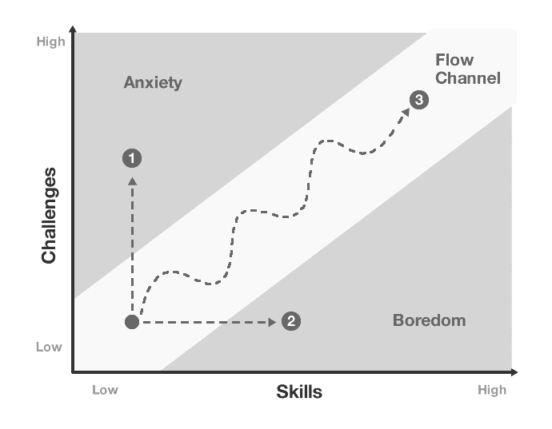

# 我如何设计我的学习经历

> 原文：<https://betterprogramming.pub/how-i-design-my-learning-experience-10b8d7861938>

本帖首发于 [**我的网站**](https://www.iamtk.co/designing-my-learning-experience) **。**

2017 年，我发布了关于 [**我的学习之旅**](https://medium.com/the-renaissance-developer/how-i-hack-my-education-354fb5b8a025) ，我谈了很多关于激情、意愿和执念。我总是觉得我有太多的事情要做。要学的东西太多了。同时这种感觉让我焦虑，它让我觉得为下一次挑战做好了准备。真是百感交集。

从 2017 年开始，我学到了很多，也分享了一些知识(在[媒体](https://medium.com/@leandrotk_/)和我的[博客](http://leandrotk.github.io/tk))。我想保持这种尝试新事物的心态，尝试新技术，学习不同的范例。但我想改善整个过程，让这成为更好的体验，更有意识。

当我了解我自己以及我的身体和大脑是如何工作的时候，我会根据这些来设计我的学习过程。所以一些问题开始浮现在我脑海中:

*   最好的学习方法是什么？
*   我如何衡量它？
*   我如何改善我的学习体验？
*   如何设计我的生活，让它“富有成效”？

好了，我们这里有很多工作要做。让我们来回答这些问题，看看最终的产品。

# 最好的学习方法是什么？

简单的回答是:我不知道。

我认为我们没有适合地球上每个人的正确答案。但是如果我专门为自己设计学习体验，我觉得我还是有机会的。

为了了解什么有效，什么不那么有效，我需要尝试不同的方法作为实验:播客，文章，视频，课程，大学，做项目，书籍等。我们有很多资源和学习方法。

*   **播客**:我在通勤、跑步、玩视频游戏的时候用它来分散注意力。我喜欢听关于技术的讨论和技术经验。我试图把它作为一种学习工具，但我总是分心。所以现在举个例子，如果我想学 React 钩子，我不会听播客来学钩子。我更喜欢阅读文档(这很好！).但如果我想了解不同的团队/公司规模如何反应，播客可能是一个很好的选择。
*   **文章**:我喜欢通过阅读文章来学习。我倾向于收集一堆关于一个主题的不同文章，并阅读所有文章，以深入了解不同的观点。当我学习带有承诺的 JavaScript 并发模型时，我得到了大约 10 篇不同的文章来深入研究这个主题。对我学习过程中的间隔重复也有好处。例如，如果我想学习 JavaScript Promises，我首先阅读前 3 到 4 篇文章，并做一些实验(也称为练习、代码！).在接下来的几天/几周，我阅读其他文章，以获得其他观点或只是记住这个概念。
*   **视频&课程**:当我开始学习编码时，视频是我学习过程中的一大部分。作为一个视觉型的人，我喜欢通过看代码来理解概念。这也很好，因为我看了很多教程。但如今，我不太看视频，我倾向于将科技视频作为娱乐+教育的内容来看，如[fun fun fun 功能](https://www.youtube.com/channel/UCO1cgjhGzsSYb1rsB4bFe4Q)和[霍马科技](https://www.youtube.com/channel/UCV0qA-eDDICsRR9rPcnG7tw)。具体到课程上，我更倾向于喜欢像 Udacity 这种混合理论(概念)和实践(编码)的教育平台。
*   **大学**:所以我们跳过这部分吧……开玩笑！嗯（表示踌躇等）...我对大学有点怀疑。我尝试过，但我意识到这种“学习方式”并不适合我。我不适合它。一个班 30 个人被动听一个教授讲 40 分钟。我喜欢活跃，我喜欢质疑，我喜欢做实验和练习。对我没用。也许这对你有用..谁知道呢？
*   项目:我喜欢做基于项目的学习。我最近做了很多这样的事情。我在学习函数式编程的时候，尝试过很多不同的项目( [PomoLambda](https://github.com/leandrotk/pomo-lambda) 、 [Luhn](https://github.com/leandrotk/luhn) 、[年进度条](https://github.com/leandrotk/year-progress-bar))。当我学习 React Hooks 时，我做了一些实验，通过构建一个迷你口袋妖怪“游戏”[来理解这些概念。我在学习带承诺的 JavaScript 并发模型的时候，](https://github.com/leandrotk/pokehooks-labs)[也尝试过不同的东西](https://github.com/leandrotk/promising)。当我想解决我与 CSS 的斗争时，我创建了 [UI 挑战项目](https://github.com/leandrotk/ui-challenges)。我想你明白了。
*   书籍:书籍是我学习过程中很重要的一部分。但是我读得很慢。喜欢做笔记，整理思路，了解细节。我知道我对很多不同的东西都太好奇了，所以对我的挑战是保持下去，保持一致，完成这些书。考虑到这一点，我正在尝试一些不同的东西:同时阅读 3 本书。一本传记或者关于自我发展的东西([精通](https://www.goodreads.com/book/show/13589182-mastery))。一个技术问题( [SICP:计算机程序的结构和解释](https://www.goodreads.com/book/show/43713.Structure_and_Interpretation_of_Computer_Programs))。还有一个职业目标([高效工程师](https://www.goodreads.com/book/show/25238425-the-effective-engineer))。这就是我的工作方式。*(ツ)*/

所以我们有大量的资源和学习方法。基本上我的心态就像一个实验室。做实验，尝试新事物。但是了解什么对我有用。问自己怎么学最好？哪些资源是我真正从事并获得最大收益的？请记住，它没有任何规则。其实，**你制定规则**。你了解你自己，你了解资源，并决定用最好的学习方法继续下去。

现在我把我的时间分成三个主要资源:文章、项目和书籍。

我有自己的时间坚持看书，就像我告诉你我同时看三本不同主题的书的实验一样。现在还不是每天，但我的目标是每天有时间阅读它，并使它更加一致。

当我想深入一个主题，理解理论和概念时，我偶尔会读一些文章。我喜欢做一个文章的链接列表(或者一个优先队列),并按主题进行组织，以便以后学习。

项目是我花费大部分时间的资源。这是我练习的方式。我得到我所学的概念并使之成为现实的方式。我做实验的方式。我思考这些概念的方式。今天我心情很好，可以尝试不同的项目。但是我想更多地探索它，组织我的时间去做更多的事情。

# 我如何衡量它？

这是一个有趣的话题，但我不知道我们是否真的可以测量学习过程。当我想“评估”我是否真的在学习时，我有两件事要考虑:基于项目的学习和现实生活中的项目。

## 基于项目的学习

正如我在资源主题中提到的，项目是使学习变得实用的简单方法。有时我称之为“迷你项目”，因为我只想做一个概念验证(PoC)或一个小实验，让学到的理论变得真实和实用。所以我不会花很多时间去做一个具体的项目或者改进它。我创建项目，做实验，当我对结果感到满意时，我会继续下一步我想学的东西。作为一名软件工程师，编码部分总是很有趣，但为了尽早进入项目并开始实验，我为自己创建了一个框架:

*   想想我可以应用我所学概念的项目
*   创建新的 Github 资源库
*   选择一种编程语言(有时我正在学习一种编程语言的特定特性。有时我只想应用概念，PL 只是这个实验的一个工具)
*   编码时间
*   分享以获得反馈

我喜欢这个框架，因为我可以快速启动项目，然后我可以专注于实验和反馈周期。

## 现实生活项目

这类似于基于项目的学习(PBL)，但 PBL 是一个快速的小项目，只是为了实验。现实生活中的项目会更长，可能更大(软件开发中更大的代码库)。一些用来“衡量”学习的问题:

*   我能把学到的概念应用到生产中吗？
*   学到的概念是否有助于我做出更好的(技术)决策？
*   我能在代码评审中提出学到的概念，或者帮助这个项目中的其他人吗？

一个例子是我需要使用 node 在无服务器环境中实现身份验证和授权的项目。当我学习承诺时，我想使用`async/await`语法来实现。我对我所学的很有信心，并且希望看到结果。将代码交付生产后，我意识到了自己的成就。当你努力学习并能在现实生活中应用这些时，这种感觉很好。不仅仅是一种好的感觉，而是一种“衡量”我正在学习它、理解它的方式。

# 我如何改善我的学习体验？

学习可能很难。有时候“无聊”。但是我们可以让它更吸引人，更“有趣”。我告诉你我用来提高学习体验的三种方法。我喜欢这三种方式，因为它让我对我正在学习的主题有了可见性和深度:**心流、** **分享知识**&**身边的聪明人。**

## **流程图**

**几年前，我写了一篇描述学习过程转折点的内容:开始时，学习一个新东西可能很难，但保持一致，直到一个时间`t`，你会意识到你会比以前学得更快。这个时候`t`对每个人都是特别的。**

****

**但这是非常简单的。因此，我一直在寻找一个更好的框架来理解这一点，但它也让我了解如何改进我的学习，并使我能够采取行动。**

**这个图表是我从[流](https://www.amazon.com/Flow-Psychology-Experience-Perennial-Classics/dp/0061339202)这本书上找到的。它讲述了如何通过管理你在焦虑和无聊之间的状态来保持心流。基本上:**

*   **低挑战+高技能=无聊**
*   **高挑战+低技能=焦虑**
*   **低挑战+低技能=流量**
*   **高挑战+高技能=流量**

****

**所以现在我可以停下来反思我的学习经历:**

*   **我无聊吗？也许我需要寻找更有挑战性的项目。**
*   **我焦虑吗？也许我需要学习一些东西来完成这个挑战。**
*   **我在心流中吗？这种感觉很好。保持下去。**

**我喜欢这个想法，因为它提供了更多的可见性来了解我学习过程中的痛点，并对我所拥有的问题和机会进行反思和采取行动，以改善整个学习体验。我也喜欢它，因为它很简单，没有那么复杂。也不需要如此。**

# **分享知识**

**对我来说，分享知识是一种让我对正在学习的主题有深度的方式。当我分享知识时，我强迫自己深入了解我正在学习的主题的每一个可能的细节，以最好的方式进行教学。现在我通常做两件事:文章和技术讲座**

**我喜欢写关于我正在学习的东西或经历的详细文章，比如当[我正在学习函数式编程](https://medium.com/free-code-camp/functional-programming-principles-in-javascript-1b8fc6c3563f)，当[我正在学习数据结构并爱上了树数据结构](https://medium.com/free-code-camp/all-you-need-to-know-about-tree-data-structures-bceacb85490c)，以及[我的第一门编程语言:Python](https://medium.com/free-code-camp/learning-python-from-zero-to-hero-120ea540b567) ！**

**科技讲座是我学习新事物的最后一步。我通常:**

*   **通过阅读大量文章来学习**
*   **通过做一些实验和项目来学习**
*   **通过写文章学习**
*   **通过做技术讲座来学习**

**这个“框架”正是我在学习函数式编程时所做的事情。我确实读了很多文章(并在这篇[中添加了函数式编程的学习途径](https://github.com/leandrotk/functional-programming-learning-path) Github repo)。做了一些[实验和项目](https://github.com/leandrotk?tab=repositories)。我确实写了一篇[文章](https://medium.com/free-code-camp/functional-programming-principles-in-javascript-1b8fc6c3563f)。我做了一个科技演讲。**

# **周围的聪明人**

**我喜欢在生活中总是设计更好的体验的想法。我知道我大部分时间都在工作，如果有可能，我会选择最好的选择。我喜欢根据三点来选择公司或工作/团队:**

*   ****公司/团队文化**:在一个支持/帮助我成长的团队中工作，一个给我质疑和辩论自由的团队，一个拥有终身学习者的团队，一个拥有优秀专业人士和令人敬畏的人的团队。**
*   ****学习/挑战**:我很喜欢解决有趣的问题。这不仅有趣，还帮助我成长，尝试不同的解决方案，激励我不断学习。**
*   ****目的**:从内心来看，我真的热爱我工作中的技术部分。我喜欢挑战和相关的学习。这激励了我很多。这听起来很老套，但我对创造新东西、新产品充满热情，这些东西对人们的生活有很好的影响**

**有了这三件事，我可以选择很多我工作过的好地方。这些地方和人们极大地促进了发展。**

**但是在公司学习是一种方法。你也可以成为社区的一员。有时我会去聚会，或者活跃在 slack 或 telegram 上的小组中，学习和讨论我感兴趣的或我想学的东西。**

# **关于生产力**

**我想充分利用一天的时间来学习和提高，所以我尝试了不同的事情。这就是我所知道的要高质量地完成事情。**

## **活力**

*   **生产力是指我投入到任务中的精力。努力考虑质量，而不仅仅是你一天结束时完成的事情的数量。**
*   **努力做到身心健康。健康饮食。做练习。好好睡觉。减压。**

## **任务规划和优先排序**

*   **意识到你不会在一天之内完成一千件事情。**
*   **优先级是如此重要。设计你的任务来完成最重要和最有影响力的事情。**
*   **计划把事情做好。做一些与你真正需要做的事情无关的事情是很容易的。计划你的一天，或者你想做的事情是一种富有成效的方式，而不是整天拖延。**

## **专注和分心**

*   **设计一个专注于你的任务的环境:买一个好的耳机，远离人多嘈杂的地方，关掉手机。**

# **包扎**

**所以在这里，我尝试不同的事情，在生活中做实验，并反思以了解什么对我有用。这很重要，因为它对我有效，但对你可能无效。做实验，尝试不同的学习方式，保持日复一日提高的心态，一种终生的心态。**

**最后想说的是:这是我学习经历的一个正在进行中的设计。我想继续改进这一点，因为我在尝试新的方法。我的学习经历的设计还在继续。**

# **一些资源**

*   **[了解流程](https://alifeofproductivity.com/how-to-experience-flow-magical-chart/)**
*   **[对心流的深刻理解](https://medium.com/swlh/flow-a-productive-antidote-to-anxiety-and-boredom-1b015be966b)**
*   **[我如何破解我的教育](https://medium.com/the-renaissance-developer/how-i-hack-my-education-354fb5b8a025)**
*   **[精通书](https://www.amazon.com/gp/product/0670024961/)**
*   **[我的 Github 库](https://github.com/leandrotk)**
*   **[纳撒尼尔在 Youtube 上开辟了自我发展频道](https://www.youtube.com/channel/UCrdWRLq10OHuy7HmSckV3Vg/videos?view=0&sort=p&flow=grid)**
*   **[马特·达维拉 Youtube 频道](https://www.youtube.com/channel/UCJ24N4O0bP7LGLBDvye7oCA)**

> **我希望你喜欢这些内容。支持我在高保真方面的工作**

**我的[Twitter](https://twitter.com/LeandroTk_)T6[Github](https://github.com/LeandroTk)。☺**