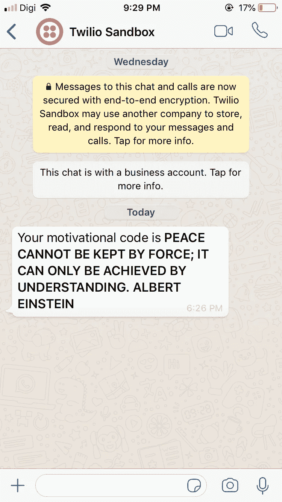
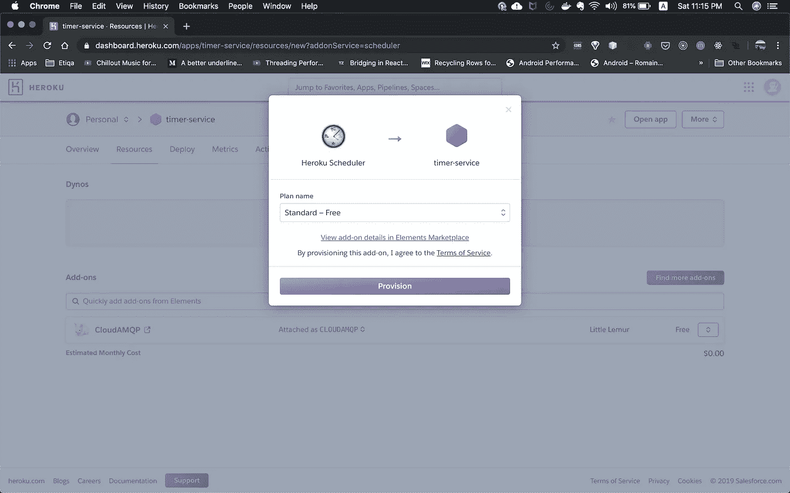

# 我每天早上是如何用励志名言来激励自己的

> 原文：<https://betterprogramming.pub/how-i-develop-api-and-automate-sending-a-quote-of-the-day-via-whatsapp-583eef089f6e>

## 受 Kartik [Nighania](https://medium.com/@kkstrack?source=post_page-----5d203c3b36c1----------------------) 的启发[将 20 行 Python 代码交给 Whatsapp 他的父母](https://medium.com/better-programming/i-wrote-a-script-to-whatsapp-my-parents-every-morning-in-just-20-lines-of-python-code-5d203c3b36c1)


照片由[达尔潘多迪亚](https://unsplash.com/@darpandodiya?utm_source=medium&utm_medium=referral)在 [Unsplash](https://unsplash.com?utm_source=medium&utm_medium=referral) 上拍摄

# 1.0 简介

在我之前的文章中，我构建了一个微服务项目，从互联网上搜集报价。本文是该项目的延续。以下是与微服务项目相关的文章列表。声明:它们是会员故事。

1.  [使用 RabbitMQ 构建事件驱动的微服务的分步指南](https://medium.com/better-programming/a-step-by-step-guide-to-building-event-driven-microservices-with-rabbitmq-deeb85b3031c)(微服务，后端相关)
2.  [我如何用 RabbitMQ 将微服务部署到 Heroku](https://medium.com/better-programming/how-i-deploy-microservice-to-heroku-with-rabbitmq-876499c797cc)(部署，Heroku)
3.  [我如何使用服务器发送的事件开发实时 Web 应用](https://medium.com/better-programming/how-i-developed-a-real-time-web-app-using-server-sent-events-488cc280c2e1)(实时)

尽管这些文章是关于同一个项目的，但是每一篇都讨论了编程和软件工程中的不同领域。所以这次就来说说 WhatsApp 的整合吧。

# 2.0 项目背景

这篇名为[我每天早上用 20 行 Python 代码给 WhatsApp 我的父母写了一个脚本](https://medium.com/better-programming/i-wrote-a-script-to-whatsapp-my-parents-every-morning-in-just-20-lines-of-python-code-5d203c3b36c1)的文章启发我做了这个增强，那就是每天早上 8 点用一句激励性的话给 WhatsApp 我自己。这是我们在这篇文章中想要达到的最终目标。

此外，作为这个项目的开发人员和用户，我不会每天都去我的网站查看激励性报价，这将是一个麻烦。为了有一个更好的 UX，传达报价的经验应该是无缝的。

在这种情况下，使用短信、电子邮件甚至 WhatsApp 将是一个不错的选择。

# 3.0 解决方案设计

为了实现上面提到的特性，让我们做一些计划和思考练习来成功地达到目标。在我们开始后端编码之前，有几个先决条件/设置我们必须做。

## 3.1 设置

*   注册一个 Twilio 沙盒帐户。
*   将我的电话号码注册到 Twilio Sandbox，这样我就可以接收来自 Twilio 的 WhatsApp 消息。

## 3.2 后端

*   创建一个 Heroku 调度程序(cron job)来调度每天早上 8 点触发`SendQuoteToSubscriber`函数调用。
*   创建一个 API 端点，它将把搜集到的报价广播给订阅者。当这个 API 被调用时，它将执行以下任务。
    -从网上获取报价。
    - WhatsApp 对订阅者的报价。
*   创建一个名为`twilioService.js`的服务组件。该组件负责 Twilio 的所有相关功能。你要么希望它发送短信，WhatsApp 消息等。

这是我们必须开发的任务的分解列表。在下一个实现部分，我们将讨论后端编码。对于与 Twilio 安装相关的指南，我在 1.0 项目背景中提到的文章很好地讨论了安装指南。

# 4.0 实施

让我们从创建`twilioService`组件开始。

## 4.1 Twilio 服务

该服务组件必须实现这一目标。

*   通知 Twilio 向报价订阅者发送 WhatsApp 消息。

twilioService.js 要点

根据要点，我们有两个功能。他们是`initClient`和`sendWhatsappMessage`。

*   `initClient`。这是为了创建一个与 Twilio 的客户端连接，以便请求其他操作。我们正在使用 [Twilio 节点助手库](https://github.com/twilio/twilio-node)来使事情变得更加简单和方便。此外，我们还需要`accountSid`和`authToken`，你应该可以通过你的 [Twilio 控制台](https://www.twilio.com/console/)取回。
*   `sendWhatsappMessage`。该函数接收一个包含`mobileNo`和`quote`的对象。然后，我们利用助手库的`client.messages.create`函数通知 Twilio 发送 WhatsApp 消息。但是，你必须告诉 Twilio 你想从哪里发送，发送给谁，内容是什么。这就是我们将`from`、`to`和`body`传入函数的地方。

## 4.2 创建 WhatsApp 报价 API 端点

现在我们有了一个可以发送 WhatsApp 消息的工作平台`twilioService`。下一个任务是决定我们什么时候应该执行这个函数？现在，我们创建一个 API 端点来完成这项工作。这样，我们的 Heroku 调度程序就可以简单地对 WhatsApp 报价的端点执行 HTTP 调用。

`server.js`创建基本的 express 应用程序和一个 POST `/whatsappQuote`端点。每当调用这个 API 端点时，它都会执行`sendQuoteViaWhatsapp`函数。现在，让我们看看我们在这个函数中要做什么。

`sendQuoteViaWhatsapp`详解:

1.  首先，它需要一个带有`mobileNo`键的 JSON 主体。
2.  然后，我们将通过`scrapQuoteOfTheDay`功能从网上抓取报价。
3.  当我们得到报价时，我们执行之前编写的`sendWhatMessage`函数，将 WhatsApp 发送到我们的手机。
4.  现在，如果你试图启动 API，你会在 WhatsApp 上收到报价信息。参考下面的截图，看看我收到了什么报价。



WhatsApp 接收报价截图

## 4.3 创建一个 Heroku 调度程序(cron 作业)

由于我的微服务项目部署在 Heroku 上，我正在探索 Heroku 实现我想要的而不是另一个平台的可能性。请随意使用您喜欢或熟悉的任何平台。

创建 Heroku 调度程序比你想象的要容易。以下是指南:

1.  转到您的 Heroku 应用仪表板。在附加输入字段中搜索 *Heroku Scheduler* 。


2.选择 *Heroku Scheduler* 并设置。



3.现在你有一个工作的 Heroku 调度程序。那么我们需要自动化什么呢？我们只需每隔 24 小时在早上 8 点自动调用 WhatsApp Quote API。我们只需对我们的 API 端点执行一个`curl`命令即可。


下面是 curl 命令的例子。如果使用的话，你可以在 [Postman](https://www.getpostman.com/) 中轻松生成`curl`命令，如果你对`curl`命令不是很熟悉的话，这可以省去你很多麻烦。

```
curl -X POST \
  [http://127.0.0.1:8083/whatsappQuote](http://127.0.0.1:8083/whatsappQuote) \
  -H 'Accept: */*' \
  -H 'Accept-Encoding: gzip, deflate' \
  -H 'Cache-Control: no-cache' \
  -H 'Connection: keep-alive' \
  -H 'Content-Length: 34' \
  -H 'Content-Type: application/json' \
  -H 'Host: 127.0.0.1:8083' \
  -H 'Postman-Token: f7be2ed4-da7f-4b31-9ead-a78820272fc9,91d8c930-6e69-42fc-8eaf-913b695aa386' \
  -H 'User-Agent: PostmanRuntime/7.15.2' \
  -H 'cache-control: no-cache' \
  -d '{
    "mobileNo": "YOUR_MOBILE_NO_REGISTERED_IN_TWILIO_SANDBOX"
}'
```

4.现在只需保存工作，并期待明天的激励报价发送到您的 WhatsApp。我希望这一天的报价给你的生活带来价值。

# 结论

Twilio 集成非常简单，我相信您可以很快开发出来。然而，使用 Twilio 沙盒有几个缺点:

*   您只能在 Twilio Sandbox 中使用预定义的模板消息。
*   Twilio Sandbox 的试用积分有限，这意味着一旦积分用完，你可能最终无法使用 Twilio WhatsApp。然而，如果你愿意支付，这将是一个非常好的解决方案。

最后，我将分享开发这个项目时想到的一些想法:

*   **API 认证和授权。**目前，API 对公众开放，这是相当冒险的。
*   **电子邮件集成。**虽然发送 WhatsApp 信息很棒，但很多人不会轻易透露自己的手机号码。因此，电子邮件集成似乎是一个更有前途的解决方案，可以吸引更多的用户。

自从我开始这个项目以来，还有很多东西需要探索。快乐发展，感谢您的阅读。