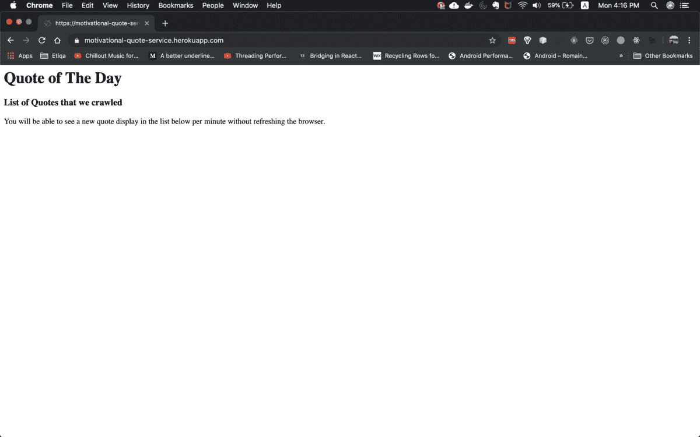

# 我如何使用服务器发送的事件开发实时 Web 应用程序

> 原文：<https://betterprogramming.pub/how-i-developed-a-real-time-web-app-using-server-sent-events-488cc280c2e1>

## 开发实时 Web 应用程序比你想象的要简单

由[维里·伊万诺娃](https://unsplash.com/@veri_ivanova?utm_source=medium&utm_medium=referral)在 [Unsplash](https://unsplash.com?utm_source=medium&utm_medium=referral) 拍摄的照片

在我之前的文章中，我构建了一个微服务项目，从互联网上搜集报价。本文是该项目的延续。以下是与微服务项目相关的文章列表。声明:它们是会员故事。

1.  [使用 RabbitMQ 构建事件驱动的微服务的分步指南](https://medium.com/better-programming/a-step-by-step-guide-to-building-event-driven-microservices-with-rabbitmq-deeb85b3031c)(微服务，后端相关)
2.  [我如何用 RabbitMQ 将微服务部署到 Heroku](https://medium.com/better-programming/how-i-deploy-microservice-to-heroku-with-rabbitmq-876499c797cc)(部署，Heroku)

尽管这些文章是关于同一个项目的，但是每篇文章都讨论了编程和软件工程中的不同领域。所以这次让我们来谈谈实时网络应用。

# 项目背景

在我之前的[文章](https://medium.com/better-programming/a-step-by-step-guide-to-building-event-driven-microservices-with-rabbitmq-deeb85b3031c)中，刮下来的励志语录被保存到了一个`.json`文件中。因此，这种设计会遇到两个问题:

*   我们无法在浏览器上进行实时更新，这意味着用户必须每隔几分钟刷新浏览器才能看到新的报价。这使得用户体验非常差。
*   由于读取文件、处理文件数据、向文件写入最新报价以及保存文件，我们使用了额外的处理能力。

# 解决方案设计

所以，为了解决上面提到的问题，我需要实现几个关键的东西:

## 前端

*   当用户打开报价页面时，与后端服务器建立事件流连接。
*   实现一个新报价事件监听器，以便浏览器可以在抓取新报价时更新新报价。

## 后端

*   创建返回报价相关事件的报价事件端点。
*   向所有连接的事件流请求发送新的抓取的引用。

# 履行

我将逐一处理前面的解决方案设计部分中列出的项目。完整代码也可以在 Github，**实现-SSE**分支获得。先从*前端*说起。

## 前端

之前，我们在报价 UI 页面中使用了 PugJS 模板。起初，我想知道如何在模板中添加 JS 代码。但是我在做研究的时候发现了一些好消息。通过`script.`我了解到模板实际上支持 JS 代码

Pug HTML 模板

基本上，对要点的评论相当清楚。我们为我们的后端服务器创建一个事件源，例如`[http://localhost:8083/quoteEvent](http://localhost:8083/quoteEvent)`。然后，我们监听`newQuote`事件，并通过将新报价添加到列表中来更新 UI 中的新报价。

我们还做了一些优化，即当连接关闭时，我们停止监听事件流。我们这样做是为了避免内存泄漏。

我们已经完成了前端需要完成的工作。只要有新的报价被抓取，前端就会得到通知，UI 也会更新。让我们移动到*后端*部分。

## 后端

让我们从最简单的开始。

## 为`quoteEvent`创建一个端点

## 向所有连接事件流请求发送新的废弃报价

这是我们必须开发的最后一个项目，以完成实时显示刮削报价的端到端流程。让我们看看代码。

在上述要点的第 40 行，`setQuoteEvent`函数建立了事件流连接。然后，我们写入所需的头并将`Response`对象保存到`quoteEventRes`数组中。

我们在数组中推送响应对象的原因是为了支持多个订阅客户端。这是为了确保我们以后可以将事件推送到所有连接的客户端。

在第 33 行，您将看到当报价被成功抓取时，我们将执行函数`sendEventToBrowser`。在这里，我们通知所有订阅客户新的抓取报价，并将数据推送给他们。

在第 61 行，我们还将删除已经关闭连接的客户端，以避免浪费资源(处理能力)。

# 结论

简而言之，开发一个实时 Web 应用程序实际上比我预期的要简单。在我做研究之前，我不知道服务器发送事件(SSE)技术。这项技术实际上使我能够更快地完成开发。

我做的每一个改进/编码都激发了我的想象力和创造力。当我编写这段代码时，我想到了几个想法。

*   是时候做一些样式来改善用户界面和用户体验了(HTML，CSS)。
*   我应该更深入地研究服务器发送的事件。这个 API 是怎么开发的？

# 现场演示

这个演示对你们来说可能有点不方便。但这是我部署到 Heroku 的实时应用程序。请遵循以下步骤。

1.  点击[链接](https://stoic-quote-timer-service.herokuapp.com/)启动定时服务
2.  打开[报价](https://motivational-quote-service.herokuapp.com/)页面。请稍等片刻，然后会看到您的第一个报价。

报价页面的屏幕截图

# 参考

*   [Auth0 使用 SSE 开发实时 Web 应用](https://auth0.com/blog/developing-real-time-web-applications-with-server-sent-events/#Building-a-Real-Time-App-with-Server-Sent-Events)
*   [PugJS HTML 模板](https://itnext.io/pug-js-to-make-your-life-easier-with-html-templates-9c62273626e0)
*   [一看服务器事件](https://medium.com/conectric-networks/a-look-at-server-sent-events-54a77f8d6ff7)