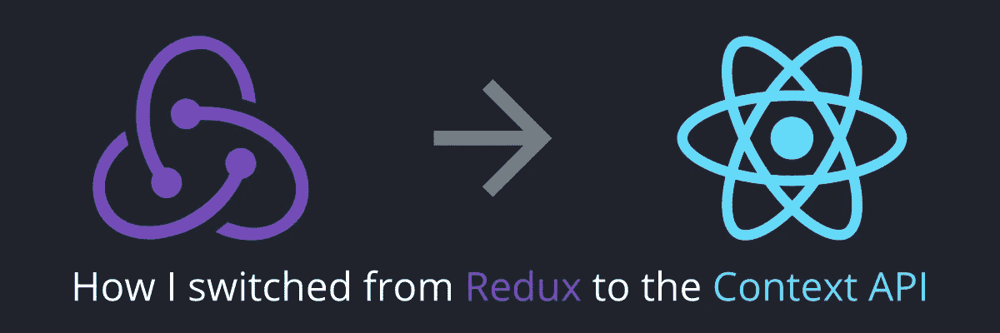

# 我如何为上下文 API 放弃 Redux

> 原文：<https://betterprogramming.pub/how-i-dropped-redux-for-the-context-api-7338d481e179>

## 我如何用上下文 API 替换 Redux 的个人故事

React 16 引入了一个新的上下文 API 来取代被弃用的那个。好了，距离 16.3 版本发布已经一年多了，但在 React 生态系统中似乎还很新鲜。

这个新的 API 有望解决以前使用上下文的实验性方法的许多问题。对我来说，它做得更多；它改变了我制作 React 应用程序的方式。这是我如何管理它的故事。

我不会给出 Redux 如何工作的课程。如果你想复习，你可以看看丹·阿布拉莫夫在 Egghead 上的精彩课程。另外，你最终会把 Redux 从你的应用中移除，所以我们需要一个完整的课程吗？

理解代码有几个要求:我会用 [React 钩子](https://en.reactjs.org/docs/hooks-intro.html)和 [React 片段](https://en.reactjs.org/docs/fragments.html)的简称`<>`。

好吧，假设我们有一个应用程序可以告诉我是否有空去喝杯啤酒。它包括以下内容:

如何在 React with Redux 中拥有啤酒身份？

在我的示例代码中，我创建了四个文件来处理 Redux 应用程序的各个部分:

*   `actions/beer.js`:包含我的应用程序中每个动作的常量的文件。这可以直接内联到其他文件中，但是我喜欢保持事情清晰，关注点分开。
*   `dispatchers/beer.js`:我的 Redux 模型的每个动作的家。在这种情况下，我只有一个`toogleBeerAvailability`方法，它从上一个文件调度动作。
*   `reducers/beer.js`:我的 Redux 模型的存储引擎，如果调用`TOGGLE_AVAILABILITY_FOR_BEER`调度程序，它会改变我的可用性值。
*   `components/beer.jsx`:显示和切换我的可用性的组件。我们使用`react-redux`将 redux 属性映射到我的组件 props。

这有很多代码，但是对于一个具有 Redux 的健壮系统来说是必要的。现在，我们将删除 Redux，结果相同。但首先，我们为什么要放弃 Redux？

我这样做只是为了通过删除两个依赖项来减轻应用程序的重量:`redux`和`react-redux`。我也不喜欢我的应用程序中有多个依赖项，所以我很乐意删除其中的两个。

这就是它的工作原理。请记住，它可能不是一个完美的解决方案，甚至不是一个推荐的解决方案，但它是我在项目和工作中使用的解决方案。但是让我们停止聊天，开始研究代码。

我正在处理一个我称为 *Provider* 的状态文件。它包含了处理状态的一切。在第一个示例中，它只是我从一个状态钩子接收的一个 getter 和一个 setter。

如何通过上下文 API 获得啤酒状态

这看起来更简单、更有效，但仍有一些问题需要改进:

*   getters 和 setters 在同一个对象中，有点乱。
*   `toggleAvailability`方法在 children 组件中被管理，这是不起作用的。
*   由于状态改变，我们可能会遇到性能问题。

对于第一个，我喜欢将对象分成两个子对象，`actions`和`values`，就像 Redux 中的 dispatchers 和 states。最终看起来是这样的:

如何通过上下文 API 和一点结构获得啤酒状态

对于第二个，我们只需要将调用移动到父组件中，并将操作添加到新的 actions 部分中。这将使我们的`Beer`组件简单很多。

如何使 beer 状态与上下文 API、结构和一致性保持一致

至于性能，我们的组件仍然有两个问题:

*   每次更新`Provider`组件时，都会重新评估`toggleAvailability`方法
*   每次`Provider`组件发生变化时，包含状态的值对象也会更新。

幸运的是，React 提供了两个钩子来处理我们的数据缓存。

我们将首先在`useCallback`钩子中封装`toggleAvailability`方法。它将确保当第二个参数中的数据没有改变时，返回的方法总是相同的。这将是可能的，因为 React 的`useState`钩子保证它的 set 方法将是相同的，尽管渲染。

然后我们将使用`useMemo`钩子来封装`value`对象。这个钩子几乎和`useCallback`一样，只是针对物体。它还将获得第二个参数来显示它所依赖的数据。

就这些了，伙计们！我们的应用程序中不再有 Redux，并有一个干净的上下文用法。希望你试试上下文 API！

我 React 项目的新方法。照片归功于我。

# **参考文献**

 [## 钩子 API 参考-反应

### 钩子是 React 16.8 中的新增功能。它们允许您使用状态和其他 React 特性，而无需编写类。这个…

en.reactjs.org](https://en.reactjs.org/docs/hooks-reference.html)  [## 如何有效使用 React 上下文

### 在使用 React 的应用程序状态管理中，我谈到了如何混合使用本地状态和 React 上下文来帮助您…

kentcdodds.com](https://kentcdodds.com/blog/how-to-use-react-context-effectively)