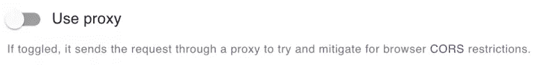
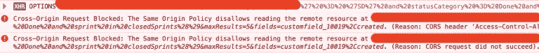
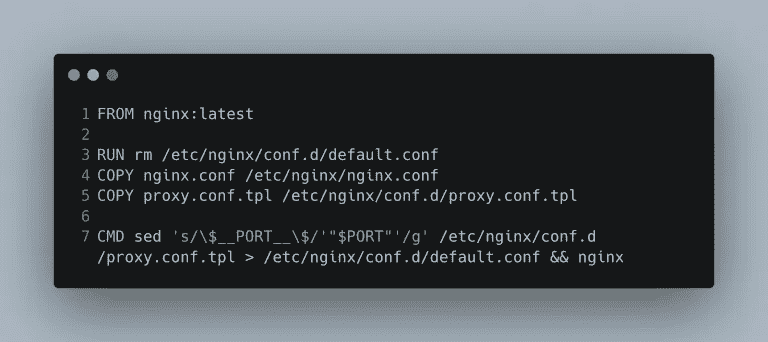
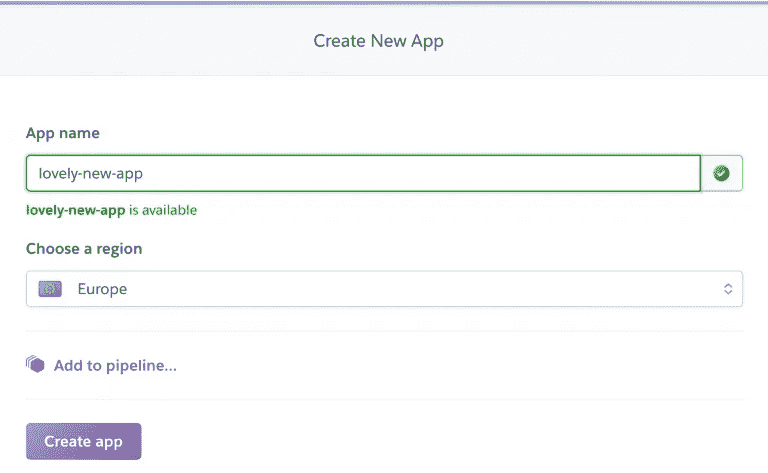
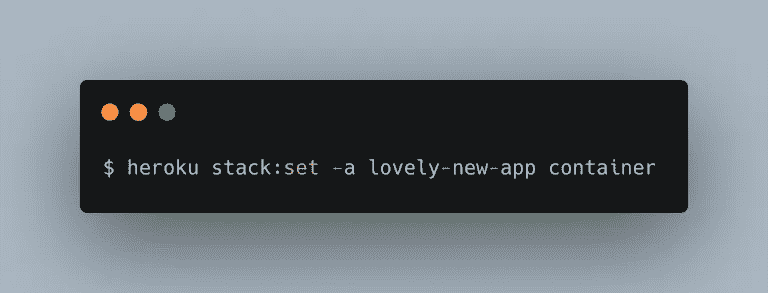
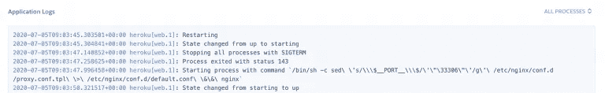
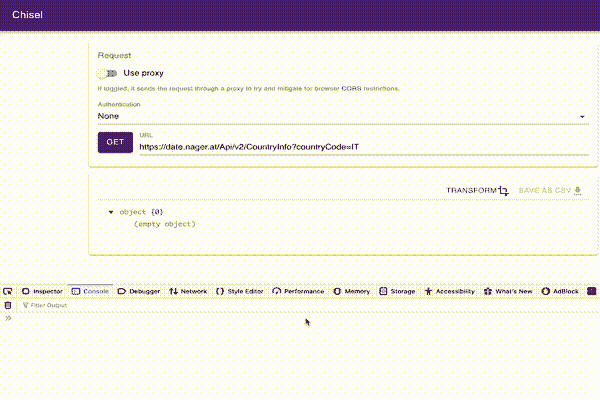

# 我如何在我的单页应用程序上为任何 API 启用 CORS

> 原文：<https://betterprogramming.pub/how-i-enabled-cors-for-any-api-on-my-single-page-app-c51700dc7c29>

## 你也可以


jose aljovin 在 [Unsplash](https://unsplash.com/?utm_source=unsplash&utm_medium=referral&utm_content=creditCopyText) 上的照片

在本文中，我将向您展示我如何使用任何人都可以获得的免费服务为我的应用程序构建一个小代理服务器，以克服我的单页应用程序的某些 CORS 限制。

我构建了[凿子](https://chisel.cloud)来帮助我在工作中做一些重复的 API 响应组合和操作。

这是一个单页应用程序，允许您针对任何 API 端点执行请求，并组合结果以仅提取您需要的内容。[它还允许 CSV 导出。非常简单。](https://alediaferia.com/2020/05/08/how-used-chisel-pull-gitlab-pipelines-stats/)

由于它仍处于早期阶段，我决定用最简单的架构来构建它，以便能够快速迭代。我选择了 JAMstack，在 React 中构建它，并部署在 Netlify 上。

因为它没有与之对话的后端服务器，所以你做的任何事情都留在你的机器上。不幸的是，并不是所有的 API 都支持跨源请求，所以在某些情况下，除非启用代理功能，否则您将无法从浏览器执行任何请求。



如果你不这样做，你的浏览器将会尝试一个 CORS 预检请求，如果 API 没有用预期的标题响应，那么这个请求将会失败。



# 什么是 CORS，什么时候它会成为你的单页应用的问题？

来自 [MDN 文档](https://developer.mozilla.org/en-US/docs/Web/HTTP/CORS):

> **“跨来源资源共享** ( [CORS](https://developer.mozilla.org/en-US/docs/Glossary/CORS) )是一种机制，它使用额外的 [HTTP](https://developer.mozilla.org/en-US/docs/Glossary/HTTP) 头来告诉浏览器，让运行在一个[来源](https://developer.mozilla.org/en-US/docs/Glossary/origin)的 web 应用程序访问来自不同来源的选定资源。当 web 应用程序请求来源(域、协议或端口)与其自身不同的资源时，它会执行跨来源 HTTP 请求。

现在有一些被称为*简单请求*的请求不会触发 CORS 检查。不幸的是，这些类型的请求非常有限，不允许您传递某些头，比如`Authorization`头(例如，一个 basic-auth 请求)。你可以在这里阅读更多关于这类请求的信息[。](https://developer.mozilla.org/en-US/docs/Web/HTTP/CORS#Simple_requests)

出于这个原因，我们将允许一组好的 HTTP 方法和头通过我们的代理，并尽可能不加改变地返回响应。

大部分工作将是配置正确的一组`Access-Control-Allow-*`标题，当 CORS 预检执行时，这些标题将返回给浏览器。我建议你看一下 [MDN 文档](https://developer.mozilla.org/en-US/docs/Web/HTTP/CORS)来了解更多关于 CORS 的信息，因为它非常全面。

# 设置 NGINX

代理本身是 NGINX 的一个简单实例，配置了一个服务器，允许对动态目的地的代理请求。

为了能够在 Heroku 上运行 NGINX，我们必须做一些修改，以非特权用户的身份运行它。

我们基本上确保 NGINX 将尝试写入非特权可写位置:这是因为 Heroku 强制我们的容器作为非根运行。你可以在这里阅读更多相关信息[。](https://devcenter.heroku.com/articles/container-registry-and-runtime)

# 考虑任何 URL

这种配置的第二个方面实际上是定义我们的动态代理:我们将把请求转换成任何 URL，这样它们将公开正确的 CORS 信息。

Chisel 案例的主要复杂性在于我们希望允许任何 URL 被代理。当然，这是因为我们不会提前知道用户将输入什么样的 URL。

NGINX 允许设置代理功能的方式是通过指令:

> "设置代理服务器的协议和地址以及位置应该映射到的可选 URI。作为协议，可以指定`http`或`https`
> 
> — NGINX 文档

为了能够指定要动态传递的 URL，我决定使用一个自定义头:`X-Chisel-Proxied-Url`。这样，我们将使用这个头来告诉代理要代理到哪个目的地。

```
proxy_pass $http_x_chisel_proxied_url;
```

NGINX 中的`$`符号用于引用变量，HTTP 头使用上面的语法自动转换成以`$http_`为前缀的[变量](https://nginx.org/en/docs/http/ngx_http_core_module.html#var_http_)。

在这个 NGINX 服务器配置中有相当多的事情要经历。让我们先从`location /`区块开始。

第一部分是`if`语句:它处理 [CORS 预触发请求](https://developer.mozilla.org/en-US/docs/Web/HTTP/CORS#Preflighted_requests)的情况，默认情况下它基本上允许一堆 HTTP 方法和头。它将一切都限制在`https://chisel.cloud`源，只是因为我不希望我的代理被其他应用程序使用。

*   `proxy_redirect off`:我暂时禁用了重定向。我仍然不确定我将如何处理它们，所以我决定把它们关掉，直到我能为它们找到一个用例。
*   `proxy_set_header Host $proxy_host`:这只是将目的主机作为`Host`报头转发。这是通过浏览器的有效 HTTP 请求的一个要求。该值将与为`proxy_pass`设置的值完全相同。
*   `proxy_set_header X-Real-IP $remote_addr`:在这里，我们只是负责将客户端 IP 转发到目的地
*   `proxy_pass $http_x_chisel_proxied_url`:这是整个配置真正重要的一点。我们从 Chisel 客户端应用程序获取头部，并将其设置为 URL。这有效地使动态代理成为可能。
*   `proxy_hide_header 'access-control-allow-origin'`:这和下面的`add_header 'access-control-allow-origin' 'https://chisel.cloud'`一起，基本上是确保用一个只允许来自 Chisel 应用程序的请求的头覆盖从目的服务器返回的任何`Access-Control-Allow-Origin`头。

最后，最上面的两条指令:

*   `resolver`:这是必需的，这样 NGINX 就知道如何解析上游服务器的名称，以便进行代理。就我而言，我选择了一个公共的免费 DNS。你可以从[这里](https://public-dns.info/)挑选你的。
*   相反，这条指令使得在 Heroku 上使用 Docker 成为可能。我们将在这篇文章的后面看到它，所以请继续阅读！

# 构建容器映像

如上所述，我准备用 NGINX 的[基图](https://hub.docker.com/_/nginx)。



`[Dockerfile](https://github.com/chiselcloud/proxy/blob/master/Dockerfile)`非常简单。我们将默认的`nginx.conf`替换为我们自己的，以确保 NGINX 可以无特权运行。我们还复制了我们的代理服务器配置。

如您所见，我将该文件命名为`proxy.conf.tpl`。我这样做是为了明确这个文件还不能按原样使用。在启动 NGINX 之前，我们必须动态地编辑它将在运行时监听的端口。

正如在[文档](https://devcenter.heroku.com/articles/container-registry-and-runtime#dockerfile-commands-and-runtime)中所阐明的，Heroku 期望容器能够监听`$PORT`环境变量中指定的值。我们在这里使用的解决方案是确保用`$PORT`环境变量的实际内容替换我在配置中包含的`$__PORT__$`占位符。

# 建立 Heroku

我们快到了。现在我们需要配置我们的应用程序，这样我们就可以直接从我们的存储库部署我们的容器。

在 Heroku 上创建一个[新的可爱的应用程序](https://dashboard.heroku.com/new-app),这样我们就可以让它和容器一起工作了。



接下来，让我们配置应用程序来处理容器图像。我还没有找到通过仪表板来实现它的方法，所以让我们继续使用命令行。



现在将一个简单的`heroku.yml`文件添加到您的存储库中，这样 Heroku 就知道如何构建映像。

```
build: 
  docker:
    web: Dockerfile
```

就这么简单。

现在，在应用程序仪表板的 Deploy 选项卡中，确保将您的存储库连接到应用程序:这样您将能够自动部署。


你的代理终于准备好了。一旦开始部署，您将能够在应用程序日志中看到它的启动，如下所示。



正如您所看到的，这个进程是使用我们通过`CMD`指令指定的命令启动的，Heroku 正在注入`PORT`值。

代理启动后，您现在可以通过代理转发您的请求。如上所述，您需要使用定制的`X-Chisel-Proxied-Url`头(或者您决定为您的代理配置的任何头)来指定用户想要访问的原始 URL。

正如您从下面的动画 GIF 中看到的，代理功能允许您在点击[管理器时克服 CORS 限制。日期](https://date.nager.at/) API 自凿。



# 结论

我们刚刚构建了一个重用开源技术的代理服务器。这允许我们将单页应用程序与克服 CORS 限制所需的服务器逻辑分开。

一般来说，CORS 是您的浏览器采用的安全措施之一，以减少劫持您的网站来执行意外活动的机会。即使我们刚刚检查了绕过这个限制的机会，也要再三考虑它是否适合您的用例。

我希望您喜欢这个构建您自己的免费代理服务器的快速演练。