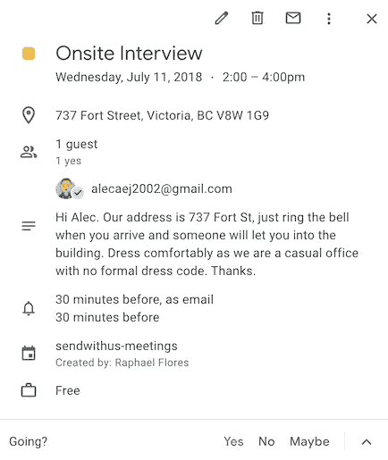
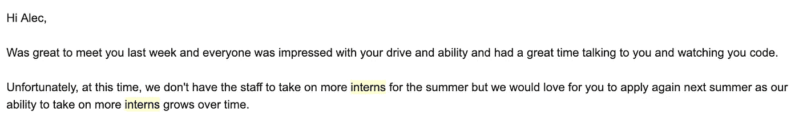
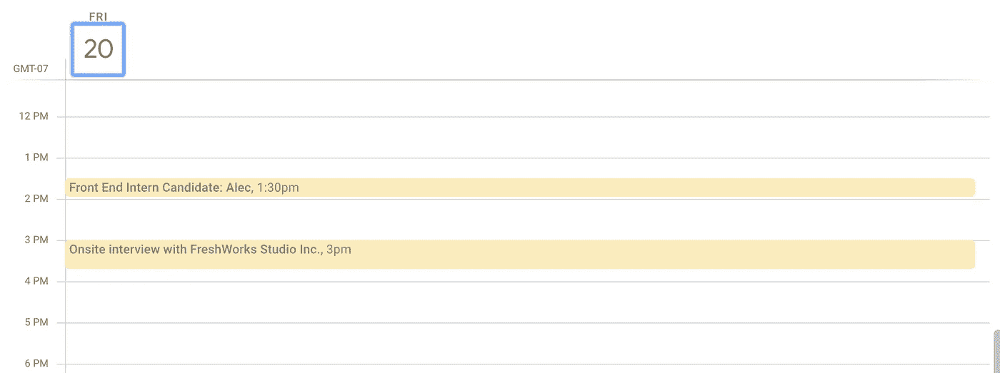

# 我是如何在 17 岁时找到我的第一份全职开发工作的

> 原文：<https://betterprogramming.pub/how-i-finally-got-my-first-full-time-development-job-at-17-72d2f190a439>

## 在参加了六次面试(其中三次是为了一个假职位)、学习 Golang 和参加黑客马拉松比赛后，我找到了一份全职开发工作

杰佛森·桑多斯在 [Unsplash](https://unsplash.com/search/photos/developers?utm_source=unsplash&utm_medium=referral&utm_content=creditCopyText) 上拍摄的照片

# 背景

我将告诉你我如何最终得到我的第一份全职网络开发工作的故事。

但是花了很长时间才来到这里，一年多的寻找。我做了六次面试，写了无数封电子邮件，学习了一门新的编程语言，参加了一场黑客马拉松比赛，还完成了一个小的实习，才获得了一个全职职位。

# 最初的搜索

我住在不列颠哥伦比亚省的维多利亚。这是一个大约有 40 万人口的小城市。我们有一个小的技术部门，但它在市中心有相当多的创业公司。

我决定去一家较大的公司 Sendwithus (Dyspatch)寻求成为一名暑期实习生的机会。他们似乎对有一个暑期实习生的前景感到兴奋——他们提到他们有一些 SaaS 的产品，他们想把它们整合在一起。

一家科技公司表现出的热情让我激动不已。他们说想让我去面试。当我收到日历邀请时，我有点震惊。

长达两个小时的采访！我不知道他们想做什么——坐下来告诉人们为什么他们应该雇用你，两个小时是很长的时间。我听说过谷歌和苹果等公司的全天面试，但这只是一次小规模的实习。

尽管如此，我还是很兴奋。当面试的那一天到来时，我穿上了我最漂亮的休闲装。我明白了在面试中，办公室里的人如何穿着是很重要的，这样他们可以看到你更适合。

因为这是我的第一次面试，所以有点困难。但是我回答了招聘经理的每一个问题，比如我最大的优点，最大的缺点，我的领导能力——这些都是普通的问题。

技术面试部分来了。这是一次白板/结对编程面试。我解决问题的能力得到了很好的展示，但我的编码技能却没有。神经——哦，好吧。

出去的时候和大家握手，我满怀希望。我等了大概五天，没有回音。我伸出手问他们是否已经找到了其他人或者已经做出了决定。

我得到的回应是，“哦，实际上，我们今天要开一个关于你的会议。”好吧……有趣的是这是如何实现的。

第二天我收到了一封邮件，

我没有被打动。他们安排了一次面试，我经历了。然后，他们仍然让我伸出手去寻找结果，当他们应该已经知道他们没有工作人员为我加油！

我对此无能为力；我不得不继续前进，试着找份工作。

我几乎没有时间了，因为当我发现 Sendwithus 不能雇用我时，已经是 7 月中旬了。

经验教训:永远不要把所有的鸡蛋放在一个篮子里。

# 扔一堆飞镖

那天晚上，我给所有我能找到的看起来有趣的科技公司发了十几封电子邮件。希望有人会伸出援手，我耐心地坐着等待。

当我找不到工作的时候，我爸爸联系了他以前的同事/朋友。他曾在那里担任他们的营销主管——他很成功。Flow 的首席执行官说，他确信他们会给我一个职位，让我来做一些开发工作。

最终，我收到了一封来自 Flow 的邮件，邀请我和他聊聊。另外，我从我投的飞镖之一得到了回应:Freshworks Studio。我的搜索结果是一个接一个的面试，一个在 Flow，一个在 Freshworks。

合理的说，流会进行的并不顺利。

地点从未指定，所以我去了他们的办公室，因为毕竟这是一家总部设在维多利亚的公司。和我谈话的那个人目前在西雅图。

当我给他发邮件时，我正在办公室，我们终于意识到发生了什么。他说我应该去最近的星巴克，那就是我们进行“采访”的地方

寒暄过后，他说了下面的话:

> “我们真的没有适合你的工作。所以……是的……但是我们应该找个时间一起喝杯咖啡。”

你可能会想，如果他们没有给我一份工作，他就不会让我去面试了。

谢天谢地，那天下午我还有一个面试。那是在维多利亚市中心的咨询机构 Freshworks Studio。

面试感觉一点都不像面试。我们刚聊过。我们讨论了我知道的和我不知道的东西——我的优势和劣势在哪里。很放松。

我的采访结束后，已经是下午 3 点 45 分了，事情渐渐结束了。我闲逛了一会儿，又和那里的人聊了一个小时。感觉我已经在那里工作了。

果然，一周后，他们给了我一个小职位，为期一个月。我欣然接受了。

在那一个月里，我学到了很多东西:最佳开发实践、敏捷方法，并且我对 PHP 更加熟悉了。

最好的部分是人。我认识了很多聪明有趣的人，和他们聊天，一起出去玩。那很有趣。

九月来了，我必须回到学校，从 11 年级开始。

我发誓要在第二年夏天找到一份全职的开发工作。我不想做兼职，也不想在公司做自己的小项目。我想加入一个团队，开发产品。

我必须成为更好的候选人。

# 成为更好的求职者

我想成为开发工作的更好的候选人，这样我就能得到一份全职工作。

我知道我已经是一个更好的候选人，因为我有工作经验，但我想做得更多。

我决定学一门新的编程语言，Go。

围棋是一种我从未学过的语言。它是静态类型的，不像 PHP 和 Ruby 那样是面向对象的。

但我想学习它，因为维多利亚的一些公司使用它，我知道这将是一个很好的挑战。

我决定用黑客马拉松来测试我的围棋技能。我之前申请的 Sendwithus 公司举办了维多利亚最大的黑客马拉松。

黑客马拉松被称为 Battlesnake，它是一项测试，测试谁能为经典街机游戏 snake 的修改版本编写最佳算法。

我名次没排好，但绝对学会了怎么在 Go 里写程序。

# 第二次求职

今年五月，我决定再次联系 Sendwithus，看看他们是否有兴趣做暑期实习生。

我解释说我去年夏天找到了一份工作，我是如何学习 Go(他们主要的后台语言)的，以及我是如何成长为一名开发人员的。

我得到了回复，

> “好的。如果我们今年夏天需要实习生，我们会把你列入名单。”

我一直在找。有一天，我在浏览 Twitter 时，看到一条招聘实习生的推文。

想要一些实习生的公司是 Zeit。他们是一个超级酷的无服务器平台。

他们正在开发一些奇妙的开源产品，我对在那里工作的想法感到兴奋。

我立即发了一封电子邮件，希望能够与他们交谈。吉列尔莫和我谈了一会儿，但什么也没有发生。

那是六月，我开始担心今年夏天去哪里工作。

# 重要的是你认识谁

就在这个时候，我父亲主动联系了他的一个朋友艾登，他可以看看镇上是否有人在找实习生。

大约一周后，艾登在 check front 帮我联系上了技术副总裁克里斯。

我听说过 Checkfront 他们是维多利亚较大的科技公司之一，大约有 70 名员工。

克里斯和我谈了谈，我去和他面谈，谈论在那里实习的可能性。我们喝了杯咖啡，聊了聊我能为 Checkfront 做些什么。

进行得很顺利，他把我介绍给了 Checkfront 平台团队的负责人戴夫。我们去喝咖啡了。进行得很顺利，然后我只能等待。

接近 6 月底的时候，他们给了我一个职位，让我在两周内开始全职工作。

我再激动不过了。一份全职的开发工作是我努力了很长时间的事情；我很兴奋终于有一个了。

我开始在平台团队工作。我开发了一个大的新功能，修复了后端的错误，重构了遗留代码，开发了前端。我什么都可以做！

在某个地方有个“熟人”肯定有帮助。安，我明白了，仅仅因为一个公司不登广告招聘并不意味着他们不需要你的帮助。

# 回到高中时代

不幸的是，我必须在九月份回去完成高中学业。我非常喜欢在 Checkfront 工作的经历。

作为一名开发者，我每天都在成长。我可以学到很酷的东西，每天和有趣的人在一起。我只能等到明年夏天了。

我想在 Github 实习！

非常感谢你的阅读。