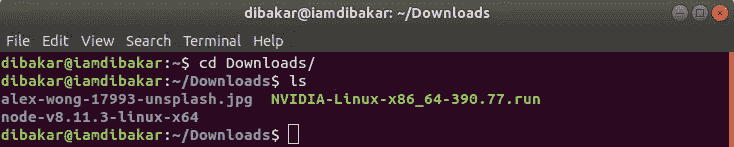
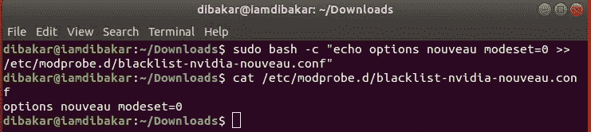
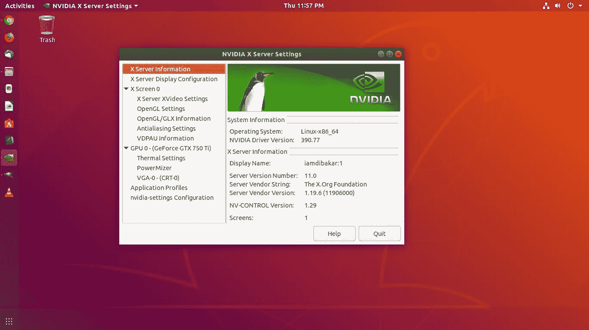

# 我如何通过在 Ubuntu 18.04 Bionic Beaver Linux 上安装 NVIDIA 驱动程序来修复我的显示器分辨率

> 原文：<https://betterprogramming.pub/how-i-fixed-my-display-resolution-by-installing-nvidia-drivers-on-ubuntu-18-04-bionic-beaver-linux-489563052f6c>

## 低分辨率显示器故障排除分步介绍


[黄福生](https://unsplash.com/photos/l5Tzv1alcps?utm_source=unsplash&utm_medium=referral&utm_content=creditCopyText)在 [Unsplash](https://unsplash.com/search/photos/ubuntu?utm_source=unsplash&utm_medium=referral&utm_content=creditCopyText) 上的照片

昨晚，我在我的台式电脑上安装了 Ubuntu 18.04 仿生海狸 Linux，完全摆脱了 Windows 7 操作系统。

因此，在正确安装 Linux 之后，我面临的第一个问题是低分辨率显示器，这让我非常恼火，因为我在机器中安装了 NVIDIA Geforce GTX 750 TI 显卡。我的显示器分辨率是 1368x768，但是 Ubuntu 默认为 960x540。所以我在谷歌上搜索，找到了一些解决方案，并开始应用，直到我得到我的结果。现在我正在写所有对我有用的方法来解决这个问题。

我假设你已经在操作系统安装后更新了系统。如果不是，那么在终端中写下这个命令。使用`CTRL + ALT + T` 打开 Ubuntu 终端。

```
$ sudo apt update && sudo apt upgrade
```

首先我们需要检测 NVIDIA 显卡的型号和推荐的驱动程序。要检测 itk，请执行以下命令:

```
$ ubuntu-drivers devices
```

结果会是这样的:

```
== /sys/devices/pci0000:00/0000:00:01.0/0000:01:00.0 ==
modalias : pci:v000010DEd00001380sv00001043sd000084BEbc03sc00i00
vendor   : NVIDIA Corporation
model    : GM107 [GeForce GTX 750 Ti]
manual_install: True
driver   : nvidia-340 - distro non-free
driver   : nvidia-driver-390 - distro non-free recommended
driver   : xserver-xorg-video-nouveau - distro free builtin
```

所以上面的输出说我安装了 NVIDIA Geforce GTX 750 Ti 显卡，推荐安装的驱动是`nvidia-390`。

现在在 Ubuntu 终端中运行这个命令来自动安装 NVIDIA 驱动程序:

```
$ sudo ubuntu-drivers autoinstall
```

或者选择性地安装所需的驱动程序:

```
$ sudo apt install nvidia-390
```

完成安装后，重新启动系统。

> 以上方法对我没用。但是我把它放在这里，因为这是最简单的方法，所以它可能对其他人也有用。但我都是手动完成的。下面提到了所有的步骤。

# **手动安装步骤**

先从他们的 [**官网**](http://www.nvidia.com/Download/index.aspx) 下载想要的 NVIDIA 驱动吧。我已经知道了我想要的驱动， **NVIDIA-390** 。将文件保存到您的主目录或下载目录中。我的在下载目录里。要从主目录移动到下载目录，只需在终端中使用以下命令:

```
$ cd Downloads/
```

然后在终端键入`ls` 命令:

```
$ ls
```

你会在终端里看到你的 NVIDIA 驱动。



下载目录中的 Nvidia 驱动程序

现在让我们安装驱动程序。为此，编写这些命令并执行以下内容:

```
$ sudo dpkg --add-architecture i386
$ sudo apt update
$ sudo apt install build-essential libc6:i386
```

这些命令需要您的系统密码。

酷！我们差不多完成了一半。现在你需要禁用你的新内核驱动。在终端中，输入以下命令:

```
$ sudo bash -c "echo blacklist nouveau > /etc/modprobe.d/blacklist-nvidia-nouveau.conf"
$ sudo bash -c "echo options nouveau modeset=0 >> /etc/modprobe.d/blacklist-nvidia-nouveau.conf"
```

执行后，现在让我们确认新 modprobe 配置文件的内容…

```
$ cat /etc/modprobe.d/blacklist-nvidia-nouveau.conf
```

它将返回以下结果:

```
blacklist nouveau
options nouveau modeset=0
```



上述命令的结果

然后你需要更新内核`initramfs`。

```
$ sudo update-initramfs -u
```

完成后，重新启动系统。

```
$ sudo reboot
```

重启后，我变得超级恐慌。不要惊慌，因为这很正常。让我解释一下发生了什么。

我们刚刚禁用了新的内核显示服务器，所以目前没有用户界面。但是现在我们将停止当前的显示服务器，以便安装 NVIDIA 驱动程序。

只要试着把`CTRL + ALT + F1` 打到`F12`就可以了。我的在 F2 工作。你会看到一个登录面板；输入您的用户名和密码以打开新的 TTY1 会话。登录后，输入以下命令继续:

```
$ sudo telinit 3
```

酷！我们快完成了。现在是时候安装 NVIDIA 驱动程序了。要开始安装，首先导航到下载目录或您的 NVIDIA 驱动程序当前所在的位置。请记住，您需要 root 权限来安装这个驱动程序。首先执行这个命令，它将授予您 root 访问权限:

```
$ sudo su
```

现在执行这个:

```
$ bash NVIDIA-Linux-x86_64-390.77.run
```

现在，您需要遵循以下步骤:

```
1\. Accept License
2\. The distribution-provide pre-install script failed! Are you sure you want to continue? -> CONTINUE INSTALLATION
3\. Install all NVIDIA's 32-bit compatibility libraries? -> YES
4\. Would you like to run the nvidia-xconfig utility? -> YES
```

答对了。NVIDIA 驱动程序现已安装。重启你的系统。重新启动后，你应该可以从活动菜单中启动 NVIDIA X 服务器设置应用程序。



NVIDIA X 服务器设置应用

从该应用程序中，您可以更改您的显示分辨率。

我希望这也解决了你的问题。