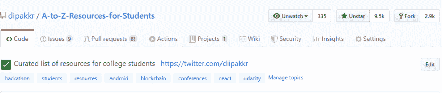
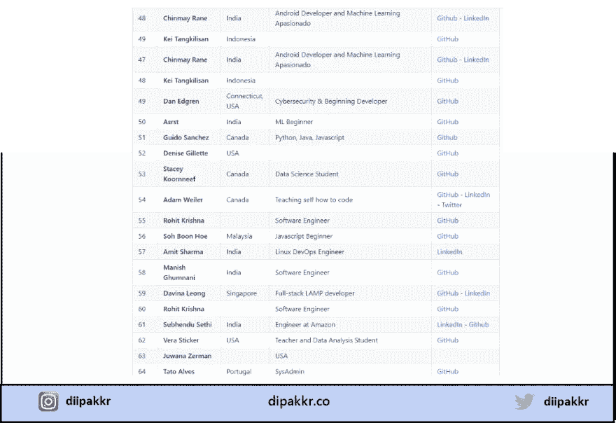

# 我是如何在我的 GitHub 知识库中获得 10，000 颗星星的

> 原文：<https://betterprogramming.pub/how-i-got-10k-stars-on-my-github-repository-e8ab52884d>

## 明星是价值的结果，而不是目标本身

照片由[格雷戈·拉科齐](https://unsplash.com/photos/oMpAz-DN-9I)在 [Unsplash](https://unsplash.com/) 上拍摄

当我在大学时，由于缺乏意识，我错过了许多机会，如黑客马拉松、会议、实习和许多全球活动。作为一名大一新生，我不知道学生可以获得什么样的机会。当然，随着时间的推移和积极参与社区活动，我们会逐渐了解这些事情。

我不想让其他学生/低年级学生遭受同样的问题。因此，我为学生/开发者创建了一个手工管理的资源列表。

该列表在 Github 和其他出版物上的浏览量/浏览量超过了一百万次。它有近 10，000 个️stars 和近 3，000 个叉子。总共有超过 590 名来自世界各地的贡献者。

# 我怎么会有这么大的流量

好吧，这从来都不是为了让我的回购协议变得更好。更重要的是这份名单所能提供的价值。

我在 GitHub 上发布了这个列表，来自世界各地的人们帮助我把这个资源列表做得越来越好。在接下来的两到三个月里，我审查了存储库上的每一个拉请求，并关闭了 800 多个拉请求。

# 社区是关键

来自世界各地的学生/专业人员/开发人员做出了贡献，使资源列表更加丰富。我们列出了大部分投稿人的姓名、社会关系和国家名称。

贡献者列表:A-to-Z-资源

所以，让我简单地告诉你我们添加到列表中的所有东西，称为`A-to-Z-Resources-for-Students`。

该列表包含以下类别的简短而重要的资源:

*   编码资源
*   黑客马拉松和活动
*   学生福利和项目，如奖学金和研究生奖学金
*   开源程序
*   启动项目和孵化器
*   实习门户
*   开发者俱乐部和聚会
*   会议
*   新兵训练营
*   关注的热门人物(不同类别)

是的，这份名单很大，我花了一个多星期来搜索和整理这份名单。

# 结论

创造和建造你认为对他人有帮助的东西。找到自己的问题并解决是关键。可能有人正面临着同样的问题。专注于创造有价值的内容，然后更多的流量和更多的观众将是副产品。

最后，你可以在 [Github](https://github.com/dipakkr/A-to-Z-Resources-for-Students) 上查看我的资源库。

我很高兴你还在这里。我希望你喜欢这篇文章。请不要忘记在评论中给出你的反馈。获得反馈有助于我提高。