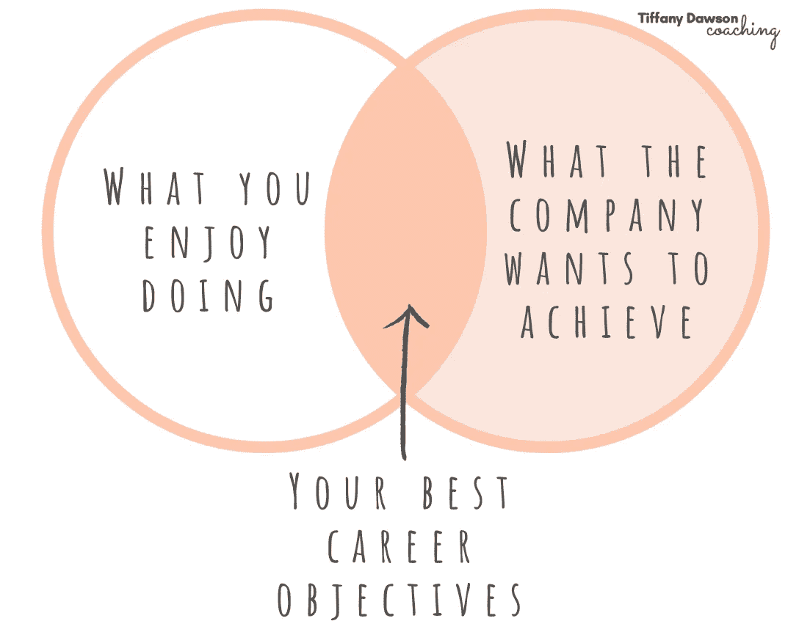

# 我是如何不用更加努力工作就获得晋升的

> 原文：<https://betterprogramming.pub/how-i-got-a-promotion-without-working-any-harder-9a97f77e8ae4>

## 在我职业生涯的这个阶段，我还不明白的是

作者照片。

# 我整个职业生涯没能理解的是

关于职业发展，我有两个大的、有害的误解:

1.  你的晋升取决于你工作的时间长短。
2.  当你足够优秀时，你会自动得到提升。

在我的整个职业生涯中，我坐在那里等待升职，或者有人注意到我做得很好。不管怎样，我把成功的钥匙交给了其他人。

我知道我并不孤单。如果你正在读这篇文章，很可能你非常关心你的职业生涯，但是从来没有人告诉过你如何积极地迈向下一步职业生涯。

当我说“积极争取升职”时，我指的不仅仅是额外努力工作、加班加点或做额外的事情。事实上，要获得晋升，你不需要做任何事情！我怎么知道这个？这就是我的故事的来源。

# 我为什么辞去第一份工作

我离开我的第一家公司纯粹是因为好奇其他组织是如何做事的。我经常发现自己感觉有更好的做事方式，但意识到除非我改变环境，否则我无法接触到它们。

所以当我去下一家公司工作时，我处于一种好奇和探索的状态。我想尝试新事物，进入人们的大脑，了解他们是如何思考的。我被他们解决问题的方式和他们的工程方法迷住了。我是对的:他们做事情的方式确实不同。有些更好，有些更差！我能够分享我以前公司的经验来帮助改进事情。这就是为什么思想的多样性如此重要！

# 我意外地创造了升职的完美条件

虽然当时我并没有考虑升职，但我的行动为我最终获得升职创造了完美的条件。事情是这样的。

我想尊重我探索别人如何做事的愿望，所以我问我是否可以参加我认为有趣的会议。我最终参加了业务发展会议、团队战略讨论和臭名昭著的每周“投标或不投标”在这里，两位最资深的董事审查所有可能进入企业的新项目，并决定它们是否值得投标。这相当于古罗马在角斗场上竖起大拇指或放下大拇指。

# 这很尴尬，但我足够好奇去做了

不要误解我，我觉得邀请自己参加这些会议真的很不舒服。首先，其他人都比我至少有十年的经验。另外，我是新来的。我经常想知道其他与会者对我的看法。他们是否在想，“这个新来的、没有经验的孩子认为她在这个非常重要的会议上做了什么？”我后来发现，他们以为我是被特别邀请来分享我有价值的见解的。显然，我的投入和新鲜的视角真的很有帮助！

我更多地了解了对那些董事来说什么是重要的，他们如何做决定，以及他们正在处理的主要问题。了解利润、员工敬业度和公司价值观之间的平衡是如此有趣，他们必须为进入企业的每个机会考虑这些因素。

# 感觉不像工作，所以我举起手

在一次会议上，他们意识到他们没有问员工什么会激励他们在工作中更加投入。例如，什么类型的项目让他们兴奋，他们想改变工作场所的什么，以及他们觉得哪些愚蠢或无聊的事情妨碍了他们的工程工作。这很重要，因为敬业的员工=高效和创新的工作=更多的利润。

我意识到这是我可以帮忙的。我一直对工作场所文化充满热情，并发现是什么让人们变得有活力。所以我举起手来和一位副主任一起创建了一个员工参与度研究。我收集了员工的反馈，并将有用的部分反馈给领导团队。

# 做有趣的事情的意外结果

通过做这项工作，我与更多的高层人士建立了新的关系，并证明了我可以提供对领导力很重要的东西——同时做我最喜欢的事情:进入人们的大脑，了解什么会激励他们做得更好。我 100%确定这就是我最终成为职业教练的原因！

通过追随我感兴趣的东西，我意外地发现了这一点。

我被要求成为该副总监继任计划的一部分，并在他 12 个月后升职时接管他的团队领导角色。我了解到他计划如何在下一年提升一个级别，这帮助我制定了一个类似的计划。

事情是这样的:

1.  知道我的目标是什么角色。
2.  想想在我到达那里之前，我需要填补哪些技能空白。
3.  写出我的职业目标。
4.  通过主要利益相关者的定期反馈来跟踪我的进展。
5.  收集证据证明我已经准备好升职了。

瞧啊。原来，由于不可预见的事件，晋升发生在 12 个月之前，但我已经证明了我是在正确的轨道上，所以他们很容易就把它授予我。

# 你不需要变得更聪明或更努力才能获得晋升

我比其他和我有相似经历的人得到了提升。我也比那些埋头苦干、加班加点的人得到了提升。并不是因为我特别或者比他们更有能力。我得到了提升，因为我证明了我能为公司增加更多价值*和*我让那些重要的人看到了我的职业发展计划。

老实说，我当时不知道我有权利要求被考虑担任更高级的角色，但这就是我如何创造自己的晋升机会。我对整个过程进行逆向工程，为我的教练客户创造晋升机会。

# 你应该从中吸取什么

我想让你从我的故事中得到的关键是:

*   追随你的好奇心，即使这意味着冒险一跳(比如换公司)。
*   你不需要等着被邀请去做某事。简单的要求参与。
*   如果你追随让你感兴趣和兴奋的东西，你会找到一种方法把它融入到你的工作中。
*   你不需要觉得自己已经为升职做好了准备，就可以开始争取升职。
*   如果你以前从未做过，找一个能帮你制定职业规划的人。

感谢阅读！