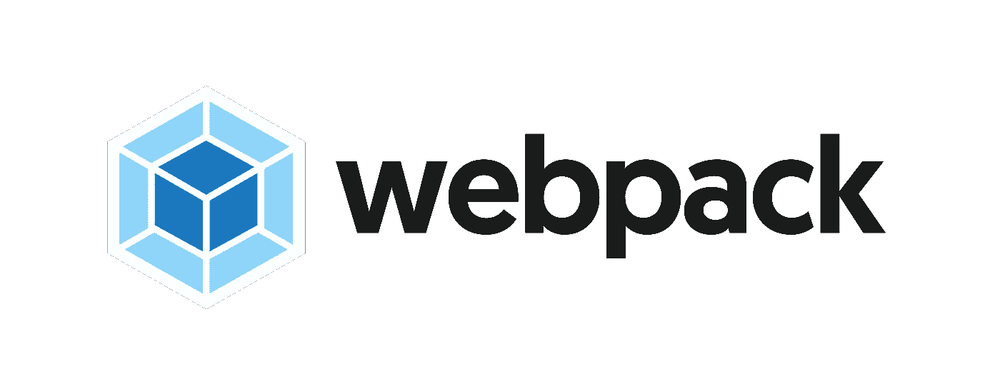
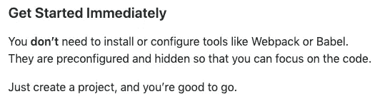

# 我如何克服对 webpack 的恐惧

> 原文：<https://betterprogramming.pub/how-i-got-over-my-fear-of-webpack-2f66218bb18b>

## 你也可以

声明:这是*不是*一个 [webpack](https://webpack.js.org/) 教程；外面有很多这样的人。

毫无疑问，使用 webpack 并理解它的功能实际上让我成为了一名更好的开发人员。但是首先，什么是[webpack](https://webpack.js.org/) ？

来自 webpack 的 [GitHub repo](https://github.com/webpack/webpack) :

> *“web pack 是一个模块捆绑器。它的主要目的是捆绑 JavaScript 文件，以便在浏览器中使用，但它也能够转换、捆绑或打包任何资源或资产。”*

或者简而言之:它是神奇的。

直到一年前，我还害怕 webpack。使用 React.js 时，我满足于简单地知道如何编码和创建组件，除此之外别无其他，并将配置和繁重的工作留给了团队中的专业人员。这似乎总是一项无聊而复杂的任务。

然而，我总是认为*理解*这种神秘的生物是我某一天会找到力量去实现的不可实现的梦想，只有最勇敢、最资深的开发人员才能解决。

当脸书的 [create-react-app](https://github.com/facebook/create-react-app) 问世时，我激动不已，因为这意味着向前迈进，我不必知道如何捆绑我的应用程序，而且我可以毫无愧疚地去做它。至少，我是这么被告知的:

看到了吗？甚至他们的医生也这么说！

在我作为前端开发人员的大部分时间里，我就是这样设法度过的，创建了令人敬畏的 React 应用程序，而不必处理那个怪异的工具。

你*可以在不了解从编码到捆绑到部署的整个流程的情况下*成为一名出色的前端开发人员，但是你真的想要这样吗？(剧透一下——你没有。)

# 开始

几个月过去了，我在一家新公司开始了一份新工作，并且是团队中唯一了解前端的人，这使我成为了前端主管。最终，这意味着我必须加快步伐。与我可怕的宿敌较量是实现这一目标的恰当的第一步。

我创建了一个新的 React 应用程序，只是这一次，我不允许自己仅仅求助于一个开箱即用的解决方案；我从头开始一步一步地创建了一个新的应用程序，直到最后我安装了 webpack 并开始了配置过程。

作为一名初级前端开发人员，我完全忘记了一些为了变得更好而需要知道和理解的关键概念。我不仅不知道它们是什么意思，甚至不知道它们的措辞。

在那之前，我习惯于用一些魔法把我的源代码变成某种东西(姑且称之为某种东西…一个包！)可以服务和部署，但我从未停下来想一想引擎盖下发生了什么。

我的第一步是开始阅读 [*入门*](https://webpack.js.org/guides/getting-started/) 手册(嗯，咄)。

这个看似简单的步骤让我接触到了其中的一些概念，这些概念在当时看来是超级先进的。我需要回顾它们来理解 webpack 和代码到捆绑包的流程，所以我继续深入阅读了像*捆绑*和*传输*这样的术语。

*捆绑*是指 webpack(或任何其他类似的工具)处理您的应用程序并构建依赖图，然后映射您的项目需要的每个模块，并生成一个或多个捆绑包。

*编译*是读取用一种编程语言编写的源代码，并用另一种语言生成等效代码的过程。

例如，webpack 可以使用插件，如 [Babel](https://babeljs.io/) JavaScript 编译器，获取 ES6 JavaScript 代码，并将其转换为任何浏览器都能理解的普通旧版本 ES5 JavaScript。

开始看到更大的画面，完成*入门*部分，我继续实验。

我从默认配置开始，继续添加和删除属性，查看它如何影响包(或者，更准确地说，由于破坏配置导致了什么错误)。

最终，我非常明白如何根据我的需要配置 webpack，这在以前似乎是不可能完成的任务。

了解 webpack 以及您可以使用它做什么的其他好方法是浏览不同的 [webpack 插件](https://webpack.js.org/plugins/)，或者使用 [react-app-rewired](https://github.com/timarney/react-app-rewired) 模块操纵和覆盖 create-react-app 使用的默认现成 webpack 配置。

像 create-react-app 这样出色的项目有一个非常棒的 webpack 配置，它负责幕后发生的许多神奇的事情。

# 我对 webpack 的体验

我使用 webpack 的经历是我第一次征服了自己的“对未知的恐惧”，走出了自己的舒适区。回报是巨大的，导致了一个巨大的升级，现在仍在进行中。

从捆绑和传输这样的基本概念开始，我很顺利，并且知道我只是触及了冰山的一角。带着新找到的自信，我现在被鼓励去学习更多关于前端世界的知识，随着时间的推移，这让我更深地爱上了它。

走出我的舒适区使我得到了提高，这反过来帮助我获得了更多的信心，直到我感到足够舒适，可以向我的团队和我公司的前端公会进行前端演示。

所以，缩小一下，那次与 webpack 最初的、微小的、不舒服的遭遇实际上让我走上了成为一名更好、更自信的开发者的道路，他绝对热爱他所做的事情。

我的主要观点是:

永远对你使用的工具和技术的机制和本质保持好奇，这是你(可能)认为理所当然的事情。

不要满足于仅仅理解某件事，仅仅让它发挥作用。

深入挖掘，因为你可能只是偶然享受它。