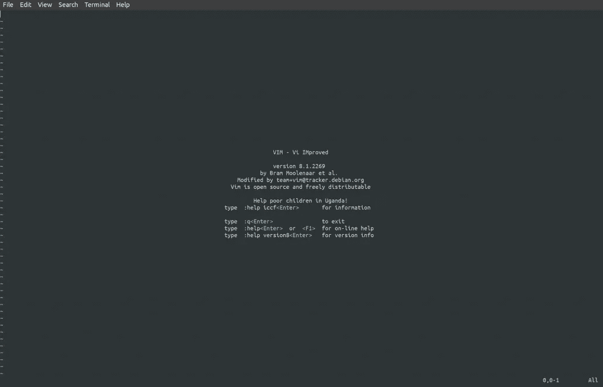

# 我如何开始使用 Vim 并在编码时变得更有效率

> 原文：<https://betterprogramming.pub/how-i-got-started-with-vim-and-become-more-productive-while-coding-a90d495de522>

## 出于对 Vim 的好奇

Paul Zoetemeijer 在 [Unsplash](https://unsplash.com/s/photos/letters?utm_source=unsplash&utm_medium=referral&utm_content=creditCopyText) 上的照片

Vim 是一个文本编辑器，可以极大地提高您的编码效率。打字速度在一定程度上是无关紧要的。您浏览代码的能力要重要得多。这就是 Vim 及其按键绑定、布局和设置可以帮助您加快这个过程的地方。

在开始使用 Vim 时，您可能会浪费时间。但是不要失去希望。这种情况下，支付少量的前期成本，随后就能获得回报。

这里有一篇文章可以帮助您开始使用 Vim，或者将它作为您选择的文本编辑器。

# Vim 是什么？

> " Vim 是一个高度可配置的文本编辑器，可以非常高效地创建和更改任何类型的文本. "— [Vim 主页](https://www.vim.org/)

Vim 是稳定的开源软件，它支持许多不同的编程语言，包括 Python 和 Bash。

# 当您第一次打开 Vim 时

当您第一次打开 Vim 时，您处于命令模式。

首先要学习的一件事是如何退出 Vim。这可以通过以下方式完成:

*   `:q`这是能够退出的最重要的命令。在此之后加上一个`!`(即`:q!`)可以让你不保存就退出。
*   `:w`将保存您创建的文件。
*   `:wq`将保存和退出放在一个命令里。

要移动光标:

*   `h`左
*   `j`向下
*   `k`向上
*   `l`对

您可以在命令前添加一个数字，命令将移动该数字的次数(例如，`20h`将使您的光标向左移动 20 次)。

要真正开始键入一些单词或编写一些代码，请使用:

*   `i`进入插入模式。

# 导航的更多常用键

回到命令模式，有更多的键来帮助导航。我们已经知道`h`、`j`、`k`和`l`允许我们四处移动光标。

此外，您可以移动到起点和终点:

*   `G`(注意`shift+g`带你到底线的起点。)
*   `gg`带您到代码的顶部。

在线上导航:

*   `0`将带你到一行的起点；将这个与`w`(即`0w`)结合使用，会将你带到该行的第一个单词。
*   `A`(或`shift+a`)将带您到当前行的末尾并进入插入模式。
*   `b`向后移动一个单词。`B`忽略标点符号。
*   我们知道`w`会带你进入下一个词。`W`会忽略标点符号。

更多粗略导航方式:

*   `{`和`}`通过代码块导航。
*   `%`将带你在圆括号、花括号或方括号之间来回切换。
*   如果我们在顶部键入一个数字，那么`enter`将带我们到特定的代码行(例如，`gg42 enter`将带我们到第 42 行代码)。
*   `/`后面跟着你想搜索的内容，然后`enter`会带你到你想搜索的内容。接下来，`n`将带你进入下一场比赛；`N`会带你去前面。
*   `*`查找与光标所在单词相似的所有单词。

# 用于编辑的简单按键

在我们进入编辑之前，一个有用的工具是使用可视化的模式:

*   使你进入视觉模式。这允许您使用导航键选择代码。如果你想知道你将操作什么代码，这是很方便的。
*   同样，`.`在重做以前的命令时特别有用。

撤消和重做:

*   `u`会撤销(可以重复)
*   `ctrl+r`会重做(可以重复)

删除、复制和粘贴:

*   `dd`删除你所在的行，同时也将它复制到剪贴板，就像使用“剪切”一样
*   `D`从光标所在的位置删除到结尾。
*   `ct`然后无论什么字符都会从你所在的位置删除到你想要删除的字符。
*   `yy`将选中的行复制到剪贴板上。
*   `p`将剪贴板上的内容粘贴到下面。

插入:

*   `o`在下面新建一行并进入插入模式。
*   `O` ( `shift+o`)在上面新建一行，进入插入模式。

缩进代码:

*   `<`和`>`可以用来缩进代码。您可以将它与可视模式结合使用来选择和缩进您的代码。使用`.`可以让你重复这个动作。如果您在前面使用一个数字，那么它将在您的选择下面缩进行数。

# 其他一些有用的钥匙

以下是一些其他有用的键和设置，可以帮助您:

*   `~`将交换字符的大小写(即，将小写改为大写，反之亦然)。
*   `:set number`将提供行号。

# 创建宏

宏是一组可以映射到任何键的命令。如果您需要多次执行一组命令，这是非常强大的。您可以将它设置为任何想要的调。

1.  `q`之后的任何键(如`qw`)用于记录宏，并将其设置为该特定键(如`w`)。
2.  我们执行命令，进入和退出命令、插入和可视模式。
3.  我们可以使用`@`重放我们的宏，然后使用保存宏的键。

我们可以通过在调用宏之前添加一个数字来多次重复宏(即，数字，然后是`@`，然后是您分配的键)。

# 接下来呢？

现在轮到你了。

在您的系统上安装 Vim。

使用 Vim 编写一个简单的程序，或者用您已经编写的一些代码来试验这些命令。一开始会觉得很别扭，但是随着你的进步会好起来的。

我希望这能帮到你。你是怎么找到它的？你还发现了哪些我没有在这里列出的有用的钥匙？哪些是没用的？请在下面发表评论，并与其他可能觉得有用的人分享。