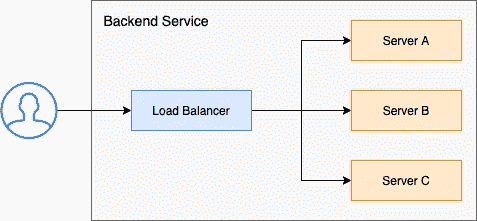
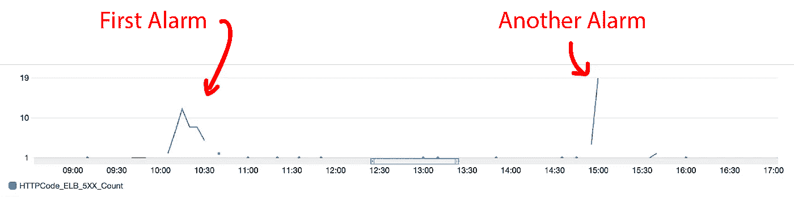
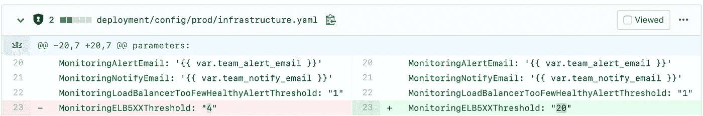
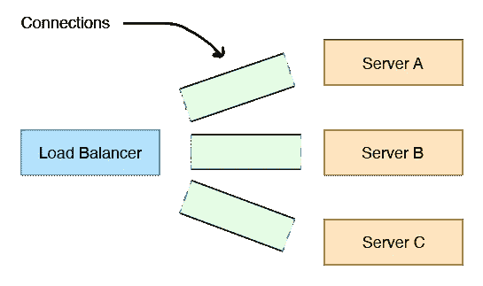
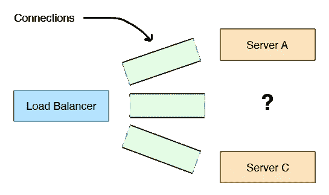

# 处理负载均衡器噪声报警的案例研究

> 原文：<https://betterprogramming.pub/how-i-help-developers-sleep-at-night-69cb70a9f018>

## 如何诊断和解决负载平衡器问题

Yeo Khee 在 [Unsplash](https://unsplash.com?utm_source=medium&utm_medium=referral) 上拍摄的照片

# 介绍

为了交付一个高度可用的应用程序，标准的做法是设置在出错时触发的警报。警报可能由以下情况触发:

*   CPU 或内存使用率高的实例
*   异常或非零退出代码
*   大量 HTTP 错误状态代码

好的警报是可操作的；否则，重要的问题可能会被看似不重要的警报所掩盖，被掩盖起来。通常在不相关的情况下发出的警报被认为是*噪音*。为了减少开发人员和第一反应者的认知负荷，重要的是不相关的情况不会产生警报。

到目前为止，我们的 AWS 应用程序负载平衡器已经生成了许多 504 和 502 错误代码，这些代码已经触发了几次警报。我们在调查过程中没有看到任何确凿的证据，一切似乎都很好。我们意识到这个警报已经变得嘈杂。

在本文中，我将讨论我们为使警报恢复正常状态所采取的步骤。谁将从这篇文章中受益:

*   对 REST 服务的网络配置感兴趣的人
*   缺乏基础设施经验并希望曝光的开发人员。这个练习是平台开发人员、开发人员和站点可靠性团队所做工作的一个很好的例子。

# 术语

一个负载均衡器反向代理多个服务器(图片来源:作者)

**负载平衡器** —负载平衡器是一个架构组件，它在一组服务器之间分配请求，这样就不会有一台服务器不堪重负。

**上游服务** —上游服务是指一个或多个运行相同业务逻辑的服务器。在上图中，服务器 A、B 和 C 形成了一个上游服务(从负载平衡器的角度来看)。

# 的反应

该过程从寻呼机发出的 ELB_5XX 警报通知开始:

由我们的 PagerDuty 集成触发的松弛通知

在我们解决这个问题之前，我们需要看看是否有任何可以立即采取的措施来降低用户体验到的服务降级水平。我们已经为不同的失败场景编写了“操作手册”,帮助我们加快流程。触发警报的描述中包含相应操作手册的链接。第一响应者只需遵循运行手册，该手册通常具有以下结构:

*   上游服务器的 CPU 或内存使用率高吗？如果是这样，请增加服务器数量以应对负载。
*   是否只有一台上游服务器的 CPU 或内存使用率很高？如果是这样，关闭该服务器并用新的替换它。
*   检查上游日志。这些警报来自同一个服务器吗？如果是这样，关闭该服务器并用新的替换它。
*   诸如此类…

关于跑步手册，需要注意以下几点:

*   说明非常简单。
*   这些步骤是连续的，很容易遵循。
*   它们旨在帮助急救人员系统地解决问题。

在我们的案例中，相关的操作手册没有产生解决方案，我们的仪表盘也没有显示任何错误/警告信号。在我们的调查中，警报自动解决，502 错误消失了。

来自我们的弹性负载平衡器的 5XX 错误计数

在我们更深入地研究这个问题之前，我们需要确定错误的影响，并向涉众提供持续的状态更新。在我们的例子中，不到 0.5%的请求导致了 502 个错误。

# 这个发现

现在我们已经更新了利益相关者，是时候调查和解决问题了。我暂时提高了警报的阈值，以确保它不会在我们的调查期间触发:

Github PR 更改触发警报的阈值

负载平衡器会抛出 5XX 错误的原因有很多:

*   一个(或多个)上游服务器没有响应。
*   有一个暂时的网络问题正在破坏上游连接。
*   上游服务响应不兼容/损坏的数据。

AWS 有许多文章解释[如何对 ELB 5XX 错误](https://aws.amazon.com/premiumsupport/knowledge-center/http-5xx-errors-s3/)进行故障诊断。我们的工作是系统地检查和消除可能的故障模式。找出根本原因的最简单方法是查询 ELB(弹性负载平衡器)访问日志并分析结果:

*   [AWS elb 可以配置为将它们的访问日志存放到 S3 桶中](https://docs.aws.amazon.com/elasticloadbalancing/latest/application/load-balancer-access-logs.html#enable-access-logging)。访问日志文件只包含向 ELB 发出的所有请求的列表。
*   [我们可以将日志文件加载到 AWS Athena 中，并使用 SQL 梳理日志。](https://docs.aws.amazon.com/athena/latest/ug/application-load-balancer-logs.html)(正如我们将看到的，使用 Athena 可以非常容易地缩小可能的故障模式。)

首先，我们在 Athena 中索引相关的日志文件:

让我们检查一下 5XX 错误是否是由同一个上游服务器引起的。我们可以通过按目标 IP 对请求进行分组来做到这一点。我们应该只能看到少数几个 IP 地址。

查询的结果。

查询结果包括许多不同的 IP 地址，所以我们知道错误不是来自一个上游服务器。以下是我们可以用来帮助调查的一些其他问题:

确定导致 5XX 的请求响应时间:

*   如果目标处理时间为 0，则意味着 ELB 在与上游服务建立连接时遇到了问题。
*   如果目标处理时间几乎是 60 秒(默认的 ELB 超时)，那么上游服务响应不够快。在这种情况下，您需要调查为什么上游服务花费这么长时间来响应或增加 ELB 目标响应超时。

基于客户端 IP 对请求进行分组:

*   如果所有错误的请求都是由少数客户端生成的，那么这些客户端的互联网连接可能会出现问题。

使用 HTTP 动词和 URL 对请求进行分组，以发现慢速端点:

**注意:**我们已经按年、月、日为 ELB 日志的 Athena 表建立了索引。使用基于日期的索引是绝对重要的，因为我们能够在感兴趣的时间范围内加载和查询日志文件。这些独立查询具有以下优点:

*   我们的查询更快，因为我们正在处理日志文件的子集。
*   雅典娜按处理的数据量收费；处理日志文件的子集意味着我们每次查询花费更少。

如果您想避免在查询上花钱，另一种梳理日志文件的方法是下载相关的日志文件，并编写一个脚本来解析和过滤请求。

# 降低噪音

在彻底查询 ELB 访问日志后，我们发现所有 5XX 请求的响应处理时间都是 60 秒(即，ELB 等待上游服务器响应需要 60 秒)。上游服务器响应不够快，导致 ELB 抛出 5XX。我们测试了我们的上游服务器，以找出它们响应如此缓慢的原因，我们发现它们实际上一点也不慢。

在做了一些研究后，我们发现问题是网络配置不一致。

打开负载平衡器和上游服务器之间的连接

当 ELB 向上游服务器转发请求时，会建立一个连接，然后通过该连接发送和接收数据。建立连接既慢又贵；为了避免为每个请求打开一个新的连接，我们的 ELB 和上游服务器使用同一个连接来处理几个请求(称为 [*保活连接*](https://en.wikipedia.org/wiki/HTTP_persistent_connection) )。

负载平衡器保持与无接收服务器的连接

我们的上游服务器被配置为在一段时间后关闭这些连接以释放资源。由于竞争条件，我们的 ELB 有时会认为这些连接仍然是开放的。ELB 会尝试通过这个“幽灵”连接发送数据，请求会超时，因为那里没有任何响应。

为了解决这个问题，我们确保上游服务器的保持活动超时大于 ELB 的空闲连接超时，确保 ELB 不会维护任何幽灵连接。做了这个改变后，我们不再接收定期警报，我们的警报再次恢复正常。

# **结论**

警报解决后，我们在评估警报的重要性时会考虑一些指标:

*   受影响用户的数量/百分比
*   用户体验下降的持续时间
*   事件的货币成本

如果警报被触发，尽管前面的因素没有中断，那么您可能有一个嘈杂的警报，在我们的情况下，我们做到了。我们的用户没有受到明显影响，我们处于“警报”状态不到一分钟，警报自动解除。

让我们回顾一下为什么我们要确保这个警报不会在无关紧要的情况下再次触发:

*   我们需要减少开发人员的认知负荷。
*   可操作的警报不应该隐藏在嘈杂的警报中。
*   第一反应者不应该在营业时间后被警报打扰。

在某些情况下，重构警报以降低噪音仅仅意味着提高/降低警报阈值。在其他情况下，您可能需要进行更深入的研究，并调整服务器/网络配置。

## 结束语

*   无论您使用的是 Athena、CloudWatch 还是定制的 Python/C 脚本，团队都应该每隔几个月进行一次 ELB 诊断演练。在关键情况下，拥有一个用于调查和解决问题的实践工作流程是非常有价值的。
*   一些 ELB 5XX 错误是由 AWS 中断引起的。如果您无法找到根本原因，最好进行[时间盒](https://en.wikipedia.org/wiki/Timeboxing)调查并开立 AWS 支持单。AWS 专家将能够告诉您问题是否在他们这边。