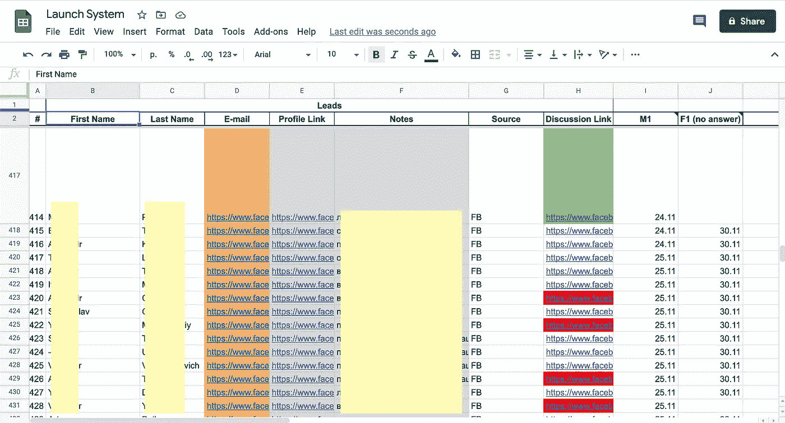

# 作为全职开发人员，我是如何开创了一个 5 位数的生意的

> 原文：<https://betterprogramming.pub/how-i-launched-a-5-figure-business-while-working-as-a-full-time-software-dev-7ef7baf31527>

## 以及如何做同样的事情

作为一名软件开发人员，多年来我一直梦想拥有自己的“被动收入”。当我睡觉时，钱会进入我的银行账户，这个想法让我着迷。这篇文章将告诉你我是如何在全职工作时开始第一次创业的。以及为什么你也能做到。

# 决定找一个联合创始人

我试图建立一个侧挤了很多次，失败得很惨。然后我决定——好吧，如果我自己做不到，我需要找另一个疯狂的家伙，和他一起合作，也许这样我们就能有所成就。

我觉得我需要去其他创始人去的地方，见见他们。由于我是一个相当内向的人，我决定参加网络研讨会就足够了。

我参加了一个网上研讨会，会上一位演讲者谈到了他开发的这个超级酷的创业系统。我没有听这个 sh*t，相反，我只是在一次聊天中写道，我正在寻找一位联合创始人。

这样，我找到了一个在聊天室回复的人。我们打了一个简短的电话，第二天我们在一家咖啡馆见了面，聊了一会儿，然后决定试着一起做点什么。

# 每天奉献两个小时。不管怎样。

我们都是全职软件开发人员，并决定每天花两个小时通过 Zoom 远程开发我们的项目。我们还没有一个项目的想法。但是不管怎样，我们花了两个小时去尝试做一些事情，任何能让我们更接近财务独立的事情。

现在我意识到，事后看来，我从一开始就幸运地找到了一个伟大的商业伙伴。

*我听说了很多关于寻找联合创始人的糟糕故事。但是没错，接受现实吧。你可以试着找个人或者自己做。归根结底，这是你的决定，也是你的人生。我只是在讲述我的故事。*

# 雇一个人来帮我们起步

从一开始，我们就很挣扎。然后我们决定——去他妈的，我们请个导师吧。我们决定回去找那个网上研讨会的家伙，雇佣他。他卖给我们一些视频课程，在那里他解释如何挑选一个想法。这里是如何…

我们列出了一堆我们擅长的事情。然后，我们选择了一个最有机会成功和有钱的客户。是亚马逊 FBA。我的搭档是这方面的专家。他在亚马逊上卖一些东西，虽然不太成功，但足以了解这个行业的来龙去脉。

“导师”卖给我们这个叫做**“启动系统”**的谷歌电子表格，我们用它启动了我们的第一笔生意。这很简单，但对我们很有效。这是它的样子:

接下来，我们列出了三到四个我们看到的亚马逊卖家经常遇到的问题。然后，我们加入了亚马逊卖家的脸书小组，开始给人们发私人信息。我们发送了消息 1(M1)，然后是 M2、M3 等等。

*   信息 1(M1)——找出潜在客户的问题
*   M2——什么问题是最紧迫和最痛苦的？
*   M3——你会使用我们的服务来精确解决这个问题吗？
*   M4——索要电子邮件
*   M5——提供服务并要钱

我们一天发送 30 条信息。在给 100 多人发了消息后，我们觉得无聊，于是雇了一个学生退伍军人来帮我们做这件事。

三周后，我们给大约 650 人发了信息，我们在亚马逊卖家中挑选了一个需求最多的问题。我会告诉你到底是什么问题。

# 我们精确地解决了这个问题…

问题是获得亚马逊 FBA 产品的评论。评论是你的产品在亚马逊上排名的一个关键因素。所以每个卖家都需要它们。

我们决定建立一个解决方案，以一种或多或少合乎道德和“白色”的方式给卖家带来评论。我不能确切地告诉你我们构建了什么样的解决方案。这是手动和自动工作的结合，包括脸书广告，为亚马逊页面增加流量，销售产品，并在一段时间后将其转化为评论。

# 我们如何开展业务，以及业务中最困难的部分

在建立了这个“系统”并在我的合作伙伴的亚马逊产品上测试之后，我们决定我们已经准备好发布了。我们发出了一条消息，为我们的启动列表提供终身 30%的交易，一些人同意测试我们的服务，并成为我们的第一批客户。

接下来是最困难的部分。我们不断地测量和调整我们的系统，直到它开始产生或多或少稳定的结果。真的很难。在这里，我学到了商业是一个缓慢而乏味的循环:做事情，衡量事情的进展，然后改进，这样下次会更好。

如果你跳过了上一段，我可以重复一遍。我要你把它内在化:

做生意是一个缓慢而无聊的循环，先做，然后衡量它的进展，再改进，这样下次会更好。

# 雇佣首席运营官(首席运营官)

在获得一个或多或少稳定的过程后，我们发现我们不擅长构建一个稳定的、可重复的业务。它运行良好，但我们知道它可以运行得更好。

所以我们雇了一个人，他后来成了我们的首席运营官。当时他是一名销售代表，在那之前我们已经认识他两年了，所以我们可以信任他。他同意辞掉工作，开始全职经营我们的企业。我们付给他股票。

不再浪费我们的时间，转而做战略规划。

两年半过去了，业务增长了 300%，年收入稳定在五位数。是的，不是几百万，但是嘿，我个人不做任何事情。我只是每周出现一次，参加一两个小时的战略规划会议，仅此而已。这是我在建立新企业时使用的模式。

# **外卖:**

*   每个人都可以在全职工作的同时创业。
*   找一个联合创始人。去创业者常去的地方(网络研讨会、Slack 等。)并告诉所有人，你正在寻找一位联合创始人。看看你们是否有相似的世界观。
*   选择一个你或你的联合创始人是专家的领域。
*   问问你所在的圈子里的人，他们有什么问题。
*   无论如何，每天至少抽出两个小时做你的事情。耐心点，别着急。这是一个长期的游戏。快钱只出现在信息产品销售页面上。
*   建立一个潜在客户名单，解决一个最有需求的问题。
*   找出你业务中所有的小问题和小故障，并逐一解决。如果你不擅长，请人来做。你可以用股权支付。

想听我说更多吗？你可以[在 Twitter](https://twitter.com/AlexBezhan) 上关注我，因为我将继续我的财务独立和自我完善之旅。