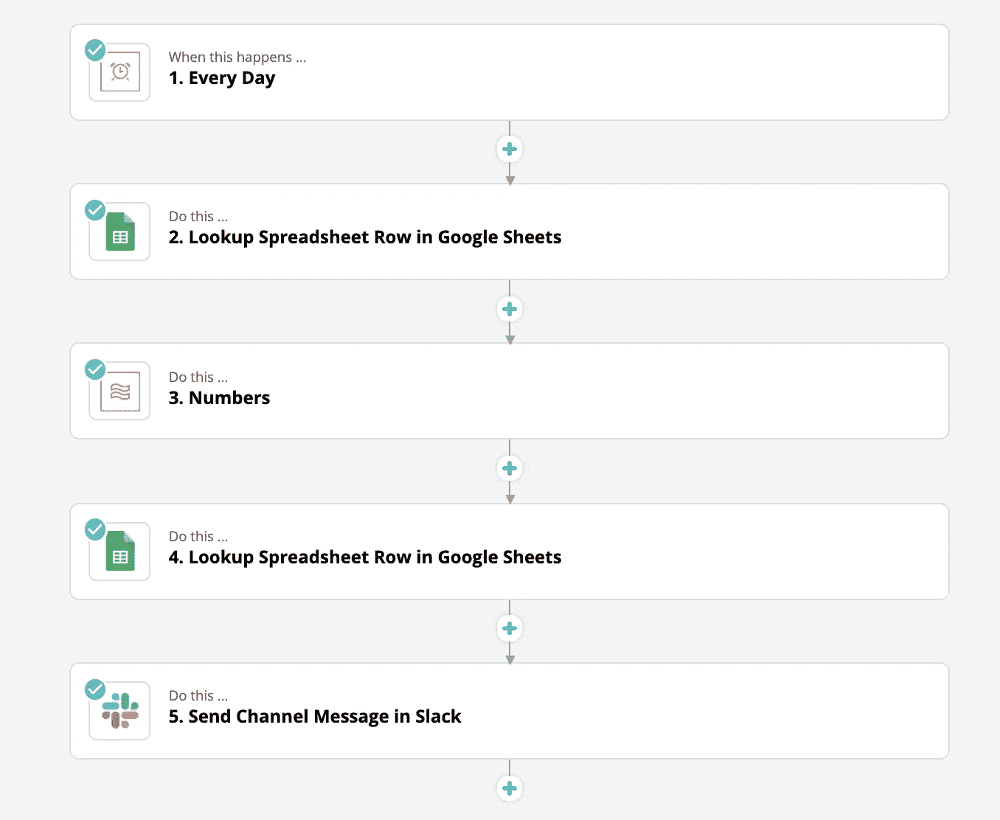
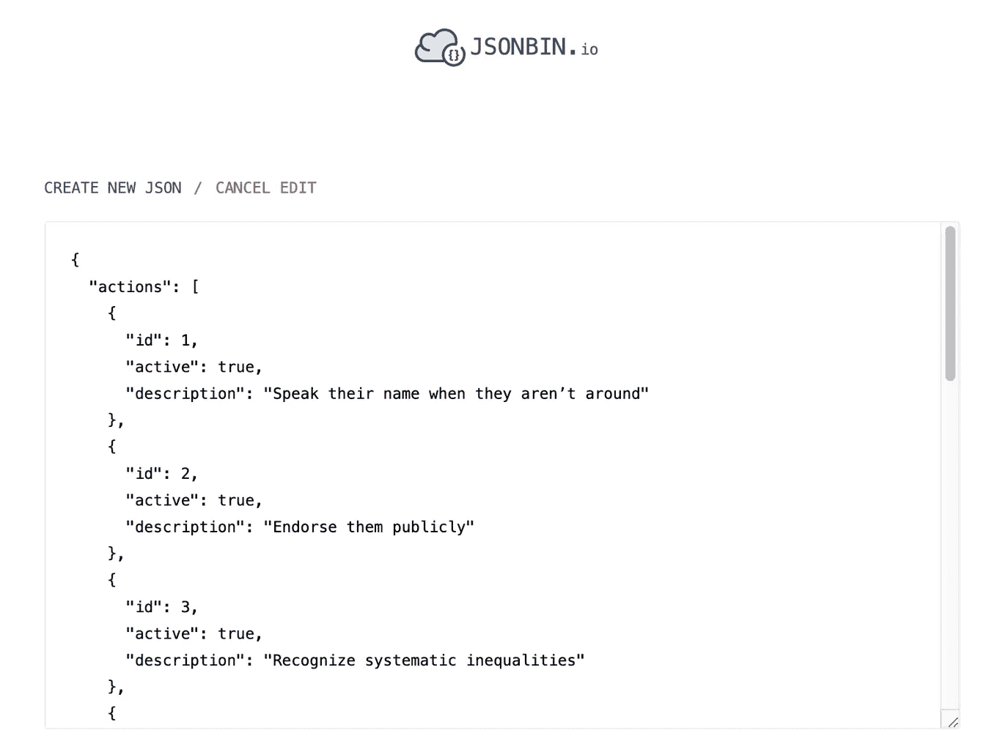
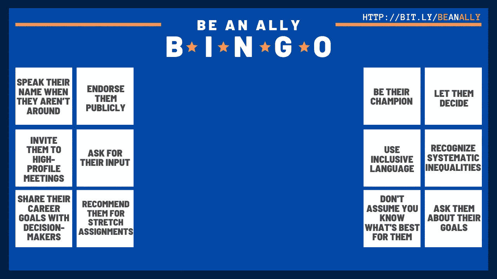
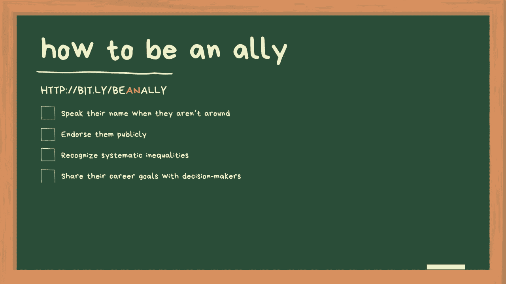
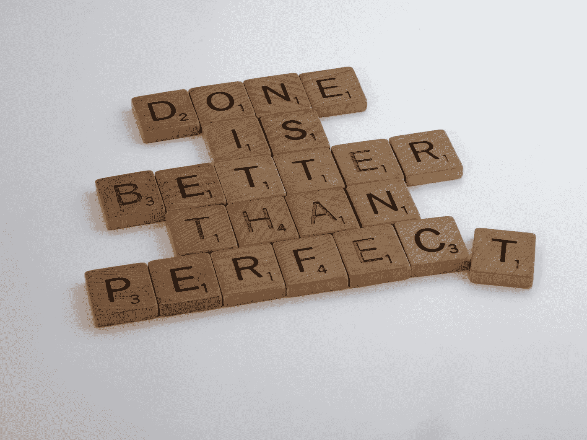

# 我如何在 4 小时内启动了一个社会正义的创业项目

> 原文：<https://betterprogramming.pub/how-i-launched-a-social-justice-startup-in-4-hours-6778af3db8bb>

## 使用#lowcode 和#nocode 工具

[粘土银行](https://unsplash.com/@claybanks?utm_source=medium&utm_medium=referral)在 [Unsplash](https://unsplash.com?utm_source=medium&utm_medium=referral) 拍摄的照片

我已经很久没有专门的编码时间了。这并不奇怪，因为多年前我从一个个人贡献者角色变成了一个 100%的人员管理角色。我仍然非常[喜欢成为一名创造者](https://medium.com/swlh/how-to-still-be-a-maker-when-youre-a-manager-33b20ab6ddaa)，但是这些天来，我经常通过文字而不是代码进行创作。

所以，当我几周前有机会创造一些东西，重新过上我的开发者生活时，我欣然接受了。事不宜迟，让我告诉你我是如何在四个小时内创建了一家名为 [BeAnAlly](http://bit.ly/beAnAlly) 的社会正义创业公司。 [BeAnAlly](http://bit.ly/beAnAlly) 是一项运动，通过提醒他们每天采取一项简单的行动，鼓励拥有特权的多数人支持科技行业的少数人。对于初创公司，我构建了一个浏览器扩展，并创建了缩放背景。

我之所以想和你分享这个，是因为我想强调一个事实，你不需要花几天、几周甚至几个月的时间在互联网上发布一些东西，无论是测试你的假设，发起一场运动，还是将你的想法变成现实，尤其是在当今的技术环境下。需要将软件开发外包给全球自由职业者的日子已经一去不复返了。今天，对任何人来说，用一点技术诀窍、创造力和足智多谋来创建一家初创公司比以往任何时候都更容易。

下面，你会发现我为自己的创业公司开展的各种活动，每项活动花费了多少时间，以及它们是什么。

# 活动 1:注册域名+获得托管:5 分钟

通常，我会登录域名注册商，购买域名，更改 DSN 记录，等等。等。

但是有了 bit.ly 和 Medium 这样的平台，我就不需要做这些了。我在五分钟内得到了一个“域名”和“托管”排序。

# 活动 2:创建一个 Slackbot，每天向 Slack 频道发送可操作的提示给盟友:55 分钟

这些天我完全支持#nocode 和#lowcode，所以我决定用 [Zapier](https://zapier.com/) 。

我创建了一个多步骤 zap，它有一个时间表，查找一个 Google Sheets，其中包含一个 Be An Ally 动作列表，选择一个随机动作，然后发送一个 Slack 消息。

成为盟友 Zap

创建 zap 本身很容易，因为有相关的教程。实际上，我花了大部分时间为盟友寻找和提出可行的建议(大部分来自[更好的盟友](https://medium.com/u/55f5070f6839?source=post_page-----6778af3db8bb--------------------------------))并填充我的数据库——也就是 Google Sheets。

然而，当我准备测试它的时候，我发现我想要添加这个机器人的 Slack Workspace 没有与 Zapier 集成，这是出于合理的安全原因。所以我决定转向。毕竟，没有一些旋转的创业，对不对？

# 活动 3:创建一个 Chrome 扩展，在打开新标签页时为盟友显示可操作的提示:2 小时

GitHub 上有很多 Chrome 扩展的样板文件。但是我拒绝上网下载安装 50GB 的 npm 包(笑话！).令我高兴的是，我发现了一个非常棒的香草 JavaScript 扩展示例。所以我以此为基础，经过几分钟的调整，我有了一个扩展。

但是我遇到了一个问题。我不想在 JavaScript 文件中硬编码所有的技巧，而是想在遇到新的技巧时添加它们。我不能要求每个安装了扩展的人更新源文件。那有点傻。所以我需要一个可以随时修改的数据库。我花了大约 30 分钟四处寻找一个在线数据库。我应该在我的网站上创建一个 API 来为 Chrome 扩展返回数据吗？我应该了解如何阅读谷歌工作表吗？我应该注册 Firebase 吗？我应该买亚马逊 DynamoDB 吗？谈谈被宠坏的选择。MySQL 作为 web 开发的唯一数据库选择的日子已经一去不复返了。

jsonbin.io

在我研究合适的数据库时，我偶然遇到了 https://jsonbin.io/的 T2，它非常适合我的用例。

经过几分钟的破解和跨源调用，我有了一个令我满意的 Chrome 扩展。

# 活动 4:创建缩放背景:1.5 小时

成为一个真正的缩放背景——右击图像进行保存

成为盟友是一种运动。每一个动作都需要引起注意。由于许多人在家工作，我们经常使用缩放功能，缩放背景是吸引人们注意力的一种很好的方式。

所以我决定创建缩放背景。创建背景实际上是最有趣的部分，我对他们的结果很满意。不，我没有用 Photoshop。我用了 Canva。哦，网络发生了多么大的变化。

成为一个真正的缩放背景——右击图像进行保存

# 活动 5:登录页面创建和推广:30 分钟

成为一个真正的缩放背景——右击图像进行保存

我的登录页面是我的媒体帐户页面。我花了大约 30 分钟把这个[登陆页面](http://bit.ly/BeAnAlly)放在一起，我在中午之前就完成了！

# 完成比完美更好

由[布雷特·乔丹](https://unsplash.com/@brett_jordan?utm_source=medium&utm_medium=referral)在 [Unsplash](https://unsplash.com?utm_source=medium&utm_medium=referral) 上拍摄的照片

这就是你想要的——讲述了一个石器时代的开发者如何在四个小时内启动一个社会正义的创业公司。这个练习让我意识到，自从我成为一名开发人员以来，网络已经发生了很大的变化。有了这么多可用的工具和资源，为 web 构建东西和发布东西从来没有这么容易过。所以如果你有想法，我强烈建议你行动起来。

感谢您的阅读，不要忘记使用缩放背景来支持我的“启动”。对社会不公说不，但空谈是廉价的，所以请考虑成为盟友，行动起来！