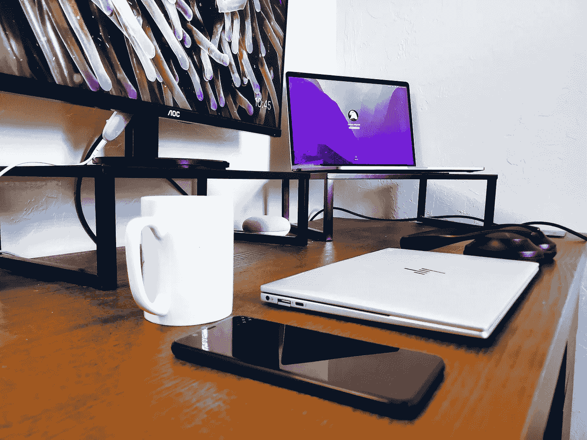

# 远程办公时代我如何平衡工作与生活

> 原文：<https://betterprogramming.pub/how-i-learned-to-find-meaning-outside-of-work-5d49903f11b7>

## 学会寻找工作之外的意义

作者照片

我们都经历过。现在是下午 6 点。你正试图完成今天的最后一项任务，或者看完所有的邮件。但是事情并不像你希望的那样顺利。突然到了晚上 8 点，而你甚至没有在收件箱里留下任何痕迹。在科技行业，这是常有的事。

当我作为一名软件工程师第一次参加工作时，我想写尽可能多的代码。我觉得我需要证明些什么，我愿意竭尽全力让每个人都注意到我的决心。我的努力成功了，但不是以我希望的方式。

与我的想法相反，并不是每个人都羡慕加班或周末进办公室的人。这种行为会树立不好的先例，损害团队文化。经理们通常不希望他们的报告持续加班。过度工作夸大了你的实际速度，以至于你需要开夜车才能跟上。

事实上，工作量最终并不总是产生实质性的影响。如果你擅长自己的工作，或者至少愿意不断学习，随着时间的推移，你会在职业生涯中以健康的速度自然进步。从长远来看，超越自己的极限可能不会让你晋升得更快，除非你能产生实质性的影响。这种现象在大公司尤其如此。

我可以理解为什么有些人可能不同意这种观点。有些人喜欢创业公司的快节奏环境或定量公司的严格要求。如果你认真订阅《为工作而活》，想寻求一个有挑战性的环境，那就去吧。在那种生活方式中找到满足感是可以的。但这条路并不适合所有人。随着时间的推移，我已经学会了看到工作与生活平衡的价值。现在我看不到自己回去了。

说着说着，我顿悟了，意识到自己的生活变得单调了。我花了太多时间发展技能，以至于忘记了发展个人生活。一个常见的笑话是，软件工程师只能在工作时间之外谈论他们的工作，我终于明白了为什么。我决定我需要后退一步，花更多的时间关注自己。

我一直热衷于学习新技能。我将角色发展与流行的角色扮演游戏《天际》联系起来。在游戏中，你通过强化你的个人技能来增加你的整体角色等级，比如锻造和射箭。欠发达的技能会比高水平的技能获得更快的等级，这与现实世界有着惊人的相似之处。这里的教训是，尝试新事物来快速获得那些被忽视的技能的经验总是值得的。我永远不会错过尝试新事物的机会，无论是一些古怪的活动还是一家时髦的新餐馆。我以“我什么都要尝试一次”为座右铭。

下班后，我开始花更多的时间去那里。我会和朋友出去吃饭喝酒，周末去爬山，和伙伴去健身房，尝试新的运动。我甚至重新开始击剑，并加入了奥克兰的一个俱乐部。

当然，作为一个内向的人，我还是需要自己的时间。我还增加了一些单人技能。我学会了弹钢琴，花更多的时间做饭和烘烤，甚至学会了开锁。我尽量限制花在游戏或看电视等无聊活动上的时间。

我对刺激和成长的追求让我的生活变得更有趣。当你的存在是一维的时，很难进行对话。现在，与人交流和进行富有启发性的对话变得容易多了。我现在的身体状况是我一生中最好的，我有一个很好的朋友网络，我比以往任何时候都更自信。

老实说，我在工作中的表现甚至没有受到我决定花更多时间在自己身上的影响。我发现尽管我工作的时间减少了，但是工作的质量却提高了。当我工作了合理的时间，我会更有动力和效率，我的产出也反映了这一点。

如果我的工作需要，有时我会蹲下来进入磨蹭模式，但这些情况通常不常见。我总是把自己放在第一位，对此并不感到内疚。

我要补充的一点是，我认为刚毕业的学生应该在刚开始工作时多付出一点努力。对于软件工程师来说，知识在某些方面几乎就像投资。你越早建立起自己的技能组合，未来的回报就越多。我把我的成功很大程度上归功于当我还是一名新员工时，我渴望成长和发展我的技术能力。

实现良好的工作生活平衡不是一朝一夕就能完成的。你必须找到适合你的平衡点。这种平衡的价值因人而异，但有两个变化对我来说意义重大。

# 谨慎从事远程工作

远程工作很棒，但保持健康的工作与生活平衡很有挑战性。尽管我喜欢在家工作，但我发现这损害了我的工作与生活的平衡。

当你的工作站一直笼罩着你时，拔掉电源就困难多了。去办公室可以在工作和家庭之间建立清晰的界限。离开办公室意味着一天的工作结束了。远程工作不提供这种分离，所以从工作模式切换需要更多的训练。

我还要补充一点，通过去办公室，我交了几个很棒的朋友。如果你还没有一个强大的朋友网络，远程工作会是一种非常孤独的存在。当 COVID 开始工作时，我最近搬到了湾区，我发现自己在家工作时相当隐居。无事可做，我最终花了更多的时间工作。

# 把事情分开

给你的私人手机添加一个工作简介来记录工作中的邮件和信息很有诱惑力，但我认为这是一个错误。

我发现自己经常在正常工作时间之外回复工作信息和电子邮件。很快我就意识到这种习惯是不可持续的，所以我申请了一个公司管理的设备。

为我的个人生活和工作生活保留不同的手机帮了我很大的忙。

我的同事们取笑我总是带着两部手机，但是清楚地分开会有很大的不同。当然，并不是每个公司都会提供公司手机作为福利。我

如果没有提供，那就不要麻烦把你的工作邮箱添加到你的手机上。你不应该被迫用工作账户污染你的个人设备。出于方便更容易养成习惯。

强迫自己找出一台公司的笔记本电脑来查看邮件，会让你不愿意查看邮件，并帮助你脱离工作。

# 结论

我相信通过工作可以找到快乐和满足感。我喜欢在科技行业工作的挑战性。然而，我不会让它定义我的生活。

我已经意识到把我自己和我的兴趣放在第一位是可以的，而不是试图最大化我的代码输出。

生活提供了如此多的东西，在我看来，试图从生活的一小部分中挤出一切似乎是低效的。

所以，关上你的笔记本，在日历上设定你的工作时间，尝试一些新的东西。我希望这有所帮助。感谢阅读。