# 我如何制作一个 LinkedIn 联系人添加机器人

> 原文：<https://betterprogramming.pub/how-i-made-a-linkedin-contact-adding-bot-and-actually-got-a-few-interviews-with-it-37a6f5f85d4d>

## 并获得了一些采访！

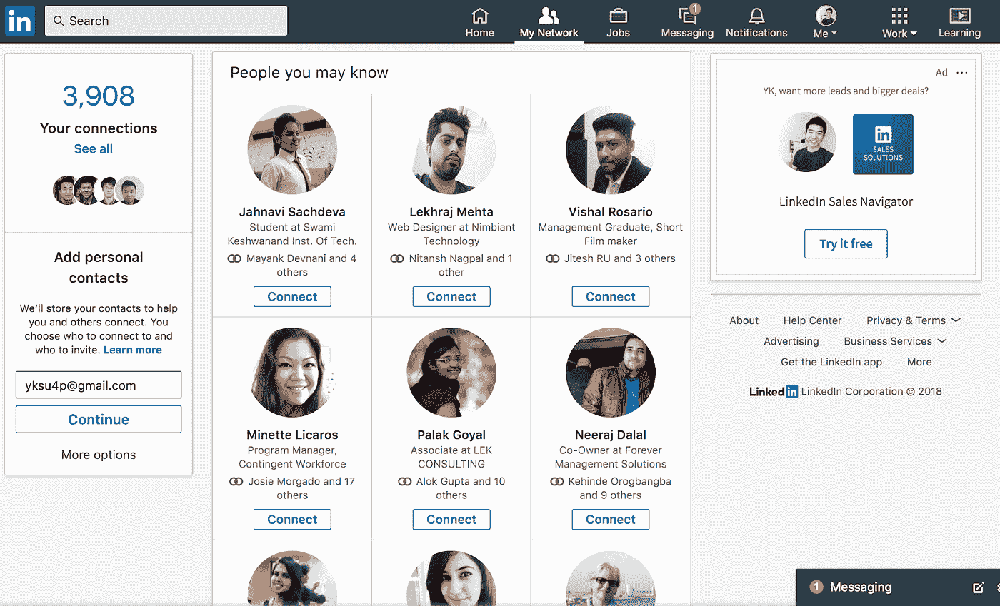

在 LinkedIn 上，有一个名为**你可能认识的人**的栏目。它在**我的网络**选项卡下。

这是建议你可能想联系的人的页面。

您可以点击**连接**按钮向列表中的人发送连接请求。

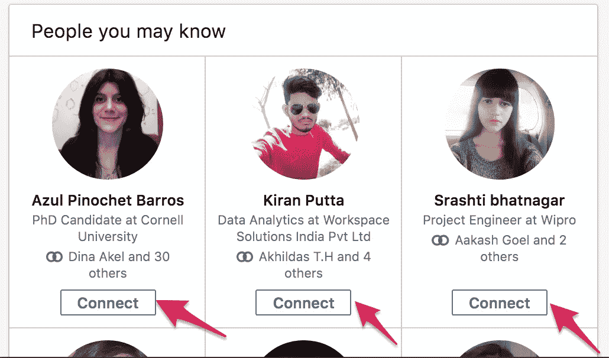

几年前我发现了这个页面，并开始在那里随机添加人。我会点击我在这个页面上找到的每个人的连接按钮。

我只是觉得在 LinkedIn 上有很多关系可能会有助于获得我想要的工作，例如，软件工程师实习。

但是过了一段时间，手动点击这些连接按钮变得有点麻烦。所以，我决定做一个机器人来帮我点击按钮。

这篇文章讲述了我是如何制作这个机器人的，结果是什么，以及我从中学到了什么。

# 我是如何制造机器人的

## 我使用的工具

我制作了这个简单的机器人，用 JavaScript 和 [Greasemonkey](https://addons.mozilla.org/en-US/firefox/addon/greasemonkey/) 在 LinkedIn 上添加随机的人。

Greasemonkey 是 Firefox 的一个插件，可以帮助你管理定制的 JavaScript 代码。它让你可以设置一些东西，以便当你打开一个特定的 URL 时，一组特定的代码自动运行。

还可以在 Greasemonkey 中存储一些数据。我用这个功能来跟踪我用这个机器人添加的人数。这样，即使当我关闭浏览器或刷新页面时，我也能够始终如一地跟踪这个数字。

## 我用的代码

不幸的是，我没有保存我用来创建我的机器人的代码。我会尽我最大的努力，尽可能地再现这一场景。

最初，为了创建这段代码，我使用了谷歌浏览器。后来换成火狐用 Greasemonkey，前面提到过。我最初选择使用 Chrome 是因为我更习惯它。

现在，让我们看看今天我将如何创建这段代码。为了简单起见，我只向您展示这个机器人的核心功能:添加人员。我将跳过使用 Greasemonkey 持久存储数据的部分。

(如果你想让我在另一篇文章中介绍这一部分，请在评论中告诉我)。

# 步骤 0: JavaScript 基础知识

如果您不熟悉 JavaScript，让我们在这里快速浏览一些 JavaScript 基础知识。

我们将在这里使用谷歌浏览器，但你可以使用任何你想使用的浏览器。

首先，打开任何网站，比如说 Google.com，然后，打开浏览器的 JavaScript 控制台。在谷歌 Chrome 上，你可以用几种不同的方式来实现。我通常是这样做的:

*   右键单击页面上的任意位置。
*   然后，在弹出的菜单中点击**检查**。

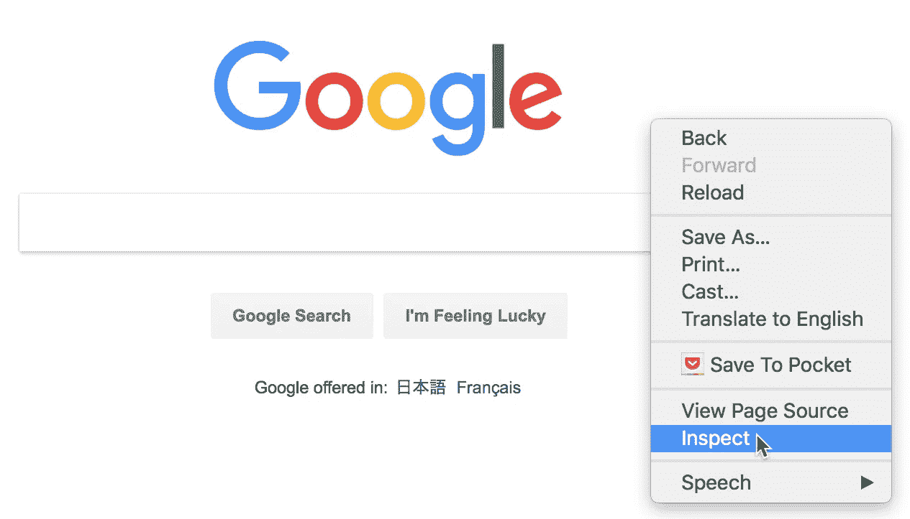

当您单击它时，应该会出现这样一个窗口:

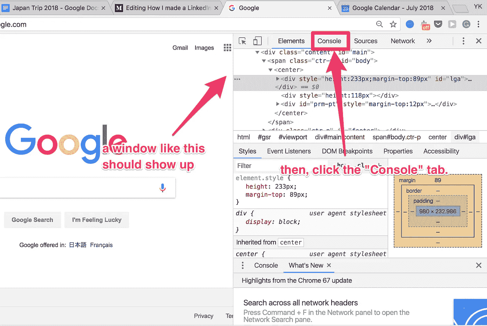

然后点击**控制台**标签，显示 JavaScript 控制台:

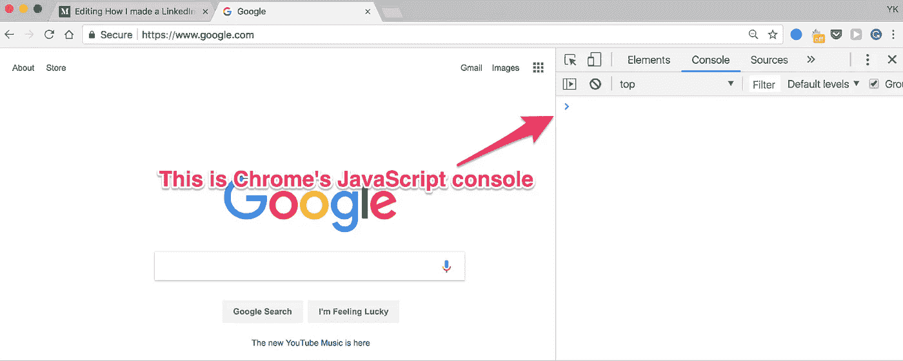

您可以在这里输入任何 JavaScript 代码进行测试。您可以使用输入的代码与浏览器中打开的页面进行交互。

例如，尝试在控制台中键入以下代码，然后按 enter 键。

```
selected = document.querySelector('body');
```

这将选择浏览器中打开的页面上的 **body** 标签。然后，它将它赋给一个名为**的新变量 selected** 。

在 Chrome 和 Firefox 中，对此有一个简写:

```
selected = document.querySelector('body');
```

相反，你可以这样写:

```
selected = $('body');
```

[这段代码相当于上一段。](https://stackoverflow.com/questions/22244823/what-is-the-dollar-sign-in-javascript-if-not-jquery)

在整篇文章中，我将使用这种速记符号，带有美元符号——只是为了使代码简短。

如果您对我将要向您展示的代码不感兴趣，请随意跳到结尾，在那里我将讲述发生了什么以及我从这次经历中学到了什么。

现在，让我们浏览一下我们的机器人代码。

## 步骤 1:找到目标元素

首先，您需要编写一段代码来找到您想要单击的按钮。

首先，登录 LinkedIn。然后，转到我的网络选项卡。目前在[https://www.linkedin.com/mynetwork/](https://www.linkedin.com/mynetwork/)(2018 年 7 月)。

你应该可以在那里的区找到你可能认识的**人。**

然后，在 Chrome 上，右键点击其中一个推荐人的“连接”按钮。然后点击**检查**。

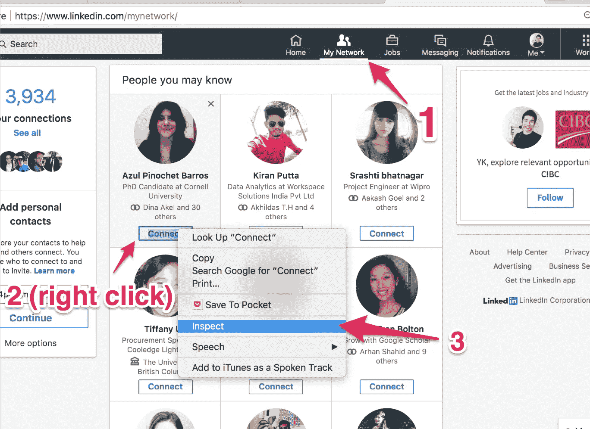

您刚才单击的元素将在开发人员窗口中突出显示。

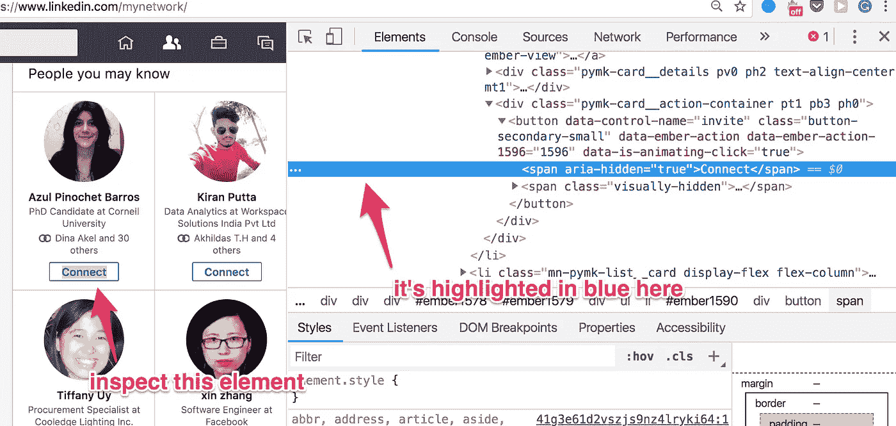

这是用蓝色突出显示的 HTML 代码:

```
<span aria-hidden=”true”>Connect</span>
```

这是一个 **span** 选项卡，显示文本:**连接**。我们真正想点击的不是这个，而是它的父元素，一个按钮。

您可以在我们选择的 span 元素的正上方找到它。

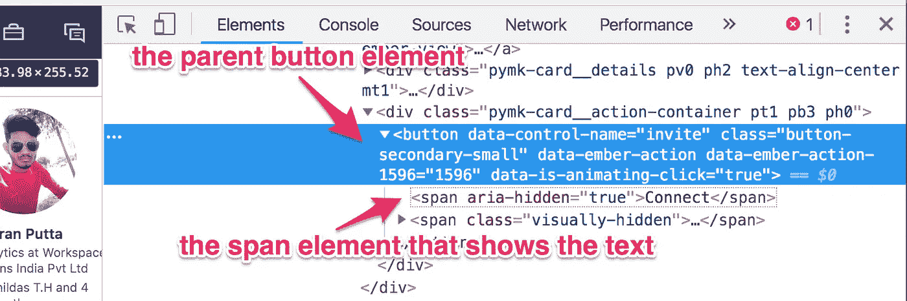

让我们来看看这个按钮元素:

```
<button data-control-name=”invite” class=”button-secondary-small” data-ember-action=”” data-ember-action-1596=”1596" data-is-animating-click=”true”>
 <span aria-hidden=”true”>Connect</span>
 <span class=”visually-hidden”>
 Invite Azul Pinochet Barros to connect
 </span>
</button>
```

这里有很多东西，但这是最重要的部分:

```
<button data-control-name=”invite” ...>
 <span aria-hidden=”true”>Connect</span>
 ...
</button>
```

基本上，这是一个按钮元素，它的属性`data-control-name`是`invite`。

在我们的脚本中，我们需要做的就是像这样选择元素并单击它们。

您可以用这段代码选择这些元素:

```
selected = $(“button[data-control-name=invite]”);
```

这读作:选择所有`data-control-name`为`invite`的按钮元素。

*注:貌似 LinkedIn 的网站用的是 jQuery。所以，上面的批注其实是一个 jQuery 选择器，* [*而不是 Chrome*](https://stackoverflow.com/questions/22244823/what-is-the-dollar-sign-in-javascript-if-not-jquery) *定义的辅助函数。令人困惑的是，他们的行为略有不同。*

无论如何，一旦你在 Chrome 控制台上运行这段代码，你应该会看到已经选择了正确的元素。

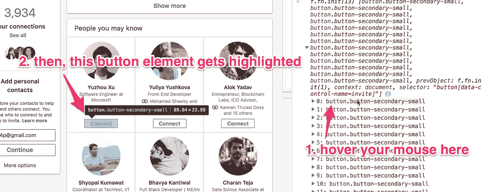

这是确保选择了正确元素的方法。

现在，使用这段代码- `selected = $("button[data-control-name=invite]");`您的浏览器找到多个按钮元素，并将它们放入一个数组中。要选择第一个元素，只需选择数组中的第一个元素，如下所示:

```
toClick = $("button[data-control-name=invite]")[0];
```

然后，你可以用这个点击它:

```
toClick.click();
```

如果通过，您应该会看到一个确认窗口弹出。

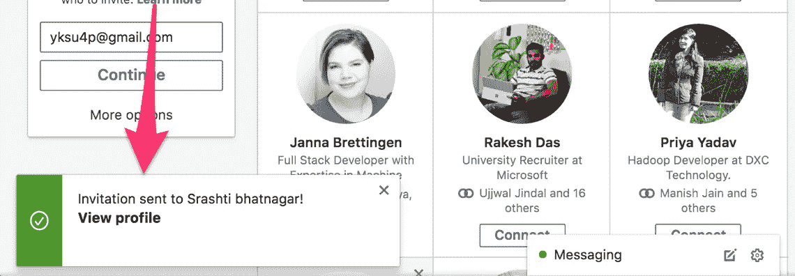

当您点击 ***连接*** 按钮时，会出现一个确认窗口

# 步骤 2:遍历多个目标元素

下一步是遍历多个目标元素，这样我们就可以添加多个人。

经过一些实验后，我意识到有一种比我之前展示的方法更简单的方法来选择多个按钮并遍历它们。

首先，使用 Inspect 元素进一步分析这个页面的结构。你应该能看出来，你可能认识的**人** 只是一个无序列表。

您应该能够找到如下所示的代码:


父元素是一个`ul`(无序列表)元素。它的子元素是`li`(列表项)元素。

每个`li`元素代表你在屏幕上看到的**个你可能认识的人**张卡片。

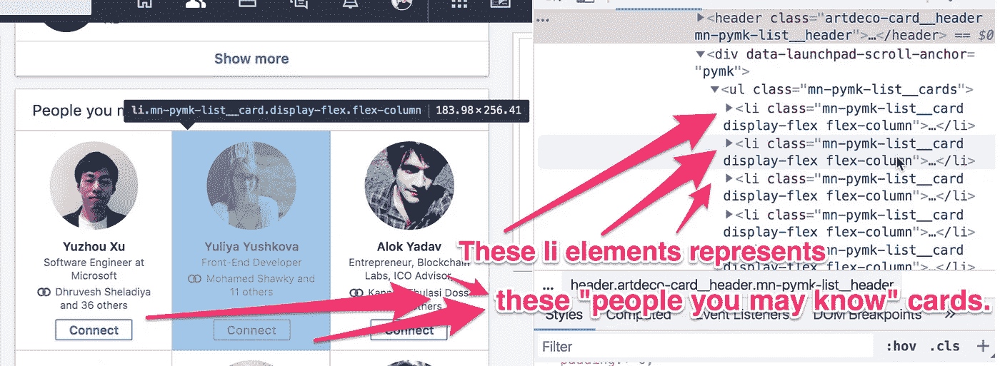

通过选择这些`li`元素，而不是直接选择按钮，通过多人实际上变得更容易。

您可以选择这个`ul`元素，它是`li`元素的父元素，如下所示:

```
ul = $('ul.mn-pymk-list__cards')[0];
```

这表示“选择带有类`ul.mn-pymk-list__cards`的`ul`元素。”我们需要在末尾添加`[0]`，因为原始结果是一个包含单个元素的数组。

您可以选择`ul`元素下的第一个`li`元素(第一个人的卡片)，如下所示:

```
firstLi = ul.querySelector('li');
```

我们不需要在这个语句的末尾添加`[0]`，因为`querySelector()`函数只返回一个元素。

然后，在`firstLi`中，你可以选择我们需要点击的按钮，就像这样:

```
buttonToClick = firstLi.querySelector("button[data-control-name=invite]");
```

用`buttonToClick.click()`点击这个按钮后，我们应该移除这个`li`元素，这样我们就可以转到下一个`li`元素(下一个人的卡)。我们可以这样做:

```
ul.removeChild(firstLi);
```

把它们放在一起，把所有的东西放在一个 while 循环中，你会得到这样的结果:

```
ul = $('ul.mn-pymk-list__cards')[0];
firstLi = ul.querySelector('li');
while(firstLi){ // do this while firstLi still exists.
  buttonToClick = firstLi.querySelector("button[data-control-name=invite]");
  ul.removeChild(firstLi);
  firstLi = ul.querySelector('li');
}
```

这段代码应该可以工作，但是它有几个问题。

*   我们添加人员*真的很快*，所以当你运行这段代码时很难知道发生了什么。
*   我们没有记录我们添加了多少人。
*   我们假设`buttonToClick`总是可以点击的正确按钮。有时这个按钮会显示“邀请”而不是“连接”。我们不想点击太多的“邀请”按钮。

# 步骤 3:精炼我们的代码

我已经解决了上面提到的所有问题，并编写了一段相对简单的代码。

这也是[这里](https://gist.github.com/ykdojo/aea4cf27fec4bbb5a175e11bae39cb2d)的大意。也许在那里更容易阅读。

```
// this function allows us to stop our code for |ms| milliseconds.
function sleep(ms) {
  return new Promise(resolve => setTimeout(resolve, ms));
}// I've put our main code into this function.
async function addPeople() {
  ul = $('ul.mn-pymk-list__cards')[0];
  firstLi = ul.querySelector('li');
  count = 0; // this is the count of how many people you've added
  while(firstLi && count < 100){ // stop after adding 100 people
    buttonToClick = firstLi.querySelector("button[data-control-name=invite]");
    // make sure that this button contains the text "Connect"
    if (buttonToClick.innerText.includes("Connect")){
      buttonToClick.click();
      count += 1;
      console.log("I have added " + count + " people so far.");
    }
    ul.removeChild(firstLi);
    await sleep(1000); // stop this function for 1 second here.
    firstLi = ul.querySelector('li');
  }
}addPeople();
```

如果您仔细检查这段代码，您可能会注意到我所做的几处更改:

*   我已经把我们的代码放到了一个名为`addPeople()`的*异步*函数中。在这个函数中，我们每添加一个人，就用`sleep()`函数暂停一秒钟。更多关于这个模式的信息[在这里](https://stackoverflow.com/questions/951021/what-is-the-javascript-version-of-sleep)。
*   我添加了一个`count`变量来记录我们添加了多少人。
*   我加了这个 if 语句:`if (buttonToClick.innerText.includes("Connect"){...}`。这样，我们可以确保我们点击的按钮中包含单词“Connect”。

当我运行修改后的代码时，它看起来像这样:

用我的 LinkedIn 脚本添加一堆人(没有音频)

# 第四步:进一步改进！

正如我上面展示的一样，当我实际使用我的机器人在 LinkedIn 上添加一群人时，我有了更多的功能。

首先，我使用了我前面提到的 Greasemonkey 来记录添加的总人数。

此外，为了避免被 LinkedIn 检测为机器人，我添加了一些东西:

*   我把我加人的顺序随机化了。
*   我随机分配了每次添加新成员时等待的时间。

如果你有兴趣解决这些问题，我会把它们作为练习题留给你来解决。

# 发生了什么

通过我的脚本，我最终添加了 2000+个连接。然后，如果我没记错的话，大概有 400 个加我回来了。

结果一周左右我就从 300 左右的连接到 700+的连接！

然后我被 LinkedIn 禁止添加任何人。我不知道我会被禁赛！我有点害怕，但大约几个月后禁令解除了。

更重要的是，我能够从这 400 多个新关系中获得一些采访。其中一次采访是在一家名为 Palantir 的公司。

下面是我从他们那里收到的信息截图:

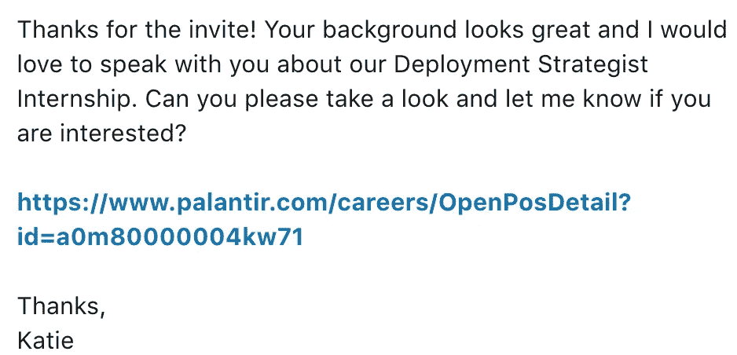

# 我从这次经历中学到了什么

当时我觉得我做的事情很傻，但最终我学到了很多东西。

## 外卖#1

首先，我意识到 LinkedIn 实际上是为了找工作。毕竟，我可以用我的机器人得到一些工作面试。

然后，过了一段时间，我也意识到添加几千个随机的人是*而不是*使用 LinkedIn 最有效的方式。用那种方法，你最终会增加很多你不需要的人。

所以，我改变了我的方法，变得更加专注。

按照我的新方法，我只会添加我想去的公司的招聘人员。然后，我只会给加我回来的人发消息。

事实证明，这是 LinkedIn 采取的一个更专注、更有效的策略。有了这个策略，我就能在多家科技公司获得更多的面试机会，包括 Yelp 和 Xamarin。这一次，我不需要添加成千上万的新连接来实现这个结果！

注:我在[这篇文章](https://medium.freecodecamp.org/here-are-4-best-ways-to-apply-for-software-engineer-jobs-and-exactly-how-to-use-them-a644a88b2241)中更多地谈到了战略，以防你对此感到好奇。

## 外卖#2

享受乐趣是磨练编程技能的最佳方式！

通过这个特别的项目，我能够磨练我的 JavaScript 技能。我了解到的情况包括:

*   如何设置功能执行之间的时间间隔
*   如何用 JavaScript 选择某些 HTML 元素
*   如何用 Greasemonkey 在本地存储数据

我通过这个项目学到了这些东西，感觉一点都不像学习，因为太好玩了！

## 外卖#3

从这次经历中，我明白了有时候做一些奇怪的事情是值得的。如果你有任何这样做的倾向，不要害怕有点淘气和冒险！

即使在这个小实验之后，我仍然继续做一些奇怪的事情来取乐。

例如，当我在微软实习时，我做了一个小实验，我“偷”了一堆员工密码。我通过发送一封钓鱼邮件做到了这一点。这应该是一个巨大的抽奖活动，奖品包括 Xbox 和 Surface 笔记本电脑。那是我的黑客马拉松项目！

我还在 YouTube 上开了一个编程教育频道，并最终决定让 T2 全职工作，并辞去全职软件工程师的工作。

也许所有这些事情对其他人来说都有点奇怪。但是每次我经历这些经历时，我都学到了一些新的东西，并且一路上我获得了很多乐趣。我想说最后一个成就了我的事业。

所以不要害怕尝试一些奇怪的东西，只是为了好玩！你可能会学到一些有价值的东西。

感谢您阅读这篇文章！