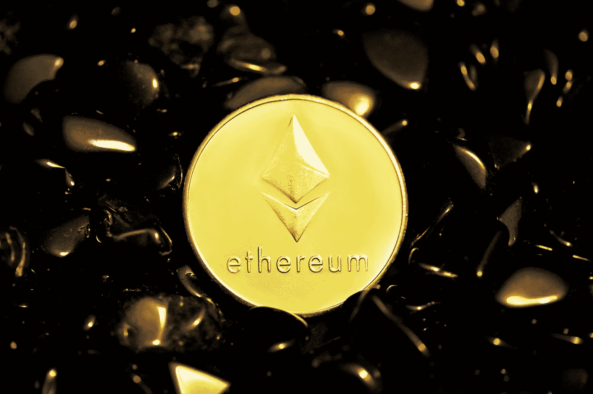
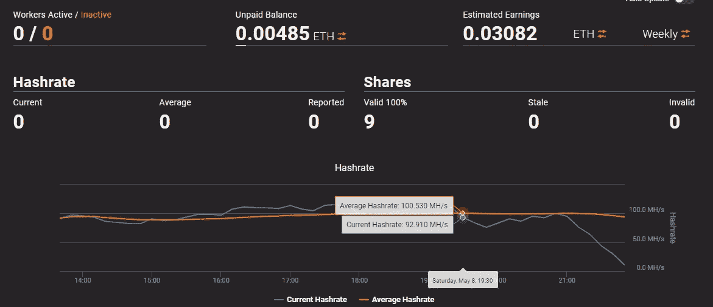
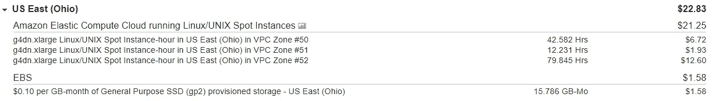
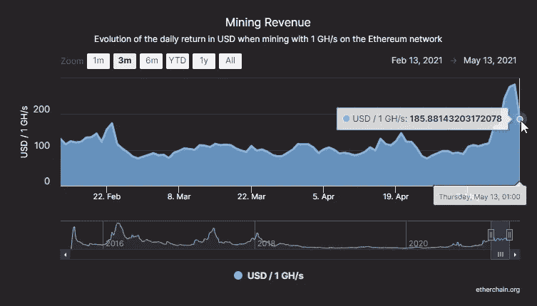
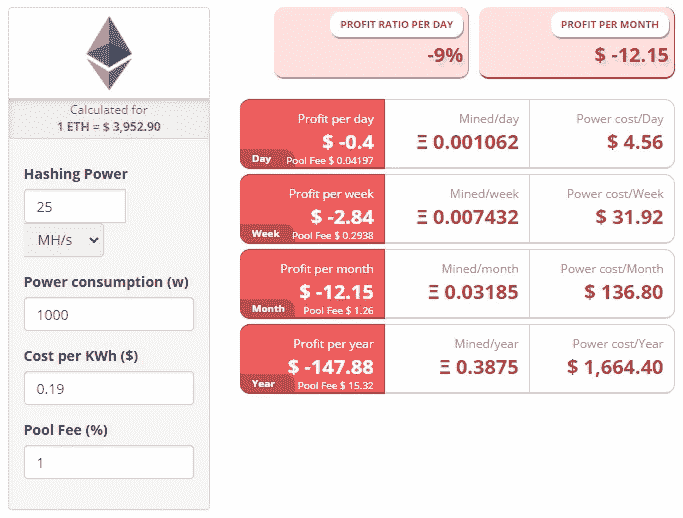

# 我如何在 AWS 上挖掘以太坊获利

> 原文：<https://betterprogramming.pub/how-i-made-a-profit-mining-ethereum-on-aws-2ffe3aab579>

## 游戏真的值得玩吗？



[行政长官](https://unsplash.com/@executium?utm_source=medium&utm_medium=referral)在 [Unsplash](https://unsplash.com?utm_source=medium&utm_medium=referral) 上的照片

我只想告诉大家:

*   这是可能的
*   AWS 不会禁止你在他们的服务器上挖矿
*   它只在特定时间有利可图

这当然是有可能的，而且我通过侥幸的时机和一点点调整做到了这一点。根本没想到会盈利。我只是尝试学习更多关于采矿的知识，尝试一些新的东西。Michael Ludvig [发表了一篇优秀的文章](https://michael-ludvig.medium.com/mining-bitcoin-and-other-crypto-on-aws-eb172940059f)，记录了在 AWS GPU spot 实例(临时廉价服务器)上运行`ethminer` 的设置，我想尝试一下，学习一些东西。

我碰巧在 2021 年 5 月 8 日写了这篇文章，这一天(我后来才知道)是以太坊矿业历史上盈利能力最好的几天的开始。我在俄亥俄州 AWS 地区使用推荐的 g4dn.xlarge 实例类型启动了 [CloudFormation 模板](https://github.com/mludvig/aws-ethereum-miner)(Michael Lud vig 创建的)。

完成此操作的步骤大致如下:

*   创建 AWS 帐户
*   创建一个以太坊钱包
*   上传云形成模板
*   输入你的以太坊钱包公共地址(接收所有以太)

顺便说一下，创建一个以太坊钱包比许多网站想象的要简单得多。你不需要注册*CryptoWalletExchangeBase*然后上传你的身份并在网络摄像头上向机器人挥手。“钱包”可以归结为一个公共地址和一个私钥，如下所示:

**公共演讲** :
`*0x6672b0A9e258b6323450156fd5582ea112fb39C2*`
你可以把这个发给任何人。乙醚可以寄到这个地址。

**私钥** : `*cb1b8e05e47f4d88de19ad4cc7abe16abba67c3c85586158de0266c6b4a99*`
(绝不分享你的私钥)
这个可以用来访问钱包里的以太。所以你可能想保守这个秘密。

…您可以自己生成这些。例如:

重要的是确保你不会丢失它们，并确保没有其他人知道私钥是什么。所以在一个没有联网的掌上电脑上运行代码，把它们存储在一个加密的软盘上，然后烧掉证据。

在第一次挖掘尝试中，我让系统运行了一段时间，AWS EC2 Spot 实例(廉价服务器)总共运行了 134.658 个小时，我得到了 0.00485 以太网，这在当时价值 19 美元。

你可以在以太网上查看你的公共钱包地址:[https://ethermine.org/miners/your_public_address/dashboard](https://ethermine.org/miners/your_public_address/dashboard)



以下是我当时 AWS 账单的快照:



所以还没有利润，但没有我预期的那么远。

我担心 CloudFormation 模板中使用的 AutoScalingGroup 可能会有额外的成本，但这是免费的；您只需为运行应用程序所需的 AWS 资源付费。但我确实注意到，有几个实例要么崩溃，要么停留在 0 MH/s，或者只有 10-20 MH/s，而不是运行在其他人管理的最佳 25.43 MH/s。

*如果能够自动终止性能不佳的实例，也许系统会做得更好。*

我查了利润计算器。如果这些 AWS EC2 Spot 实例以每小时 0.1578 的速度运行，并且我达到了大多数情况下达到的 25.43 MH/s，那么所有灯都是绿色的。


【https://www.cryptocompare.com/mining/calculator/eth? hashing power = 25.43&hashing unit = MH % 2Fs&power consumption = 1000&CostPerkWh = 0.1578&mining poolfee = 1

弄清楚为什么有些实例失败了，而有些没有，这不属于“摆弄以太坊”的范围，所以我拼凑了一些东西。我决定在 EC2 Spot 实例中编写一些 SSH 代码来检查错误或低散列率。我在 AWS 中创建了一个 KeyPair，下载了它，并向 CloudFormation 模板添加了一个参数，这样我就可以指定这个 KeyPair 的名称，并确保 spot 实例启动模板使用它。

```
Parameters:
  ...
  KeyPairName:
    Description: Name of EC2 key pair assigned to instances.
    Type: String...LaunchTemplate:
  Type: AWS::EC2::LaunchTemplate
  Properties:
    ...
    KeyName: !Ref KeyPairName
```

这意味着我现在可以直接 SSH 到任何一个 spot 实例来查看它们的运行情况。我编写了一个简单的 Node.js 脚本来访问所有正在运行的实例，并检查 CPU 速率和散列速率。

在远程系统上运行命令并使用 NodeJS 获得结果可以像这样完成:

因此，要获得 CPU 利用率…

或者 hashrate(如 ethminer.log 文件中所报告的)…

我知道，这些是脚本中脆弱的部分，我已经去掉了 catch 块，但是你已经明白了。

使用 AWS SDK，我们可以获得正在运行的所有 spot 实例的列表…

…当其中一个实例不再适用时，我们可以终止它:

因此，使用这些部分，我编写了一些可以每 20 秒运行一次的代码，来获取所有 spot 实例的 CPU/hashrate，如果它们的 hashrate 较低或者连续 3 次检查的 CPU 使用率较低，就终止它们。AutoScalingGroup 将自动创建新的 spot 实例来替换我们的死实例。事情得到了改善。

到现在为止，在我第二轮生成以太坊的过程中，我已经运行 spot 实例超过 24 小时了。

我目前未支付的余额:0.01012 乙醚，也就是说 **0.00535 乙醚**已经在最近 **24 小时**赚到了。

```
Cost for spot instances = 24 hours * $0.1578 * 5 instances = $18.94
```

*EBS gp2 卷每月每 GB 0.10，我们每个实例有 100GB。也就是每小时每 GB 0.000137。*
EBS 卷的成本= `100 * 0.000137 * 24 * 5 = **$1.64**`

```
Total cost = $20.58
Value of Ether mined = $22.10
```

那很好。

到目前为止，我还没有考虑到税收。在英国，我们为 AWS 服务支付 20%的税(增值税)(除非我们是一家销售自己服务的公司，可以扣除它)，所以我的实际成本是 **$24.70** 。不太好。

但是第二天(2021 年 5 月 12 日)，在又运行了 24 小时的 5 个实例后，我赚了 **0.0079 乙醚**，其价值为 **$33.96** ，而我的成本为 **$24.70** (包括增值税)。好吧，这样更好，但是为什么会有这么大的差别呢？

就目前而言，我并没有太多的质疑。我向 AWS 申请提高我在廉价地区(俄亥俄州、弗吉尼亚州和俄勒冈州)的现货实例配额/限额，并检查是否还有其他可以调整的地方。

我可以看到，我们为每个 spot 实例支付了 100GB 的 gp2 存储。他们都在使用“深度学习 AMI(Ubuntu 18.04)36.0 版”，该版本附带了所有必要的 NVIDIA 驱动程序。首先，如果我从映像中删除了 Anaconda Python 平台(`~/anaconda3`)，那么所需的磁盘大小就会减少到 36GB，这样我们就可以使用 40GB 的驱动器(节省 60%的 EBS 存储成本)。此外，较新的 gp3 存储(每 GB 0.08 美元)比 gp2 存储(每 GB 0.10 美元)便宜。根据你的使用量，你必须为 gp3 支付额外的费用，但总的来说，对我们来说还是便宜的。

5 月 14 日，当我达到 **0.1 以太**(当时从以太矿(我们使用的以太坊矿池)获得支出的最小值)时，我运行了 40-60 个 spot 实例，具体取决于它们的可用性。在过去的几天里，我花了将近 320.70 美元(含税)来买 0.1 美元的乙醚(T21，387.73 美元)。


[https://ethermine.org/](https://ethermine.org/)

就在这个时候，我了解了采矿的盈利能力:



[https://etherchain.org/charts/miningRevenue](https://etherchain.org/charts/miningRevenue)

事情开始变得不那么令人兴奋了:



[https://www.cryptocompare.com/mining/calculator/eth?hashing power = 25&hashing unit = MH % 2Fs&power consumption = 1000&CostPerkWh = 0.1890&mining poolfee = 1](https://www.cryptocompare.com/mining/calculator/eth?HashingPower=25&HashingUnit=MH%2Fs&PowerConsumption=1000&CostPerkWh=0.1890&MiningPoolFee=1)

基本上，事情在改变。埃隆·马斯克[不仅用“确实”](https://twitter.com/elonmusk/status/1394001894809427971)这个词回复了一条推文，让以太坊的价格再次下跌，而且美元对哈希拉的汇率也开始再次正常化。在高峰期，我以每秒 1 千兆赫的速度 24 小时开采，成本为**~ 183**美元，盈利能力为每天**~ 282**美元。自 5 月份以来，盈利能力仅达到**$ 111**/GH/s/day(截至 2021 年 10 月 23 日),这使得这一切都无利可图。我在正确的时间拔掉了插头。

盈利能力必须高于 **$183** 每天然气水合物/秒/天。盈利能力是基于在任何给定时间有多少交易被放在网络上，以及有多少矿工在那里采矿，从而运行网络。五月份的价格飙升被归因于 Elon、DeFi 和 NFTs 的漩涡，这给了矿工们很多工作要做。我们可以通过查看每个区块被开采所用的时间、网络上所有矿工的当前哈希值以及当前区块奖励来计算盈利能力。然后，我们可以将自己的哈希表插入其中，看看我们有资格获得多大的份额…

我们可以从 https://www.etherchain.org/index/data 获得这些价值，以及以美元计算的当前价格。

由此我们可以计算出 1GH/s/天采矿的美元价值…

今天(2021 年 10 月 23 日)`userDollarPerDay` = **$73.44** 。比我们**的 183 美元**成本低多了。

尽管我的 0.1 乙醚的价值超过了我当时支付的价格，但在可预见的未来，乙醚的价格显然也非常不稳定。因此，即使你在“有利可图”的时候开采它，你也是在赌你正在积累的乙醚会保持价值，或者至少在你卖掉它之前。我设法以合适的价格卖掉了乙醚，但不久之后，它的价值就远远低于我的买价了。与此同时，数小时燃烧能量，让这个大型数学游戏在空中运行，只是为了收支平衡或向贝佐斯扔钱。这真的不是一个值得玩的游戏。

YMMV。