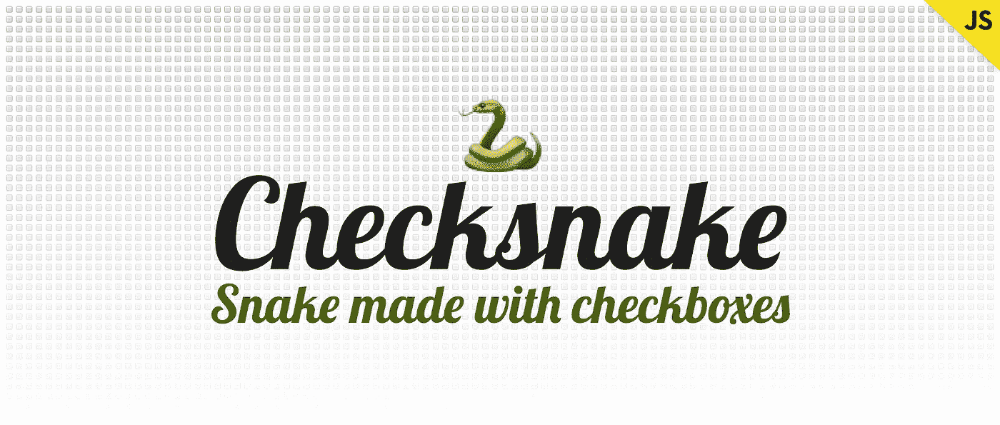
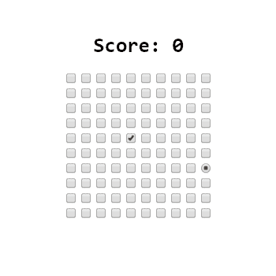
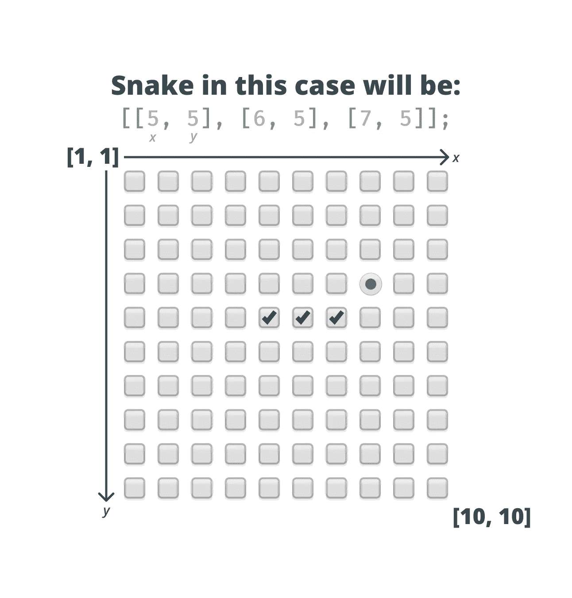
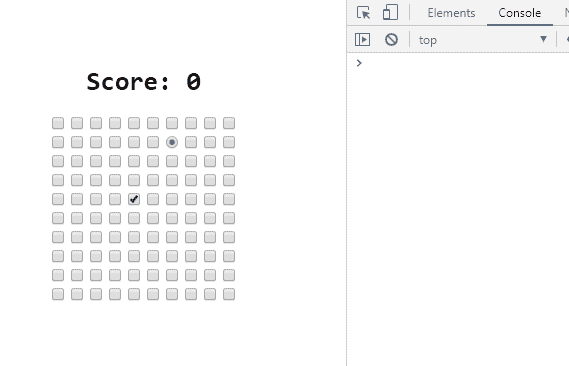
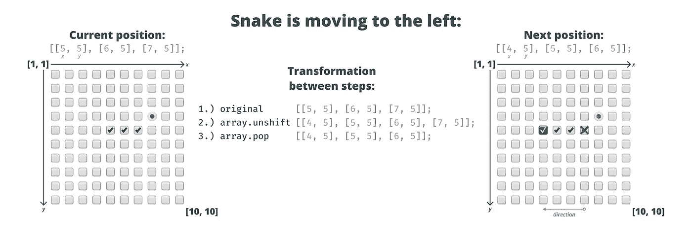
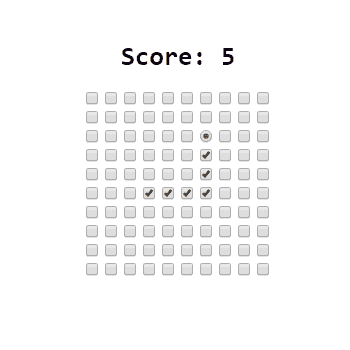

# 我如何用复选框制作一个贪吃蛇游戏

> 原文：<https://betterprogramming.pub/how-i-made-a-snake-game-out-of-checkboxes-5a5e3c4c07b1>

## 用 JavaScript 重新创建贪吃蛇游戏

我一直喜欢尝试经典游戏并在浏览器中重现它们的想法。它们似乎总是提供一些新的挑战，看看浏览器内部能实现什么是很有趣的。

这一次，我有了一个想法，从追逐单选按钮的复选框中重新创建贪吃蛇游戏；苹果。

看到其背后的逻辑以及如何将其转化为 JavaScript 非常有趣。因为我也喜欢动画，所以当游戏结束时，我用一个漂亮的 CSS 转换完成了整个项目。

这是最终的结果，也就是说，让我们看看这个游戏是如何被创造出来的。

本教程的输出

# 创建索引文件

第一件事当然是创建 HTML 文件:

我将整个项目分成四个不同的文件:

*   用于定义将在整个游戏中使用的常量。
*   `world.js`用于生成复选框的网格。
*   `snake.js`这将处理游戏逻辑。
*   而`game.js`，它唯一的目的就是把蛇和苹果带到这个世界上来。

我还添加了一些小的样式，让世界在屏幕中央对齐:

# 定义配置

我做了一个单独的配置文件，这样我就可以调整组成游戏的一些数字，而不必触及逻辑。让我们来看看里面有什么:

在这里，我定义了在游戏中起关键作用的变量，例如:

*   这个`speed`，负责蛇的速度。我尝试了各种设置，觉得大约每 100 毫秒更新一次复选框是个不错的速度。
*   世界的大小；这意味着我们要生成一个 10x10 的网格。
*   蛇的起点。我选择了中间位置。
*   `snake`本身。这将是一个多维数组，保存蛇的每个部分的引用。
*   将用于控制蛇的箭头的关键代码。
*   和两个`let`s；一个用于存储当前的移动方向，另一个将用作指向一个`setInterval`的指针，它将更新蛇的位置。

保存每个线段坐标的 snake 变量的内容

# 创造世界

为了开始，我首先在屏幕上生成了一些复选框。这是我使用`worldSize`变量的地方。

我在彼此内部创建了两个循环。一个用于行，一个用于列。在每一行中，我为每一行创建了一个`div`，正好包含 10 个复选框；`worldSize`的值。

你会得到一个 10x10 的网格。在此之后，我们可以开始工作的核心游戏逻辑。

# 添加助手功能

但在此之前，我创建了一些辅助函数，以后会很方便。

比如通过(x，y)位置获得一个复选框，使其被选中/取消选中，或者在世界中放置一个苹果，这将由一个单选按钮表示。

## 得到苹果的位置

我们还需要一个函数来获取苹果的位置，因为我们想知道蛇什么时候拿起一个苹果。

为了了解这一点，我简单地遍历了每一行和每一列，并检查输入的类型是否是收音机。注意，我还需要将`row.children`转换成一个数组，因为你不能在`HTMLCollection`上调用`forEach`。

当蛇取回苹果时，我们希望将它显示在另一个随机位置。

## 得到一个随机的位置

为此，我创建了一个名为`getRandomPosition`的独立函数:

它通过遍历每一行和每一列来获取世界上所有可用的位置，并检查当前项是否是未选中的复选框。

我们不想将苹果的位置添加到`availablePositions`数组中，所以我们需要特别检查它是否是一个复选框。如果这个位置是空的，我把它放入数组，并从中选择一个随机的索引来返回一个随机的位置。

## 增加分数

当然，每个玩家都想得到奖励。一旦蛇收集到一个苹果，我们应该奖励玩家一分。我将评分放入一个单独的函数中:

使用函数集轻松获得位置和设置分数

# 处理用户输入

有了这些，下一步就是处理用户输入。我想用箭头键让蛇移动。配置文件保存了所有关键代码。

因此，我在文档上附加了一个`keydown`事件监听器，并在按键代码之间切换，将方向设置为`up`、`down`、`left`或`right`。

我还检查了当前方向。如果蛇已经向上移动，玩家按下向下键，我们不希望切换方向，因为这意味着蛇可以简单地通过移动来碰撞自己。

在这里，我将`moveInterval`设置为`setInterval`，调用`move`函数，这将实际上使蛇移动。但是在研究函数如何处理移动之前，我快速设置了`game.js`文件:

我们从配置文件中定义的`startPoint`开始。记住，由于变量是一个数组，而`checkItemAt`函数需要两个参数(x，y)，我们需要使用 spread。

当然，我们也想在每次游戏开始时把苹果放在一个随机的位置上。

# 添加运动

最后，游戏的核心逻辑是检查相应的复选框。为了充分理解实现是如何工作的，让我们首先看看检查复选框背后的逻辑是什么。

这是我们想要遵循的流程:

*   我们需要知道苹果的位置，头部，以及蛇的最后一段。
*   根据`movingDirection`，我们想要增加或减少头部的 x 或 y 位置。
*   我们还想检查下一个位置是否有苹果。因为在这种情况下，我们需要增加蛇的长度以及增加分数，并将苹果放在其他地方。
*   最后但同样重要的是，我们需要检查下一个头部位置是否已经检查过了。如果它被选中，这意味着蛇要打自己，所以它的游戏结束。

我们只关心头部和最后一个元素的位置，而不关心中间的复选框的原因如下:

我们只需要得到头部的新位置，并把它放在数组的最开始。这就是`array.unshift`的作用。

然后我们干脆去掉最后一段`array.pop`。所以现在，数组中的每个坐标只用两行就更新了。

我为每个位置定义了一个变量，并创建了一个函数来更新蛇的位置。

在这里，我简单地循环`snake`数组，并在给定的位置检查每个复选框。然后是我更新头部位置的部分:

因为我想让这条蛇环绕世界，如果它撞到边缘就不会死，所以我检查了它是否到达了世界的尽头。如果有，我简单地把它移到另一端，或者是`pos1`或者是`pos10`，这取决于方向。

最后，我们还需要检查头部的位置是否与苹果的位置相匹配。这意味着我们需要给蛇添加一个新的部分，并将苹果放在其他地方。

在这种情况下，由于蛇的长度增加，我们不需要从数组中删除最后一项。否则，我们会的。

# 游戏结束

现在，如果蛇撞了自己却什么也没发生，那就没有挑战了。所以通过在`move`函数中添加下面的`if`语句，我们可以清空地图，写出 *Game Over…* ，播放一个好看的动画。

我们只需要检查头部的下一个位置是否是复选框，以及该位置是否已经被选中。

我还添加了一个`playWave`函数，首先动画头部，然后是其余的输入。动画很简单:将输入缩放至 200%,然后将其缩放回原始大小:

每当一个输入得到了`wave`类，它就会被动画化。

这里的技巧是延迟每行的动画。我们希望按顺序从(1，1)一直到(10，10)得到每个输入。然后我们可以循环遍历它们，并根据它们的索引来延迟动画:

现在游戏可以开始了。

# 结论

尝试创建游戏是解决逻辑问题的一个很好的方法，这是一个前端开发人员很少遇到的问题。

如果你想得到一个完整的源代码，你可以在我的 [GitHub repo](https://github.com/flowforfrank/checksnake) 中这样做。如果你更愿意尝试游戏并在线调试，我也可以在我的[域名](https://allma.si/checksnake)下下载。

你在重现一个需要你跳出框框思考的著名游戏时有没有一些乐趣？请在下面的评论中告诉我。感谢您花时间阅读本文，编码快乐！

