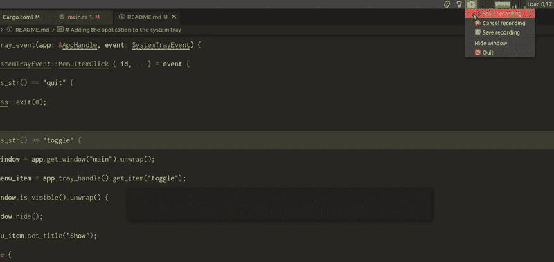

# 我如何通过将我的生产力应用程序添加到系统托盘中来让它更快地打开

> 原文：<https://betterprogramming.pub/how-i-made-my-productivity-app-open-faster-by-adding-it-to-the-system-tray-d1d61066534e>

## 调试我的焦点工具的简要指南


由[奥斯汀·迪斯特尔](https://unsplash.com/@austindistel)在 [Unsplash](https://unsplash.com/s/photos/guide?utm_source=unsplash&utm_medium=referral&utm_content=creditCopyText) 上拍摄的照片

在上一篇文章的[中，我分享了我是如何开始开发一个名为`focus`的小型生产力工具的。](/how-i-created-the-focus-app-using-react-and-rust-fd8fd072d1a7)

这个工具的想法很简单:

*   我在电脑的任何地方点击键盘快捷键。
*   屏幕中央会弹出一个包含文本输入的窗口。
*   当我点击`Enter`时，我输入一些我想以后记住的想法/任务。
*   弹出窗口消失。
*   我输入的所有想法都被添加到一个文本文件中。该文件的路径由环境变量`FOCUS_TASKS_PATH`设置。

我有一个工作版本，但有一个问题:当我点击键盘快捷键时，弹出窗口需要大约两秒钟才能打开并正确呈现。让它更快地“冒出来”。

# 为什么慢？只是文字输入吧？

根据我对 [Tauri 的流程模型](https://tauri.studio/v1/guides/architecture/process-model)的理解，当我点击快捷方式时，会发生以下情况:

*   创建了一个核心流程。这是运行 Rust 代码的进程。
*   一个`webview`进程由核心进程创建。这是运行前端代码的那个。

你可以把`webview`想象成一个迷你浏览器，它拥有显示网页和处理交互所需的一切(解析 HTML、应用 CSS、执行 JavaScript 等等)。).此外，它还可以与核心进程通信来运行 Rust 代码。

这解释了为什么启动它需要时间(就像打开 Chrome 或 VSCode 需要时间一样)。

# 怎么让它开的更快？

我的想法是打开应用程序一次，让它在后台运行，这样当快捷方式被点击时，我们只显示窗口，这应该比从头开始创建它更快。一种方法是将应用程序添加到系统托盘(任务栏上有小图标的部分。你知道你关闭一个应用程序，但仍然发现它的图标告诉你“我还活着！”).

# 将应用程序添加到系统托盘

通过遵循[文档](https://tauri.studio/v1/guides/features/system-tray)，首先，我们需要使用`tauri.conf.json`文件在系统托盘上指定我们的应用程序的图标，让我们使用已经存在的 Tauri 图标(我可能需要为这个应用程序设计一个自定义图标，但现在不是优先事项)。

接下来，我修改了`Cargo.toml`文件的依赖部分，以包含我的 Linux 发行版所需要的特性`gtk-tray`。

```
tauri = { version = "1.0.0-rc.11", features = ["api-all", "gtk-tray", "system-tray"] }
```

现在我们需要编辑`main.rs`文件来创建系统托盘，并指定附加到它的菜单项。

`make_tray`功能创建系统托盘，其菜单包含两个项目:`Hide`和`Quit`。

*   最初，显示应用程序窗口；我希望能够通过点击`Hide`菜单项来隐藏它。然后它的文本应该变成`Show`，点击它应该再次显示窗口。
*   点击`Quit`菜单项应关闭应用程序。

如果我现在运行应用程序，我会在系统托盘上看到 Tauri 图标。点击它会显示带有`Hide`和`Quit`项目的菜单，但点击它们没有任何作用。为了在项目被点击时运行一些代码，我们应该使用`on_system_tray_event`方法添加一个事件处理程序:

然后我们定义`handle_tray_event`函数:

结果如下:



# 从前端隐藏窗口

下一步是当输入`Enter`时隐藏窗口，而不是关闭应用程序。为此，让我们更新`App`组件的代码:

现在，当我输入内容并点击`Enter`时，窗口被隐藏，但有两个问题:

1.  当我点击系统托盘上的图标时，菜单项仍然显示`Hide`。
2.  当窗口再次显示时，我上次键入的文本仍然在那里。

让我们从解决第二个更简单的问题开始。我们所要做的就是在调用`add_task`命令后将`content`状态设置为空字符串。

第一个问题更棘手。我没有找到使用 JavaScript API 更改菜单项文本的方法。所以看起来我需要调用 Rust code 来做到这一点。让我们创建一个新命令`hide_window`:

并从前端调用它:

注意，`hide_window`命令接受了一个类型为`AppHandle`的参数`app`，但是当从 Javascript 调用它时，我们没有传递任何参数。Tauri 将根据参数的类型自动注入参数。

# 显示带有全局快捷方式的窗口

到目前为止，当我键入快捷方式时，我正在运行应用程序的一个新实例，但现在我想只显示隐藏的窗口，而不打开一个全新的实例。Tauri 提供了一种[注册全局快捷键](https://tauri.studio/v1/api/js/modules/globalShortcut)并在它们被按下时运行自定义代码的方法。

让我们在`tauri.conf.json`上启用全局快捷键。下面是如何做到这一点:

然后通过向`main.tsx`文件添加以下代码来注册快捷方式`Alt+Enter`:

现在，每次我按下`Alt+Enter`时，字符串`Alt+Enter pressed!`都应该被登录到控制台。但是它不工作，我不知道为什么…直到我在`tao`库:[https://github.com/tauri-apps/tao/issues/307](https://github.com/tauri-apps/tao/issues/307)上发现这个公开的问题

Tao 是 Tauri 用来创建和管理窗口的 Rust 库。根据这个问题，全局快捷方式在 Linux 上不能正常工作。这就是为什么它对我不起作用！

所以，如果我想继续开发这个应用程序，我需要实现一个全局快捷方式来在 Ubuntu 上工作。这就是我将在下一篇文章中做的事情。

再见！