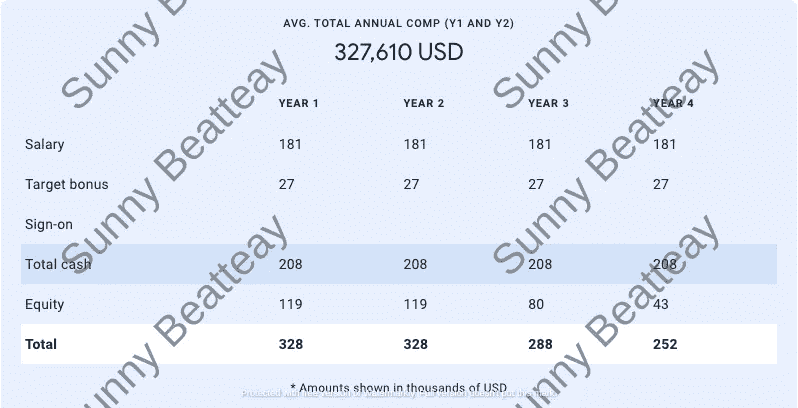
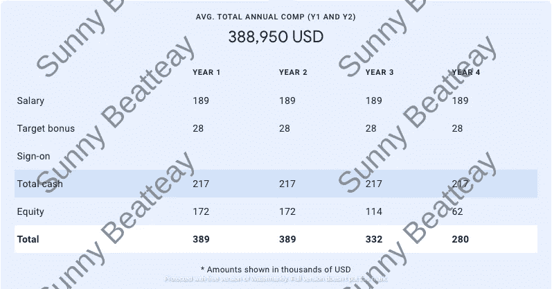
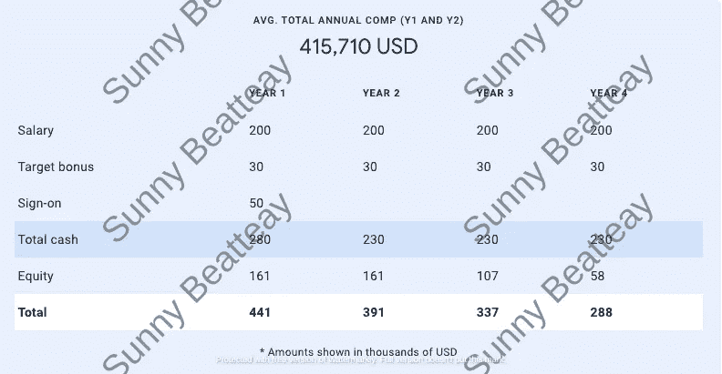

# 我是如何通过谈判向谷歌出价 10 万美元的

> 原文：<https://betterprogramming.pub/how-i-negotiated-100k-from-google-370823b2c79c>

## 我关于充分利用大型科技产品的建议

Photo by [金 运](https://unsplash.com/@jinyun?utm_source=medium&utm_medium=referral) on [Unsplash](https://unsplash.com?utm_source=medium&utm_medium=referral)

我会第一个承认我从来不擅长谈判。在我第一次找工作时，我在谈判中哽咽了。我宁愿连续解决 100 次硬币兑换问题，也不愿向招聘人员要更多的钱。

所以当我最近一次找工作的时候，我知道我的工作已经准备好了。特别是因为我的目标是 FAANG 和其他品牌科技公司，在这些公司中，我特别关注谷歌。

在所有 FAANG 公司中，谷歌是最有声望的，如果不是最有声望的话。它也有最难的面试。众所周知，你必须精通算法、数据结构和系统设计。你还需要大量的运气。

但是谷歌的提议和他们的采访一样臭名昭著。

谷歌因贬低潜在候选人而臭名昭著。许多试图以高级软件工程师身份参加面试的技术候选人都没有通过高级考试。相反，他们收到中等水平的报价。

即使你设法达到了你想要的水平，薪酬待遇也不会有竞争力——至少一开始不会。谷歌对每个级别都有一个薪酬区间，其最初的报价总是在区间的低端。他们对谈判也很固执。

但是，有了足够的杠杆作用和技巧，你可以得到顶级的，甚至是带外的优惠。我从自己的经历中了解到这一点，当时我为自己的高级职位(15 英镑)协商了 10 万美元的加薪。

我是这样做的。

克里斯蒂娜@ wocintechchat.com 在 [Unsplash](https://unsplash.com?utm_source=medium&utm_medium=referral) 上的照片

# 面试

在我开始谈判之前，我需要先看一下面试。

我在找工作的早期面试过谷歌，因为他们进展缓慢。在你得到一份工作之前有许多阶段，每一个阶段都可能持续数周。其中最长的是小组赛阶段，可持续 1-2 周或长达 6 个月。

幸运的是，我能够直接完成这个过程。这是因为我得到了公司里某个人的推荐。由于我以前担任技术主管的经验，我能够跳过最初的技术筛选，直接进入现场面试。此外，我的团队比赛阶段只持续了两周。

但我的经历远非典型。所以，如果你打算去谷歌面试，我建议你在找工作的时候早点去。[点击这里](https://medium.com/@SunnyB/resources-for-prepping-for-interviews-dc9f23bb41fb)获取我用来准备 FAANG 面试的资源。

# 第一次报价

虽然谷歌是我面试的第一批公司之一，但在我参加球队比赛时，已经有其他公司向我发出了邀请(正如我所说，他们进展缓慢)。

在谷歌的典型流程中，在你完成一场团队比赛之前，你不会收到邀请。但有了其他报价在手，谷歌愿意加快进程。当我还在与团队匹配时，他们就让我进入了报价阶段。通过现场面试后的几周内，我的收件箱里出现了一封录用信。

这是随后的提议。

谷歌的第一个报价是 32.8 万美元。作者加了水印。

关于谷歌，需要知道的一件事是，他们有一个不寻常的股权授予计划。对于大多数公司来说，在四年的时间里，你每年会收到四分之一的股权奖励。

但是谷歌的授权时间表是这样的:

*   第一年:33%
*   第二年:33%
*   第三年:22%
*   第四年:12%

他们的时间表是"[前置](https://www.cfodive.com/news/companies-speed-up-salary-hikes-front-load-stock-vesting/619298/#:~:text=Front%2Dloaded%20vesting&text=Google%20is%20also%20reportedly%20increasing,according%20to%20the%20Forbes%20report.)"前两年，你每年会得到三分之一的股权。第二年后，股本迅速下降。他们这样做的原因是为了避免“[四年悬崖](https://news.ycombinator.com/item?id=27767031)”谷歌提供股权更新来弥补这一下降。这是为了激励人们在公司呆得更久。

# 首次谈判

正如我之前提到的，谷歌的第一个报价是你的水平的薪酬带的低端。所以总有商量的余地。

同时，这仍然是一个可靠的提议。试图谈判可能会令人恼火和焦虑。许多人接受第一份工作，只是为了结束面试。但是一点点耐心会有很大帮助。如果我愿意等待并争取更多，成功的机会很大。

我照做了。

招聘人员打电话来讨论这份工作以及我对它的印象。我诚恳地让他们知道我有其他有竞争力的工作机会，并告诉他们我理想的薪酬范围。

许多人认为在谈判中你需要亮出你所有的底牌——但事实并非如此。我小心翼翼地没有说我的其他邀请是什么，也没有透露任何其他的邀请函。

在让招聘人员知道我的目标薪酬后，他们说会看看他们能做些什么。但是他们不能做出任何承诺。

# 第二个提议

我不确定谷歌是否会提高他们的报价，因为我的面试表现不是最好的。还记得我说过谷歌倾向于降低候选人的级别吗？嗯，我就是这样。

我参加了一个高级职位的面试，包括一次行为、一次系统设计和三次编码面试。但我在两轮编码中表现不佳，所以他们只批准了我的中级(L4)职位。

我的招聘人员给了我两个选择:

1.升 L4 级，进入团队赛阶段。

2.做两次额外的编码面试，看看我是否能通过高级律师资格考试。

尽管选择二似乎显而易见，但有一个问题。如果我在补考中表现更差，我可能会再次被降级为初级工程师(L3)。或者他们会断然拒绝我。所以有风险。但是我的目标是“高级”头衔，所以我冒了这个险。

它得到了回报！我在接下来的面试中表现得更好，并且获得了高层的批准。但这对我的谈判不是好兆头。

成功谈判的最好方法之一就是好好面试。你表现得越好，公司就越想让你加入，他们愿意支付的薪水也就越多。这就是为什么我担心我的临时降级会影响我的谈判能力。

但两天后，当我收到一封更新报价的电子邮件时，我的担心就烟消云散了。

谷歌的第二个报价是 38.8 万美元。作者加了水印。

在这一点上，我向招聘人员透露的唯一信息是我有其他的工作机会和我理想的薪酬范围。所以这个更新的报价增加了 6 万美元，仅仅是因为我提出了要求。

现在，如果我只是在谷歌面试，或者我只对在谷歌工作感兴趣，我会接受这份工作。但是我正在面试其他我喜欢的大公司，所以我推迟了签约。

招聘人员说这是薪酬团队会批准的最高报价，但我对此表示怀疑。我还有一个谈判策略。尽管如此，这种策略需要一个非常有竞争力的报价才能成功。

幸运的是，我得到了一个。

# 第二次谈判

当谷歌给我第二次报价时，他们是我的较高报价之一，但这不会持续太久。我面试的另一家公司最终给了我一份比谷歌高出 20%的工作。

有了这个新提议，我回到谷歌，问他们是否可以匹配。而这一次，我给他们看了录取通知书，揭示了套餐的完整明细。这是我向招聘人员摊牌的方式，以表明我对谈判是认真的。

招聘人员重申，他们不确定能否提高之前的报价，但他们会尝试一下。

我不知道谷歌是否会让步，但我满怀希望。当我听到新的提议需要得到主管、副总裁和财务团队的批准时，我知道我遇到了好事。

# 最终报价

带外报价总有一定程度的风险。因为它需要多人的批准，所以有可能会被拒绝。因此，在接下来的几天里，我屏住呼吸等待着，急切地想知道这个提议是否会被批准。

令我高兴的是，我很快就收到了一封电子邮件，详细介绍了最新报价的明细。

谷歌的最终报价是 44 万美元。作者加了水印。

由于该报价需要副总裁批准，因此不可能进行进一步的谈判。这是他们最好的也是最后的一次——这次是真的。

这是目前为止，我谈过的最多的出价。加上签约奖金，这一最终报价标志着第一年的薪酬比第一次报价增加了 11 万美元。前两年平均增长了 85，000 美元。

Ibrahim Rifath 在 [Unsplash](https://unsplash.com?utm_source=medium&utm_medium=referral) 上的照片

# 经验教训

我总是听说求职面试时谈判的重要性。“谈判谈判谈判谈判”是一般的建议，但目前可能很难实践。当你最终到达那个阶段时，你很容易会想，“如果我不谈判，我会错过多少？”

相信我；太多了。

我知道很多人会不假思索地接受谷歌的第一份报价。我写这篇文章是为了那些人。如果我接受了最初的提议，我会在第一年损失 10 万美元，在四年中损失大约 30 万美元。至少可以说，那是一大笔钱。不管是好是坏，谈判仍然是找工作的一个重要部分。

综上所述，以下是我在求职过程中学到的一些快速技巧:

*   尽可能多地通过电子邮件而不是电话进行谈判。
*   与招聘人员建立良好的关系，因为他们是在谈判中为你争取的人。
*   你需要谈判的筹码。最好的筹码是竞争性的工作机会、出色的面试表现和主动离开的意愿。其中一个很好，但是同时拥有这三个会带来惊人的优惠。
*   你不需要透露竞争报价的价值。对许多公司来说，简单地说“我有竞争性的报价，我的目标是这个薪酬范围”就足够了。
*   但是，展示竞争对手的录取通知书是展示你认真态度的有用工具。
*   如果公司仍然顽固地坚持谈判，即使在上述建议之后，你也可以采用全有或全无的方法。“我会加入，如果你能提供 x 美元。”只使用这个公司，你真的会加入。

我还想推荐 Haseeb Qureshi 的这些 [文章](https://haseebq.com/farewell-app-academy-hello-airbnb-part-i/)，以获得更多谈判技巧。

记住:一家公司的“最佳报价”很少是他们的最佳报价。如果他们足够想要你，他们会找到钱的。