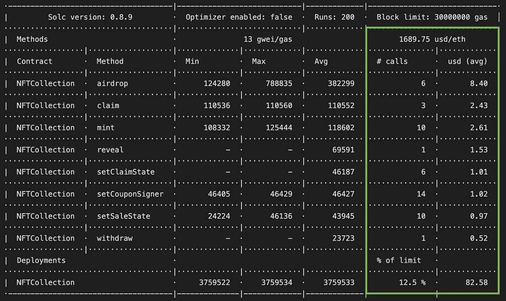
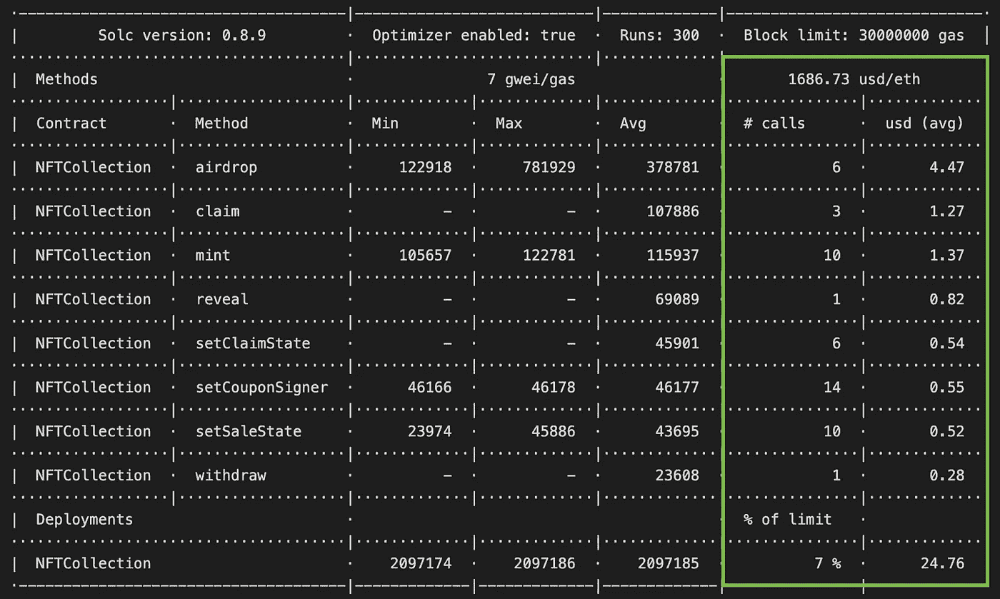

# 我如何将花在以太坊上的汽油费优化了 75%

> 原文：<https://betterprogramming.pub/how-i-optimized-gas-costs-by-75-b850ac3cff72>

## 优化示例 NFT 项目


照片由 [micheile dot com](https://unsplash.com/@micheile?utm_source=medium&utm_medium=referral) 在 [Unsplash](https://unsplash.com?utm_source=medium&utm_medium=referral) 上拍摄

在以太坊区块链上，每笔交易都要花费一笔“汽油费”。作为开发人员，我们的目标是尽可能降低交易成本。

在本文中，我将讨论如何配置 hardhat 来报告天然气成本，以及如何配置 Solidity 的内置优化器来降低天然气成本。

我将从我即将出版的书“启动 NFT 集合的开发者指南”中优化一个样本 NFT 项目。

# 气体记者

在我们打开优化器之前，让我们先测量一下当前的天然气成本，以便为我们提供一个比较基准。我们需要首先安装和配置`hardhat-gas-reporter`插件。

`hardhat-gas-reporter`插件覆盖了哈德哈特的`npx hardhat test`命令，并跟踪测试中调用的每个函数的平均油价。

您可能已经猜到了——使用 gas reporter 需要对您的项目进行自动化测试！

*   运行`npm install hardhat-gas-reporter`安装插件。
*   在你的 hardhat 配置文件中，通过添加`require("hardhat-gas-reporter")`在文件顶部导入插件
*   将以下块添加到从该文件导出的设置中:

```
gasReporter: {
  outputFile: "gas-report.txt",
  enabled: process.env.REPORT_GAS !== undefined,
  currency: "USD",
  noColors: true,
  coinmarketcap: process.env.COIN_MARKETCAP_API_KEY || "",
  token: "ETH"
}
```

为了让 gas reporter 为我们提供每笔交易的货币成本，我们需要一个 [CoinMarketCap](https://coinmarketcap.com/) API 密匙，可以从他们的网站上免费获得。

继续将下面几行添加到您的`.env`文件中:

```
REPORT_GAS=true
COIN_MARKETCAP_API_KEY=[YOUR-API-KEY]
```

让我们通过`npx hardhat test`再次运行我们的测试。气体报告器插件将接管并记录每个函数调用中使用的气体，并将结果输出到`gas-report-txt`文件。



气体报告(未优化)

这份报告对于估算您的合同部署到生产环境的成本以及部署后每笔交易的成本非常有用。

它还为我们提供了一个基准，我们可以用它来衡量我们的气体优化工作！

# 坚固性优化器

让我们配置 solidity 编译器，通过调整`hardhat.config.js`中的 hardhat 配置中的`solidity`行来优化我们的代码:

```
solidity: {
    version: "0.8.9",
    settings: {
        optimizer: {
            // Toggles whether the optimizer is on or off. 
            // It's good to keep it off for development 
            // and turn on for when getting ready to launch.
            enabled: true, // The number of runs specifies roughly how often 
            // the deployed code will be executed across the 
            // life-time of the contract.
            runs: 300,
        }
    },
}
```

除了打开优化器，我们唯一的配置选项是`runs`参数。

从坚固性文档中:

> 运行次数大致规定了在合同的生命周期中，所部署代码的每个操作码的执行频率。这意味着它是代码大小(部署成本)和代码执行成本(部署后的成本)之间的权衡参数。

200 或 300 次运行是一个合理的默认值，但是我鼓励您尝试不同的值，看看它如何影响部署和事务成本，并为您的项目选择最合适的值。

这又是同一个报告，但是打开了优化器。请注意汽油价格的下降:



打开优化器后的气体报告

感谢阅读。

```
If you'd like to get a head-start on learning to code an NFT Collection from scratch, check out my book: "[A developer's guide to launching an NFT Collection](https://book.michaelstivala.com/)" - use this link for 10% off for more blockchain-related tips and tricks, and to follow along as I use my software development skills to build $10k/month in passive income.
```