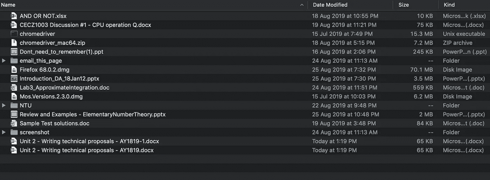
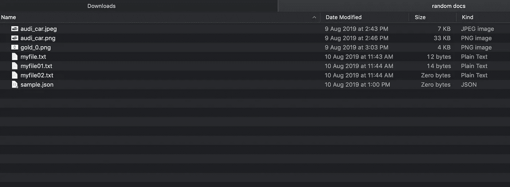
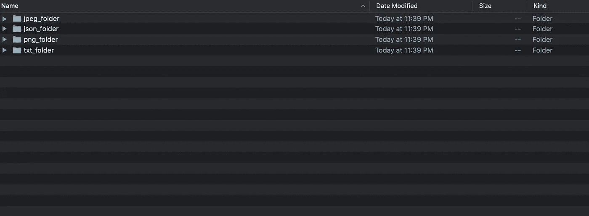
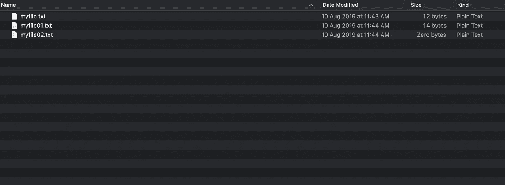

# 如何用 Python 组织我的下载文件夹

> 原文：<https://betterprogramming.pub/how-i-organise-my-downloads-folder-with-python-6c76358968ea>


安德鲁·庞斯在 [Unsplash](https://unsplash.com/photos/6-RhsUzKO6g) 上的照片

最近，我对我个人电脑上凌乱的下载文件夹感到过度烦恼。文件太多了，乱七八糟。作为一个患有轻度强迫症的人，我很恼火。我花了一个下午的时间试图思考一个解决方案，我想也许我可以写一个简单的 Python 脚本来解决这个问题。



这是我的下载文件夹

# 解决方案

解决方案一个 Python 脚本，它循环下载文件夹并确定每个文件的文件类型。随后，它会为该文件类型创建一个文件夹。具有相同文件类型的所有文件都将被传送到该文件夹。每当一个文件被添加到下载文件夹中时，这个脚本都应该工作。

假设我们有一个如下所示的下载文件夹:



JPG、PNG 和 TXT 文件的混合

这是我们希望达到的结果:



下载文件夹是根据类型分类的

经过仔细检查，例如在 txt_folder 中，我们应该会看到这样的内容:



是啊！！我所有的文本文档都在 txt_folder 中

现在让我们深入研究一下代码:

```
from os import listdir
from os.path import isfile, join
import os
import shutildef sort_files_in_a_folder(mypath): '''
    A function to sort the files in a download folder
    into their respective categories
    ''' files = [f for f in listdir(mypath) if isfile(join(mypath, f))]
    file_type_variation_list=[]
    filetype_folder_dict={} for file in files:
        filetype=file.split('.')[1]
        if filetype not in file_type_variation_list:
            file_type_variation_list.append(filetype)
            new_folder_name=mypath+'/'+ filetype + '_folder'
            filetype_folder_dict[str(filetype)]=str(new_folder_name)
            if os.path.isdir(new_folder_name)==True:  #folder exists
                continue
            else:
                os.mkdir(new_folder_name) for file in files:
        src_path=mypath+'/'+file
        filetype=file.split('.')[1]
        if filetype in filetype_folder_dict.keys():
            dest_path=filetype_folder_dict[str(filetype)]
            shutil.move(src_path,dest_path) print(src_path + '>>>' + dest_path)if __name__=="__main__":
    mypath='your_path_to_your_download_folder'
    sort_files_in_a_folder(mypath)
```

首先，在您的终端(Mac)或命令提示符(Windows)上运行这两个命令:

```
pip install os
pip install shutil
```

OS 是一个 Python 库，允许你与操作系统交互，而 shutil 是另一个库，帮助你在目录中传输文件/文件夹/文档。

```
files = [f for f in listdir(mypath) if isfile(join(mypath, f))]
file_type_variation_list=[]
filetype_folder_dict={}for file in files:
    filetype=file.split('.')[1]
    if filetype not in file_type_variation_list:
        file_type_variation_list.append(filetype)
        new_folder_name=mypath+'/'+ filetype + '_folder'
        filetype_folder_dict[str(filetype)]=str(new_folder_name)
        if os.path.isdir(new_folder_name)==True: #folder exists alrd
            continue
        else:
            os.mkdir(new_folder_name)
```

## 循序渐进的教程

首先，我们创建一个列表`(files)`，它包含一个目录中所有文件的名称(例如，下载)。我们循环遍历这个列表，并根据文件类型(例如`json_folder`)创建一个命名的文件夹，只要它事先不存在。此外，将创建一个字典`(filetype_folder_dict)`，它将密钥文件类型映射到一个值。

```
for file in files:
    src_path=mypath+'/'+file
    filetype=file.split('.')[1]
    if filetype in filetype_folder_dict.keys():
        dest_path=filetype_folder_dict[str(filetype)]
        shutil.move(src_path,dest_path)print(src_path + '>>>' + dest_path)
```

然后，我们再次循环初始列表，并将文件移动到我们之前创建的目标文件夹。目标路径是通过参考先前创建的字典来确定的。

最后，我们需要决定如何触发这个脚本。理想的情况是，每当一个新项目被添加到下载文件夹时，这个脚本就会被触发；然而，对我来说，我发现更简单的方法是创建一个 crontab (Mac)或 task scheduler (Windows)。

这两个程序允许在一天中的特定时间执行 Python 脚本(它们可以由用户控制)。

或者，只要有一些新的项目添加到下载文件夹中，您就可以手动运行该脚本…但是这将非常繁琐。

链接到 crontab 教程:

[](https://ole.michelsen.dk/blog/schedule-jobs-with-crontab-on-mac-osx.html) [## 在 Mac OS X 上使用 crontab 调度作业

### 在你的电脑上运行脚本是很棒的。自动运行它们甚至更好。如果你在 Mac(或 Linux)上…

ole.michelsen.dk](https://ole.michelsen.dk/blog/schedule-jobs-with-crontab-on-mac-osx.html) 

链接到 window 任务计划程序教程:

[](https://datatofish.com/python-script-windows-scheduler/) [## 如何使用 Windows 调度程序调度 Python 脚本

### 在本教程中，我将向您展示使用 Windows 调度程序调度 Python 脚本的步骤。这种类型的运动是…

datatofish.com](https://datatofish.com/python-script-windows-scheduler/) 

链接到源代码:

 [## 凯捷/自动化

### 此时您不能执行该操作。您已使用另一个标签页或窗口登录。您已在另一个选项卡中注销，或者…

github.com](https://github.com/kaikiat/automation/blob/master/sort_download_folder/sort_files.py)