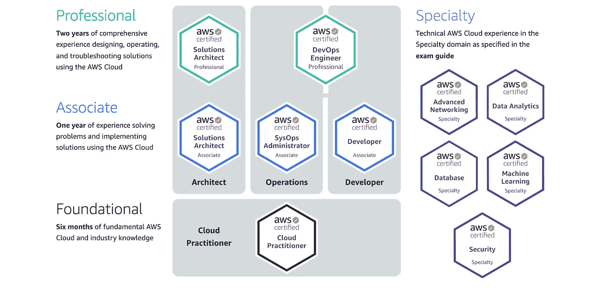
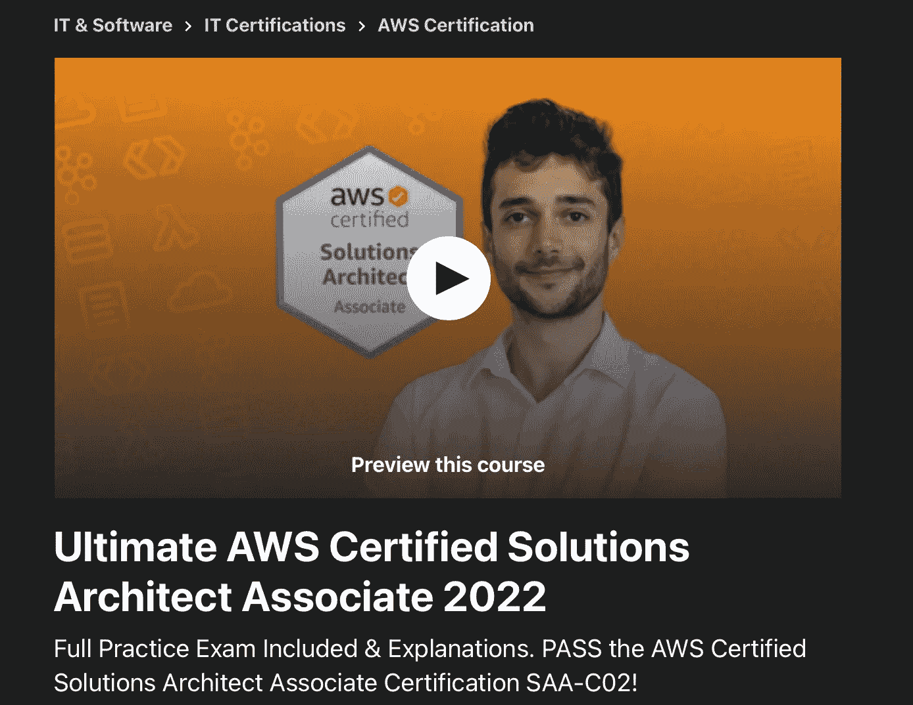
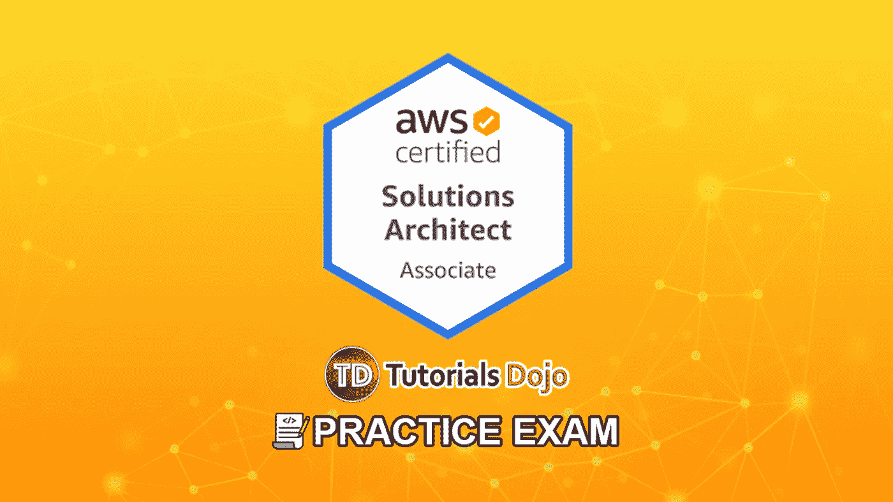
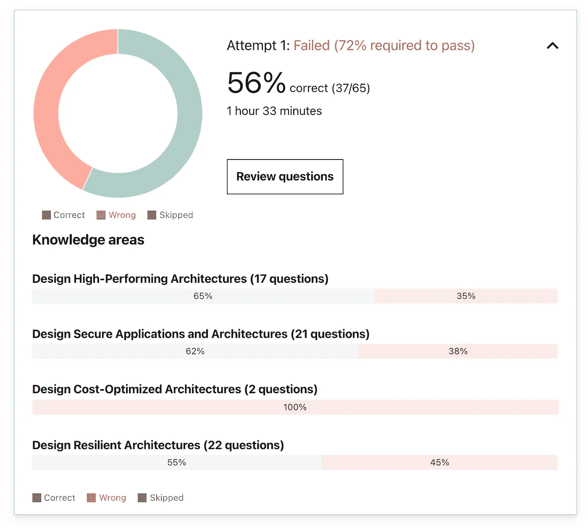
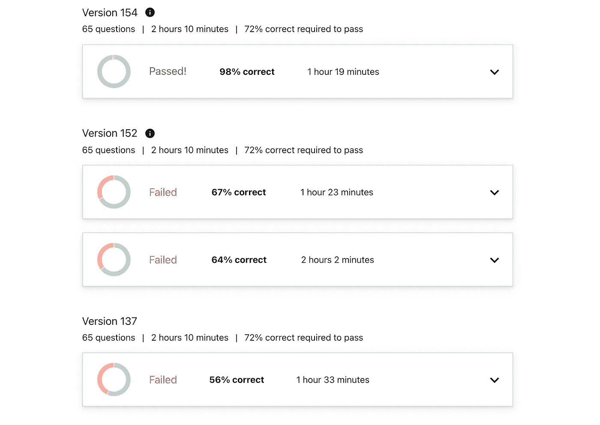
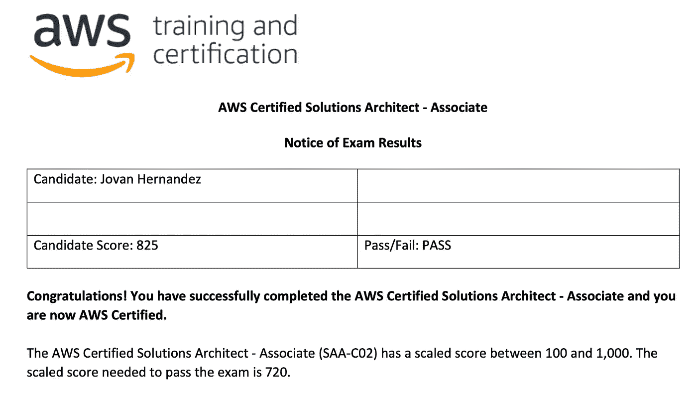

# 我如何在一个月内通过 AWS 解决方案架构师认证(SAA-C02)

> 原文：<https://betterprogramming.pub/how-i-passed-the-aws-solutions-architect-associates-saa-c02-in-one-month-eac64768d236>

## 看看我采用的学习资源和学习过程

AWS 拥有多项重要认证—[https://aws.amazon.com/certification/](https://aws.amazon.com/certification/)

AWS 解决方案架构师助理认证是目前最受任何试图进入云工程、架构或 web 解决方案领域的人欢迎的认证之一。它涵盖了 AWS 系统的技术部署、AWS 最佳实践以及在 Amazon AWS 生态系统中工作所需的其他技能。

该认证面向在 AWS 云环境中设计解决方案(因此得名)的个人，也面向在设计可用、经济高效、容错和可扩展的分布式系统方面拥有至少一年或一年以上实践经验的个人……尽管许多人在没有此类经验的情况下通过了认证。

# 在我们开始之前…

我想在这篇文章之前解释一下这篇文章是关于什么的。我在这里不是要告诉你 RDS 和 Redshift 之间的区别，或者你应该使用哪个 EC2 实例用于哪个工作或系统设计。这篇文章只是指导我如何通过 AWS SAA-C02 认证。

这并不意味着读完这篇文章后你会成为一名熟练的云工程师。如果你通过了考试，你甚至可能没有资格或没有准备好真正的云工程工作…我想做的就是分享我是如何通过考试的，什么学习方法对我有效，以及如果你坚持严格的团队，你如何能在 30 天内规划出一条通过考试的道路。

我还想强调的是，我参加了这个课程并通过了考试，已经有了几年的 AWS 经验。现在…这并不是说我比任何没有经验的人有更大的优势。

我的大部分经历都是关于 EC2、S3 和 IAM，这些基本的核心服务可能只占 AWS SAA-C02 考试的 10-15%……但我仍然有参加认证的经验，我不否认它帮助我掌握了一些主题和概念，可能比零经验或没有经验的人更快。话虽如此，让我们开始吧…

# **准备资源**

我用来准备 AWS SAA-C02 的资源包括(但不限于)以下内容:

*   [Andrew Brown 的 ExamPro AWS 认证解决方案架构师课程](https://www.freecodecamp.org/news/pass-the-aws-certified-solutions-architect-exam-with-this-free-10-hour-course/)
*   [夏羽·马雷克的终极 AWS 认证解决方案架构师助理课程](https://www.udemy.com/course/aws-certified-solutions-architect-associate-saa-c02)
*   [Jon Bonso 教程 Dojo AWS 认证解决方案架构师助理实践考试](https://portal.tutorialsdojo.com/courses/aws-certified-solutions-architect-associate-practice-exams/)
*   [keenanromain 的 AWS-SAA-C02 学习指南 Github Repo](https://github.com/keenanromain/AWS-SAA-C02-Study-Guide)

这四种资源是我花了大部分时间使用的，取决于当天学习的环境和效用。我列出这 4 个特定的资源是有原因的。无论我是在家，在外面散步，坐在咖啡馆，还是在火车上，我都有一个可以消化和学习的资源。

这一点很重要，因为只依赖一种资源或平台通常会导致内容盲点和学习疲劳，也就是倦怠。能够在各种资源之间进行交换有助于你保持新鲜感，并提供其他导师可能没有适当或深入涉及的主题的不同视角，从而建立和保持动力。

例如，我知道 FreeCodeCamp AWS Solutions Architect 视频缺乏 SAA-C02 上的几个 AWS 服务的内容，但由于它是 YouTube 上的免费资源，我仍然将其列为主要的研究来源，因为它具有巨大的价值(免费)且易于访问和消化。

现在，我们来看一下资源…

## Andrew Brown 的 ExamPro AWS 认证 SAA-C02 课程

[安德鲁·布朗的 ExamPro AWS SAA-C02 课程](https://www.freecodecamp.org/news/pass-the-aws-certified-solutions-architect-exam-with-this-free-10-hour-course/)是我实际上使用最多的免费资源。我想 YouTube 的易用性是我默认将它作为首选资源的原因之一。安德烈·布朗做得很好，充分涵盖了所有主题，没有偏离奇怪的题外话或对考试不实用的奇怪例子。

我不确定布朗是否在他的视频中声明了这一点，但我觉得他的课程方法是他的目标是让你通过考试。如果他的课程不超过 50 个小时，几乎不可能涵盖所有 AWS 服务的每一项注意事项。他的视频端到端只有 10 个多小时，涵盖了 AWS 的大部分服务。视频中有一些遗漏，但我想说他的视频涵盖了 AWS SAA-C02 考试中 75-80%的服务。

关于他的视频，我最喜欢的一点是，他用带项目符号的幻灯片对每个“部分”进行了简明扼要的概述，涵盖了您应该了解的每个服务或部分的主要内容。我最后把这些幻灯片截图下来，用作抽认卡。

这个特定资源的问题是，因为它是一个 YouTube 视频，我不能 100%确定这个课程会得到更新。它最后一次更新是在 2019 年 12 月，所以一些信息可能有点过时，正如前面提到的，AWS 2020 年后发布的一些较新的服务将不包括在本课程中。我仍然强烈建议至少看一遍这门课程，因为它是免费的，容易获取，并且涵盖了大部分内容。

## 夏羽·马立克的 AWS SAA 终极课程

这是 AWS SAA-C02 课程的黄金标准— [图片来源](https://www.udemy.com/course/aws-certified-solutions-architect-associate-saa-c02/)

如果你真的想了解 AWS 服务的来龙去脉，而不仅仅是通过认证，[夏羽·马雷克的终极 AWS 认证解决方案架构师助理](https://www.udemy.com/course/aws-certified-solutions-architect-associate-saa-c02)是绝对必须的。

夏羽在将服务分解成关键部分和易于理解的概念方面做得很好，同时保持了他的课程的新鲜和有趣。与安德鲁·布朗的 ExamPro YouTube 课程不同，夏羽的课程是一门付费的 Udemy 课程，但你可以获得定期更新的优质内容。截至本文撰写之时(2022 年 1 月 7 日)，夏羽的课程已经更新，以反映 2022 年的 AWS SAA-C02，因此他总是掌握着他的材料，当涉及到他时，你保证会获得最新和最棒的 AWS SAA 学习材料。

虽然夏羽的课程清单有些“昂贵”，但我从未见过它们的全价。Udemy 几乎总是在进行某种销售，通常是 75-80%的折扣。

我认为，即使是全价，他的课程也是值得的，因为如果你真的想从里到外了解 AWS SAA 服务，它就很有价值。你也拥有它的生命，所以这意味着任何时候他更新材料，你已经可以访问它。选择这门课程是显而易见的。

## Jon Bonso 教程道场

教程道场是你强化考试技巧的地方— [图片来源](https://portal.tutorialsdojo.com/courses/aws-certified-solutions-architect-associate-practice-exams/)

如果你在互联网上浏览 AWS SAA-C02 考试的学习指南，你会发现几乎每个人都推荐乔恩·邦索的练习考试，这是有充分理由的。乔恩·邦索的模拟考试可能是通过 AWS SAA-C02 考试最重要的一块拼图。

乔恩·邦索的模拟考试是你能真正参加考试的最接近的东西。共有 60 个问题，时间限制为 90 分钟，并有 6 次模拟考试。

这些问题几乎和测试一模一样，但不是一字不差。它给你足够的练习，让你对考试中会遇到什么样的问题和场景有一个良好的感觉。AWS 喜欢试图通过在问题中填充不必要的信息来分散你的注意力或让你分心，从而让你分心。一些问题的结构甚至可以根据考试问题中的关键词排除所有选项，减去唯一显而易见的答案。

这是一种心理练习，不仅让你在场景层面上做好准备，还能训练你的大脑如何消化这些问题。你训练你的大脑寻找关键信息，这些信息通常会消除 4 个选择中的 2 个。当你掌握了考试流程，并意识到大多数问题在四个选项中的两个之间只是 50/50，你知道你正在取得进步。

## Keenan Romain 的 AWS SAA-C02 学习指南 Github Repo

Keenan Romain 汇编了一个海量的 Github 信息库,可以保存在我的手机上。我包括这个资源，因为它是免费的，易于搜索，也易于消费。由于这是一个巨大的文本墙，我发现当我坐在地铁上、排队等候，甚至只是在床上时，这个资源非常有用，当我没有能力观看视频或收听音频时，它可以作为我浏览 AWS 服务的一种方式。

因为所有的信息都在一页上，一旦信息被加载，你基本上可以把它当作一本书，并随时查阅，因此当我在长途火车上或飞机上旅行时很方便。

# 学习过程

在开始学习之前，了解 AWS 知识是非常重要的。在学习之前参加 Jon Bonso 的模拟考试会让你对将要发生的事情有一个明确的想法，也会给你一种现实感。

有了几年的核心 AWS 服务，我想我至少能达到及格的 70%。当我看到我只得了 50%的分数时，我被现实击中了。

56%绝对不是我第一次开枪时期望的。作者图片

我知道如果我不认真对待这件事，我将很难学习，所以我制定了一个计划和时间表，并在接下来的 30 天里坚持下去。

*   一觉醒来，参加一个完整的实践考试。
*   复习考题的答案和解释。
*   每天涵盖 3-4 节夏羽·马雷克的课程(每节大约 30-90 分钟)。
*   在 Andrew Brown 的 ExamPro 视频中找到相同或相似的部分，浏览这些部分。
*   阅读 Keenan Romain 的 Github repo 中涉及这些服务的部分。
*   再参加一次全实践考试。
*   睡眠

这基本上是我 30 天的全部日常工作。冲洗并重复，直到我感到舒适。

你可能会问什么是“舒适水平”？这可能取决于你的考试能力和 AWS 服务的经验，但根据我在 Twitter 和 Reddit 上的研究，一旦你能够在 Jon Bonso 的辅导考试中达到 85%，这通常是一个很好的指标，表明你对源材料有很强的掌握。

正如你在下面看到的，我第一次尝试失败得很惨，只是在接下来的两次尝试中有所提高，然后在第四次尝试中几乎得了满分。

随着时间的推移，通过参加模拟考试逐渐提高。作者图片

# 提示、警告等

*   在你开始学习之前安排你的考试。动力需要来自某个地方，安排你的测试使这个决定成为现实。它让你负责，因为你有一个目标日期。如果有什么事情发生，你可以把考试挪出来重新安排。我相信你可以重新安排的次数是有限的，所以如果可以的话，你应该坚持计划。
*   在你计划学习的这个月左右，计划停止所有的社交活动和干扰。如果你真的想在一两个月内通过这次考试，你需要把它当成你在准备 sat 考试。有些人声称几乎没怎么学习就通过了考试。对他们来说很好，但是即使我有 2 年的 AWS 经验，我仍然没有准备好，需要所有的时间来学习。
*   建立一个时间表或策略，并坚持下去。这将帮助你不要浪费时间去试图弄清楚你应该学习哪些部分，应该使用哪些资源。我已经列出了我所使用的资源和我学习方法的粗略指南。你应该找一些对你有用的东西，但是要有条理，并坚持下去。
*   我很幸运能够在疫情期间远程工作，我也没有家庭，所以我在 2020 年有大量的空闲时间。这绝对是我能够制定我的学习时间表并每天花 6-8 小时学习和参加模拟考试的主要因素。
*   当你参加考试的时候，要确保你诚实、真实地试图通过考试。你将能够在考试结束时复习问题和答案，这很有帮助，但是如果你参加考试的次数太多，你可能会陷入一种虚假的自信感，你认为你知道内容，但你实际上只是记住了问题和答案。你应该努力在第三次模拟考试中取得 80%以上的分数。吃太多次，你就失去了学习的目的。
*   确保你学习并理解了 VPC(虚拟私有云)的概念，几乎所有的事情都围绕着这个概念，对于你来说，完全掌握它们在 AWS 生态系统中是如何构建的非常重要。我认为 VPC 是最关键也是最难理解的部分。
*   AWS 提供了许多免费服务。花些时间亲身体验他们的服务，包括 EC2、S3、RDS 等。仅仅看材料是不够的。拥有实际的用例知识和经验对加强服务之间的协作大有帮助。
*   AWS 还提供了许多资源，包括他们的白皮书。有人说从头到尾读一遍很重要。我几乎没有接触过白皮书，但它们是了解服务的重要资源。我没有把他们包括在这篇文章中，因为这篇文章的目标是讲述我如何在 30 天内通过，而不是如何成为一名 AWS 专家。也就是说，浏览它们是个好主意，尤其是 [AWS 架构良好的框架](https://docs.aws.amazon.com/wellarchitected/latest/framework/welcome.html)

# 结论

总的来说，为 AWS SAA C0-2 学习可能是我 2020 年最大的成就之一。通过这个认证加强了我对 AWS 云服务的了解，也有助于缓解我当时出现的冒名顶替综合症。

我以 825 分通过了 AWS 解决方案架构师助理认证。不是最好的分数，但及格分数是最重要的。

通过这个测试感觉很好。作者图片

我强烈建议任何有兴趣在云工程领域建立职业生涯的人去看看你所在领域的 AWS 认证，并获得那个徽章。

许多人会认为证书是无用的，你可以不需要任何证书就找到工作，虽然这有一些道理，但当招聘人员在竞争激烈的市场上寻找专业候选人时，证书肯定会让你在简历中名列前茅。这也有助于你巩固你将在未来职业生涯中用到的领域知识。

通过足够的学习，任何人都能通过这次考试。这当然不容易，但这是一个开始学习 AWS 的好地方，特别是如果你想在职业生涯中获得下一步发展的话。