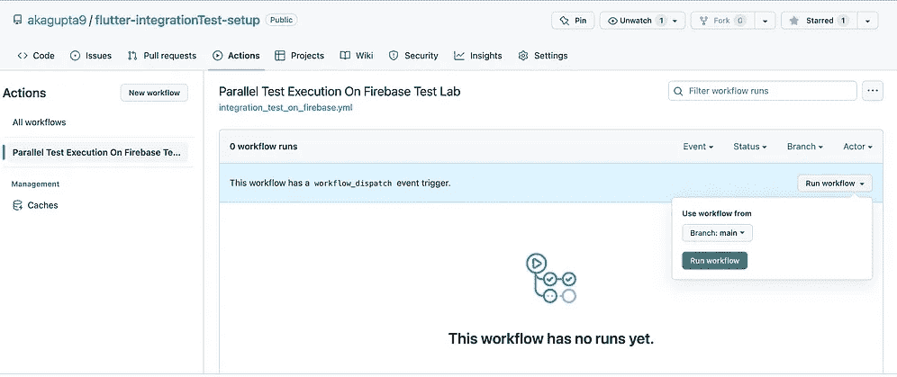
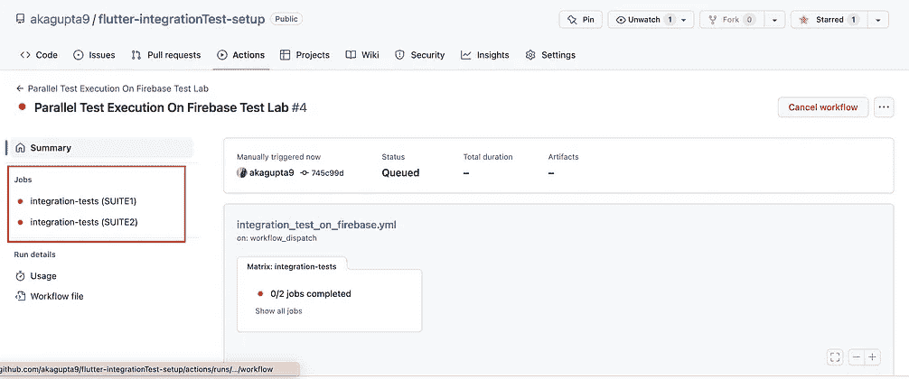

# 加速颤振集成测试:我如何将我的套件运行时间减少 50%

> 原文：<https://betterprogramming.pub/how-i-reduced-flutter-integration-suite-result-time-by-approx-50-adddffb12cbf>

## 使用 **GitHub 作业策略**缩短周转时间


照片由 [Guillaume Jaillet](https://unsplash.com/@i_am_g?utm_source=medium&utm_medium=referral) 在 [Unsplash](https://unsplash.com/?utm_source=medium&utm_medium=referral) 上拍摄

如果你是 Flutter 集成测试的新手，我建议先学习一下[集成测试](https://docs.flutter.dev/cookbook/testing/integration/introduction)文档。颤振支持与 Firebase 测试实验室的顺利集成。要了解更多集成，请查看带有 Firebase 测试实验室的[集成套件](https://firebase.google.com/docs/test-lab/flutter/integration-testing-with-flutter)。

> Firebase 测试实验室是一个基于云的应用测试基础设施，允许您在一系列设备和配置上测试您的应用，因此您可以更好地了解它在真实用户手中的表现。

# **问题陈述**

假设我们有 30 个 E2E 流用于颤振综合试验。获得结果的总执行时间平均大约需要 30 分钟(每个 e2e 流一分钟)。我假设我们可以在 30 分钟内获得自动化测试反馈。

但是如果我们的 E2E 流量从 30 增加到 300，平均反馈时间是 5 个小时。等待时间太长了。

我们想到的一个解决方案是以并行模式运行测试。

但是，我们有一个未解决的[问题](https://github.com/flutter/flutter/issues/101296)，Firebase 测试实验室不支持针对颤振的并行执行(测试分片)。

# 解决办法

我通过使用 GitHub 工作策略减少了自动化周转时间。我将一步一步地讨论我的方法。

步骤 1:假设我们有四个测试文件:`feature1_tests.dart`、`feature2_tests.dart`、`feature3_tests.dart`和`feature4_tests.dart`。每个文件都有测试小部件案例。每个特性测试文件看起来如下所示(具有包含多个测试用例的主方法):

```
import 'package:flutter_test/flutter_test.dart';
import 'package:integration_test/integration_test.dart';

void main() {
  final binding = IntegrationTestWidgetsFlutterBinding.ensureInitialized()
      as IntegrationTestWidgetsFlutterBinding;
  binding.framePolicy = LiveTestWidgetsFlutterBindingFramePolicy.fullyLive;

  group('Feature 1', () {
    testWidgets('Scenario 1', (WidgetTester tester) async {});

    testWidgets('Scenario 2', (WidgetTester tester) async {});
  });
}
```

步骤 2:我们将定义我们的测试套件，其中包含调用多个特性的 main 方法。说，`Suite1`和`Suite2`。

```
 // Suite1.dart File , with feature 1 and Feature 2
import 'tests/feature1_tests.dart' as feature1_tests;
import 'tests/feature2_tests.dart' as feature2_tests;

void main() {
  feature1_tests.main();
  feature2_tests.main();
}
```

```
 // Suite2.dart File , with feature 3and Feature 4

import 'tests/feature3_tests.dart' as feature3_tests;
import 'tests/feature4_tests.dart' as feature4_tests;

void main() {
  feature3_tests.main();
  feature4_tests.main();
}
```

> **注意**:根据您的项目和特点，您可以相应地制作您的套件。

步骤 3:让我们创建 GitHub 工作流，使用 [GitHub 作业策略](https://docs.github.com/en/actions/using-workflows/workflow-syntax-for-github-actions#jobsjob_idstrategy)并行运行两个套件。

```
name: Parallel Test Execution On Firebase Test Lab

on:
  workflow_dispatch:

env:
  ANDROID_HOME: /Users/runner/Library/Android/sdk
  JAVA_HOME: /Users/runner/hostedtoolcache/Java_Microsoft_jdk/11.0.13/x64/Contents/Home
  flutter_version: "3.3.9"

jobs:
  integration-tests:
    runs-on: macos-11
    timeout-minutes: 60
    continue-on-error: true
    strategy: # GitHub Strategy
      fail-fast: false
      max-parallel: 2
      matrix:
        tests: [SUITE1,SUITE2]

    steps:
      - name: Checkout Repository And Submodules
        uses: actions/checkout@v2

      - id: 'auth'
        uses: 'google-github-actions/auth@v0'
        with:
          service_account: 'Your Service Account Link'
          credentials_json: ${{ }}

      - name: 'Set up Cloud SDK'
        uses: 'google-github-actions/setup-gcloud@v0'

      - name: 'Use gcloud CLI'
        run: 'gcloud info'

      - name: Java Setup
        uses: actions/setup-java@v3
        with:
          distribution: 'temurin'
          java-version: '11'

      # Caching Flutter SDK download based on version
      - name: Flutter SDK Download
        uses: subosito/flutter-action@v2
        with:
          flutter-version: ${{ env.flutter_version }}
          channel: 'stable'
          cache: true
          cache-key: flutterA-${{ env.flutter_version }}
          cache-path: ${{ runner.tool_cache }}/flutterA-${{ env.flutter_version }}

      - name: Download Flutter Dependencies
        run:  |
            flutter pub get

      # Assuming shell script to Run on Firebase is Placed at file location - integration_test/firebase_parallel_test_runner.sh
      - name: Assign Permission to shell file
        run: |
          chmod 777 ./integration_test/firebase_parallel_test_runner.sh 

      # Passing ${{matrix.tests}} as positional parameter to shell file
      # If ${{matrix.tests}} = SUITE1 , we will upload Suite1.dart based test apk and same as SUITE2

      - name: Run Suite
        run: |
          sh .integration_test/firebase_parallel_test_runner.sh  ${{matrix.tests}} 
```

步骤 4:创建 Bash Shell 脚本，在 Firebase 测试实验室上运行这些套件。我们将从命令行或 GitHub 变量中获取一个参数，并使用它来构建特定于该套件的测试 APK。

```
# Firebase Test Lab required Gcloud setup on Your Machine

DEBUG_APK_PATH=build/app/outputs/flutter-apk/app-debug.apk # File path of debug APk
TEST_APK_PATH=build/app/outputs/apk/androidTest/staging/debug/app-debug-androidTest.apk # File Path of Test Apk
SUITE=$1 # Positional Argument which will give Suite Name i.e SUITE1 and SUITE2 in our case
flutter build apk --debug # Build the Debug APk

pushd android
  ./gradlew app:assembleAndroidTest
popd 

if [ "$SUITE" == "SUITE1" ]; then
      pushd android
        ./gradlew app:assembleDebug -Ptarget=integration_test/suites/suite1.dart
      popd

      if gcloud firebase test android run --type instrumentation --app $DEBUG_APK_PATH --test $TEST_APK_PATH --timeout 45m
      then
        exit 0 # Exit with 0 if all test passed else exit with 1
      else
        exit 1
      fi  
    fi

if [ "$SUITE" == "SUITE2" ]; then
      pushd android
        ./gradlew app:assembleDebug -Ptarget=integration_test/suites/suite2.dart
      popd

      if gcloud firebase test android run --type instrumentation --app $DEBUG_APK_PATH --test $TEST_APK_PATH --timeout 45m
      then
        exit 0
      else
        exit 1
      fi  
    fi 
```

耶！你都准备好了。现在，您的两个套件将并行运行。这将减少你的周转时间。



源代码可以在这个 [GitHub 库](https://github.com/akagupta9/flutter-integrationTest-setup)中找到。

***注意:*** *将并行线程增加到无限制可能会导致 GitHub runner 崩溃。确保根据机器配置保持最大并行线程数。*