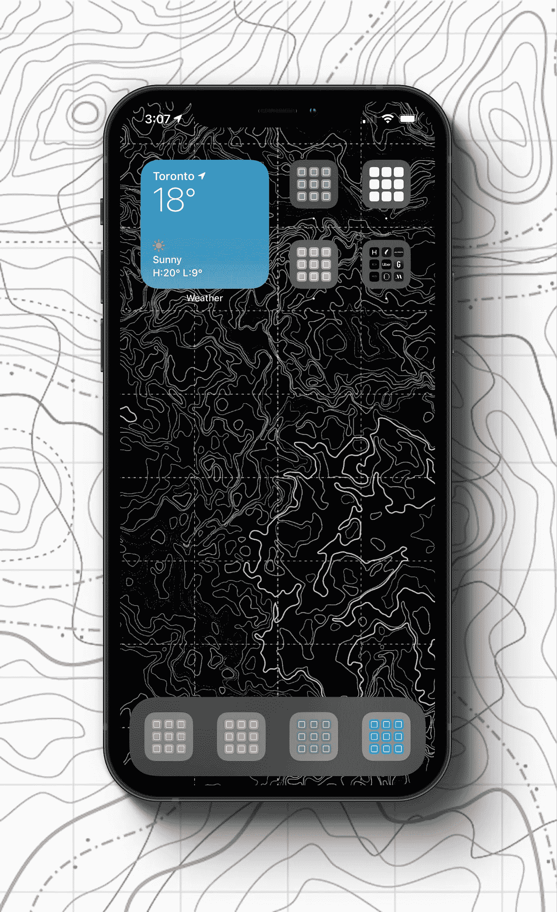
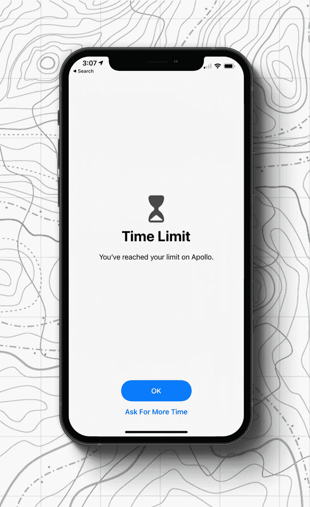

# 使用 iOS14 减少屏幕时间的 3 个技巧

> 原文：<https://betterprogramming.pub/how-i-reduced-my-screen-time-by-60-89a01e3c9d8f>

## 把工作做好是关于专注

由 [Yura Fresh](https://unsplash.com/@mr_fresh?utm_source=medium&utm_medium=referral) 在 [Unsplash](https://unsplash.com?utm_source=medium&utm_medium=referral) 上拍摄的照片。

*注意:这是我正在做的挑战的一部分:28 天内的 28 个概念。如果你想了解它，请阅读* [*简介*](https://karson.medium.com/product-idea-challenge-2020-4656855cb5da) *。*

今天的概念有点不一样。我想分享三个让我在过去几个月保持专注的技巧和诀窍。

在隔离期间，筛选时间一直处于[最高值](https://www.washingtonpost.com/technology/2020/03/24/screen-time-iphone-coronavirus-quarantine-covid/)。没什么可做的，隔离迷因已经离开了这个世界。在疫情的早期，我在 YouTube、Instagram、脸书和 Reddit 上的屏幕时间接近 8 小时。它毁了我的日子。我的手机一直有点问题，但情况越来越糟。

我不是唯一有这个问题的人。

随着 iOS 13 和 14 中新功能的引入，以及在观看了 [*【社交困境】*](https://www.netflix.com/title/81254224) 之后，我对我的手机进行了优化，并在某些日子里将屏幕时间减少了 60%以上。这里有三个小贴士让你也能做到。

# 1.主屏幕

几年前，我们办公室的一个人要求我们用颜色来组织我们的应用程序，看看我们是否会因为找不到应用程序而感到沮丧。将所有应用程序移动到正确的文件夹中是一个耗时但有益的过程。我从未回头。打开我的手机，除了有组织的颜色什么也看不到，这是一种平静的感觉。

把一些浪费时间的大程序放到这些文件夹里，这样它们就更难通过内存访问了。

关闭徽章也是我减少分心的一个关键决定。如果你进入设置>通知，你可以关闭每个应用程序中的小图标徽章，这样你的电子邮件上方就不会再有红色的 2，368 了。

# 2.自动黑白

在 iOS 13 中，苹果推出了一种名为[快捷键](https://apps.apple.com/us/app/shortcuts/id915249334)的东西，可以根据事件执行动作。其中一个动作是当你打开你的应用程序时，它可以变成黑白的。查看[关于如何设置快捷方式的教程](https://www.howtogeek.com/676204/how-to-automatically-launch-shortcuts-when-you-open-an-app-on-iphone-or-ipad/)和[关于如何设置黑白滤镜的教程](https://intercom.help/flipdapp/en/articles/1970782-grayscale-shortcut)。

我已经设置了在晚上 10:00 或当我打开某些应用程序时，它会变成黑色和白色。我可以双击我的侧边按钮来打开/关闭它。

YouTube 或其他平台上的许多创作者正在推出引人注目的缩略图，以吸引更多的点击。它确实工作得很好，但是我发现当一个应用程序是黑白的时，我的滚动时间大幅下降。

# 3.看电视的时间

我们都会有脆弱的时候，仍然会花太多时间打电话。作为最后一招，你可以设置屏幕时间，当达到极限时关闭应用程序。你可以设置单个应用程序的屏幕时间或基于类别的屏幕时间，如“社交媒体”、“游戏”等。

我把一些浪费时间的应用程序设置为每天一小时。苹果公司让你很容易绕过这一点与屏幕时间代码，你设置。我有核武器，只有我的未婚夫知道密码。

幸运的是，我不再经常碰到这些屏幕时间限制了。

我还做了其他一些随机的事情，比如切换到脸书和 Instagram 的纯网络应用版本。这有助于我少用那些，但并不适合每个人。

希望这些建议能帮助你减少花在手机上的时间。你有什么额外的技巧或窍门吗？