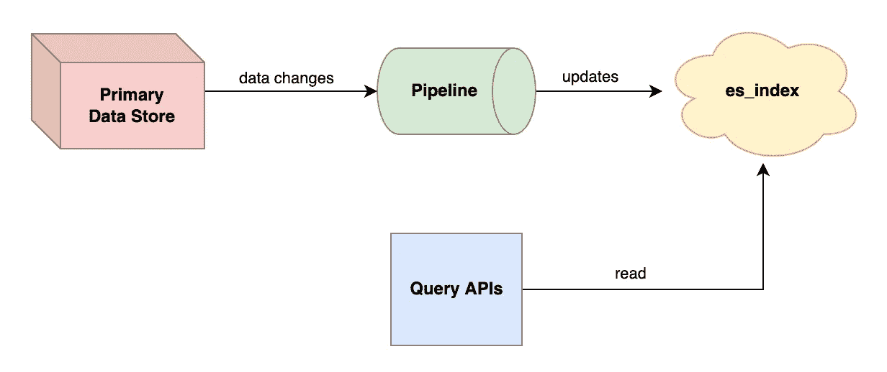
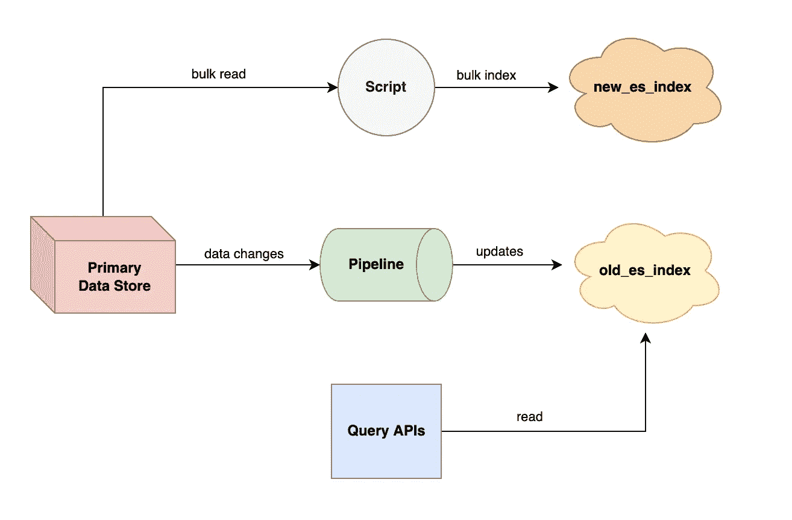
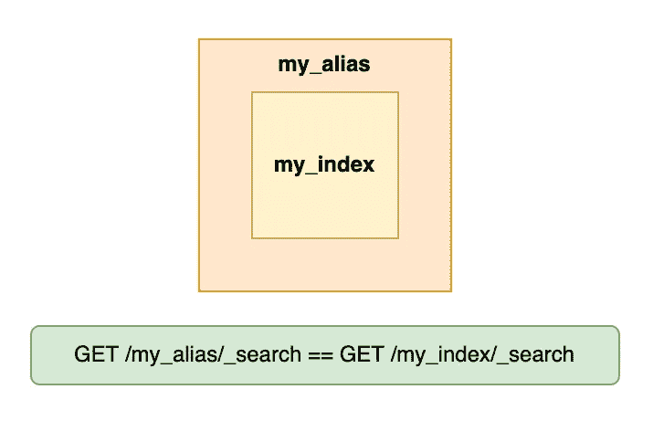
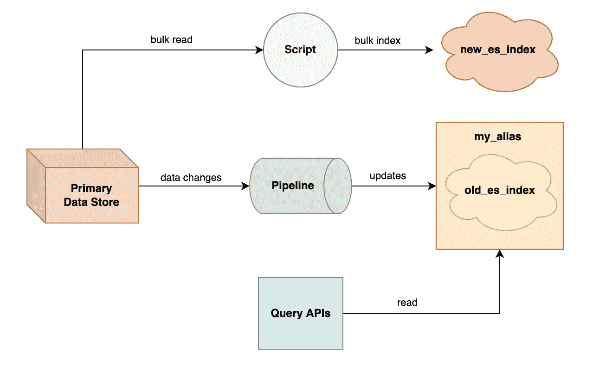
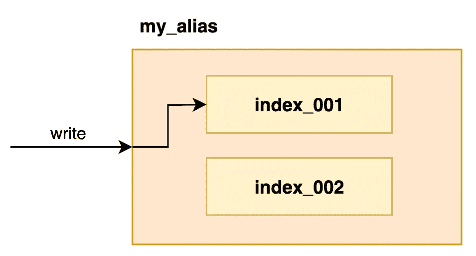
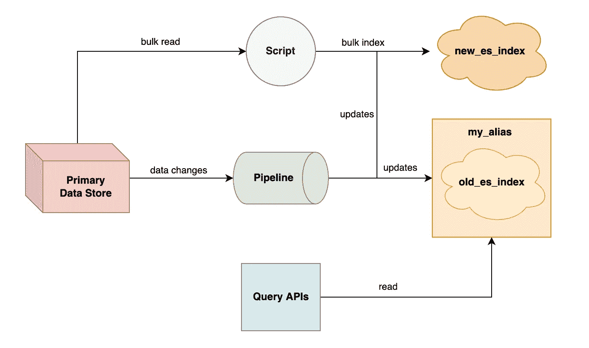
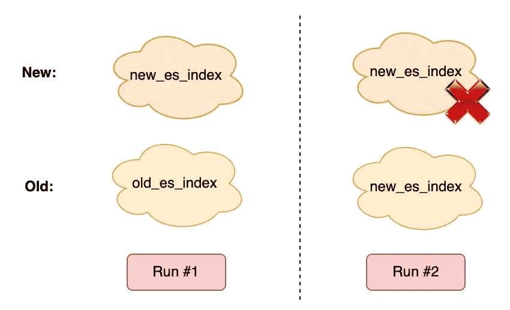
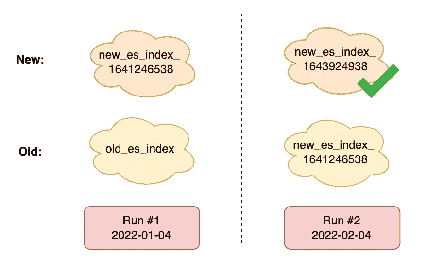

# 如何在不停机的情况下重新索引弹性搜索

> 原文：<https://betterprogramming.pub/how-i-reindex-elasticsearch-without-downtime-6e8a6a512070>


马库斯·温克勒在 [Unsplash](https://unsplash.com/s/photos/search?utm_source=unsplash&utm_medium=referral&utm_content=creditCopyText) 上的照片

Elasticsearch (ES)是一个强大、灵活、可扩展的搜索引擎。它将数据作为键值对存储在文档中。它将许多文件组合成一个索引。实际上，ES 使用了一种倒排索引数据结构，它允许我们通过文档包含的字段来查询文档。


你知道，为了搜索！

通常，您不应该使用 ES 作为您的主要数据存储。数据仍然应该存储在像 MySQL 这样的持久性数据库中。您必须编写代码来在数据存储和 ES 集群之间同步数据。

保持数据的一致性是一项挑战。随着业务的发展，您可能需要更新索引中现有字段的映射。或者，由于数据同步过程中的意外错误，索引中可能有许多脏数据。

在这两种情况下，您都需要从头开始重建 es 索引。这就是所谓的重新索引。

在本文中，我将与您分享我如何在不停机的情况下执行 ES 重新索引。我们将讨论设计思想和一些重要的 ES 概念。我们开始吧！🏃

# 系统概况

在深入研究主要内容之前，我们应该对典型的 ES 系统有一个共识。



带专家系统的系统架构

在上面的系统中，我们的应用程序数据存储在主存储中。当有数据更改时，会触发一个管道来更新 es 索引。

有许多方法可以实现管道。对于实时、异步的更新，你可以使用带有 [Kafka](https://kafka.apache.org/) 的消息总线和一个消费者应用程序。在这篇文章中，细节并不重要。

reindex 应用程序应该是什么样子？它在我们系统中的什么位置运行？

首先，reindex 应用程序执行批处理。它从数据存储中批量读取数据，并将[批量索引](https://www.elastic.co/guide/en/elasticsearch/reference/current/docs-bulk.html)到 ES 中。通过为每个请求处理更多的数据，我们可以大大提高重建索引的速度。

其次，没有必要让 reindex 应用程序永远作为一个活动系统运行。我们只会在需要的时候执行它。

因此，很明显，reindex 应用程序是一个作业脚本。当我们需要做一些工作时，可以手动运行脚本。此外，我们可以公开命令行标志来配置脚本行为。

例如，我们的 reindex 脚本的一个有用标志是布尔值`dryRun`。如果`true`，脚本将只批处理你的数据的相当大的一部分。这是为了测试重新索引对您的实时系统的影响。



使用脚本重新编制索引

该脚本还应该将数据索引到新的 ES 索引中。当我们执行大规模数据迁移时，从逻辑上将新数据与旧数据分开总是一个好的做法。

这样，我们可以减轻系统在同一位置与不同版本的数据交互时可能出现的冲突。此外，如果新数据有问题，我们可以很容易地回滚我们的查询 API 以使用旧的 ES 索引。

# 从旧索引过渡到新索引

我们的设计有一个很大的缺点。转换我们的查询 API 以使用新的 ES 索引是很麻烦的。

首先，如果新索引和旧索引共享同一个集群，它们就不能同名。

其次，索引名可以硬编码在 API 代码中，也可以作为环境变量传递。无论哪种方式，我们都必须重启或重新部署我们的查询 API 来使用新的 ES 索引。

我们如何在不增加额外工作或停机的情况下将查询 API 指向新索引呢？这就是化名为的[可以帮助我们的地方！](https://www.elastic.co/guide/en/elasticsearch/reference/current/aliases.html)

ES 别名是一个或多个索引的包装器。我们可以自由地从别名中添加或删除索引。对于大多数 ES APIs 来说，与 alias 交互相当于使用它的底层索引。



别名是索引的次要名称

为了解决我们的问题，查询 API 应该与别名而不是索引进行交互。重新建立索引后，我们可以将新索引添加到别名中，并删除旧索引。API 将自动从新索引中读取数据。

要添加和删除索引，我们可以使用`[_aliases](https://www.elastic.co/guide/en/elasticsearch/reference/current/indices-aliases.html)` API。

```
POST _aliases
{
  "actions": [
    {
      "remove": {
        "index": "old_index",
        "alias": "my_alias"
      }
    },
    {
      "add": {
        "index": "new_index",
        "alias": "my_alias"
      }
    }
  ]
}
```

上面的操作是原子性的，这意味着别名不会同时指向两个索引。为了减少手工操作，脚本可以在完成后自动执行切换。



带别名的重新索引

# 保持新索引最新

我们的系统很好，但是还有一个问题。新的 ES 索引遗漏了来自管道的实时数据更新。

这是有问题的，因为我们的脚本从存储中顺序读取数据。对已被读取和索引的数据的任何更新都将被忽略。当这种情况发生时，陈旧的数据将堆积在新的 ES 索引中。

为了解决这个问题，我们的系统需要执行“双写”。顾名思义，双写在两个不同的位置添加或更新数据。在我们的例子中，这就是我们的新旧 ES 指数。

您可能认为我们可以将新索引添加到旧索引所在的别名中。索引到别名会更新它的所有索引，对吗？

不幸的是，[在写入](https://github.com/elastic/elasticsearch/issues/68003)时，ES 别名不支持多次写入不同的索引。在别名中，只能写入一个索引，而其他索引都是只读的。



index_002 是只读的

由于这种限制，我们别无选择，只能配置我们的管道，也将数据写入新的 ES 索引。



管道双重写入

但是……管道如何动态地知道何时应该执行双重写入？请记住，重新索引可以在任何时候发生，管道需要迎合这种灵活性。

一种简单的方法是管道在每次接收到数据变化时检查是否存在新的 ES 索引。如果是，管道将数据写入两个索引。

```
// Date comes in...write_to_old()// Sends request to ES
exist = check_new_index_exist()if exist {
    write_to_new()
}
```

可以想象，这种方法效率很低。如果管道经历高负载，它将向 es 发出大量额外请求，并给集群增加压力。

更好的方法是让管道定期检查新索引是否存在。管道缓存结果，以便在一段时间内可以重用。根据您的编程语言，这种定期检查可以在后台线程中进行。

```
// Pipeline initexist = falsestart_background_thread {
    for every 1 min {
        exist = check_new_index_exist()
    }
}// Data comes in...writes_to_old()if exist {
    writes_to_new()
}
```

# 其他实施细节

在我结束这篇文章之前，关于我们的设计，我想强调两点。


由[凯利·西克玛](https://unsplash.com/@kellysikkema?utm_source=unsplash&utm_medium=referral&utm_content=creditCopyText)在 [Unsplash](https://unsplash.com/s/photos/write-notes?utm_source=unsplash&utm_medium=referral&utm_content=creditCopyText) 上拍摄的照片

## 索引命名

请记住，在 es 集群中不能有索引名称冲突。

在某些情况下，您可能希望多次运行 reindex 脚本。但是，该脚本不能使用与以前运行相同的名称创建新索引。



索引命名冲突

当然，您可以简单地通过在每次运行时更新您的脚本以使用不同的名称来克服这个问题。但是，我认为我们可以做得更好！

我的解决方案是在索引名后面添加一个 Unix 时间戳作为后缀。这保证了脚本的每次运行都会创建一个新的、唯一的索引。



添加 Unix 时间戳作为后缀

如果新索引有一个动态名称，那么管道如何知道应该将哪个索引重复写入？

这是我们可以再次使用 ES 别名的地方！reindex 脚本应该将新索引包装在一个临时别名**中。然后，管道会定期检查别名是否存在，并在需要时写入别名。**

当脚本完成时，它需要删除临时别名，以便管道可以停止重复写入。

## **自动创建索引**

我们的管道对双写的定期检查有一个小漏洞。

reindex 脚本可以在**定期检查的间隔**中结束并移除别名。管道不会知道这一点，因为它依赖于缓存的信息来决定是否重复写入。

如果发生这种情况，管道将写入临时别名，认为它仍然存在。如果没有，默认情况下，ES 会自动为您创建一个新的别名索引！

为了防止这种情况发生，我们需要禁用索引的自动创建。

```
PUT /_cluster/settings
{
    "persistent" : {
        "action.auto_create_index": false
    }
}
```

有些人可能不喜欢这个设置，因为它放弃了 es 提供的灵活性。我喜欢这种方式，因为它可以防止数据意外索引到错误的位置。

# **最后的想法**

本文到此为止！这是我作为初级软件工程师完成的最具挑战性的技术项目之一。我学到了很多，我希望你能从我的旅程中学到一些东西。

欢迎在评论中挑战我的设计！总有改进的余地，从你的经历中学习将是我的荣幸。

感谢您的阅读，我们会再见的！